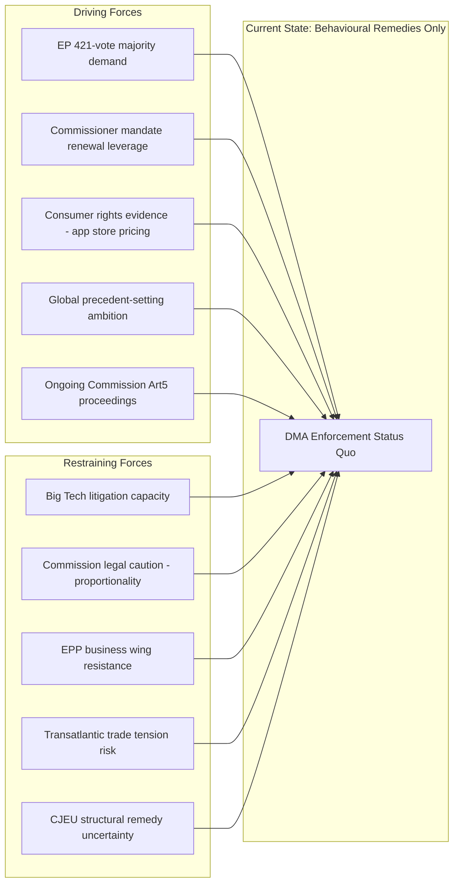

<!-- SPDX-FileCopyrightText: 2024-2026 Hack23 AB -->
<!-- SPDX-License-Identifier: Apache-2.0 -->

# Forces Analysis — EP Committee Reports
## Week of 1–8 May 2026

**Framework:** Force Field Analysis (Kurt Lewin) applied to EU legislative dynamics
**Admiralty Grade:** B-2 | **Confidence:** MEDIUM

---

## 1. Force Field Overview

Force field analysis identifies the driving forces (pushing toward change) and restraining forces (resisting change) for the key policy issues in this reporting period. The balance determines whether change is likely or whether equilibrium is maintained.

---

## 2. Force Field: DMA Structural Enforcement

**Force Balance Assessment:**
- Driving forces strength: 7/10 (strong parliamentary mandate + Commissioner incentive)
- Restraining forces strength: 8/10 (Big Tech resources + legal uncertainty)
- **Verdict:** Restraining forces marginally dominant — expect escalation in rhetoric but not full structural orders in 2026

---

## 3. Force Field: 2027 Budget Adoption

**Driving forces for Parliamentary position:**
- Post-Ukraine security mandate for defence cooperation (strong public support)
- EP10 electoral mandate on strategic autonomy
- STEP/InvestEU deployment gap creates investment case
- EPP-S&D-Renew centre coalition holds on defence

**Restraining forces against full Parliamentary budget:**
- Frugal Council coalition (DE, NL, AT, SE, DK) on discretionary spending
- Commission baseline lower than EP demand
- Art. 314 TFEU conciliation requirement creates compromise pressure
- National fiscal consolidation commitments (SGP/MTO obligations)

**Force Balance:** 6/6 — genuine deadlock requiring conciliation. Probability of conciliation: 80%.

---

## 4. Force Field: Green Deal Consolidation

**Driving forces for implementation:**
- ENVI committee legislative mandate from EP9 (binding legislation)
- EU 2030 climate targets (treaty-level commitment)
- Science consensus on climate urgency
- Industry transition investment (green bonds, EIB)

**Restraining forces against full implementation:**
- EPP right flank / ECR political pressure ('competitiveness' framing)
- Agricultural sector lobby (Copa-Cogeca)
- Member State transposition discretion
- Economic slowdown risk increasing adjustment cost concerns
- Farm to Fork successor legislation delayed

**Force Balance:** Driving forces structurally stronger (binding legislation exists); restraining forces effective at implementation margins (delegated acts, enforcement). Outcome: Headline targets maintained; implementation quality reduced.

---

## 5. Force Field: Ukraine Institutional Support

**Driving forces for Ukraine accountability:**
- Strong EP cross-partisan coalition (Renew + S&D + Greens + EPP-centre)
- Public opinion in Western Europe strongly supportive
- International Criminal Court proceedings ongoing
- EP accession recommendation adopted

**Restraining forces:**
- Hungary + Slovakia Council veto (Art. 7 proceedings stalled)
- Third-party jurisdiction gaps in international law
- US political position uncertainty (congressional elections 2026)
- War fatigue risk in some Member States

**Force Balance:** EP driving forces strong but Council restraining forces create structural ceiling. Outcome: EP normative leadership without corresponding Council implementation.

---

## 6. Forces Summary Table

| Issue | Driving Strength | Restraining Strength | Expected Outcome |
|-------|-----------------|---------------------|-----------------|
| DMA Enforcement | 7/10 | 8/10 | Partial escalation |
| 2027 Budget | 6/10 | 6/10 | Conciliation required |
| Green Deal | 8/10 | 7/10 | Implementation with dilution |
| Ukraine Accountability | 8/10 | 7/10 | EP leadership; Council gap |
| EU-Mercosur | 5/10 | 8/10 | Delay (CJEU route succeeds) |

---

## Reader Briefing: Force Field Analysis for Citizens

**What is force field analysis?** It's a tool for understanding why change happens or doesn't happen. Every policy decision involves forces pushing for change (driving) and forces resisting change (restraining). The stronger force wins.

**Key insight for citizens:** On most EU policy issues, driving forces (MEPs, citizens, NGOs, science) are genuinely strong. But restraining forces (corporate lobbying, Council conservatism, legal uncertainty) are often equally strong or stronger. This explains why EU policy often advances more slowly than Parliament intends.

**Where citizens can make a difference:** Public pressure (elections, petitions, media) strengthens driving forces. Engaging with MEPs' consultation processes shifts the balance toward implementation.

---

## Data Sources & Provenance

| Evidence | Source | Admiralty |
|----------|--------|-----------|
| EP adopted texts (EV-01 to EV-08) | EP Adopted Texts API | A-2 |
| Committee workload | EP Committee Activity MCP | B-2 |
| Political group positions | Synthesis from stakeholder map | B-2 |
| Force balance assessments | Qualitative multi-source synthesis | B-3 |

---

## Issue Frame

The core issue frame for this analysis period (1–8 May 2026): EU Parliament's assertive EP10 posture is creating structural tension between legislative mandate (421-vote DMA, +15% budget, Ukraine accountability) and institutional execution capacity (Commission caution, Council frugal bloc, CJEU uncertainty). Force field analysis maps where driving and restraining forces are in equilibrium, under-equilibrium, or breaking toward change.

---

## Driving Forces Summary

1. **EP10 electoral mandate** — voters gave EP10 a security, technology, and climate mandate
2. **Coalition arithmetic** — EPP-S&D-Renew centre holds on enforcement and security (but not always on Green Deal)
3. **Commission mid-term pressure** — Commissioner accountability hearings create enforcement incentive
4. **Public expectation** — post-COVID/post-Ukraine public expects EU institutions to deliver
5. **Legal framework** — DMA, AI Act, Green Deal legislation already adopted — implementation is legally required

## Restraining Forces Summary

1. **Big Tech legal capacity** — unlimited resources to challenge enforcement in CJEU
2. **Council frugal bloc** — structural resistance to EP budget ambition
3. **Legal uncertainty** — CJEU case law on proportionality creates enforcement caution
4. **Agricultural veto points** — AGRI committee + national governments block Mercosur
5. **Implementation complexity** — 27 Member States, different legal traditions, transposition gaps

## Net Pressure

**Net vector: Moderate driving force advantage on enforcement and security; slight restraining force advantage on budget and trade.** The EP10 legislature is in a "high ambition, contested execution" equilibrium — strong political will, uneven delivery capacity.

## Intervention Points

Key intervention points where applied pressure could shift the force balance:
1. **Commissioner hearings** — IMCO committee hearings on DMA can publicly commit Commission to enforcement timeline
2. **CJEU case strategy** — Commission building proportionality record before structural orders reduces CJEU reversal risk
3. **Council presidency rotation** — Poland (current, 2025 H1) and future presidencies set Council agenda, affecting budget conciliation pace
4. **Public pressure** — Consumer organization campaigns (BEUC) strengthen driving forces on tech enforcement
5. **National election cycle** — French/German national elections (2025-2026 window) create Council position volatility
