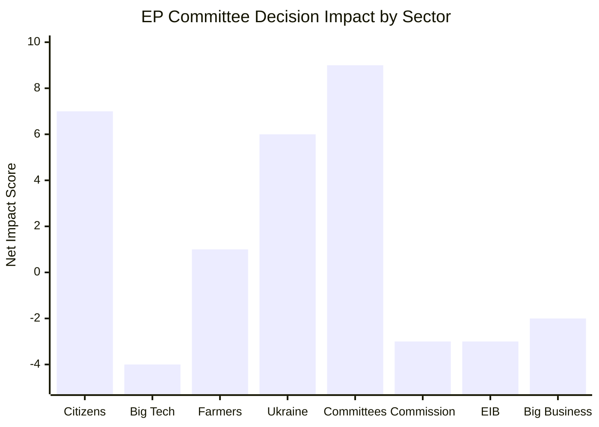

<!-- SPDX-FileCopyrightText: 2024-2026 Hack23 AB -->
<!-- SPDX-License-Identifier: Apache-2.0 -->

# Impact Matrix — EP Committee Reports
## Week of 1–8 May 2026

**Framework:** Multi-stakeholder Impact Assessment | **Admiralty Grade:** B-2

---

## 1. Event List

| Event ID | Event | Date | Source |
|----------|-------|------|--------|
| EV-01 | DMA enforcement resolution adopted | 2026-04-30 | TA-10-2026-0160 |
| EV-02 | 2027 Budget guidelines adopted | 2026-04-28 | TA-10-2026-0112 |
| EV-03 | EIB annual report 2024 adopted | 2026-04-28 | TA-10-2026-0119 |
| EV-04 | Ukraine accountability resolution | 2026-04-30 | TA-10-2026-0161 |
| EV-05 | Armenia democratic resilience resolution | 2026-04-30 | TA-10-2026-0162 |
| EV-06 | Animal welfare (dogs/cats) regulation | 2026-04-28 | TA-10-2026-0115 |
| EV-07 | US tariff quota adjustment | 2026-03-26 | TA-10-2026-0096 |
| EV-08 | EU-Mercosur CJEU referral | 2026-01-21 | TA-10-2026-0008 |

---

## 2. Stakeholder Impact Matrix

| Event | EU Citizens | Big Tech | EU Farmers | Ukraine | EP Committees | Commission | EIB | Big Business |
|-------|------------|---------|-----------|---------|--------------|-----------|-----|-------------|
| EV-01 DMA | 🟢 +++ | 🔴 --- | ⚪ 0 | ⚪ 0 | 🟢 ++ | 🟡 - | ⚪ 0 | 🟡 - |
| EV-02 Budget | 🟢 + | ⚪ 0 | 🟡 -/+ | ⚪ 0 | 🟢 ++ | 🟡 - | ⚪ 0 | 🟡 - |
| EV-03 EIB | 🟢 + | ⚪ 0 | ⚪ 0 | ⚪ 0 | 🟢 ++ | 🟡 - | 🔴 -- | ⚪ 0 |
| EV-04 Ukraine | 🟢 + | ⚪ 0 | ⚪ 0 | 🟢 +++ | 🟢 + | 🟡 - | ⚪ 0 | ⚪ 0 |
| EV-05 Armenia | 🟢 + | ⚪ 0 | ⚪ 0 | ⚪ 0 | 🟢 + | 🟡 - | ⚪ 0 | ⚪ 0 |
| EV-06 Animal | 🟢 ++ | ⚪ 0 | 🟡 - | ⚪ 0 | 🟢 + | ⚪ 0 | ⚪ 0 | 🟡 - |
| EV-07 US tariff | 🟡 -/+ | ⚪ 0 | ⚪ 0 | ⚪ 0 | 🟡 - | ⚪ 0 | ⚪ 0 | 🔴 -- |
| EV-08 Mercosur | 🟡 -/+ | ⚪ 0 | 🟢 ++ | 🟡 - | 🟢 + | 🔴 -- | ⚪ 0 | 🟡 - |

*Key: +++ very positive, ++ positive, + slightly positive, 0 neutral, - slightly negative, -- negative, --- very negative*

---

## 3. Impact Heat Map by Sector

---

## 4. Cascade Analysis

### Cascade from EV-01 (DMA enforcement):
1. **Immediate:** Big Tech companies activate legal challenge preparations (Days 1–30)
2. **Short-term:** Commission DG CONNECT must respond to Parliamentary pressure (Weeks 4–8)
3. **Medium-term:** If Commission escalates to Art. 26, CJEU interim proceedings likely (Months 3–6)
4. **Long-term:** EU digital market structure changes if structural separation ordered (Years 2–5)
5. **Cascading effect on citizens:** More app store competition → lower prices → measurable consumer benefit (delayed 3–5 years)

### Cascade from EV-02 (Budget guidelines):
1. **Immediate:** Commission budget proposal preparation affected (Months 1–2)
2. **Short-term:** Council prepares counter-position (Months 2–4)
3. **Medium-term:** Conciliation process begins (Months 5–8)
4. **Long-term:** 2027 EU spending priorities locked in for 12 months (Year 1+)
5. **Cascading effect on citizens:** Defence/sovereignty funding increases mean more EU-funded capability; potential cohesion fund trade-off affects regional development

---

## 5. Reader Briefing: Impact Matrix for Citizens

**What this matrix shows:** Every EP decision has winners and losers. The matrix above shows who gains (+) and who loses (-) from recent Parliamentary decisions.

**Key finding:** EU citizens benefit from most recent decisions (+++ on DMA enforcement, ++ on animal welfare, + on budget/Ukraine support). The largest losers are Big Tech companies (DMA) and large businesses dependent on US trade exemptions.

**Important caveat:** These are *intended* impacts — what Parliament wants to happen. *Actual* impacts depend on Commission enforcement, Council cooperation, and legal outcomes. The gap between intended and actual impact is the core governance challenge in EU law-making.

---

## Data Sources & Provenance

| Evidence | Source | Admiralty |
|----------|--------|-----------|
| EV-01 to EV-08 | EP Adopted Texts API (TA-10-2026-*) | A-2 |
| Impact assessments | Qualitative analysis from stakeholder map + PESTLE | B-2 |
| Cascade analysis | Synthesis from scenario forecast + historical baseline | B-3 |
