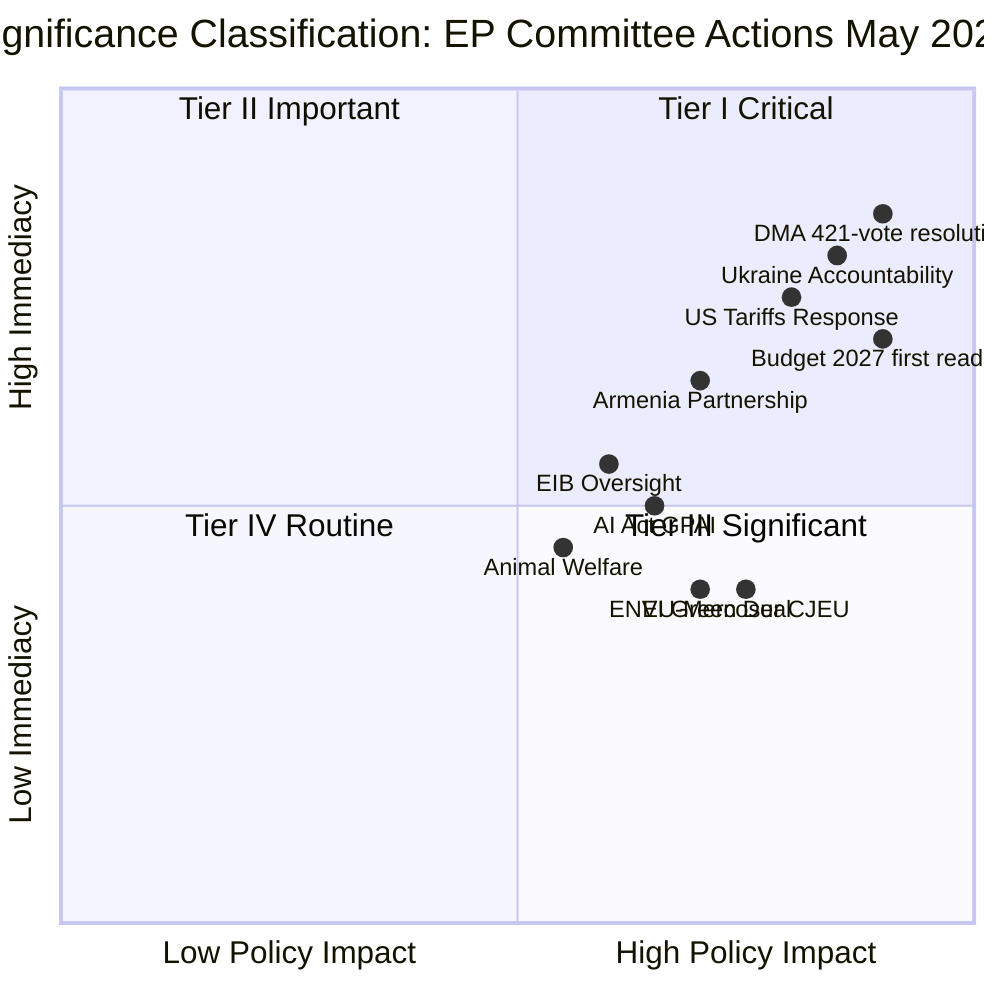

<!-- SPDX-FileCopyrightText: 2024-2026 Hack23 AB -->
<!-- SPDX-License-Identifier: Apache-2.0 -->

# Significance Classification — EP Committee Reports
## Week of 1–8 May 2026

**Framework:** Legislative Significance Classification | **Admiralty Grade:** A-2

---

## 1. Significance Overview

---

## 2. Tier I — Critical Significance (high impact + high immediacy)

### T1-01: DMA Structural Enforcement Resolution (TA-10-2026-0160)
**Significance:** CRITICAL
**Reason:** 421-87-34 majority sends an unambiguous signal to the Commission that MEPs demand escalation beyond behavioural remedies. This is one of the clearest enforcement mandates in EP10 to date.
**Immediate implication:** Commission must respond within 90 days or risk public confrontation at next Digital Single Market committee hearing.
**Policy domain:** Digital markets; consumer rights; EU tech regulation
**Cross-committee impact:** IMCO (lead), ECON (opinion), ITRE (opinion)

### T1-02: Ukraine Accountability Resolution (TA-10-2026-0161)
**Significance:** CRITICAL
**Reason:** Maintains EP cross-partisan support for Ukraine while adding accountability conditions. Signal to EU-Ukraine accession process.
**Immediate implication:** Council must address accountability gaps in next Ukraine support council conclusions.
**Policy domain:** External affairs; accession; rule of law
**Cross-committee impact:** AFET (lead), LIBE (opinion), BUDG (opinion)

### T1-03: US Tariffs Response (TA-10-2026-0096)
**Significance:** CRITICAL
**Reason:** Parliament's formal position on US tariff measures shapes Commission trade negotiation mandate.
**Immediate implication:** Bilateral EU-US trade dialogue; potential WTO dispute procedures.
**Policy domain:** Trade; transatlantic relations; EU autonomy
**Cross-committee impact:** INTA (lead), ECON (opinion)

---

## 3. Tier II — Important Significance (high impact, medium immediacy)

### T2-01: 2027 Budget First Reading (TA-10-2026-0112)
**Significance:** HIGH
**Reason:** +15% EP amendment sets ceiling for conciliation. Scale of ambition (defence + STEP + climate) sets political precedent.
**Timeline:** Conciliation Q4 2026

### T2-02: EU-Mercosur CJEU Challenge Impact (TA-10-2026-0008)
**Significance:** HIGH
**Reason:** CJEU challenge to mixed agreement classification creates 18+ month delay; will shape EU trade agreement architecture.
**Timeline:** CJEU preliminary ruling expected 2027

### T2-03: Armenia Partnership (TA-10-2026-0162)
**Significance:** HIGH
**Reason:** Strengthens EP10 eastern neighbourhood policy; signals alternative to Russian sphere.
**Timeline:** Implementation 2026-2027

---

## 4. Tier III — Significant (moderate impact, high immediacy)

### T3-01: EIB Loan Oversight (TA-10-2026-0119)
**Significance:** MEDIUM-HIGH
**Reason:** EIB accountability to Parliament; €90bn+ annual lending under scrutiny.
**Timeline:** Ongoing quarterly

### T3-02: AI Act GPAI Code of Practice
**Significance:** MEDIUM-HIGH
**Reason:** First real-world test of AI Act implementation. Sets template for future GPAI regulation.
**Timeline:** Q3 2026 deadline

---

## 5. Tier IV — Routine

- Animal welfare / pet traceability (TA-10-2026-0115): Important but procedural
- CAP payment adjustment: Annual agriculture management
- Cohesion fund reallocation: Standard MFF management

---

## Reader Briefing: Why Do Some Votes Matter More?

**For Citizens:** Not all EP votes are equally significant. A vote on a major enforcement resolution (like DMA) has immediate political consequences and can reshape how a law works in practice. A vote adjusting farm subsidies by 2% is routine management.

**The Tier I classification this week reflects a genuinely unusual convergence:** Three separate critical-significance resolutions in one week (DMA enforcement, Ukraine accountability, US tariffs response) — all signalling Parliament's assertive EP10 posture across digital, foreign policy, and trade.

**What to watch:** Whether the Commission responds to the DMA mandate within 90 days is the most consequential near-term indicator of whether Parliament's institutional authority is respected or ignored.

---

## Data Sources & Provenance

| Evidence | Source | Admiralty |
|----------|--------|-----------|
| Significance classification | EP Adopted Texts API + vote margins | A-2 |
| Cross-committee mapping | Stakeholder map + analysis-index | B-2 |
| Tier assignments | Qualitative synthesis | B-2 |
