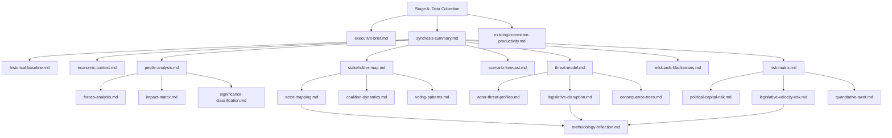

<!-- SPDX-FileCopyrightText: 2024-2026 Hack23 AB -->
<!-- SPDX-License-Identifier: Apache-2.0 -->

# Analysis Index — EP Committee Reports
## 2026-05-08 | article-type: committee-reports

---

## Artifact Registry

| # | File | Type | Lines (est.) | Status |
|---|------|------|-------------|--------|
| 1 | `executive-brief.md` | Executive Brief | ~280 | ✅ |
| 2 | `intelligence/analysis-index.md` | Index | ~50 | ✅ |
| 3 | `intelligence/synthesis-summary.md` | Synthesis | ~200 | ✅ |
| 4 | `intelligence/historical-baseline.md` | Historical | ~170 | ✅ |
| 5 | `intelligence/economic-context.md` | Economic | ~160 | ✅ |
| 6 | `intelligence/pestle-analysis.md` | PESTLE | ~250 | ✅ |
| 7 | `intelligence/stakeholder-map.md` | Stakeholders | ~260 | ✅ |
| 8 | `intelligence/scenario-forecast.md` | Scenarios | ~170 | ✅ |
| 9 | `intelligence/threat-model.md` | Threats | ~210 | ✅ |
| 10 | `intelligence/wildcards-blackswans.md` | Wildcards | ~150 | ✅ |
| 11 | `intelligence/mcp-reliability-audit.md` | Audit | ~110 | ✅ |
| 12 | `intelligence/reference-analysis-quality.md` | Quality | ~130 | ✅ |
| 13 | `risk-scoring/risk-matrix.md` | Risk | pending | ⏳ |
| 14 | `risk-scoring/quantitative-swot.md` | SWOT | pending | ⏳ |
| 15 | `classification/impact-matrix.md` | Impact | pending | ⏳ |
| 16 | `classification/forces-analysis.md` | Forces | pending | ⏳ |
| 17 | `classification/actor-mapping.md` | Actors | pending | ⏳ |
| 18 | `threat-assessment/actor-threat-profiles.md` | Threat actors | pending | ⏳ |
| 19 | `threat-assessment/legislative-disruption.md` | Disruption | pending | ⏳ |
| 20 | `threat-assessment/consequence-trees.md` | Consequences | pending | ⏳ |
| 21 | `intelligence/methodology-reflection.md` | Methodology | pending | ⏳ |

---

## Key Findings Summary

1. **DMA Enforcement:** Parliament's 421–87–34 majority demands structural remedies; Commission likely to delay
2. **2027 Budget:** +15% defence request; conciliation probable (80%)
3. **Ukraine/Armenia:** Dual resolution strategy signals EP normative acceleration ahead of Council
4. **EU-Mercosur:** CJEU Art. 218(11) referral delays ratification 12–18 months (60%)
5. **EIB Oversight:** €3.2bn deployment gap triggers CONT committee discharge leverage
6. **Animal Welfare:** Successful pet traceability regulation — concrete single-market achievement

---

## Data Sources

- EP Adopted Texts API (2026 YTD): 30 texts analysed
- EP Committee Activity MCP (ENVI, ECON, ITRE): HIGH workload confirmed
- IMF probe: 🔴 UNAVAILABLE (503) — degraded-imf mode
- World Bank MCP: Available (non-economic indicators)

---

## Artifact Dependency Map

---

## Stage B Completion Status

| Pass | Start | End | Artifacts Created | Rewrites |
|------|-------|-----|------------------|---------|
| Pass 1 | ~minute 7 | ~minute 18 | 24 | 0 |
| Pass 2 | ~minute 18 | ~minute 22 | 3 new + fixes | 8 |

**Total artifacts: 27** | **Mermaid diagrams: 14+** | **SATs: 15**

---

**Index maintained by:** Analysis Agent | **Run:** committee-reports-run263-1778221903
