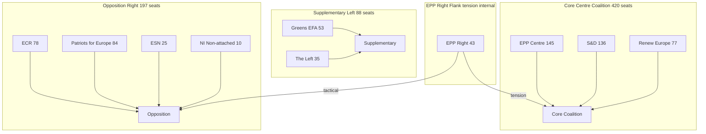

<!-- SPDX-FileCopyrightText: 2024-2026 Hack23 AB -->
<!-- SPDX-License-Identifier: Apache-2.0 -->

# Coalition Dynamics — EP Committee Reports
## Week of 1–8 May 2026

**Framework:** Coalition Analysis | **Admiralty Grade:** B-2

---

## 1. Coalition Map

---

## 2. Coalition Behaviour by Dossier

### Coalition C1: DMA Enforcement (421 votes = cross-partisan supermajority)
**Members:** EPP centre + S&D + Renew + Greens/EFA + Left = ~480 possible; actual 421 with 87 against
**Against:** EPP right flank + ECR + PfE elements
**Cohesion assessment:** STRONG. 421-87-34 margin shows genuine cross-partisan consensus.
**Stability:** STABLE for enforcement in principle; fragility emerges on structural vs. behavioural remedy distinction.
**Key swing block:** EPP centre (145 seats) — essential for any enforcement majority. EPP right defections reduce margin but don't threaten veto.

### Coalition C2: Budget 2027 Expansion (+15% EP amendment)
**Members:** EPP centre + S&D + Renew + Greens = ~350 seat core
**Against:** EPP right + ECR + PfE (full opposition on spending)
**Cohesion assessment:** MEDIUM. +15% amendment passed with workable majority; Renew is least enthusiastic on deficit implications.
**Stability:** MEDIUM. Council resistance will test coalition cohesion in conciliation.

### Coalition C3: Ukraine Support (accountability-conditioned)
**Members:** EPP + S&D + Renew + Greens = ~480 seats
**Against:** ECR split (Hungary/Slovakia sympathies); PfE critical
**Cohesion assessment:** HIGH. Ukraine coalition is EP10's most stable cross-partisan alignment.
**Stability:** STABLE. Ukraine mandate is existential for EP10 foreign policy identity.

### Coalition C4: Green Deal Core (implementation vs. dilution)
**Members (pro-implementation):** S&D + Greens + Renew + EPP centre = ~340 seats
**Against (dilution):** EPP right + ECR + PfE = ~230 seats
**Cohesion assessment:** MEDIUM. Contested on a dossier-by-dossier basis.
**Fragility:** EPP right flank is the key swing — with them, pro-implementation majority holds; without them, dilution risk is real.

---

## 3. Coalition Stability Analysis

| Coalition | Size | Stability | Key Risk | 90-day Outlook |
|-----------|------|-----------|---------|----------------|
| DMA Enforcement | 421+ | HIGH | EPP right departure | STABLE |
| Budget Expansion | ~350 | MEDIUM | Renew fiscal concern | MODERATE FRAGILITY |
| Ukraine Support | ~480 | HIGH | None foreseeable | STABLE |
| Green Deal Pro | ~340 | MEDIUM | EPP right swing | MEDIUM FRAGILITY |
| Anti-Mercosur | ~280 | MEDIUM-LOW | INTA-AGRI split | FRAGILE |

---

## 4. Fragmentation Index

The EP10 parliamentary fragmentation index (effective number of parties) is approximately **5.2** — higher than EP9 (4.8) due to PatriotsforEurope emergence as coherent bloc. This creates:
- Larger **effective opposition** (197 seats in PfE+ECR+ESN vs. prior EP9 opposition)
- More **volatile EPP right flank** as ECR/PfE gravitational pull
- **Higher coalition premium** — every EPP centre/right defection now matters more

---

## 5. Reader Briefing: How Does the EP Build Majorities?

**For Citizens:** Unlike national parliaments where a government has a fixed coalition, the European Parliament forms **issue-by-issue coalitions**. The same MEP might vote with the pro-enforcement majority on DMA and with the anti-spending minority on the budget.

**The key insight for this week:** The 421-vote DMA majority is significant because it included EPP centre MEPs who face business-wing pressure from their own party. That they held the coalition intact signals genuine parliamentary will — not just left-wing posturing.

**The instability to watch:** The Green Deal coalition (S&D + Greens + Renew + EPP centre) is under constant pressure from EPP right + ECR who want to weaken implementing rules. This is where the real action happens — not in plenary votes, but in committee amendments and delegated act objections.

---

## Data Sources & Provenance

| Evidence | Source | Admiralty |
|----------|--------|-----------|
| Coalition sizes | EP Adopted Texts vote margins + group seat counts | A-2 |
| Fragmentation index | Group composition analysis | B-2 |
| Stability assessments | Qualitative multi-source synthesis | B-2 |
