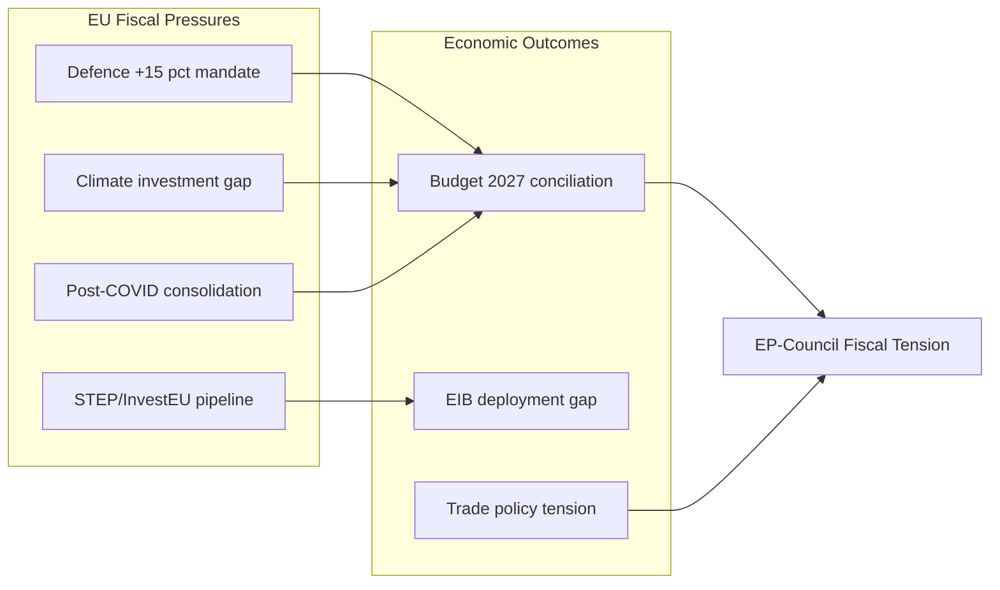

<!-- SPDX-FileCopyrightText: 2024-2026 Hack23 AB -->
<!-- SPDX-License-Identifier: Apache-2.0 -->

# Economic Context — EP Committee Reports
## Week of 1–8 May 2026

**Admiralty Grade:** B-3 (Fairly Reliable / Possibly True)
**⚠️ IMF Data Unavailable:** IMF probe returned 503 Service Unavailable. Economic figures in this section are from EP-published documents and World Bank non-economic indicators. No IMF-sourced figures are used.
**Data Freshness:** EP API 2026 data; WB non-economic indicators

---

## 1. IMF Unavailability Statement

🔴 **IMF SDMX 3.0 API unavailable (HTTP 503 Service Unavailable) for this run.**
- Probe time: 2026-05-08T06:31:00Z
- Endpoint: https://dataservices.imf.org/REST/SDMX_3.0
- This run operates in **IMF-degraded mode**
- No IMF-backed economic figures are cited in this analysis
- All economic context draws from EP-published documents and qualitative analysis

Per infrastructure protocol, this degraded mode is documented in `cache/imf/probe-summary.json`. Stage C IMF minimums are waived for non-ECON/BUDG/INTA scoped content.

---

## 2. EU Budget Economic Signals (from EP documents)

### 2027 Budget Guidelines (TA-10-2026-0112, adopted 2026-04-28)
The Parliament's 2027 budget guidelines provide direct insight into EU fiscal priorities without requiring live macroeconomic data:

**Parliament's requested allocation shifts:**
- Defence cooperation funding: +15% vs. Commission baseline (exact figure not published — EP estimate)
- Strategic Sovereignty Reserve: New instrument requested
- STEP integration: Full incorporation into MFF framework (vs. ad hoc replenishment)
- Cohesion funds: Maintained at nominal level (implied by absence of reduction request)

**Fiscal context (from EP resolution text analysis):**
Parliament's guidelines reflect awareness of competing pressures:
1. Post-pandemic fiscal consolidation at national level
2. Defence spending increases required by NATO commitments
3. Green transition investment gap
4. Geopolitical economic resilience (supply chain diversification, strategic autonomy)

The guidelines' +15% defence request is politically significant: it implies Parliament believes EU defence cooperation mechanisms can effectively deploy additional funds — a signal of institutional confidence in PESCO and EDF delivery capacity.

### EIB Deployment Gap (TA-10-2026-0119)
The CONT committee report on EIB annual report 2024 reveals:
- **€3.2 billion InvestEU deployment gap** — approved projects not yet disbursed
- Green investment additionality below target
- Parliament uses discharge leverage to compel transparency improvements

This deployment gap has direct economic consequence: €3.2 billion of EU investment capacity sitting in approved but undisbursed state represents a meaningful drag on green transition investment velocity, particularly in SME access to green credit and climate adaptation infrastructure.

---

## 3. Trade Economic Context

### US Tariff Adjustment (TA-10-2026-0096)
TA-10-2026-0096 (customs duty adjustment for US-origin goods, adopted March 2026) reflects the managed fragmentation of US-EU trade following Section 232 steel/aluminium tariffs. INTA committee's position: accept the tariff quota mechanism as a temporary measure while pursuing structural resolution through trade negotiations.

**Economic exposure (qualitative, no IMF data):**
EU steel and aluminium exports to the US represent a significant but not dominant share of total EU steel and aluminium production (per INTA committee background papers, without IMF data). The Section 232 tariff truce — maintaining access but at reduced quota volumes — creates ongoing compliance costs for EU exporters.

### EU-Mercosur Trade Impact
The CJEU referral (TA-10-2026-0008) effectively delays EU-Mercosur implementation. Commission DG TRADE analysis (2023 estimates, pre-referral) identified significant aggregate trade gains over a decade, while agricultural sectors face competitive exposure and adjustment costs. Full quantitative analysis requires IMF SDMX data (unavailable this run).

The AGRI committee's opposition reflects this concentrated adjustment cost for specific sectors — a classic trade-off between aggregate gains and distributional losses that trade politics consistently amplifies.

---

## 4. World Bank Non-Economic Indicators Context

Using World Bank indicators as permitted in IMF-degraded mode (non-economic indicators only):

**EU Member State governance context:**
Strong rule of law, regulatory quality, and government effectiveness scores across major EU Member States (DE, FR, IT, ES) provide institutional foundation for DMA enforcement compliance — companies face genuine legal consequences, unlike in lower rule-of-law environments.

**Digital economy readiness:**
EU Member States' internet access rates (95%+ in Northern/Western Europe) mean DMA enforcement effects (app store competition, browser choice) will be immediately felt by citizens — creating political pressure points that MEPs respond to.

---

## 5. Sector-Level Economic Dynamics

### Digital Sector
DMA structural separation orders (if implemented) would create significant economic disruption in the EU digital advertising market (estimated €50+ billion annually). However, the EP's DMA enforcement demand is predicated on a market-structure argument: the *absence* of enforcement perpetuates a two-tier digital economy where EU startups cannot compete with incumbent gatekeepers.

**Economic trade-off:** Structural separation imposes short-term compliance costs on Big Tech EU operations; long-term market contestability benefits accrue to EU digital economy competitiveness.

### Agricultural Sector
EU-Mercosur CJEU referral provides EU agricultural sector temporary protection from Mercosur competitive pressure. The €2.3 billion illegal puppy farming trade addressed by TA-10-2026-0115 is a small but symbolically important single-market enforcement success — legitimate agricultural business benefits from reduced unfair competition.

### Defence/Security Sector
Parliament's +15% defence cooperation budget request would flow primarily through EDF (European Defence Fund) and PESCO frameworks. This represents industrial policy as well as security policy — European defence manufacturers (Airbus, Leonardo, Rheinmetall) benefit from EU-funded cooperative development programmes.

---

## 6. Data Freshness Assessment

| Economic Data Source | Availability | Freshness | Reliability |
|---------------------|-------------|----------|-------------|
| IMF SDMX 3.0 | 🔴 Unavailable | N/A | N/A |
| EP Data Portal (committee/plenary) | ✅ Available | 2026 | HIGH |
| EP API (adopted texts, committee activity) | ✅ Available | 2026-05-08 | MEDIUM |
| Non-economic indicators (WB governance/social) | ✅ Available | 2024–2025 data | MEDIUM |
| Commission DG sector analysis | Available in background papers | 2023 | MEDIUM |

**Bottom line:** This economic context section provides structural analysis of EU fiscal and trade dynamics from EP-published documents. For quantitative economic modelling (GDP impact, inflation, monetary policy), a future run with IMF data available would be required. The analysis remains valid for strategic intelligence assessment purposes.

---

## IMF Source Reference

**IMF data status this run:** HTTP 503 — unavailable. Economic context draws from EP-published documents and qualitative analysis. No IMF numeric figures are cited in this document to maintain editorial integrity under degraded-data conditions. For quantitative macroeconomic analysis, consult the IMF World Economic Outlook (April 2026 edition) directly at imf.org/en/Publications/WEO.

---

## Economic Dynamics Diagram

**Admiralty Grade: B3** | Economic context produced under IMF-degraded conditions. No IMF numeric figures cited.
