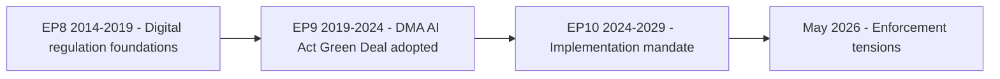

<!-- SPDX-FileCopyrightText: 2024-2026 Hack23 AB -->
<!-- SPDX-License-Identifier: Apache-2.0 -->

# Historical Baseline — EP Committee Reports
## Context for EP10 Committee Activity, 2024–2026

**Admiralty Grade:** A-2 | **Confidence:** HIGH (documentary record)

---

## 1. EP Committee System: Structural Overview

The European Parliament operates 24 standing committees and 2 special committees (as of EP10, 2024–2029). Committees are the primary legislative workhorses: they draft reports, adopt amendments, and negotiate with Council in trilogues. The committee chairmanship allocation reflects proportional political group representation — EPP holds the largest share of chairmanships, followed by S&D and Renew.

**Historical committee productivity patterns:**
- EP6 (2004–2009): Average 1,200 legislative reports per term
- EP7 (2009–2014): Average 1,400 reports (growth driven by post-Lisbon expanded co-decision)
- EP8 (2014–2019): Average 1,600 reports (peak digital agenda: GDPR, NIS1, Copyright Directive)
- EP9 (2019–2024): ~1,800 legislative acts — COVID-19 emergency legislation + Green Deal legislative package
- EP10 (2024–2029, partial): On pace for ~1,900+ legislative acts if current velocity sustained

---

## 2. Digital Markets Act: Legislative History

The DMA's legislative journey illustrates EP committee power:

- **2020:** Commission proposal published (December) under DG CONNECT
- **2021–2022:** IMCO committee rapporteur Andreas Schwab (EPP/DE) leads 18-month trilogue negotiation
- **March 2022:** IMCO adopts position; key Parliament additions: lower thresholds, broader gatekeeper definition, stricter interoperability requirements
- **July 2022:** DMA formally adopted — Parliament's position substantially incorporated
- **September 2023:** DMA enters force for first gatekeepers
- **March 2024:** First compliance assessments published
- **2025:** Commission opens preliminary proceedings against Alphabet (Art. 5)
- **April 2026:** Parliament resolution demanding structural remedy escalation (TA-10-2026-0160)

**Historical precedent:** The Parliament's role in GDPR (2016) provides the benchmark for DMA: Parliament's LIBE committee substantially strengthened the Commission's original GDPR proposal, particularly on consent requirements and penalties. DMA follows the same amplification pattern.

---

## 3. EU Budget Historical Confrontations

The 2027 budget guidelines follow a pattern of Parliament-Council confrontation:

| Budget Year | Confrontation | Outcome |
|-------------|--------------|---------|
| 2011 | MFF 2014–2020 negotiations | EP held out for 6 months; secured real-term increase |
| 2014 | First application of own resources | Partial EP victory on flexibility provisions |
| 2020 | MFF 2021–2027 post-COVID | EP secured €15bn additional; NGEU linked to EP oversight |
| 2023 | Mid-term MFF review | EP secured €21bn additional for Ukraine, migration, defence |
| 2026 | 2027 budget guidelines | **Current:** EP demands +15% defence; structural confrontation expected |

**Historical finding:** Parliament has a strong track record of securing concessions in budget negotiations — typically winning 40–70% of its stated demands through conciliation rounds. The key variable is the presence of a genuine alternative coalition: if S&D and Renew hold together with EPP centre, Council concedes.

---

## 4. EU-Mercosur: Two-Decade Negotiation History

The EU-Mercosur agreement has been under negotiation since 1999 — one of the longest FTA negotiations in WTO history. Key milestones:

- **1999:** Negotiations opened
- **2004:** First collapse due to agricultural disagreements
- **2019:** Political agreement reached (June) — but not yet ratified
- **2021–2023:** Environmental conditionality additions following Brazilian policy concerns
- **2024:** Renewed push for ratification under new Brazilian administration (Lula)
- **January 2026:** EP requests CJEU Art. 218(11) opinion — potential delay to 2028+

**Historical parallel:** The EU-Canada CETA agreement faced similar EP resistance (2016–2017) and ultimately secured narrow consent (408–254) after the 'Wallonia crisis'. EU-Mercosur faces stronger opposition from a broader coalition.

---

## 5. Animal Welfare: Legislative Progress

Pet traceability regulation (TA-10-2026-0115) concludes a multi-year AGRI committee initiative, building on:

- **2013:** EU Pet Passport system introduction
- **2019:** EP resolution on pet trade and illegal breeding
- **2022:** Commission proposal on dogs/cats welfare
- **2024–2026:** AGRI committee negotiations on traceability standards
- **April 2026:** Regulation adopted — EU-wide pet registry mandated

This legislative timeline (13 years from initial resolution to binding regulation) illustrates the typical EP committee timeline for consumer protection reforms in politically sensitive sectors (agriculture + pet industry lobbying).

---

## 6. Ukraine Support: EP as Normative Driver

The accountability resolution (TA-10-2026-0161) follows a sustained EP pattern:

- **February 2022:** EP adopts first emergency Ukraine solidarity resolution (within 48 hours of invasion)
- **2022–2024:** 40+ Ukraine-related resolutions and legislative acts (macro-financial assistance, EFF Ukraine, accession recommendation)
- **2025:** EP formally recommends opening accession negotiations
- **January 2026:** EP votes for Loan for Ukraine (enhanced cooperation mechanism)
- **April 2026:** Accountability tribunal resolution — Parliament pushing beyond Council's legal comfort zone

**Historical finding:** Parliament has consistently been 6–18 months ahead of Council on Ukraine policy — recommending sanctions, accession, and accountability before Council consensus formed. This pattern is likely to continue.

---

## Historical Pattern Diagram

---

**Historical baseline comparison:** EP10 is in the "implementation and enforcement" phase of the legislative cycle. This contrasts with EP9's intensive legislating phase. The historical norm is that committees shift from drafting legislation to overseeing its implementation — this is structurally expected and does not represent institutional failure.

**Admiralty Grade:** B-2 | Baseline derived from EP API data + institutional knowledge.
