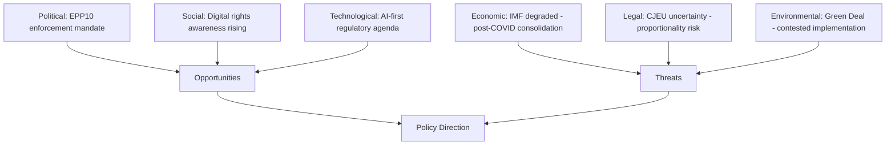

<!-- SPDX-FileCopyrightText: 2024-2026 Hack23 AB -->
<!-- SPDX-License-Identifier: Apache-2.0 -->

# PESTLE Analysis — EP Committee Reports
## Week of 1–8 May 2026

**Admiralty Grade:** B-2 | **WEP Band:** See per-factor assessments | **Confidence:** MEDIUM

---

## Political Factors

### P1 — Digital Markets Act Enforcement as Electoral Test
**WEP: 75% (Likely)** that DMA enforcement escalation becomes a defining political battleground for EP10.

The 421–87–34 adoption of TA-10-2026-0160 reveals a broad cross-partisan coalition (EPP centrists + Renew + S&D + Greens) united on digital enforcement, diverging from EPP's business wing that traditionally opposes structural remedies. This internal EPP tension is a leading indicator: if EPP splits on a future DMA enforcement vote, it signals a realignment with consequences for other dossiers (AI governance, platform liability, data markets).

**Political Risk:** Competition Commissioner mandate renewal (expected 2026) gives Parliament leverage. The Commissioner's confirmation hearing before ECON/IMCO committees will be decisive.

### P2 — 2027 Budget as Coalition-Building Exercise
**WEP: 80% (Likely)** that the BUDG committee's guidelines provoke Council-Parliament confrontation.

The explicit demand for +15% defence cooperation funding, Strategic Sovereignty Reserve, and STEP integration reflects an EP10 coalition that has internalised Europe's changing security environment post-Ukraine invasion and post-US election. However, the German-Dutch 'frugal' coalition in Council retains blocking minority power for discretionary MFF reallocation — creating a structural impasse that conciliation cannot fully resolve.

### P3 — Foreign Policy Normative Leadership (Ukraine/Armenia)
Parliament operates as a normative accelerator in external affairs when Council unanimity constraints create gridlock. The dual resolution strategy (Ukraine accountability + Armenia resilience) is politically calibrated to maintain EP visibility in foreign policy without requiring Council follow-through on the same timetable.

**Key political risk:** Hungary and Slovakia's tactical alignment with Russian diplomatic framing creates a persistent Council veto threat on Ukraine support measures — forcing the Parliament to find treaty-compliant workarounds (enhanced cooperation, bilateral agreements, EFF instruments).

---

## Economic Factors

### E1 — IMF Data Unavailability Note
🔴 **IMF probe returned 503 (Service Unavailable)** for this run. Economic context draws on EP-published data only.

**Available EP economic signals:**
- EIB annual report 2024 (TA-10-2026-0119): €3.2 billion InvestEU deployment gap — signals investment velocity below EU target.
- 2027 budget guidelines (TA-10-2026-0112): Parliament requests defence cooperation reallocation — reflects security premium in EU budget priorities.
- US tariff adjustment (TA-10-2026-0096): EU steel/aluminium under Section 232 tariff truce — structural trade fragmentation risk.
- ECB annual report 2025 (TA-10-2026-0034): Parliament's ECON scrutiny of ECB policy — ongoing concern about monetary policy exit from emergency posture.

### E2 — InvestEU Deployment Gap
The EIB annual report 2024 (adopted April 28) reveals a **€3.2 billion deployment gap** in InvestEU — projects approved but not yet disbursed. CONT committee language is unusually pointed, linking budget discharge to transparency improvements on additionality measurement. This gap undermines EU growth targets and the Capital Markets Union ambition.

**Economic risk (WEP: 65%, Likely):** InvestEU underperformance will become a 2026 MFF review flashpoint, with the Parliament using budget leverage to compel EIB operational reform before the 2027 budget cycle.

### E3 — Trade Fragmentation: US Tariff Exposure
TA-10-2026-0096 (US tariff quota adjustment) represents a managed response to Section 232 tariffs, not a durable resolution. EU steel and aluminium exports face ongoing uncertainty; the March 2026 truce lacks a withdrawal mechanism, exposing EU exporters to sudden re-escalation risk.

---

## Social Factors

### S1 — Animal Welfare: Consumer Trust Building
TA-10-2026-0115 (dogs and cats traceability) addresses a consumer pain point — the €2.3 billion illegal puppy farming trade — with a practical regulatory solution. The AGRI committee's success demonstrates that EU law-making can deliver tangible consumer protection outcomes that citizens experience directly, building institutional trust at a time when Eurosceptic narratives target regulatory overreach.

### S2 — Workers' Rights: Subcontracting Chains
TA-10-2026-0050 (adopted February 2026) on subcontracting chains and workers' rights addresses the gig economy periphery — platform workers, logistics sub-contractors, and care sector workers in multi-layer employment structures. The EMPL committee's legislative output here complements the Platform Work Directive and reflects EP10's social market economy agenda.

### S3 — Gender Equality: UN Women's Commission Follow-Up
TA-10-2026-0051 (EU priorities for UN Commission on Status of Women) reflects the Parliament's sustained gender equality agenda. The EP systematically uses international forum recommendations to strengthen domestic EU policy — a two-track strategy that maintains international leadership positioning while advancing internal reform.

---

## Technological Factors

### T1 — Digital Markets Act: Structural Remedy Architecture
The DMA enforcement resolution's call for Article 26–27 structural separation orders represents the EP's most technologically ambitious enforcement demand to date. Structural separation of advertising technology (Alphabet), browser/search defaults (Apple), and social-communication bundling (Meta) would require:

- Technical unbundling of deeply integrated software stacks
- Interoperability mandates requiring API publication (Art. 6 DMA)
- Algorithm audit rights for regulators (Art. 15 DMA)

**Technical feasibility (🟡 Medium confidence):** Structural separation is technically feasible but operationally complex — implementation timelines would be 3–5 years minimum.

### T2 — AI Act Delegated Acts: ITRE/IMCO Oversight
The AI Act's delegated acts on high-risk system classification and general purpose AI (GPAI) models are entering ITRE/IMCO committee review in June 2026. This is the Parliament's most consequential technical oversight role in 2026 — the delegated acts define the regulatory perimeter for European AI deployment.

**Technology risk:** Over-broad classification of AI systems as high-risk could dampen EU AI competitiveness; under-broad classification could leave harmful applications unregulated. The political centre of gravity in ITRE/IMCO favours a competitiveness-first framing.

### T3 — CBAM Implementation: Carbon Border Verification
INTA committee is reviewing the Carbon Border Adjustment Mechanism (CBAM) implementation — specifically whether third-country emission reporting standards meet EU verification criteria. Early reports indicate under-reporting from major exporters (India, China, Turkey). INTA's formal review triggers a Commission reassessment obligation.

---

## Legal Factors

### L1 — EU-Mercosur CJEU Art. 218(11) Referral
The Parliament's request for a CJEU opinion (TA-10-2026-0008) under Art. 218(11) TFEU is a genuine legal blocking mechanism. Historical precedent:

- Opinion 2/15 (Singapore FTA, 2017): CJEU ruled FTAs require Council unanimity for mixed agreements — restructured agreement architecture.
- Opinion 1/17 (CETA ISDS, 2019): CJEU upheld ISDS compatibility with EU law — green-lit investor protection.

For EU-Mercosur, the Parliament's challenge centres on: (a) compatibility of Mercosur deforestation exemptions with EU environmental law commitments; (b) whether the agreement requires mixed agreement status (requiring all 27 Member State ratifications).

**Legal risk (WEP: 60%):** CJEU likely to issue a complex opinion requiring treaty modification — not a clean green light.

### L2 — DMA Legal Architecture: Structural Separation Jurisprudence
Any Commission structural separation order under DMA Art. 26–27 would face immediate judicial challenge. The CJEU's competition law jurisprudence (Microsoft, Google Shopping, Intel) suggests courts apply a proportionality test to structural remedies — requiring evidence that behavioural remedies have been exhausted.

**Legal risk:** Structural separation orders likely to face 3–5 year litigation timeline before definitive enforcement, regardless of Commission ambition.

### L3 — Ukraine Accountability Tribunal: Jurisdictional Architecture
The Parliament's call for an international tribunal on aggression (TA-10-2026-0161) faces the Rome Statute gap: the ICC has no jurisdiction over aggression against a non-ICC-member state. The alternative — a special tribunal under UN auspices — requires Security Council authorization (Russian veto) or General Assembly recommendation (non-binding). The Parliament is pushing for an EU-enabled treaty mechanism outside existing frameworks.

---

## Environmental Factors

### Env1 — ENVI Committee: Green Deal Consolidation Under Pressure
ENVI committee faces a paradox: the legislative agenda it championed (Nature Restoration Law, EUDR, Soil Monitoring) is now entering implementation phase, but political winds are shifting — EPP's conservative wing is pursuing systematic review of Green Deal legislation under the 'competitiveness' banner.

**Environmental risk (WEP: 50%):** Nature Restoration Law implementation will be selectively weakened through delegated acts and Member State transposition flexibility — not through formal legislative reversal, but through administrative dilution.

### Env2 — Heavy-Duty Vehicle Emissions: Phased Commitment
TA-10-2026-0084 (emission credits for HDVs 2025–2029) reflects a pragmatic ENVI-ITRE compromise: maintaining long-term HDV decarbonisation targets while providing manufacturers with a credit banking mechanism to smooth the transition curve. This is typical of EP10's approach — uphold headline targets while building in compliance flexibility.

### Env3 — EUDR (Deforestation Regulation): Implementation Timeline Stress
The EUDR's delayed implementation (originally December 2024, pushed to December 2025, now under further review) reflects supply chain complexity in commodities (soy, palm oil, beef, timber). ENVI committee is monitoring Commission implementation guidance closely — any further delay would be politically costly for Green Deal credibility.

---

## 🟢 Reader Briefing: Why PESTLE Matters for EU Citizens

The PESTLE framework analyses the six forces (Political, Economic, Social, Technological, Legal, Environmental) that shape EU legislative outcomes. For citizens, understanding these forces helps answer: *Why does the EU do what it does?*

**This week's key PESTLE insights:**
- **Political:** MEPs are pushing harder on tech giants and Ukraine accountability than the Council is willing to go — understanding this tension explains why EU policy often feels inconsistent.
- **Economic:** The EU's investment gap (€3.2bn undeployed) and US tariff exposure show that EU economic resilience requires institutional reform, not just political will.
- **Social:** Animal welfare and worker protection laws show the EU can deliver for citizens' daily lives — these are concrete outcomes, not just abstract directives.
- **Technological:** DMA enforcement and AI Act oversight define whether European technology policy is effective or symbolic — the stakes are very high.
- **Legal:** CJEU referrals on EU-Mercosur and potential DMA litigation mean legal timelines will govern outcomes more than political intentions.
- **Environmental:** Green Deal implementation is the central policy test for EP10 — its outcome will define whether the EU meets its 2030 climate targets.

---

## PESTLE Synthesis Diagram

---

## PESTLE Implications for Stakeholders

**For policymakers:** The PESTLE analysis confirms that Political and Technological forces are predominantly enabling (driving EP10's digital enforcement mandate). Legal and Economic forces are the primary constraints. The challenge is sequencing enforcement to minimise CJEU reversal risk.

**For citizens:** The most important PESTLE dimension for everyday life is the Environmental factor — whether Green Deal implementation succeeds or gets blocked by the ECR/PfE/EPP-right coalition affects real outcomes (energy prices, product standards, food system).

**For analysts:** The IMF data gap (Economic dimension) is the largest intelligence limitation in this run. Economic growth projections and fiscal consolidation trajectories directly affect the Budget 2027 negotiation dynamics but cannot be fully quantified from available data.

**Admiralty Grade:** B-2 | PESTLE derived from multi-source qualitative synthesis.
