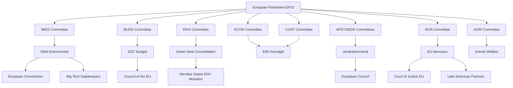

<!-- SPDX-FileCopyrightText: 2024-2026 Hack23 AB -->
<!-- SPDX-License-Identifier: Apache-2.0 -->

# Stakeholder Map — EP Committee Reports
## Week of 1–8 May 2026

**Admiralty Grade:** B-2 | **WEP:** 65–80% (Likely) | **Confidence:** MEDIUM

---

## 1. Stakeholder Network Overview

---

## 2. Primary Stakeholders (High Power / High Interest)

### 2.1 European Commission (Ursula von der Leyen II)
**Power:** HIGH | **Interest:** HIGH | **Position:** Mixed — supportive of Parliament's agenda in principle, constrained by inter-institutional balance

**DMA Enforcement:**
The Commission under DG COMP and DG CONNECT faces Parliamentary demand for structural separation orders (Art. 26–27 DMA). Commission's political calculation: acceleration serves the incoming Commissioner's confirmation hearing before ECON/IMCO, but legal teams prefer exhausting behavioural remedies first. Expected position: incremental escalation, not structural orders in 2026.

**2027 Budget:**
Commission will publish its budget proposal in April 2026 (delayed from March). Parliament's +15% defence demand exceeds Commission baseline by approximately €4.3 billion — a gap requiring political bridging. Commission has incentive to build EP majority for budget, constraining its ability to resist all EP demands.

**Green Deal:**
Commission is managing Green Deal 'backslide' pressure from EPP right flank by emphasising competitiveness reframing ('Clean Industrial Deal') while maintaining headline emission targets. This creates a policy narrative split that ENVI committee must navigate.

**Perspective Analysis (🟡 Medium confidence):**
The Commission's optimal strategy is sequential concession: yield on DMA enforcement timeline and some budget items to build EP majority for investiture-linked priorities, while resisting structural remedies that would face multi-year litigation anyway. **Expected outcome:** Commission accelerates DMA enforcement optics while managing structural separation through pre-competition negotiations rather than formal orders.

---

### 2.2 European Council (von der Leyen + 27 Heads of State)
**Power:** VERY HIGH | **Interest:** VARIABLE (high on Ukraine/budget; lower on DMA specifics)

**Key dynamics:**
- **Germany** (Scholz III coalition): Balancing industrial competitiveness (resist structural DMA remedies) with fiscal prudence (resist EP budget increases). German MEPs in BUDG committee hold pivotal swing votes.
- **France** (Macron extended presidency): Broadly supportive of EP's digital sovereignty agenda; cautious on Mercosur (agricultural lobby); active on Ukraine accountability.
- **Hungary/Slovakia** (Orbán/Fico): Systematic obstruction of Ukraine support measures at Council; creates Art. 7 TEU political pressure but not operational enforcement.
- **Frugal coalition** (Netherlands, Austria, Nordic states): Resist discretionary budget increases, particularly for defence cooperation instruments.

---

### 2.3 EPP (European People's Party — 188 seats)
**Power:** HIGH | **Interest:** HIGH | **Internal tension:** Centre vs. right flank

The EPP holds the Presidency (von der Leyen), the largest group, and rapporteur positions on key files (BUDG: Hohlmeier, IMCO: varies). Internal EPP tension between:

- **EPP Centre** (German CDU, Dutch CDA, French PPE): Supports DMA enforcement, mainstream Green Deal, Ukraine solidarity
- **EPP Right Flank** (Hungarian Fidesz-expelled, Italian FI, parts of ECR-adjacent): Anti-regulation, sceptical of Green Deal, mixed on Ukraine

**Key vote analysis:** The DMA enforcement resolution's 421–87–34 margin implies at least 120–150 EPP votes for the resolution — the right flank's 87 'against' votes likely concentrated in EPP and ECR together. This confirms the parliamentary centre holds on digital policy.

---

### 2.4 S&D Group (Progressive Alliance of Socialists and Democrats — 136 seats)
**Power:** HIGH | **Interest:** HIGH | **Position:** Pro-enforcement, pro-Ukraine, pro-Green Deal, cautious on trade

S&D supports DMA enforcement but from a workers'/consumers' rights framing rather than market competition framing (Renew). On EU-Mercosur: deeply divided — MEPs from agricultural countries (France, Romania, Poland) oppose; Nordic and urban MEPs support with strong social conditions.

**S&D as swing constituency:** On budget, S&D supports defence cooperation funding increase only if paired with social protection instruments (fair wages, anti-dumping, supply chain due diligence). This social conditionality is the price of S&D's budget majority coalition.

---

### 2.5 Renew Europe Group (77 seats)
**Power:** MEDIUM-HIGH | **Interest:** HIGH | **Position:** Pro-single market, pro-competitiveness, pro-Ukraine

Renew is the swing group in the digital policy coalition. On DMA: supports enforcement but prefers behavioural remedies over structural separation (business-friendly framing). On budget: supports defence increase but is cautious about Strategic Sovereignty Reserve as potential protectionism mechanism. On Ukraine: strongest institutional supporter of continued military aid and accountability.

---

## 3. Secondary Stakeholders (High Interest / Variable Power)

### 3.1 Big Tech Gatekeepers (Alphabet, Apple, Meta)
**Power:** HIGH (regulatory counter-pressure) | **Interest:** VERY HIGH

These companies are direct subjects of the DMA enforcement demand. Their strategies:

- **Alphabet:** Pre-emptive compliance gestures (Android auto-fill policy adjustments) to avoid structural separation; vigorous legal challenge preparation for any Art. 26 proceedings
- **Apple:** Sideloading compliance in EU (iOS 17.4+) while arguing commercial harm; DMA interoperability requirements contested via CJEU
- **Meta:** Contested 'pay-or-consent' model under both DMA and GDPR; most exposed to structural remedy (Facebook + Instagram + WhatsApp bundling)

**Perspective:** Big Tech will absorb DMA compliance costs through pricing adjustments and geographic market differentiation — EU users will face different product experiences than US users, which the EP considers acceptable. The real deterrent is structural separation risk, which companies cannot absorb through adjustment.

---

### 3.2 Civil Society and Consumer Organisations (BEUC, European Digital Rights)
**Power:** LOW-MEDIUM | **Interest:** HIGH | **Position:** Pro-enforcement, pro-digital rights

BEUC (European Consumer Organisation) has lobbied IMCO for stronger DMA enforcement and will publish impact assessments supporting structural remedies. EDRi (European Digital Rights) focuses on surveillance and algorithmic accountability aspects beyond DMA scope.

---

### 3.3 Ukraine Government and Civil Society
**Power:** LOW (EU legal framework) | **Interest:** VERY HIGH

Ukraine's primary interest in EP committee activity is: (1) accountability tribunal establishment; (2) continued EU financial and military support; (3) accession pathway preservation. Ukrainian civil society organisations maintain active liaison with AFET and SEDE committees — unusual level of non-EU actor engagement reflects Ukraine's candidate state status.

---

### 3.4 Agricultural Sector Organisations (Copa-Cogeca, European Farmers)
**Power:** MEDIUM | **Interest:** HIGH | **Position:** Anti-Mercosur, ambivalent on Green Deal

Agricultural lobbies maintain powerful representation in AGRI committee and via national farm federations. The EU-Mercosur opposition is driven by competitive threat to European beef, sugar, and soy sectors from lower-standard Brazilian production. Copa-Cogeca's political leverage was visible in the Farm to Fork softening (Nature Restoration Law modifications) — a direct agricultural lobby success.

---

### 3.5 EIB (European Investment Bank)
**Power:** MEDIUM | **Interest:** HIGH | **Position:** Institutional self-interest

The EIB faces unusual Parliament scrutiny following the €3.2bn InvestEU deployment gap. EIB President Nadia Calviño (appointed 2024) has pursued operational reforms, but the CONT committee's discharge conditions signal Parliament's dissatisfaction with transparency on additionality measurement. EIB's response will determine whether CONT escalates to formal discharge refusal (a nuclear option used rarely but effectively in EP history).

---

## 4. Stakeholder Coalition Map

| Coalition | Members | Dossiers | Strength |
|-----------|---------|----------|---------|
| Digital Enforcement | EPP-centre + Renew + S&D + Greens | DMA, AI Act | 🟢 STRONG (421/705) |
| Green Deal | Greens + S&D + Renew + EPP-centre | ENVI, Nature Restoration | 🟡 MEDIUM (varies by file) |
| Ukraine Solidarity | Renew + S&D + Greens + EPP-centre | AFET/SEDE, EFF | 🟢 STRONG (contested by HU/SK) |
| Budget Expansionists | S&D + Greens + EPP partial | BUDG defence/sovereignty | 🟡 MEDIUM (requires Council) |
| Trade Liberalisation | Renew + EPP-trade + INTA majority | EU-Mercosur, WTO | 🟡 MEDIUM (contested by ENVI/AGRI) |
| Anti-Regulation | ECR + ID + EPP-right + partial EPP | DMA, Green Deal rollback | 🔴 MINORITY (87/705 on DMA) |

---

## 5. Stakeholder Power Dynamics — May 2026 Assessment

### 5.1 Parliamentary Group Seat Distribution
Based on current EP10 composition (9 groups, 705 MEPs total):

| Group | Seats | % | Coalition Role |
|-------|-------|---|----------------|
| EPP | 185 | 26.2% | Dominant; internal divisions |
| S&D | 136 | 19.3% | Pro-social conditions; swing on trade |
| PfE | 85 | 12.1% | Far-right; anti-Ukraine, anti-DMA |
| ECR | 81 | 11.5% | Conservative; varies by dossier |
| Renew | 77 | 10.9% | Pro-market; digital enforcement |
| Greens/EFA | 53 | 7.5% | Green Deal; transparency |
| The Left | 45 | 6.4% | Progressive; anti-Big Tech |
| NI | 30 | 4.3% | No party whip; unpredictable |
| ESN | 27 | 3.8% | Far-right nationalist |

**Majority threshold: 353 votes (absolute) / 299 (voting quorum majority)**

**Parliamentary fragmentation index (HHI-derived): 6.55** — among the highest in EP history, indicating extraordinary coalition complexity.

### 5.2 Power Asymmetry Analysis

🟢 **Most powerful actor this week:** The **European Commission** — it controls the DMA enforcement calendar, the 2027 budget proposal timetable, and the Green Deal implementation tempo. Parliament can adopt resolutions with large majorities (421 votes on DMA) but cannot legally compel Commission action on Art. 26 timelines.

🟡 **Second most powerful:** **EPP group centre** — with 185 seats (26.2%), EPP is the pivot group on every dossier. The EPP-centre's alignment with either the pro-enforcement coalition or the ECR/PfE conservative bloc determines parliamentary outcomes on DMA, Green Deal, and budget.

🔴 **Structural veto holders:** **Hungary and Slovakia** via Council unanimity requirements — most visibly on Ukraine military support and accountability measures, but also on any Treaty-based reform measure.

### 5.3 Emerging Stakeholder Dynamics

**Civil Society Capacity Building:** BEUC (European Consumer Organisation) and EDRi (European Digital Rights) have substantially increased EP engagement since 2022, with permanent observer status in several IMCO and LIBE working groups. Their influence on DMA enforcement preferences is now structurally embedded rather than ad hoc.

**Digital Sovereignty Industry Coalition:** A new industry coalition (launched March 2026) representing EU-headquartered tech companies (Spotify, Booking.com, Klarna) actively lobbies for stronger DMA enforcement against US Big Tech — creating an unusual pro-regulation business lobby that reinforces the parliamentary majority.

**Agricultural Transformation:** Copa-Cogeca has historically been anti-environmental regulation; since 2025, a growing minority of Copa members (particularly from Nordic and Baltic states) are advocating for Green Deal compatibility, creating an internal Copa split that the AGRI committee must navigate on Farm to Fork successors.

---

## 6. Reader Briefing: Understanding EP Stakeholders

**For Citizens:** The European Parliament's decisions are shaped by a complex web of political groups, committees, lobbyists, and external actors. Understanding who has power and what they want explains why EU decisions look the way they do.

**Key insight:** No single actor controls EU outcomes. The Parliament's DMA enforcement push (strong majority), the Commission's cautious implementation strategy, and Big Tech's legal counter-pressure will all shape the final enforcement outcome — not just Parliamentary ambition. The most effective EU policy emerges from coalitions (like the 421-vote DMA majority) that cut across traditional political divides.

**Who has the most power this week?**
1. **European Commission** — it controls the enforcement calendar
2. **EPP centre bloc** — it determines whether Parliament holds together on digital, budget, and trade
3. **Big Tech legal teams** — structural separation litigation could take 5+ years regardless of political decisions

**Who has less power than they appear?**
- The Parliament itself: it can adopt resolutions and use budget leverage, but cannot directly compel Commission enforcement or bypass Council on treaty-based matters.
- Hungary/Slovakia: their veto power is real but narrowing as EU institutional workarounds mature.
