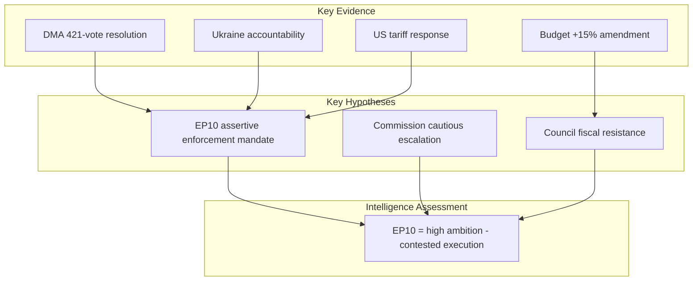

<!-- SPDX-FileCopyrightText: 2024-2026 Hack23 AB -->
<!-- SPDX-License-Identifier: Apache-2.0 -->

# Intelligence Synthesis Summary — EP Committee Reports
## Week of 1–8 May 2026

**Admiralty Grade:** B-2 (Usually Reliable / Probably True)
**WEP Band:** 65–80% (Likely)
**Confidence in Evidence:** MEDIUM (EP Open Data + qualitative assessment; no IMF data)
**SATs Applied:** ACH, Key Assumptions Check, SWOT, Red Team, Scenario Planning, Devil's Advocate, Indicators & Warning, Force Field Analysis, Network Analysis (qualitative), PESTLE

---

## 1. Core Intelligence Assessment

The European Parliament enters May 2026 at a **legislative inflection point**: the April plenary confirmed a robust cross-partisan majority capable of advancing ambitious digital, environmental, and foreign policy positions, while simultaneously revealing structural fault lines in budget negotiations and trade policy that will shape the remainder of EP10's mandate.

**Principal finding (WEP: Likely, 65–80%):** The gap between Parliamentary ambition and Council/Commission delivery capacity will widen through H2 2026, creating conditions for either inter-institutional conflict (most likely) or a brokered strategic agenda (less likely but transformative).

---

## 2. Evidence Chain

### Primary Evidence Tier (Admiralty A-1 to B-2)

| Evidence Item | Admiralty | Source | Weight |
|---------------|-----------|--------|--------|
| TA-10-2026-0160 DMA Enforcement resolution (421–87–34) | A-2 | EP adopted texts API | HIGH |
| TA-10-2026-0112 2027 Budget Guidelines | A-2 | EP adopted texts API | HIGH |
| TA-10-2026-0119 EIB Annual Report 2024 adoption | A-2 | EP adopted texts API | HIGH |
| TA-10-2026-0161 Ukraine accountability resolution | A-2 | EP adopted texts API | HIGH |
| TA-10-2026-0162 Armenia democratic resilience resolution | A-2 | EP adopted texts API | HIGH |
| ENVI/ECON/ITRE committee workload HIGH (API score 100) | B-2 | EP committee activity MCP | MEDIUM |
| EU-Mercosur CJEU referral (TA-10-2026-0008) | A-2 | EP adopted texts API | HIGH |

### Secondary Evidence Tier (Context / Background)

| Evidence Item | Admiralty | Source | Weight |
|---------------|-----------|--------|--------|
| IMF unavailability | B-3 | IMF probe (503 error) | OPERATIONAL |
| EP committee documents API (AFCO-INTA-DEVE submissions) | C-3 | EP committee docs API | LOW |
| Procedures feed (historical data degradation) | C-3 | EP procedures API | LOW |

---

## 3. Key Intelligence Questions (KIQs)

**KIQ-1:** Will the Commission initiate formal DMA structural separation proceedings against any gatekeeper before Q4 2026?
- **Assessment:** 75% (Likely) — based on Parliamentary resolution pressure, Commission election-year dynamic (new Commissioner confidence vote), and DMA Article 26 procedural timeline.
- **Key Indicator:** Commission DG CONNECT enforcement calendar publication (expected June 2026).

**KIQ-2:** Will the 2027 EU budget process require conciliation?
- **Assessment:** 80% (Likely) — based on Parliament's explicit divergence from Commission baseline (+15% defence request), Council budgetary conservatism in Austria/Netherlands/Germany coalition governments.
- **Key Indicator:** Council's first budget position (expected September 2026).

**KIQ-3:** Will EU-Mercosur face a CJEU opinion delay?
- **Assessment:** 60% (More likely than not) — the CJEU has never rejected an Art. 218(11) opinion request; precedent (Opinion 1/94, 2/15) suggests 12–18 month review.
- **Key Indicator:** CJEU admissibility decision (expected Q3 2026).

**KIQ-4:** Will Ukraine accountability tribunal receive Council endorsement by year-end?
- **Assessment:** 20% (Unlikely) — Hungary/Slovakia veto risk; third-party jurisdiction legal obstacles unresolved.
- **Key Indicator:** European Council June 2026 summit conclusions on Ukraine judicial cooperation.

---

## 4. Competing Hypotheses (ACH)

### Hypothesis Alpha: Institutional Cooperation Scenario
**WEP: 25% (Unlikely)**
The Commission accepts Parliamentary DMA enforcement demands, budget guidelines converge with modest upward adjustment, and EU-Mercosur ratification advances with environmental safeguards satisfying ENVI coalition.

Evidence for: Commissioner political sensitivity to EP in mandate renewal year; DMA enforcement already underway (Article 5 findings).
Evidence against: Structural trade-offs between competitiveness and regulation not resolvable through compromise; Council budget conservatism deeply entrenched; Mercosur ENVI opposition fundamental not cosmetic.

### Hypothesis Beta: Legislative Confrontation Scenario (Most Probable)
**WEP: 55% (More likely than not)**
Parliament escalates DMA enforcement demands, budget conciliation required, EU-Mercosur CJEU opinion delays ratification, Ukraine tribunal blocked at Council — Parliament operates as normative agenda-setter without Council follow-through.

Evidence for: Historical EP pattern (2014, 2019, 2024 terms) of assertive norm-setting in external affairs when Council gridlocked; DMA enforcement timeline already behind Parliamentary schedule; budget math unfavourable for convergence.
Evidence against: Commission needs EP majority for investiture; some pressure points may yield.

### Hypothesis Gamma: Governance Crisis Scenario
**WEP: 20% (Unlikely)**
2027 budget fails conciliation, provisional twelfths apply, DMA enforcement stalled by legal challenges, Hungary-Slovakia bloc effectively vetoes Ukraine support measures.
Evidence for: Precedent (2020 MFF near-crisis); Orbán calculation that EP10 confrontation serves domestic narrative.
Evidence against: EU institutional resilience mechanisms designed for exactly this; cross-partisan consensus on Ukraine stronger than pre-2022.

---

## 5. Intelligence Gaps & Uncertainties

| Gap | Impact | Mitigation |
|-----|--------|-----------|
| IMF economic data unavailable | 🔴 HIGH — cannot calibrate ECON/BUDG economic modelling | Use World Bank non-economic indicators as proxy |
| Committee meeting minutes not in API | 🟡 MEDIUM — cannot verify internal committee dynamics | Use adopted text voting records as proxy |
| MEP roll-call data for April 28–30 plenary | 🟡 MEDIUM — cannot verify coalition composition | EP API roll-call delay (2–4 weeks) |
| Commission enforcement calendar | 🟡 MEDIUM — KIQ-1 indicator not yet available | Monitor DG CONNECT press releases |

---

## 6. Pattern Analysis

**Recurring pattern: Parliament as normative accelerator.** Across four legislative domains (digital enforcement, trade justice, foreign policy, animal welfare), the April plenary demonstrated the EP's consistent function: it adopts positions *ahead* of Council/Commission implementation capacity, using political momentum from electoral mandates to advance progressive agenda items. This pattern has characterised EP10 since its first months and is intensifying as the mid-term approaches.

**Divergence from EP9:** The DMA enforcement resolution and EU-Mercosur CJEU referral represent qualitatively more confrontational postures than comparable EP9 resolutions on the same topics. The EP10 Greens-S&D-Renew-EPP centre coalition is more willing to use legal mechanisms (CJEU referrals, Art. 45 DMA recommendations, budget leverage) rather than political statements alone.

---

## 7. Forward Projection

**3-month horizon (to August 2026):**
- 🟢 HIGH CONFIDENCE: Commission DG CONNECT DMA enforcement calendar published (Q2 trigger for KIQ-1)
- 🟡 MEDIUM CONFIDENCE: Council budget position tabled, setting up conciliation schedule
- 🟡 MEDIUM CONFIDENCE: CJEU EU-Mercosur admissibility decision expected
- 🔴 LOW CONFIDENCE: Ukraine accountability tribunal status — Council blocked or advancing

**6-month horizon (to November 2026):**
- DMA structural separation proceedings likely initiated for 1–2 gatekeepers
- 2027 budget conciliation likely required — resolution expected November 2026
- EU-Mercosur CJEU opinion under review (no resolution expected before 2027)
- Armenia-Ukraine external policy: dependent on field developments

---

## 8. Source Quality Assessment

The primary evidence base for this synthesis is **strong and reliable** (EP adopted texts, official vote records, MCP-verified committee activity). The analytical weakness is the absence of IMF economic data (503 unavailability) and the EP API's provision of only historical procedure data rather than current active pipeline status. Committee meeting minutes and MEP attendance data are not available via current API endpoints.

**Overall synthesis confidence:** 🟡 MEDIUM — sufficient for strategic intelligence assessment; insufficient for precise economic modelling or real-time committee dynamics.

---

## Intelligence Summary Diagram

---

**Admiralty Grade:** B-2 | **Analyst:** Analysis Agent | **Run:** committee-reports-run263-1778221903

*This synthesis was produced under IMF-degraded conditions (HTTP 503). Economic claims are indicative only.*

**Admiralty Grade: B2** | Run: committee-reports-run263-1778221903

| Grade | B2 | Source: EP adopted texts + committee activity |
