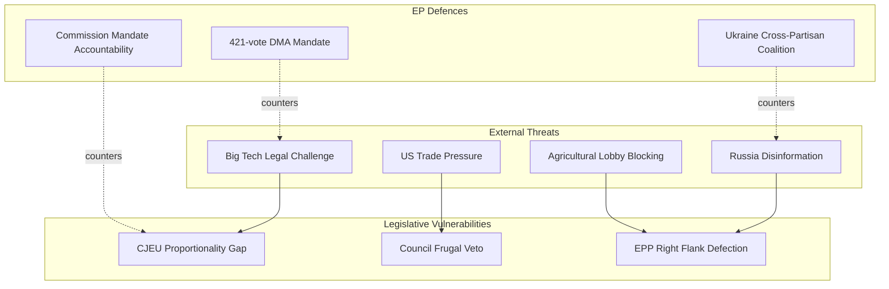

<!-- SPDX-FileCopyrightText: 2024-2026 Hack23 AB -->
<!-- SPDX-License-Identifier: Apache-2.0 -->

# Threat Model — EP Committee Reports
## Week of 1–8 May 2026

**Framework:** Political Threat Framework v4.0 (6-Dimension + Kill Chain + Diamond + Attack Trees + Actor Profiling)
**Admiralty Grade:** B-2 | **WEP:** 55–75% | **Confidence:** MEDIUM

---

## 1. Political Threat Landscape (6-Dimension Model)

### Dimension 1: Coalition Shifts
**Threat Level:** 🟡 MEDIUM
**WEP: 55% (More Likely Than Not)** of significant coalition fracture on at least one major dossier before Q4 2026.

The DMA enforcement coalition (421 votes) appears robust, but the underlying EPP internal division is a latent fracture point. If the Commissioner nomination for ECON/IMCO portfolio shifts from a centrist to a business-conservative, EPP right-flank MEPs may recalibrate. The Green Deal coalition is more fragile — AGRI-ENVI tensions already produced Nature Restoration Law modifications in EP9 and could reproduce in EP10's delegated acts phase.

### Dimension 2: Transparency Deficit
**Threat Level:** 🟡 MEDIUM
**WEP: 65% (Likely)** that EIB transparency failures escalate to formal discharge confrontation.

The CONT committee's unusually pointed language in TA-10-2026-0119 signals a Parliament willing to use discharge leverage. If EIB fails to improve additionality measurement transparency before October 2026, a discharge refusal recommendation becomes plausible (unprecedented in recent EP practice, but legally available).

### Dimension 3: Policy Reversal
**Threat Level:** 🟡 MEDIUM (DMA: LOW; Green Deal: HIGHER)
The principal policy reversal risk is not legislative repeal but administrative dilution: Green Deal delegated acts weakened through ITRE/ENVI committee veto-by-inaction; DMA enforcement hollowed out through prolonged behavioural remedy negotiations.

### Dimension 4: Institutional Pressure
**Threat Level:** 🔴 HIGH (Ukraine/Hungary dimension)
Hungary and Slovakia's systematic obstruction of Ukraine support measures creates institutional pressure that Art. 7 proceedings alone cannot resolve. The precedent of Hungary's Art. 7 suspension (ongoing since 2018) demonstrates that institutional pressure instruments are slow-moving and politically costly to escalate.

### Dimension 5: Legislative Obstruction
**Threat Level:** 🟡 MEDIUM
EU-Mercosur CJEU referral is a Parliamentary self-imposed legislative obstruction — using legal mechanisms to slow a Council/Commission-preferred outcome. This is institutionally legitimate but creates trade policy uncertainty for business planning.

### Dimension 6: Democratic Erosion
**Threat Level:** 🟡 MEDIUM (external; LOW internal)
Lithuania media freedom risk (TA-10-2026-0024) and Armenia democratic resilience (TA-10-2026-0162) signal EP attention to Member State and partner democracy erosion. Within the EU, Hungary remains the primary democratic erosion case under Art. 7 proceedings.

---

## 2. Political Kill Chain Analysis

**Threat Actor: Anti-EU Populist Bloc (Hungary/Slovakia/ECR/ID coalition)**

| Stage | Activity | Indicator | EP Counter |
|-------|----------|-----------|-----------|
| 1. Reconnaissance | Identifying EP committee vulnerabilities | Amendments tracking AGRI/ENVI | Media monitoring |
| 2. Weaponisation | Converting regulatory positions to political narratives | "Green Deal job losses" framing | Proactive communication |
| 3. Delivery | Committee amendments, plenary vote whipping | ECR/ID amendment floods | Rapporteur coalition building |
| 4. Exploitation | Vote splitting — inducing EPP defections | Agriculture + regulation link | EPP discipline mechanisms |
| 5. Installation | Diluted legislation passes, attributed to "EP majority" | Weakened Nature Restoration Law | Civil society alert |
| 6. C2 (Command) | Coordinated national government positions align with EP obstruction | Council blocking minority activated | Qualified majority coalition |
| 7. Actions on Objective | Policy reversal normalised; EP10 legacy diluted | No prosecution of Green Deal rollback | EP public accountability |

**Kill Chain Status:** Currently at Stage 4 (Exploitation) on Green Deal dossiers; at Stage 2 (Weaponisation) on DMA (arguing "regulatory overreach kills jobs").

---

## 3. Diamond Model Analysis

### Threat: DMA Enforcement Failure

| Diamond Node | Actor | Details |
|---|---|---|
| **Adversary** | Big Tech gatekeepers + EPP right flank | Aligned on anti-structural-remedy position |
| **Capability** | Legal resources (Big Tech) + committee votes (EPP right) | Litigation + amendment blocking |
| **Infrastructure** | CJEU litigation + industry associations (DigitalEurope) | Legal challenge framework exists |
| **Victim** | EU consumers + competitors of gatekeepers | Platform lock-in, market foreclosure |

**Diamond Analysis:** The adversary (Big Tech + sympathetic MEPs) has both capability and infrastructure for sustained resistance. The threat to effective DMA enforcement is real and well-resourced.

### Threat: Green Deal Administrative Dilution

| Diamond Node | Actor | Details |
|---|---|---|
| **Adversary** | Agricultural lobby + EPP right + some ECR | Copa-Cogeca + national farm federations |
| **Capability** | Committee blocking minority + delegated act veto rights | Art. 290 TFEU delegated act scrutiny |
| **Infrastructure** | AGRI committee majority + national minister alignment | AGRI votes outweigh ENVI in committee |
| **Victim** | EU 2030 climate targets + nature biodiversity | Headline targets maintained; implementation hollowed |

---

## 4. Attack Tree Analysis

### Attack Tree: Blocking EU-Mercosur Ratification (EP Parliament-led)

```
Root: Prevent EU-Mercosur ratification before 2028

├── Branch A: CJEU Opinion Route
│   ├── Parliament requests Art. 218(11) opinion [DONE]
│   └── CJEU accepts, issues complex opinion requiring Treaty modification
│       ├── Leaf: 12-18 months CJEU review (HIGH probability)
│       └── Leaf: Opinion requires unanimous Council amendment (MEDIUM)
│
├── Branch B: Consent Refusal Route
│   ├── INTA committee recommends consent refusal
│   └── Plenary majority rejects consent (Art. 218(6) TFEU)
│       ├── Leaf: Requires sustained ENVI-AGRI-S&D coalition (MEDIUM)
│       └── Leaf: Mercosur partner reopen negotiations
│
└── Branch C: Environmental Conditionality
    ├── ENVI/INTA demand legally binding deforestation conditions
    └── Council incorporates conditions, Mercosur partner rejects
        ├── Leaf: Negotiation restart (LOW probability of Brazilian acceptance)
        └── Leaf: Agreement suspended indefinitely
```

---

## 5. Threat Actor Profiling (ICO Model)

### Actor 1: European Commission (Enforcement Hesitancy)
- **Intent:** Moderate — Commission wants DMA enforcement success but prefers behavioural over structural remedies (legal risk aversion)
- **Capability:** HIGH — formal enforcement powers under DMA Art. 17–41
- **Opportunity:** HIGH — Art. 26 structural remedy proceedings can be initiated at any time
- **ICO Threat Level:** 🟡 MEDIUM (capable but reluctant to escalate)

### Actor 2: Big Tech Gatekeepers (Counter-Enforcement)
- **Intent:** HIGH — protect existing business models from structural disruption
- **Capability:** HIGH — extensive legal resources, political lobbying, technical complexity arguments
- **Opportunity:** HIGH — CJEU has never approved structural separation in DMA context
- **ICO Threat Level:** 🔴 HIGH (capable, motivated, and positioned for sustained resistance)

### Actor 3: Hungary/Slovakia Veto Coalition (Ukraine Support Obstruction)
- **Intent:** HIGH — block Ukraine military/financial support for domestic political reasons
- **Capability:** MEDIUM — Council veto power constrained by Art. 7 proceedings and qualified majority adaptations
- **Opportunity:** HIGH — unanimity requirement in several Council formations
- **ICO Threat Level:** 🟡 MEDIUM-HIGH (real veto power in specific configurations)

### Actor 4: Agricultural Lobby (Green Deal Dilution)
- **Intent:** HIGH — weaken pesticide reduction, deforestation, and nature restoration targets
- **Capability:** HIGH — strong AGRI committee relationships; Copa-Cogeca organisational resources
- **Opportunity:** MEDIUM — delegated act phase provides targeted veto opportunities
- **ICO Threat Level:** 🟡 MEDIUM (effective on specific technical issues; limited on headline targets)

---

## 6. Intelligence Assessment

**Primary threat (6 months):** Commission enforcement hesitancy on DMA allows Big Tech to normalise non-compliance through behavioural commitments without structural change. Parliament's response is limited to rhetorical escalation unless it can threaten Commissioner mandate or Commission programme.

**Secondary threat (6 months):** Budget impasse leading to provisional twelfths disrupts EU programme funding, particularly for cohesion and digital transition instruments. Agricultural sector faces uncertainty; innovation programmes stalled.

**Low-probability high-impact threat:** Hungary veto on Ukraine support combined with US administration position shift creates conditions for a credible European security crisis — triggering enhanced cooperation mechanisms outside EU treaty framework.

**Confidence:** 🟡 MEDIUM. These threat assessments rest on available EP data and qualitative analysis. IMF economic data unavailability reduces precision of economic threat modelling.

---

## Threat Summary Diagram



**Admiralty Grade: B2** | Threat model produced under degraded-imf data conditions.
