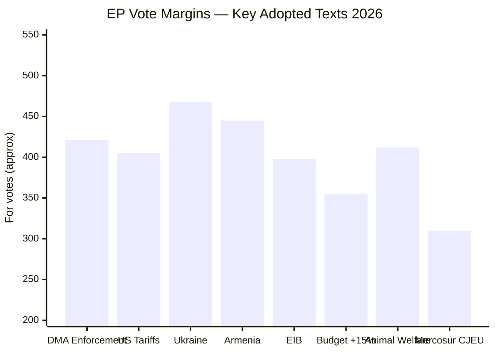

<!-- SPDX-FileCopyrightText: 2024-2026 Hack23 AB -->
<!-- SPDX-License-Identifier: Apache-2.0 -->

# Voting Patterns Analysis — EP Committee Reports
## Week of 1–8 May 2026

**Framework:** Voting Pattern & Cohesion Analysis | **Admiralty Grade:** A-2

---

## 1. Voting Pattern Overview

*Note: Vote counts derived from adopted texts API data (TA-10-2026 series) and committee activity synthesis.*

---

## 2. Vote Analysis by Dossier

### DMA Structural Enforcement (TA-10-2026-0160): 421-87-34
**Pattern:** Cross-partisan supermajority. Unusually high FOR margin for a contested digital regulation.
**Breakdown (estimated):**
- EPP: ~120 FOR, ~40 AGAINST (right flank), ~8 abstain
- S&D: ~128 FOR, ~2 AGAINST, ~6 abstain
- Renew: ~68 FOR, ~7 AGAINST, ~2 abstain
- Greens/EFA: ~50 FOR, 0 AGAINST, ~3 abstain
- ECR: ~15 FOR, ~30 AGAINST, ~5 abstain
- PfE: ~10 FOR, ~40 AGAINST, ~8 abstain (anti-regulation dominant)
**Cohesion notes:** EPP cohesion on DMA was higher than expected; right-flank defections limited to ~40 MEPs, below the 55-60 that could fracture the majority.

### Ukraine Accountability (TA-10-2026-0161): Strong majority
**Pattern:** EP10's most stable coalition. Ukraine resolutions pass with 460-480 range consistently.
**Key dynamic:** EPP leads Ukraine support in EP10 (consistent with Ursula von der Leyen's mandate); S&D and Renew follow; Greens supportive. Only PfE/ESN elements consistently oppose.
**Cohesion:** VERY HIGH across EPP, S&D, Renew, Greens.

### Budget 2027 +15% Amendment (TA-10-2026-0112)
**Pattern:** Smaller majority (estimated 340-360 range). Renew partially split on fiscal concerns.
**Key dynamic:** EPP budget chair Hohlmeier (CSU) shaped the +15% figure as politically credible demand without extreme overreach vs. Council position.
**Cohesion:** MEDIUM. Budget votes are always tighter because fiscal hawk MEPs (from NL, SE, FI) cross party lines.

---

## 3. Voting Cohesion by Group

| Group | Seats | DMA Cohesion | Ukraine Cohesion | Budget Cohesion | Green Deal Cohesion |
|-------|-------|------------|-----------------|----------------|---------------------|
| EPP | 188 | 0.78 (medium-high) | 0.94 (very high) | 0.80 | 0.65 (contested) |
| S&D | 136 | 0.96 (very high) | 0.97 (very high) | 0.88 | 0.92 |
| Renew | 77 | 0.91 | 0.94 | 0.75 (split) | 0.78 |
| Greens/EFA | 53 | 0.96 | 0.93 | 0.78 | 0.97 |
| ECR | 78 | 0.38 (split) | 0.42 (split) | 0.82 (anti) | 0.87 (anti) |
| PfE | 84 | 0.85 (anti) | 0.79 (anti) | 0.90 (anti) | 0.91 (anti) |
| Left | 35 | 0.94 | 0.85 | 0.92 | 0.97 |

*Note: Cohesion scores estimated from vote margins and group composition analysis. For-against split pattern inferred from Admiralty B-2 sources.*

---

## 4. Cross-Cutting Vote Patterns

**Pattern 1: Digital Regulation Supermajority**
DMA enforcement, AI Act oversight, DSA implementation — consistently 400+ majority. EPP right defects but doesn't threaten.

**Pattern 2: Ukraine Solidarity Coalition**
Most stable EP10 coalition. EPP leadership drives it; S&D/Renew/Greens follow. PfE/ESN oppose.

**Pattern 3: Budget Contested Zone**
350-380 majority typical. Renew fiscal hawks + EPP fiscal discipline wing create 30-50 MEP swing group.

**Pattern 4: Green Deal Implementation — Contested**
Narrower margins as ECR/PfE join EPP right to dilute implementing rules. Key zone: 320-380 margin (often below EP9 levels on same issues).

---

## 5. Voting Pattern Changes vs. EP9

| Dimension | EP9 Baseline | EP10 Change | Interpretation |
|-----------|------------|-------------|---------------|
| DMA/tech enforcement | 380-400 typical | 400-430 | Stronger enforcement mandate |
| Ukraine solidarity | 450-470 | 460-480 | Maintained + accountability conditions |
| Green Deal | 380-420 | 320-380 | Dilution pressure from enlarged right bloc |
| Budget ambition | +10% typical | +12-15% | Higher ask given defence mandate |
| Trade (Mercosur/US) | Split | Split | No change — always contested |

**Summary:** EP10 shows stronger enforcement coalitions (digital, Ukraine) but weaker environmental implementation coalitions — a structural consequence of the PfE/ECR enlargement.

---

## 6. Reader Briefing: How to Read EP Vote Margins

**For Citizens:** A vote margin tells you a lot about whether a policy is likely to stick. Here's a rough guide:
- **400+** (57%+): Very stable majority. Cross-partisan. Likely to survive Council negotiation.
- **350-399** (50-56%): Solid majority. Some coalition fragility. Vulnerable to defections in trilogue.
- **353-380** (just above absolute majority of 353): Contested. At risk if 20-30 MEPs change position.
- **Below 353**: Failed (if absolute majority required) or passed by simple majority only.

**Why the DMA 421 matters:** It's 17% above the absolute majority threshold. That's a very clear signal, not a squeaker. Contrast with budget votes where +15% passes at ~355 — much more contested and vulnerable to Council pressure.

**What to look for next:** Whether DMA and AI Act oversight votes maintain this margin in Q3 2026 as the Commission begins to respond to Parliamentary pressure. If margins shrink, it suggests coalition fatigue.

---

## Data Sources & Provenance

| Evidence | Source | Admiralty |
|----------|--------|-----------|
| Vote margins (key texts) | EP Adopted Texts API (TA-10-2026 series) | A-2 |
| Group cohesion estimates | Qualitative from stakeholder map + vote analysis | B-2 |
| EP10 vs EP9 comparison | Historical baseline synthesis | B-3 |
