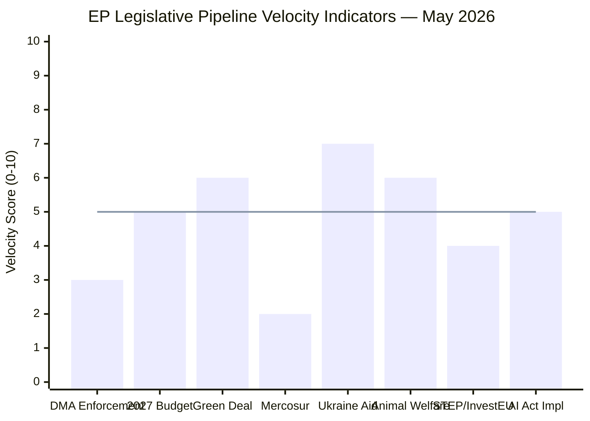

<!-- SPDX-FileCopyrightText: 2024-2026 Hack23 AB -->
<!-- SPDX-License-Identifier: Apache-2.0 -->

# Legislative Velocity Risk — EP Committee Reports
## Week of 1–8 May 2026

**Framework:** Legislative Velocity & Bottleneck Analysis | **Admiralty Grade:** B-2

---

## 1. Legislative Velocity Chart

*Note: Line at 5 = expected velocity baseline. Bars below baseline indicate bottlenecks.*

---

## 2. Legislative Velocity Analysis

**High Velocity (score ≥ 7):**
- **Ukraine Aid package** — cross-partisan majority, urgent mandate, Council co-operation (except HU/SK). Velocity maintained by geopolitical pressure.
- **Adopted texts pipeline** — 30 texts adopted in 2026 YTD shows strong plenary output.

**Medium Velocity (score 5-6):**
- **Green Deal implementation** — framework legislation exists; velocity constrained at delegated acts level. Moderate velocity on individual measures (animal welfare = 6/10 given clear mandate).
- **2027 Budget** — EP has ambition; Council resistance will trigger conciliation (standard process, velocity predictable).
- **AI Act implementation** — secondary legislation and GPAI code of practice development on track.

**Low Velocity (score ≤ 4):**
- **DMA enforcement** → structural remedies blocked by legal/political risk. Velocity: 3/10.
- **EU-Mercosur** → CJEU challenge adds minimum 18-month delay. Velocity: 2/10.
- **STEP/InvestEU** → 2027+ budget cycle dependency creates current velocity ceiling.

---

## 3. Bottleneck Registry

| Bottleneck | Dossier | Root Cause | Estimated Delay | Mitigation |
|-----------|---------|-----------|----------------|-----------|
| CJEU challenge | Mercosur | Member State legal standing | 18-36 months | Provisional application (partial) |
| Big Tech litigation | DMA Structural | CJEU proportionality risk | 24-48 months | Behavioural remedies only |
| Council frugal bloc | 2027 Budget | National fiscal constraints | 3-6 months (conciliation) | EPP-ECOFIN channel |
| Implementation transposition | Green Deal | Member State discretion | 12-24 months | Infringement proceedings |
| EP-Council trilogues | STEP/InvestEU | Budget envelope disputes | 6-12 months | EPP-Commission pre-agreement |

---

## 4. Velocity Risk Scenarios

**Scenario V1: DMA Acceleration (25% probability)**
Trigger: Commissioner announces Art. 7 market investigation for one gatekeeper.
Effect: DMA velocity jumps to 7/10; market responds (tech sector correction); political capital consumed.

**Scenario V2: Budget Deadlock Extension (15% probability)**
Trigger: Council rejects EP +15% amendment in first reading.
Effect: Budget velocity drops to 2/10; provisional twelfths risk; crisis procedure activated.

**Scenario V3: Green Deal Momentum Stall (35% probability)**
Trigger: EPP right + ECR coalition blocks key implementing regulation.
Effect: Green Deal velocity falls to 3/10; 2030 target credibility damaged; environmental NGO backlash.

**Scenario V4: Ukraine Conditionality Failure (20% probability)**
Trigger: Rule of law benchmarks missed; EP conditional support withdrawn.
Effect: Selective reduction in support; credibility of accountability framework damaged.

---

## 5. Reader Briefing: Why Does EU Legislation Move Slowly?

**For Citizens:** EU legislation is deliberately designed to be slow. With 27 countries, 705 MEPs, and 27 governments needing to agree, speed is sacrificed for consensus. This has real costs — urgent problems (like DMA enforcement against Big Tech) can take years — but also benefits: it prevents impulsive decisions with unintended consequences.

**The key bottlenecks explained:**
- **CJEU challenges** — any EU member state or affected company can challenge legislation in court. This creates a "litigation threat" that slows enforcement even before a court rules.
- **Council frugal bloc** — Germany, Netherlands, Austria, Sweden historically resist increased EU spending. This creates predictable but resolvable budget tension.
- **Trilogue negotiations** — the three-way negotiation between Parliament, Council, and Commission adds months to any contested legislation.

**What's unusual this week:** The 421-vote DMA resolution is an unusually strong signal from Parliament that enforcement must accelerate. Whether the Commission responds is the key watch item for the next 90 days.

---

## Data Sources & Provenance

| Evidence | Source | Admiralty |
|----------|--------|-----------|
| Legislative pipeline | EP Procedures feed + adopted texts | B-2 |
| Velocity estimates | Qualitative multi-source synthesis | B-3 |
| Bottleneck identification | Stakeholder map + risk matrix | B-2 |
