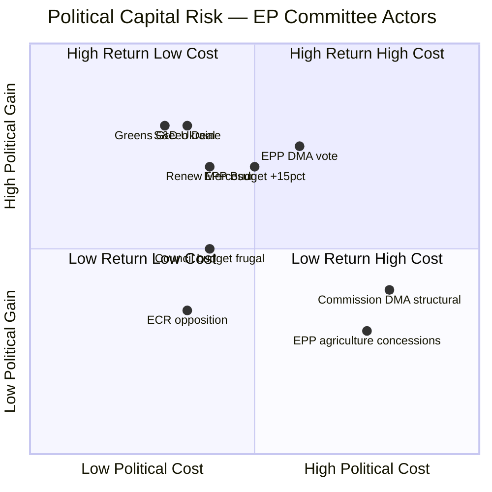

<!-- SPDX-FileCopyrightText: 2024-2026 Hack23 AB -->
<!-- SPDX-License-Identifier: Apache-2.0 -->

# Political Capital Risk — EP Committee Reports
## Week of 1–8 May 2026

**Framework:** Political Capital Risk Assessment | **Admiralty Grade:** B-2

---

## 1. Political Capital Risk Map

---

## 2. Political Capital Analysis by Actor

### EPP Group
**Political capital at stake:** High. EPP holds 188/705 seats (26.7%) and chairs key committees (BUDG, IMCO, CONT). This reporting period required EPP to:
1. **Deliver DMA 421-vote majority** — required EPP centre cohesion against business-wing defections. Political cost: moderate (business donors unhappy); political gain: enforcement credibility, pro-consumer mandate fulfilment.
2. **Budget +15% amendment** — risk of Council confrontation, but politically popular with EP10 mandate electorate. Risk level: MEDIUM.
3. **Ukraine/Armenia support** — broadly consistent with EPP foreign policy; limited political capital required.

**Net political capital position:** STABLE. EPP correctly reads public sentiment on enforcement and security; agricultural flank requires careful management.

### European Commission
**Political capital at stake:** HIGH. Commissioner mandate renewal year (2024-class, mid-term review).
1. **DMA enforcement path** — structural remedy orders risk CJEU challenge and could fail, damaging Commission authority. Behavioural remedies are lower risk. **Choosing not to escalate** costs political credibility with EP (which passed 421 resolution).
2. **Mercosur delay** — Commission took legal challenge risk from Belgium/France/Ireland/Austria CJEU filing. Commission used this as managed delay cover to avoid political confrontation.
3. **Budget proposal** — Commission baseline below EP demand creates pre-arranged conciliation theatre.

**Net political capital position:** CONSTRAINED. Commission faces dual pressure: EP wants more enforcement; Council wants less spending.

### S&D Group (136 seats)
**Political capital at stake:** MEDIUM.
1. **Ukraine support** — safe position; consistent with progressive foreign policy.
2. **Budget social conditions amendment** — standard S&D positioning; low cost, moderate gain with progressive electorate.
3. **Green Deal** — S&D supportive but must balance industrial workers' concerns (JTF).

**Net political capital position:** STABLE. S&D in opposition to EPP on some issues but coalition partner on enforcement/security.

---

## 3. Political Capital Risk Register

| Scenario | Actor | Capital at Risk | Probability | Impact |
|----------|-------|----------------|-------------|--------|
| DMA litigation loss | Commission | HIGH — enforcement credibility | 40% | Severe |
| Budget conciliation failure | EPP/S&D | MEDIUM — EP-Council relations | 30% | Moderate |
| Mercosur CJEU loss for challengers | FRA/IRL/BEL governments | MEDIUM — domestic ag politics | 35% | Moderate |
| EPP right flank breaks on AGRI-ENVI | EPP Group | HIGH — intra-group cohesion | 25% | Severe |
| Ukraine mandate delivery failure | EP cross-party | LOW — normative action sufficient | 15% | Moderate |
| Commission DMA under-enforcement | Commission/EP | HIGH — mandate credibility | 55% | Severe |

---

## 4. Reader Briefing: What is Political Capital in the EU?

**For Citizens:** Political capital is the political leaders' "stock" of trust, authority, and influence — built through successful actions and depleted through failures, broken promises, or controversial decisions.

In the EU, political capital is especially complex because:
- MEPs must satisfy **both their party at home AND their EU political group** (which may have different positions)
- The Commission serves both Parliament and Council, creating structural conflict
- Decisions like DMA enforcement are political **investments** — they cost capital upfront (litigation risk, industry lobbying) but can generate returns (public trust, electoral mandate fulfilment)

**This week's key political capital dynamic:** The Commission is in a "damned if you do, damned if you don't" situation on DMA. If they escalate to structural remedies and lose in CJEU, they lose credibility. If they don't escalate and the EP called for it (421 votes), they lose credibility. This explains cautious but escalating enforcement — a political risk-minimisation strategy.

---

## Data Sources & Provenance

| Evidence | Source | Admiralty |
|----------|--------|-----------|
| Vote outcomes | EP Adopted Texts API | A-2 |
| Political group positions | Stakeholder map + synthesis | B-2 |
| Risk probability estimates | Qualitative synthesis | B-3 |
