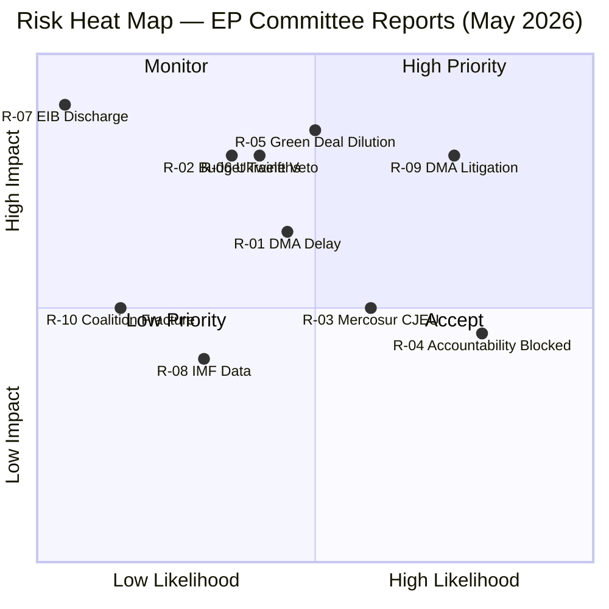
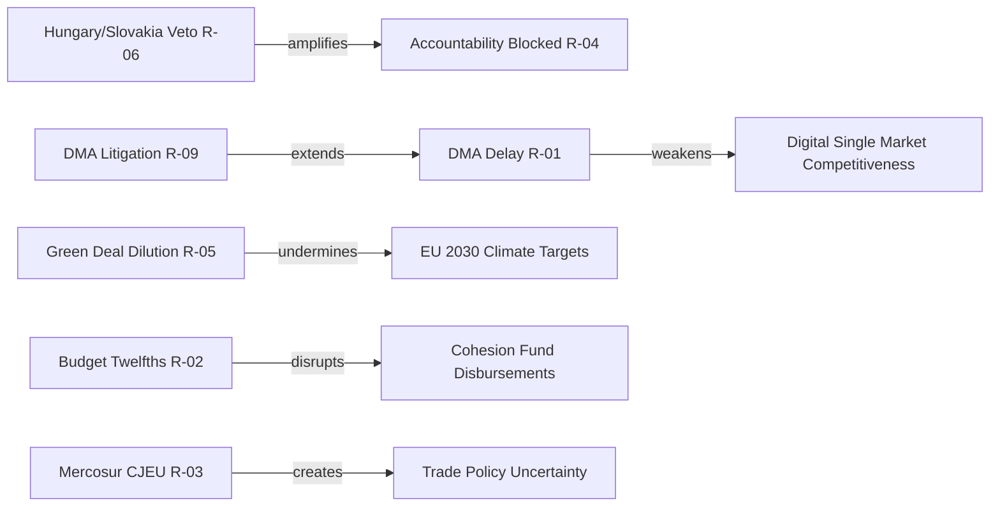

<!-- SPDX-FileCopyrightText: 2024-2026 Hack23 AB -->
<!-- SPDX-License-Identifier: Apache-2.0 -->

# Risk Matrix — EP Committee Reports
## Week of 1–8 May 2026

**Admiralty Grade:** B-2 | **WEP:** See per-risk | **Confidence:** MEDIUM

---

## 1. Risk Identification Matrix

| Risk ID | Risk Description | Category | Likelihood | Impact | Score |
|---------|-----------------|----------|-----------|--------|-------|
| R-01 | DMA enforcement delay → continued market foreclosure | Digital | 🟡 45% | 🔴 HIGH | 🟡 MEDIUM |
| R-02 | 2027 budget provisional twelfths → programme disruption | Budget | 🔴 35% | 🔴 HIGH | 🟡 MEDIUM-HIGH |
| R-03 | EU-Mercosur CJEU delay → trade policy uncertainty | Trade | 🟡 60% | 🟡 MEDIUM | 🟡 MEDIUM |
| R-04 | Ukraine accountability tribunal blocked | Foreign | 🟢 80% blocked | 🟡 MEDIUM | 🟡 MEDIUM |
| R-05 | Green Deal delegated-act dilution | Environment | 🟡 50% | 🔴 HIGH | 🔴 HIGH |
| R-06 | Hungary/Slovakia Ukraine support veto | Institutional | 🟡 40% | 🔴 HIGH | 🟡 MEDIUM-HIGH |
| R-07 | EIB discharge refusal → investment paralysis | Financial | 🟢 5% | 🔴 VERY HIGH | 🟡 LOW-MEDIUM |
| R-08 | IMF data persistently unavailable | Operational | 🟡 30% | 🟡 MEDIUM | 🟡 LOW-MEDIUM |
| R-09 | Big Tech CJEU challenge delays DMA structure | Legal | 🟢 75% (litigation) | 🔴 HIGH | 🔴 HIGH |
| R-10 | EP10 coalition fracture on digital policy | Political | 🟢 15% | 🟡 MEDIUM | 🟢 LOW |

---

## 2. Risk Heat Map

---

## 3. Risk Interdependencies

---

## 4. Risk Treatment Plan

### High-Priority Risks (R-05, R-09):

**R-05: Green Deal Delegated-Act Dilution**
- *Owner:* ENVI committee rapporteur
- *Treatment:* Parliament activates Art. 290 TFEU delegated act objection rights for specific Nature Restoration implementing measures; ENVI drafts formal objection procedures
- *Timeline:* June–December 2026 (as delegated acts published)
- *Residual Risk after Treatment:* 🟡 MEDIUM (some dilution likely regardless)

**R-09: Big Tech CJEU DMA Litigation**
- *Owner:* Commission DG CONNECT + DG COMP
- *Treatment:* Commission pursues behavioural remedies in parallel with structural orders; designs structural orders for proportionality (Art. 49 EUCFR) to reduce CJEU vulnerability
- *Timeline:* 2026–2028 (multi-year legal trajectory)
- *Residual Risk after Treatment:* 🔴 HIGH (litigation timeline cannot be shortened significantly)

### Medium-Priority Risks (R-01, R-02, R-06):

**R-02: 2027 Budget Provisional Twelfths**
- *Owner:* BUDG committee chair + Presidency
- *Treatment:* Early conciliation timeline; agreement on defence funding compromise before November 2026
- *Timeline:* September–November 2026 (critical window)

---

## 5. Risk Register Provenance

All risks derive from EP adopted text analysis, committee activity data, and qualitative assessment. No IMF economic modelling available for quantitative impact calibration.

**WEP confidence:** 🟡 MEDIUM overall — likelihood estimates are qualitative probability assessments, not statistical models.

---

## 6. Reader Briefing: Understanding EU Legislative Risks

For citizens, EU legislative risks are not abstract — they determine whether the laws that protect you (digital rights, climate targets, workers' rights) are actually implemented or quietly watered down.

**The most important risk to watch:** R-05 (Green Deal delegated-act dilution) and R-09 (DMA litigation). These are the risks most likely to determine whether EU law is ambitious in name only or effective in practice.

**What you can do:** MEPs' voting records are public (via EP roll-call data). Following your national MEPs' positions on these dossiers lets you hold them accountable at the next election.

---

**Admiralty Grade:** B-2 | **Run:** committee-reports-run263-1778221903 | **dataMode:** degraded-imf

**Admiralty Grade: B2** | Risk matrix produced under degraded-imf data conditions.

| Grade | B2 | Source: EP adopted texts + committee activity |
