<!-- SPDX-FileCopyrightText: 2024-2026 Hack23 AB -->
<!-- SPDX-License-Identifier: Apache-2.0 -->

# Actor Threat Profiles — EP Committee Reports
## Week of 1–8 May 2026

**Framework:** Diamond Model of Intrusion + Threat Actor Profiling | **Admiralty Grade:** B-2

---

## 1. Threat Actor Network Map

```mermaid
graph TD
    subgraph State Actors
        US_GOV[US Administration - trade friction]
        RU_GOV[Russia - disinformation / energy]
        CN_GOV[China - tech regulation lobbying]
    end
    subgraph Non-State Corporate
        GAFAM[Big Tech Gatekeepers - DMA target]
        AG_LOBBY[Agricultural Lobby - trade/food]
        ENERGY_INT[Energy Industry - Green Deal]
    end
    subgraph Internal EP Actors
        ECR_FAR[ECR/far-right - blocking]
        EPP_R[EPP right flank - dilution]
    end
    subgraph EP Legislative Targets
        DMA_ENF[DMA Enforcement]
        BUDGET[2027 Budget]
        GREENDEAL[Green Deal]
        MERCOSUR[Mercosur]
        UKRAINE[Ukraine Support]
    end
    US_GOV -.->|tariff retaliation threat| MERCOSUR
    US_GOV -.->|diplomatic friction| UKRAINE
    RU_GOV -.->|energy leverage| GREENDEAL
    RU_GOV -.->|disinformation| UKRAINE
    CN_GOV -.->|lobbying| DMA_ENF
    GAFAM -.->|legal challenge| DMA_ENF
    GAFAM -.->|lobbying EPP| DMA_ENF
    AG_LOBBY -.->|opposition| MERCOSUR
    AG_LOBBY -.->|pressure| GREENDEAL
    ENERGY_INT -.->|resistance| GREENDEAL
    ECR_FAR -.->|blocking votes| BUDGET
    ECR_FAR -.->|dilution| UKRAINE
    EPP_R -.->|dilution pressure| GREENDEAL
    EPP_R -.->|protection| MERCOSUR
```

---

## 2. Actor Threat Profiles

### Threat Actor T1: Big Tech Gatekeepers (Alphabet, Apple, Meta, Amazon)
**Threat Category:** Corporate legal/political resistance
**Capability:** Exceptionally high. Combined EU legal team capacity rivals small Member State governments; lobbyist density in Brussels world-class.
**Intent:** Prevent structural DMA remedies (market separation orders). Willing to accept behavioural compliance to avoid structural intervention.
**Opportunity:** Commission caution on proportionality; CJEU uncertainty; EPP business wing receptivity.
**Diamond Assessment:**
- Adversary: Legally and politically sophisticated
- Capability: HIGH (unlimited legal/lobbying resources)
- Infrastructure: Brussels offices, DigitalEurope membership, direct Commissioner access
- Victim: EU enforcement credibility; EP mandate fulfilment
**Mitigation:** Strong procedural record-building by Commission; EP public pressure; consumer organization mobilisation.
**Threat Level: ELEVATED**

### Threat Actor T2: Agricultural Lobby (Copa-Cogeca + National Equivalents)
**Threat Category:** Sectoral interest resistance
**Capability:** Moderate-high. Deep access to AGRI committee; strong national government access (France, Ireland, Poland). Track record of blocking legislation (Farm to Fork withdrawal, CAP reform dilution).
**Intent:** Block EU-Mercosur; limit animal welfare scope; preserve CAP subsidies.
**Opportunity:** EPP right + ECR = sufficient minority to block or significantly dilute.
**Diamond Assessment:**
- Adversary: Experienced parliamentary lobby
- Capability: MEDIUM (domestic political leverage > Brussels resources)
- Infrastructure: National farm union networks; Copa-Cogeca Brussels secretariat
- Victim: Trade liberalisation; food system transition
**Threat Level: MODERATE-ELEVATED** (specific to Mercosur and Green Deal)

### Threat Actor T3: Russia (Strategic Influence)
**Threat Category:** State disinformation and energy leverage
**Capability:** Residual but declining. Energy leverage largely neutralised post-2022 gas diversification; disinformation campaigns ongoing but facing counter-measures.
**Intent:** Undermine EP Ukraine support; weaken transatlantic alignment; exploit agricultural/economic anxieties.
**Opportunity:** ECR/ID sympathetic political groups; economic anxieties in some Member States.
**Diamond Assessment:**
- Adversary: State actor with strategic disinformation apparatus
- Capability: MEDIUM (reduced from pre-2022; cyber + narrative still active)
- Infrastructure: RT fragments; social media; ECR-affiliated political networks
- Victim: EU-Ukraine solidarity; EP institutional credibility
**Threat Level: MODERATE** (contained but persistent)

### Threat Actor T4: US Administration (Trade Friction)
**Threat Category:** State economic pressure
**Capability:** HIGH (tariff authority; dollar dominance; NATO leverage). However, constrained by EU size and retaliation capacity.
**Intent:** Transactional — reduce EU regulatory burden on US tech; limit Mercosur competition with US agricultural exports; maintain NATO cohesion.
**Opportunity:** EU-Mercosur delay creates trade negotiation space; DMA enforcement pressure creates leverage.
**Diamond Assessment:**
- Adversary: Ally-state with misaligned interests on specific issues
- Capability: HIGH (economic; security)
- Infrastructure: US Trade Representative; bilateral diplomatic channels; corporate intermediaries
- Victim: EU regulatory autonomy; digital markets governance
**Threat Level: MODERATE** (manageable through established EU-US institutional channels)

---

## 3. Reader Briefing: Who Are the Threats to EU Legislation?

**For Citizens:** The EU legislative process faces threats from both outside (foreign governments, global corporations) and inside (political groups that want to block or dilute legislation). Understanding these threats helps explain why good-sounding policies often end up weaker than expected.

**The most impactful threat this week:** Big Tech lobbying on DMA. With 421 MEPs demanding stronger enforcement, the pressure is real — but Big Tech companies have nearly unlimited resources to challenge any enforcement action legally, creating a chilling effect on the Commission.

**What citizens can do:** Follow EP voting records to see which MEPs support enforcement (public data available at europarl.europa.eu). Contact your MEP to signal support for strong DMA enforcement. Support consumer organisations (BEUC, national equivalents) that represent citizen interests in Brussels.

---

## Data Sources & Provenance

| Evidence | Source | Admiralty |
|----------|--------|-----------|
| Threat actor capabilities | Open source + EP vote records | B-2 |
| Lobbying patterns | Public register; adopted texts vote analysis | A-2 |
| Diamond model assessments | Multi-source qualitative synthesis | B-3 |
