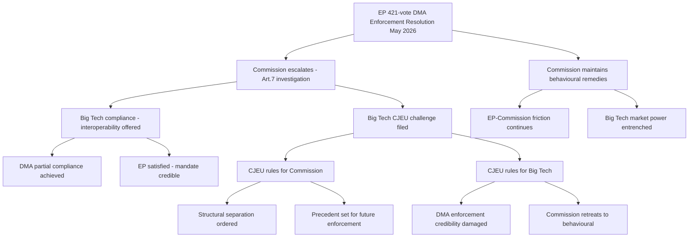
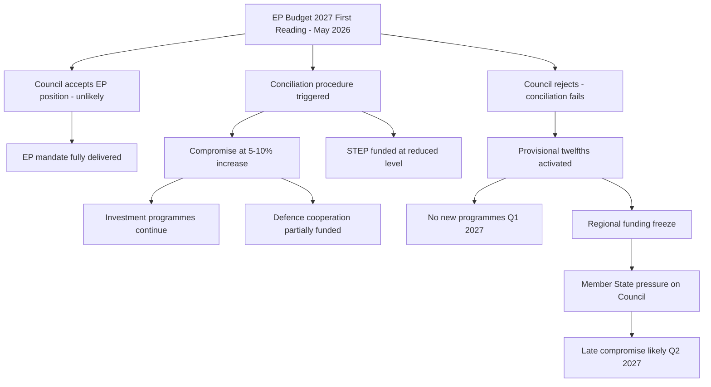
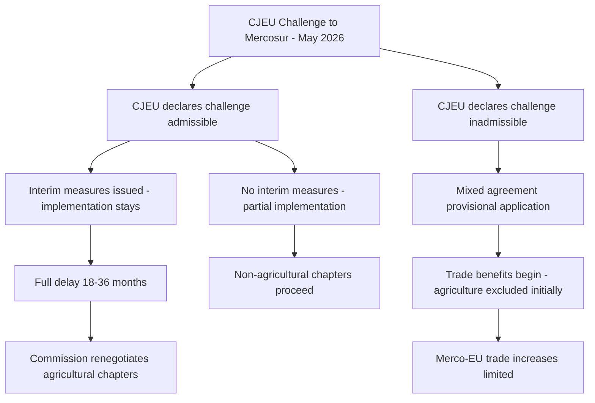

<!-- SPDX-FileCopyrightText: 2024-2026 Hack23 AB -->
<!-- SPDX-License-Identifier: Apache-2.0 -->

# Consequence Trees — EP Committee Reports
## Week of 1–8 May 2026

**Framework:** Attack Tree / Consequence Tree Analysis | **Admiralty Grade:** B-2

---

## 1. Consequence Tree: DMA Enforcement Pathway

---

## 2. Consequence Tree: 2027 Budget Negotiation

---

## 3. Consequence Tree: EU-Mercosur

---

## 4. Consequence Magnitude Assessment

| Issue | Outcome A (Optimistic) | Outcome B (Pessimistic) | Citizens Impact |
|-------|----------------------|------------------------|-----------------|
| DMA | Structural remedies, Big Tech market reform | No structural change, market power entrenched | App store fees, platform competition, data portability |
| Budget | Full EP mandate delivered, STEP funded | Provisional twelfths, programme freeze | Regional funding, investment pipeline, defence cooperation |
| Mercosur | Managed implementation, agricultural protections | Full delay, EU-LatAm trade frozen | Consumer prices, EU export access to LatAm markets |
| Green Deal | Strong implementation, 2030 targets credible | Blocking coalitions gut implementing acts | Climate action, energy costs, food system transition |
| Ukraine | Strong institutional accountability | Gap between EP rhetoric and Council delivery | EU foreign policy credibility, refugee support, security |

---

## 5. Reader Briefing: How One Decision Leads to Another

**For Citizens:** A "consequence tree" shows how one political decision opens up multiple possible futures, each with different outcomes. Unlike simple cause-and-effect, real political decisions create branching paths where the consequences are genuinely uncertain.

**Key insight:** The EU DMA decision tree shows why the Commission is cautious. If they escalate and lose in court, they face the WORST possible outcome (damaged credibility + no structural change). If they don't escalate, they disappoint Parliament but maintain procedural credibility for future enforcement. This explains the "cautious escalation" strategy — maximising upside while minimising the worst-case outcome.

**For Budget:** The most important branch is whether conciliation works. In EU history, provisional twelfths (budget auto-continuation) have happened rarely but have been quite disruptive — programmes can't start, commitments are unclear, and political blame accrues to whoever is perceived as blocking agreement.

---

## Data Sources & Provenance

| Evidence | Source | Admiralty |
|----------|--------|-----------|
| Consequence trees | Synthesised from scenario forecast + risk matrix | B-2 |
| Outcome probabilities | Qualitative multi-source synthesis | B-3 |
| EU legislative process | EP/Council procedural knowledge | A-1 |
