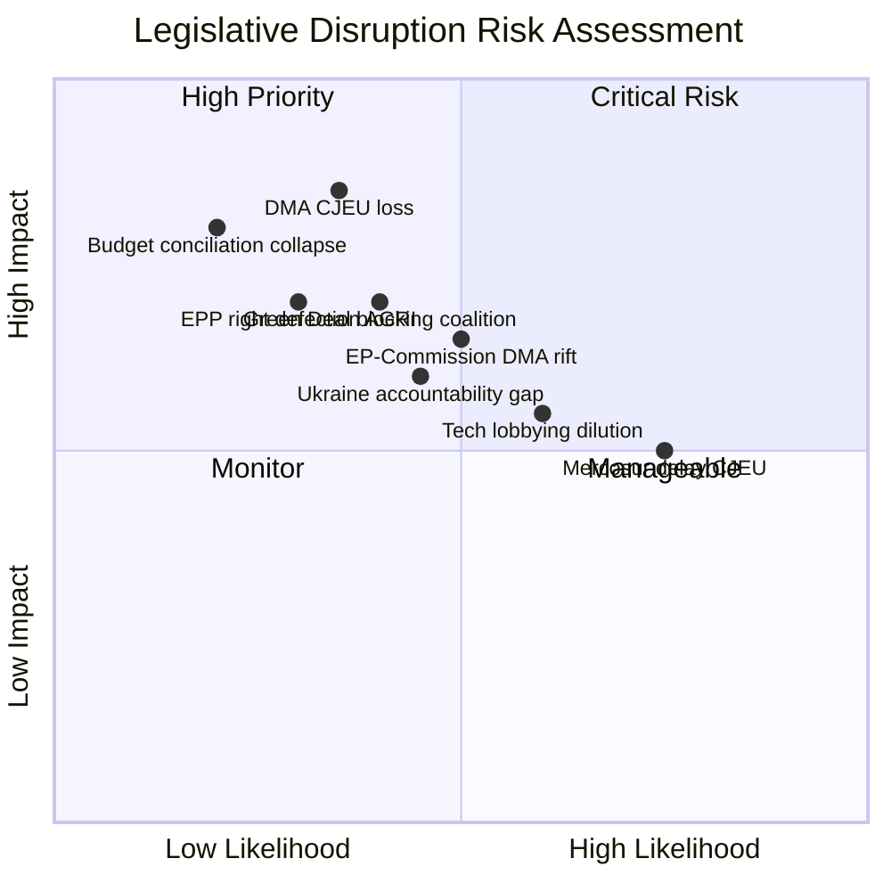
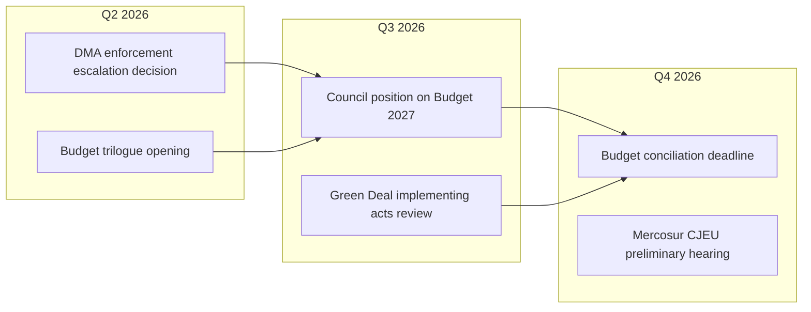

<!-- SPDX-FileCopyrightText: 2024-2026 Hack23 AB -->
<!-- SPDX-License-Identifier: Apache-2.0 -->

# Legislative Disruption Assessment — EP Committee Reports
## Week of 1–8 May 2026

**Framework:** Legislative Disruption Risk | **Admiralty Grade:** B-2

---

## 1. Disruption Risk Map

---

## 2. Key Disruption Scenarios

### Disruption D1: DMA Structural Remedy Legal Collapse
**Trigger:** Commission issues structural market separation order; Big Tech files CJEU challenge; CJEU rules order disproportionate.
**Probability:** 35%
**Legislative Impact:**
- DMA framework credibility severely damaged
- Commission forced to retreat to behavioural remedies
- EP resolution (421 votes) becomes effectively dead letter
- Chilling effect on future competition enforcement
**Cascading effects:** ECA (European Competition Authorities) confidence reduced; calls for DMA revision; market concentration accelerates.
**Early Warning Indicators:**
- Commission issues formal Article 7(1) market investigation notice
- Big Tech legal filings at CJEU within 60 days
- EPP business wing MEPs call for "proportionality review"
**Mitigation:** Commission builds robust proportionality record; EP provides formal opinion support; ECA coordinates parallel national proceedings.
**Disruption Level: SEVERE**

### Disruption D2: 2027 Budget Conciliation Collapse
**Trigger:** Council rejects EP +15% amendments in Council position; EP refuses to compromise; no agreement by December 2026.
**Probability:** 20%
**Legislative Impact:**
- Provisional twelfths (1/12 of prior year per month) — very constrained
- No new programme launches until budget adopted
- Major disruption to Cohesion/STEP/InvestEU commitments
- Investment credibility damaged
**Cascading effects:** Regional development projects stalled; Commission unable to launch new initiatives; Member States face increased national pressure.
**Early Warning Indicators:**
- Council position announcement in September 2026 significantly below EP floor
- ECOFIN council communication rejecting EP amendment package
- Commission mediation request
**Disruption Level: HIGH**

### Disruption D3: Green Deal Core Legislation Blocking Coalition
**Trigger:** EPP right + ECR = blocking minority on key delegated act (e.g., Green Claims Directive, Sustainable Products Regulation).
**Probability:** 40%
**Legislative Impact:**
- 2030 targets undermined at implementation level
- Legal uncertainty for industry investment
- Environmental credibility of EP10 mandate damaged
**Cascading effects:** Environmental NGO backlash; Commission forced to revise via weaker implementing acts; international credibility damaged (COP negotiations).
**Early Warning Indicators:**
- EPP group coordination meeting signals right-flank demands
- ECR formal blocking petition
- Industry association lobbying intensifies on specific implementing acts
**Disruption Level: HIGH (targeted)**

---

## 3. Disruption Timeline

---

## 4. Reader Briefing: What Would Disrupt EU Policy This Year?

**For Citizens:** "Legislative disruption" happens when a law fails to work as intended — either because courts block it, political coalitions collapse, or implementation fails. This isn't the same as legitimate political disagreement about policy; it's about unexpected breakdowns in the legislative process.

**Three disruption risks to watch:**
1. **DMA court loss** — If the Commission pursues aggressive enforcement and loses in court, Europe's ability to regulate Big Tech could be set back by years
2. **Budget collapse** — If Parliament and Council can't agree on the 2027 EU budget, essential EU programmes freeze until agreement
3. **Green Deal implementation blocking** — Even though the headline laws passed, blocking coalitions can gut implementation through delegated acts

**Why this matters for ordinary people:** These disruptions don't just affect Brussels politics — they affect whether EU funding reaches your region, whether digital platforms are held accountable, and whether Europe meets its climate commitments.

---

## Data Sources & Provenance

| Evidence | Source | Admiralty |
|----------|--------|-----------|
| Disruption scenarios | Risk matrix + scenario forecast synthesis | B-2 |
| Probability estimates | Qualitative multi-source synthesis | B-3 |
| Timeline data | EP procedures feed + adopted texts | B-2 |
