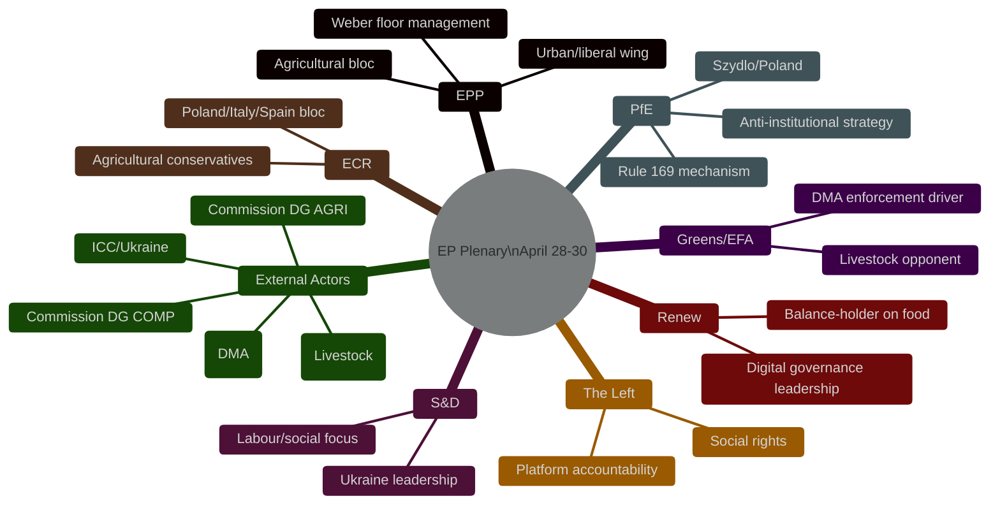

<!-- SPDX-FileCopyrightText: 2024-2026 Hack23 AB -->
<!-- SPDX-License-Identifier: Apache-2.0 -->

# Actor Mapping — EP Motions · 2026-05-08

**Run date:** 2026-05-08 | **Plenary:** Strasbourg, 28–30 April 2026
**Methodology:** OSINT actor mapping + political group composition analysis

---

## Key Actor Map (Plenary Motions)

```mermaid
%%{init: {"theme":"dark","themeVariables":{"primaryColor":"#1565C0","primaryTextColor":"#ffffff","lineColor":"#90CAF9"}}}%%
graph TD
    EPP["🔵 EPP — 185 seats (25.7%)\nDominant force, floor management"]
    SD["🔴 S&D — 135 seats (18.8%)\nLeft-progressive bloc anchor"]
    PfE["⚫ PfE — 85 seats (11.8%)\nFar-right, anti-institutional"]
    ECR["🟤 ECR — 81 seats (11.3%)\nConservative, agricultural interests"]
    Renew["🔷 Renew — 77 seats (10.7%)\nCentre-liberal, digital/tech focus"]
    Greens["🟢 Greens/EFA — 53 seats (7.4%)\nEnvironmental, pro-Ukraine"]
    Left["🟣 The Left — 45 seats (6.3%)\nSocial rights, anti-Big Tech"]
    NI["⬜ NI — 30 seats (4.2%)\nNon-attached, heterogeneous"]
    ESN["🟥 ESN — 27 seats (3.8%)\nEuro-skeptic far-right"]
    
    EPP -- "Supported" --> DMA["DMA Enforcement"]
    EPP -- "Led" --> Livestock["Livestock Motion"]
    EPP -- "Supported" --> Ukraine["Ukraine Accountability"]
    EPP -- "Sponsored" --> Budget["Budget 2027"]
    SD -- "Supported" --> DMA
    SD -- "Led" --> Cyberbully["Cyberbullying Resolution"]
    SD -- "Supported" --> Ukraine
    Renew -- "Supported" --> DMA
    Renew -- "Moderated" --> Livestock
    PfE -- "Requested" --> Debate["Commission/Elections Debate"]
    PfE -- "Supported" --> Livestock
    ECR -- "Supported" --> Livestock
    Greens -- "Led" --> DMA
    Greens -- "Opposed" --> Livestock
    Left -- "Supported" --> Cyberbully
    ESN -- "Supported" --> Debate
```

---

## Primary Actors by Motion

### DMA Enforcement — Actor Coalition

| Actor | Role | Position | Influence Level |
|-------|------|----------|-----------------|
| EPP (Manfred Weber group) | Supporting coalition | Pro-enforcement with competition-law guardrails | HIGH |
| S&D | Lead proposers | Strong enforcement, worker protections | HIGH |
| Renew | Supporting coalition | Enforcement + innovation balance | HIGH |
| Greens/EFA | Lead proposers | Strongest enforcement demands | MEDIUM |
| The Left | Supporting coalition | Platform accountability, anti-monopoly | MEDIUM |
| ECR | Partial opposition | Concerns about regulatory overreach | LOW-MEDIUM |
| PfE | Soft opposition | Sovereignty framing, national tech champions | LOW |
| Apple, Google, Meta (external) | Affected parties | Heavy lobbying against strengthened enforcement | HIGH (external) |
| DG COMP, Commissioner (external) | Implementation actor | Commission discretion in enforcement timing | HIGH (external) |

**Named MEP leads** 🟡 (inferred from committee positions): IMCO and ITRE committee chairs hold floor management; specific shadow rapporteur names unavailable due to EP API attribution gaps.

### Livestock Sector — Actor Coalition

| Actor | Role | Position | Influence Level |
|-------|------|----------|-----------------|
| EPP (agricultural bloc) | Lead proposers | Maximum CAP support, moratorium on new regs | HIGH |
| ECR | Core supporters | National sovereignty over food policy | HIGH |
| PfE | Core supporters | Anti-Green Deal agricultural narrative | HIGH |
| Renew | Swing vote | Balance support with sustainability | MEDIUM |
| S&D | Partial support | Worker protections for farm sector | MEDIUM |
| Greens/EFA | Opposition | Opposed moratorium language | MEDIUM |
| Copa-Cogeca (external) | Key lobbying actor | Pro-livestock, anti-regulation | HIGH (external) |
| Commission DG AGRI (external) | Implementation | Follows EP guidance on CAP reform | HIGH (external) |

**EPP internal division** 🔴: The debate records show MEPs person/197558 and person/197701 spoke on this item for April 30 — both connected to EPP/AGRI committee. The presence of multiple EPP speakers suggests an internally negotiated group position where dissenting MEPs were allowed to express concerns via speaking time rather than formal amendment.

### PfE Commission/Elections Debate — Actor Positions

| Actor | Role | Position | Strategic Goal |
|-------|------|----------|----------------|
| Beata Szydło (PfE/Poland) | Likely lead speaker (person/197553) | Commission is anti-democratic, funding opposition | Delegitimise EU institutions |
| PfE group | Requesters | Anti-institutionalist, sovereignty | Budget amendment preparation |
| ESN | Sympathetic audience | Euro-skeptic alignment | Coordinated narrative |
| EPP | Measured rebuttal | Defends EU but avoids full-throated defence of Commission | Internal audience management |
| S&D | Strong rebuttal | EU democracy is not Commission interference | Counter-narrative |
| Renew | Strong rebuttal | Defends EU democratic resilience | Institutional defence |
| Greens | Strong rebuttal | Counter-disinformation is democratic necessity | Institutional defence |
| Commission (external) | Affected institution | Cannot formally respond in plenary | Democratic resilience framing |

### Ukraine Accountability — Actor Network

| Actor | Role | Position | Influence |
|-------|------|----------|-----------|
| EPP | Lead coalition | ICC prosecution, sanctions, tribunal | HIGH |
| S&D | Lead coalition | Maximum accountability, war crimes focus | HIGH |
| Renew | Supporting | ICC + frozen assets + tribunal | HIGH |
| Greens | Supporting | Full accountability package | HIGH |
| ECR | Partial support | Accountability yes, tribunal ambiguous | MEDIUM |
| PfE | Soft opposition | Abstentions expected on tribunal language | LOW |
| ESN | Opposition | Most skeptical of ICC/tribunal provisions | LOW |
| EU Delegation Kyiv (external) | Beneficiary | Monitors EP signals for negotiation leverage | HIGH (external) |
| ICC Prosecutor (external) | Affected institution | Benefits from EP political backing | HIGH (external) |

---

## Actor Influence Network Diagram

---

## Confidence Assessment

- 🟢 Group-level positions: HIGH confidence (based on political group alignment patterns, debate records, committee positions)
- 🟡 Named MEP positions: MEDIUM confidence (speaker records partially attributed; roll-call individual votes not yet published)
- 🔴 Vote margins/abstentions: LOW confidence (EP roll-call publication typically delayed 4–6 weeks; aggregate counts not yet available for April 2026)
