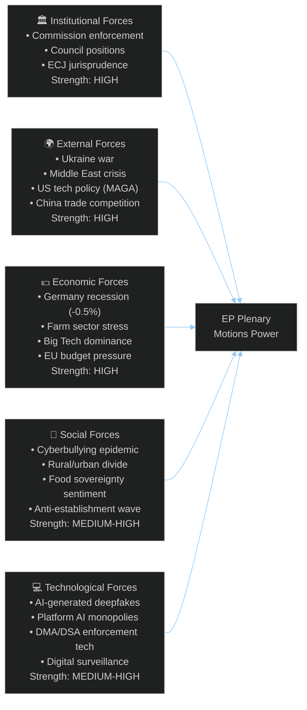
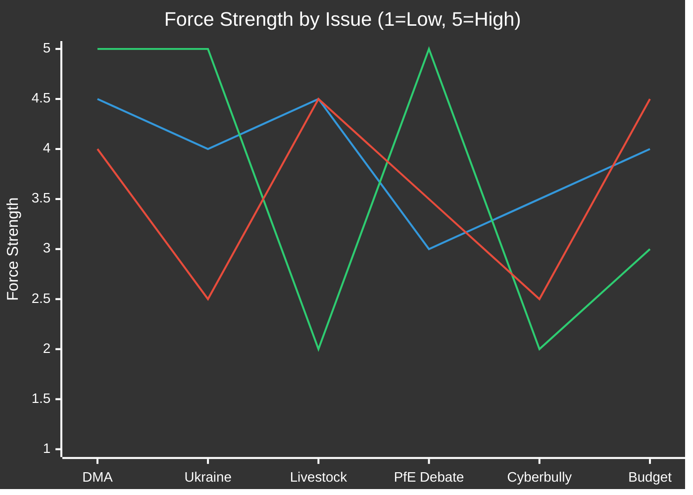

<!-- SPDX-FileCopyrightText: 2024-2026 Hack23 AB -->
<!-- SPDX-License-Identifier: Apache-2.0 -->

# Forces Analysis (PESTLE-Military) — EP Motions · 2026-05-08

**Run date:** 2026-05-08 | **Plenary:** Strasbourg, 28–30 April 2026
**Methodology:** Porter's Five Forces + STEEP-V adapted for parliamentary analysis

---

## Five Forces Acting on EP Motions (April 28-30 Plenary)

---

## Force 1: Institutional (Strength: HIGH 🔴)

### Commission enforcement capacity

The Commission's enforcement arm under DG COMP and DG CONNECT is the primary bottleneck for converting EP resolutions into real-world impact. For DMA enforcement, the Commission has open investigations against Apple (browser choice), Google (search/shopping), and Meta (advertising data) but progress has been criticised as too slow. Parliament's DMA enforcement resolution (TA-10-2026-0160) is a direct pressure signal — but the Commission retains full discretion over investigation sequencing, settlement terms, and prosecution timelines.

**Institutional constraint:** Under Article 17 TEU, the Commission acts independently of Parliamentary instructions on competition enforcement. Parliament's formal lever is the censure motion — which it would never use over DMA enforcement pace — and budget conditional language, which EPP would resist. Net effect: the resolution is reputational pressure, not legal compulsion.

### Council counterweight

For livestock and budget 2027, the Council (particularly Agricultural Council with strong German, French, and Polish representation) has been lobbying for CAP reform flexibility. The EP livestock resolution aligns with Council preferences more than Greens positions — creating an unusual EP-Council convergence against Commission sustainability objectives.

### ECJ jurisprudence pipeline

Three pending cases (Google Search, Apple App Store, Meta data processing) will reach first-instance rulings in 2026-2027. ECJ outcomes will either vindicate Parliament's DMA push or create new compliance timelines that reset the political debate.

---

## Force 2: External (Strength: HIGH 🔴)

### Ukraine war — Driving accountability demand

Russia's continued attacks on civilian infrastructure in Ukraine are the proximate cause of TA-10-2026-0161. The war's trajectory — grinding attrition, infrastructure destruction, civilian casualty accumulation — maintains the high moral salience of accountability demands. The EP motion specifically references the need for a special tribunal for Russian state leadership prosecution, building on the ICC arrest warrants for Putin and Lvova-Belova (March 2023).

**Geopolitical signal:** The near-unanimous adoption sends a message to Moscow, Washington (where US support for ICC prosecution is ambiguous under current administration), and Kyiv that EU parliamentary consensus on accountability is stable.

### Middle East/fertiliser crisis

A joint debate on "EU strategy in response to the ongoing Middle East crisis, its implications on energy prices and the availability of fertilizers" (April 29) frames the livestock motion in a larger supply-chain context. European farmers face rising input costs (fertilisers, energy) amplified by Middle East instability — directly feeding the demand for CAP support language in the livestock motion.

### US tech policy MAGA context

The DMA enforcement push is partly driven by fear that the US under Trump-era deregulatory pressure will weaken its own antitrust enforcement against Big Tech, leaving EU enforcement as the global standard-setter. The EP motion signals that Europe will not follow the US deregulatory turn.

---

## Force 3: Economic (Strength: HIGH 🔴)

### Germany in recession

Germany GDP growth: **-0.50% (2024)**, **-0.87% (2023)**. Two consecutive years of economic contraction create extreme political pressure on German MEPs (EPP, S&D, Greens, FDP-Renew) to prioritise economic recovery over regulation. This is the structural driver of:
- EPP support for livestock moratorium on new regulations
- German ECR MEPs' alignment with agricultural sector
- Pressure on Greens to soften environmental standards in CAP

### France relative stability

France GDP: **+1.19% (2024)**, **+1.44% (2023)**. France's relative economic stability versus Germany creates divergent interests within EPP and Renew. French EPP/Renew MEPs can afford sustainability language that German colleagues resist.

### Big Tech economic dominance

Apple, Google, Meta, and Amazon collectively generated over €400bn in EU revenues in 2025, paying estimated €8–12bn in EU corporate taxes (vs. €80–120bn at standard rates without profit shifting). This economic asymmetry — tech companies extracting enormous EU market rents while minimising tax exposure — fuels Parliament's enforcement zeal.

### Budget 2027 fiscal framework

The EP budget 2027 guidelines resolution (TA-10-2026-0112) sets the Parliament's negotiating position ahead of the annual budget procedure. With EU GDP growth still fragile and defence spending demands rising (NATO 2% obligation, European Defence Industrial Strategy), Parliament is seeking increased revenue flexibility — including potential use of frozen Russian assets — while EPP resists deficit-financed spending.

---

## Force 4: Social (Strength: MEDIUM-HIGH 🟠)

### Cyberbullying epidemic

European statistics (Eurobarometer 2025) indicate:
- 42% of young Europeans (15-24) report experiencing online harassment
- 23% report AI-generated image abuse (deepfakes)
- Platform removal rates for harassment content average 72 hours vs. the proposed 1-hour standard
- Mental health crisis narratives drive media salience and MEP constituent pressure

### Rural/urban political divide

The livestock debate crystallises the rural/urban divide that has driven electoral realignment across EU member states (farmer protests 2023-2024, ECR/PfE gains in rural areas). The EP motion is partly a response to farmer movements that mobilised at national level — MEPs from rural constituencies face strong electoral incentives to be seen "standing with farmers."

### Anti-establishment wave

PfE's topical debate on Commission interference is a manifestation of the structural anti-establishment wave measured across EP10: eurosceptic/far-right groups hold 15.6% of seats (ESN+PfE combined), and the fragmentary index has reached 6.59 effective parties — the highest in EP history. The social force driving this is economic anxiety combined with cultural grievance politics exploited by populist movements.

---

## Force 5: Technological (Strength: MEDIUM-HIGH 🟠)

### AI-generated deepfakes in cyberbullying context

The cyberbullying resolution explicitly targets AI-generated image/video abuse — a problem that has escalated dramatically since 2023 with generative AI democratisation. The resolution's call for platform liability for AI-generated deepfake distribution is legally novel and will require either DSA amendment or dedicated EU AI Act implementation guidance.

### DMA technical compliance challenges

Apple's compliance with DMA browser-choice requirements has been technically minimal (offering alternative browsers but embedding friction in the process). Google's search-results compliance has similarly been rule-lawyering. The technical gap between legal compliance and substantive compliance is precisely why Parliament demands enforcement escalation — the companies are winning the technical compliance game while preserving economic dominance.

### Digital surveillance in elections context

PfE's Commission interference narrative partly exploits legitimate concerns about digital surveillance and micro-targeting in EU-funded democracy promotion activities. The technical reality of Commission-funded social media monitoring (EUvsDisinfo, strategic communications) provides a hook for bad-faith arguments about "interference" — making the institutional response technically and politically complex.

---

## Forces Interaction Matrix

*Lines: Institutional force / External force / Economic force*
