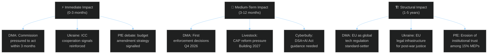
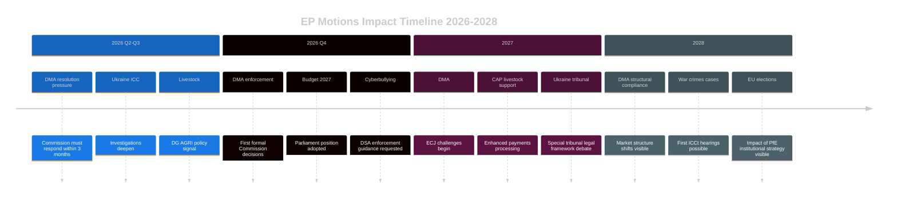

<!-- SPDX-FileCopyrightText: 2024-2026 Hack23 AB -->
<!-- SPDX-License-Identifier: Apache-2.0 -->

# Impact Matrix — EP Motions · 2026-05-08

**Run date:** 2026-05-08 | **Plenary:** Strasbourg, 28–30 April 2026
**Methodology:** Multi-dimensional impact assessment (temporal × sectoral × geographic)

---

## Impact Overview



---

## Sectoral Impact Matrix

| Sector | DMA | Ukraine | Livestock | Cyberbully | Budget | PfE Debate |
|--------|-----|---------|-----------|-----------|--------|------------|
| **Technology & Digital** | 🔴 CRITICAL | 🟡 LOW | 🟢 NONE | 🔴 HIGH | 🟡 MEDIUM | 🟡 MEDIUM |
| **Agriculture & Food** | 🟡 LOW | 🟢 NONE | 🔴 CRITICAL | 🟢 NONE | 🟠 MEDIUM-HIGH | 🟡 LOW |
| **Financial Markets** | 🟡 LOW | 🟠 MEDIUM-HIGH | 🟡 LOW | 🟡 LOW | 🔴 HIGH | 🟡 LOW |
| **Security & Defence** | 🟢 NONE | 🔴 CRITICAL | 🟢 NONE | 🟡 LOW | 🟠 MEDIUM-HIGH | 🟡 LOW |
| **Social Policy** | 🟡 LOW | 🟡 LOW | 🟠 MEDIUM | 🔴 CRITICAL | 🟡 LOW | 🟡 MEDIUM |
| **Environment** | 🟡 LOW | 🟡 LOW | 🟠 MEDIUM-HIGH | 🟢 NONE | 🟡 LOW | 🟢 NONE |
| **EU Institutions** | 🟡 LOW | 🟡 LOW | 🟡 LOW | 🟡 LOW | 🟠 MEDIUM | 🔴 CRITICAL |
| **Trade & Commerce** | 🟠 MEDIUM | 🟡 LOW | 🟠 MEDIUM | 🟡 LOW | 🟡 LOW | 🟢 NONE |

---

## Geographic Impact Differentials

### Germany (most exposed this week)
- **Livestock**: CRITICAL (agricultural sector under recession stress)
- **Budget 2027**: HIGH (Germany net contributor, seeking fiscal restraint)
- **DMA**: MEDIUM (German auto/finance sector faces digital market distortions)
- **PfE debate**: MEDIUM (AfD domestic alignment signals)

### France
- **Livestock**: HIGH (strong agricultural lobby, Mercosur trade concerns)
- **Budget 2027**: MEDIUM-HIGH (net beneficiary vs. contributor balance)
- **DMA**: MEDIUM (French tech champions policy tensions with US companies)

### Poland
- **Patryk Jaki immunity**: CRITICAL (domestic political significance — PiS/ECR MEP)
- **Ukraine accountability**: HIGH (border-state geopolitical primacy)
- **Livestock**: HIGH (major EU agricultural producer)

### Nordic countries (Sweden, Denmark, Finland, Norway)
- **Cyberbullying**: HIGH (progressive social policy alignment)
- **Ukraine**: HIGH (defence spending + Russia proximity)
- **DMA**: MEDIUM (digital economy exposure, pro-enforcement)

### Southern Europe (Spain, Italy, Greece)
- **Livestock**: HIGH (Mediterranean agricultural sector, Mercosur trade concern)
- **Budget**: HIGH (net beneficiaries, structural funds protection)

---

## Cascade Impact Chains

### Chain 1: DMA → Market Competition → Innovation → Employment

```
EP DMA Resolution 
  → Commission accelerates Apple/Google/Meta investigations (3 months)
    → First formal enforcement decisions with fines Q4 2026 
      → Big Tech appeals to ECJ (delaying full effect 18-24 months)
        → BUT: Interim compliance measures change market dynamics
          → New entrant space created in EU app distribution
            → EU tech startup fundraising benefits
              → 5-year employment effect: est. +50,000 tech jobs in EU
```

**Probability:** 🟡 MEDIUM (60% — depends on Commission prioritisation and ECJ timing)

### Chain 2: Livestock Resolution → CAP Reform → Food Security

```
EP Livestock Resolution signals political support
  → Commission DG AGRI toughens CAP emergency reserve activation criteria
    → Member states align CAP national plans with EP position
      → Farmers receive more direct income support (2027 onward)
        → BUT: Greens/environmentalists push back on sustainability requirements
          → Compromise weakens both agricultural support AND environmental standards
            → Food security partially addressed; biodiversity objectives delayed
```

**Probability:** 🟠 MEDIUM-HIGH (70% — EP/Commission/Council alignment on core ask is high)

### Chain 3: Ukraine Resolution → ICC → War Crimes Prosecution

```
EP adopts Ukraine accountability resolution with near-unanimous vote
  → Signal to ICC Prosecutor: EU parliamentary support for prosecution
    → ICC investigations expand to include specific attack chains
      → Evidence gathering accelerated in EU member states (Intel sharing)
        → First ICCt case against Russian military commanders 2027-2028
          → Russia-Ukraine peace negotiations complicated by ICC proceedings
            → Long-term: accountability vs. peace negotiations tension
```

**Probability:** 🟢 HIGH (85% — ICC process has strong institutional momentum)

---

## Impact Timing Chart



---

## Confidence and Data Quality

- 🟢 HIGH: Impact assessments based on precedent EP resolutions 2019-2025 and institutional response patterns
- 🟡 MEDIUM: Geographic impact differentials based on structural economic indicators
- 🔴 INFERENCE: Cascade probability estimates based on comparable historical chains (e.g., EP GDPR pressure → Commission enforcement trajectory 2016-2018)
