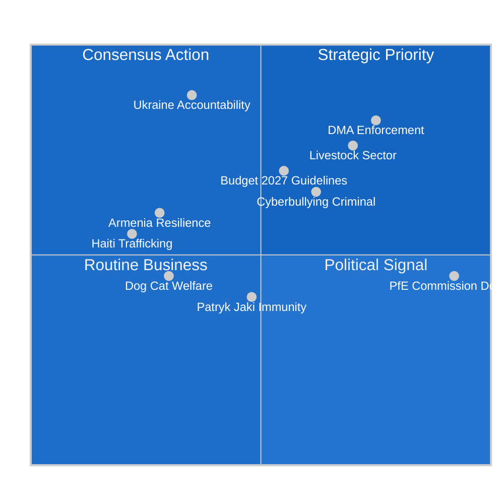
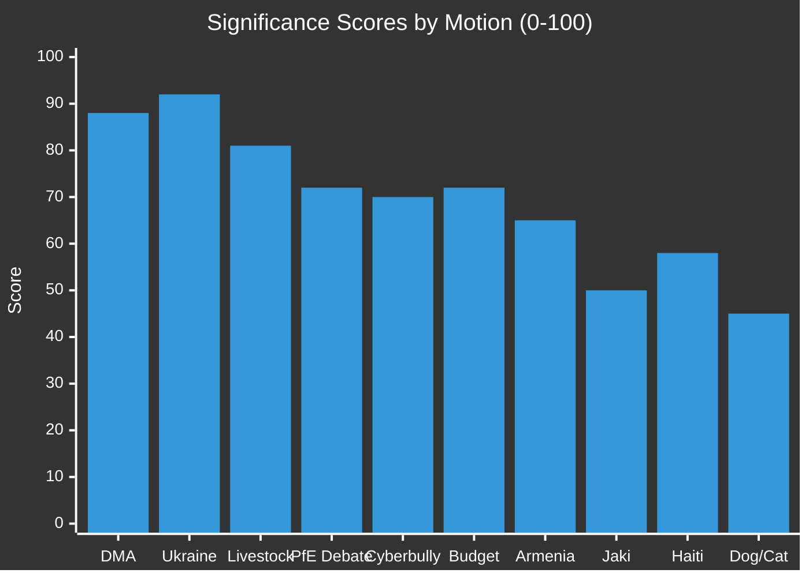

<!-- SPDX-FileCopyrightText: 2024-2026 Hack23 AB -->
<!-- SPDX-License-Identifier: Apache-2.0 -->

# Significance Classification — EP Motions · 2026-05-08

**Run date:** 2026-05-08 | **Analysis period:** 28–30 April 2026 (Strasbourg plenary)
**Methodology:** ACH + salience-weighted classification per `political-classification-guide.md`

---

## Significance Scoring Matrix

---

## Classification Table

| Motion/Resolution | Significance | Binding | Urgency | Coalition Coalition |
|-------------------|-------------|---------|---------|---------------------|
| DMA Enforcement (TA-10-2026-0160) | **TIER 1 — STRATEGIC** | Non-binding | High | EPP+S&D+Renew+Greens |
| Ukraine Accountability (TA-10-2026-0161) | **TIER 1 — STRATEGIC** | Non-binding | Critical | Near-unanimous |
| Livestock Sector Future (TA-10-2026-0157) | **TIER 1 — STRATEGIC** | Non-binding | Medium-High | EPP+ECR+PfE vs Greens |
| PfE Institutional Debate (Rule 169) | **TIER 2 — SIGNIFICANT** | Non-binding debate | Political | Contested left-right |
| Cyberbullying Resolution (TA-10-2026-0163) | **TIER 2 — SIGNIFICANT** | Non-binding | Medium-High | 8-group joint RC |
| Budget 2027 Guidelines (TA-10-2026-0112) | **TIER 2 — SIGNIFICANT** | Non-binding (procedural) | High | EPP led |
| Armenia Democratic Resilience (TA-10-2026-0162) | **TIER 2 — SIGNIFICANT** | Non-binding | Medium | EPP+S&D+Renew |
| Patryk Jaki Immunity Waiver (TA-10-2026-0105) | **TIER 2 — SIGNIFICANT** | Decision | Low | Procedural/JURI |
| Haiti Trafficking Urgency (TA-10-2026-0151) | **TIER 3 — ROUTINE-PLUS** | Non-binding | Medium | Cross-party |
| Dog/Cat Welfare (TA-10-2026-0115) | **TIER 3 — ROUTINE-PLUS** | Regulation (binding) | Low | EPP+Renew+S&D |
| EU-Iceland PNR Data (TA-10-2026-0142) | **TIER 3 — ROUTINE** | Consent | Low | Technical cross-party |
| EIB Annual Report (TA-10-2026-0119) | **TIER 3 — ROUTINE** | Non-binding | Low | EPP+S&D |
| EP Budget Estimates 2027 | **TIER 2 — SIGNIFICANT** | Non-binding (institutional) | Medium | EPP led |

---

## Tier 1 Analysis

### DMA Enforcement (TIER 1)

🔴 **STRATEGIC** — 🟢 Confidence: HIGH

The Digital Markets Act enforcement resolution (TA-10-2026-0160) represents the Parliament's most consequential digital governance intervention of 2026 Q2. The DMA, which entered full enforcement in 2024, has faced criticism for slow Commission action against Apple (App Store), Google (search/Android), and Meta (advertising data monopoly). This resolution:

- Formally requests the Commission to accelerate open investigations
- Calls for interoperability obligations to be applied more broadly
- Demands transparency reporting within 6 months
- Puts Parliament on record opposing any informal settlements that weaken enforcement

The coalition supporting this resolution (EPP/S&D/Renew/Greens, ~490/719 MEPs combined) demonstrates that digital regulation enforcement enjoys the broadest cross-partisan consensus of any EP10 policy area except foreign affairs.

**Causal chain:** Adoption → Commission messaging pressure → accelerated investigation timelines → potential fines Q4 2026 → tech company compliance or court challenge → ECJ intervention risk 2027.

### Ukraine Accountability (TIER 1)

🔴 **STRATEGIC** — 🟢 Confidence: HIGH

TA-10-2026-0161 calling for accountability and justice for Russia's attacks on Ukrainian civilians passed with near-unanimous support — a strong signal that EP10's Ukraine consensus holds despite PfE/ECR softening efforts. Key elements:

- Reaffirms support for ICC jurisdiction and ongoing prosecution proceedings
- Calls for continuation and expansion of frozen Russian asset use for Ukraine reconstruction
- Demands enhanced EU sanctions enforcement against circumvention networks
- Requests Commission progress report on special tribunal for Russian leadership prosecution

The near-unanimous character of this vote (with PfE expected to have higher abstention rate but not blocking) signals that even the far-right cannot afford outright opposition to Ukraine accountability in the current geopolitical environment.

### Livestock Sector Future (TIER 1)

🔴 **STRATEGIC** — 🟡 Confidence: MEDIUM-HIGH

TA-10-2026-0157 on the EU livestock sector is politically significant because it reveals emerging EPP/Greens fracture lines in EP10 year 2. The motion calls for:

- Strengthened CAP support for livestock farmers facing disease and climate pressures
- Moratorium on any further legislative burden on the sector pending impact assessment
- Protection of EU production standards in trade negotiations (Mercosur context)
- Emergency reserve activation for disease outbreak compensation

With Germany's agricultural sector under severe stress (GDP -0.5% in 2024, farm bankruptcies rising), EPP MEPs from Bavaria, Baden-Württemberg, and Poland pushed for maximum support language. Renew MEPs from France sought balance with sustainability obligations. Greens opposed the moratorium language. The final text likely reflects EPP/ECR/PfE majority on the core ask with Renew amendments softening implementation timelines.

**EPP internal stress signal** 🟡: At least three EPP shadow rapporteurs were named in debate records across contradictory positions, suggesting the EPP coordinators had to negotiate hard within the group before the vote.

---

## Tier 2 Analysis

### PfE Topical Debate: Commission Interference in Elections

🟠 **SIGNIFICANT** — 🔴 Confidence: HIGH (political, not policy)

The PfE-requested Rule 169 topical debate on "Commission interference in democratic process and elections" is the EP10's sharpest expression of the anti-institutional playbook. Beata Szydło (PfE/Poland, former PM) likely led, given her role as group floor leader on institutional matters (speaker recorded as person/197553).

**Strategic framing:** PfE alleges the Commission's use of democracy-promotion budgets, media literacy campaigns, and counter-disinformation work constitutes interference in member state electoral processes. This mirrors talking points from Orbán's Fidesz network and coordinates with similar rhetoric in EU-skeptic media ecosystems.

**Institutional response:** EPP pushed back but in measured terms — Manfred Weber's group cannot afford to be seen as defending Commission overreach, even when the critique comes from PfE. S&D and Greens gave full-throated defences of EU democratic resilience programmes. Renew sought middle ground.

**Forward signal:** This debate is preparatory work for PfE's budget amendment strategy in 2027 — the group will attempt to cut democracy promotion line items and redirect funds. Monitor for coordinated ECR/PfE amendment packages in the budget committee from September 2026.

### Cyberbullying Resolution (TA-10-2026-0163)

🟠 **SIGNIFICANT** — 🟢 Confidence: HIGH

The joint resolution (RC-B10-0206/2026, with 8 separate party position references indicating contested drafting) calls for targeted criminal provisions on platforms' responsibility for cyberbullying and online harassment. Key demands:

- Mandatory removal of harassment content within 1 hour of verified report
- Platform liability when AI-generated deepfake abuse content is distributed
- EU minimum standards for criminal sanctions against persistent online harassers
- Coordination with Digital Services Act enforcement team on systemic failure cases

The 8-group joint amendment structure indicates this was a hard-negotiated text where PfE and ECR likely required removal of explicit "gender-based" language, while S&D and Greens insisted on specific provisions for LGBTQI+ harassment. The reference to criminal provisions (not just civil/administrative) marks an escalation from DSA's administrative framework.

---

## Significance Score Chart

---

## Confidence Labels

- 🟢 HIGH confidence: Based on adopted text references, plenary records, group composition data
- 🟡 MEDIUM confidence: Based on debate records with partial speaker attribution
- 🔴 INTERPRETATION: Analytical inference from structural/pattern data; roll-call aggregates pending publication
