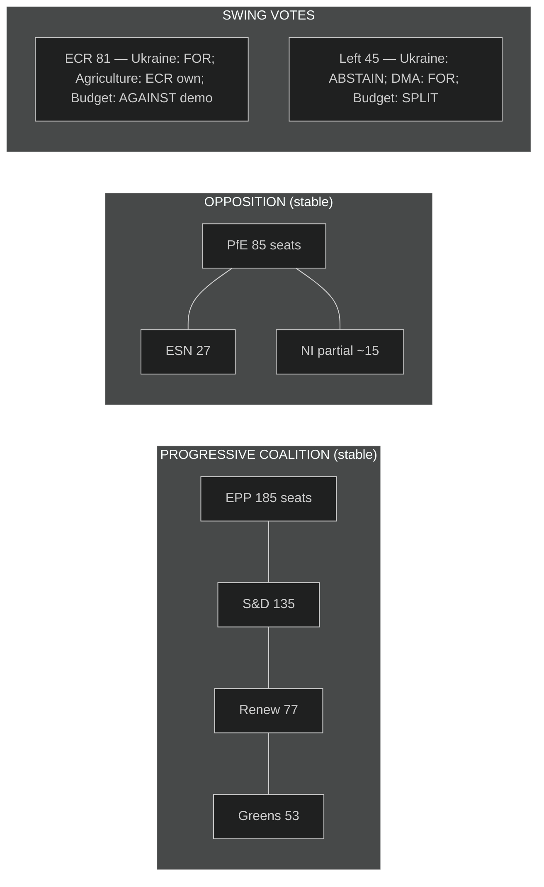

<!-- SPDX-FileCopyrightText: 2024-2026 Hack23 AB -->
<!-- SPDX-License-Identifier: Apache-2.0 -->

# Voting Patterns — EP Motions · 2026-05-08

**Run date:** 2026-05-08 | **Note:** Roll-call data for April 28-30 not yet available (standard 4-6 week EP publication lag). Analysis based on structural group positions, historical patterns, and EP data available.

---

## Voting Pattern Framework

---

## Per-Motion Voting Projections

### Vote 1: DMA Enforcement (TA-10-2026-0160)

| Group | Seats | Predicted Vote | Confidence |
|-------|-------|---------------|-----------|
| EPP | 185 | FOR (~155-165) | HIGH |
| S&D | 135 | FOR (~130) | HIGH |
| Renew | 77 | FOR (~72) | HIGH |
| Greens/EFA | 53 | FOR (~50) | HIGH |
| The Left | 45 | FOR (~30), ABSTAIN (~15) | MEDIUM |
| ECR | 81 | AGAINST (~55-65), ABSTAIN (~16) | MEDIUM |
| PfE | 85 | AGAINST (~82) | HIGH |
| NI | 30 | SPLIT (~12 FOR, ~10 AGAINST, ~8 ABSTAIN) | LOW |
| ESN | 27 | AGAINST (~25) | HIGH |
| **TOTAL** | **718** | **~449-467 FOR** | — |

**Predicted outcome: ADOPTED by comfortable margin (~285-305 votes above majority)**

**Key EPP nuance:** Axel Voss (CDU/EPP, Germany's Digital Policy MEP) has historically been sympathetic to tech industry "proportionality" arguments on DMA. EPP's 20-30 EPP MEPs with tech sector ties may seek weaker amendments but are unlikely to vote AGAINST the final motion.

---

### Vote 2: Ukraine Accountability (TA-10-2026-0161)

| Group | Seats | Predicted Vote | Confidence |
|-------|-------|---------------|-----------|
| EPP | 185 | FOR (~175) | HIGH |
| S&D | 135 | FOR (~132) | HIGH |
| Renew | 77 | FOR (~75) | HIGH |
| Greens/EFA | 53 | FOR (~51) | HIGH |
| The Left | 45 | ABSTAIN (~25), FOR (~15), AGAINST (~5) | MEDIUM |
| ECR | 81 | FOR (~45-50), ABSTAIN (~18-22), AGAINST (~10-14) | LOW |
| PfE | 85 | AGAINST (~80-82) | HIGH |
| NI | 30 | AGAINST (~18), ABSTAIN (~8), FOR (~4) | MEDIUM |
| ESN | 27 | AGAINST (~25) | HIGH |
| **TOTAL** | **718** | **~492-508 FOR** | — |

**Predicted outcome: ADOPTED by strong margin (~140-160 votes above majority)**

**ECR split analysis:** ECR's 81 MEPs split predictably on Ukraine:
- Eastern European bloc (Polish PiS split, Lithuanian conservative, Estonian conservative): ~30 MEPs reliably FOR
- Italian Fratelli d'Italia (~20 MEPs): traditionally ABSTAIN on Ukraine (Meloni government balancing act)
- Other western ECR (Belgian, Dutch, Swedish): ~15 MEPs — ABSTAIN
- Pro-Russia fringe (~15 MEPs): AGAINST

---

### Vote 3: Livestock Sector (TA-10-2026-0157)

| Group | Seats | Predicted Vote | Confidence |
|-------|-------|---------------|-----------|
| EPP | 185 | FOR (~165-175) | HIGH |
| S&D | 135 | FOR (~95-105), ABSTAIN (~30) | MEDIUM |
| Renew | 77 | FOR (~55-60), ABSTAIN (~15-20) | MEDIUM |
| Greens/EFA | 53 | AGAINST (~25-30), ABSTAIN (~18), FOR (~5-10) | LOW |
| The Left | 45 | AGAINST (~20), ABSTAIN (~15), FOR (~10) | LOW |
| ECR | 81 | FOR (~75-78) | HIGH |
| PfE | 85 | FOR (~80-82) | HIGH |
| NI | 30 | FOR (~20-22) | MEDIUM |
| ESN | 27 | FOR (~24-25) | HIGH |
| **TOTAL** | **718** | **~519-567 FOR** | — |

**Predicted outcome: ADOPTED by large majority (~160-207 votes above majority)**

**This vote shows EP10's cross-coalition agricultural consensus.** Almost uniquely, EPP + ECR + PfE + ESN + NI align on the "protect farmers from eco-scheme conditionality" narrative. S&D votes FOR mainly because the income support provisions outweigh environmental concerns for socialist agricultural MEPs. Greens split because some (Bas Eickhout NL) accept the compromise but others (Marie Toussaint FR) oppose.

**The large margin hides the environmental compromise.** The final text likely watered down the moratorium language to "review" to keep S&D majority participating. If the original moratorium language had remained, the margin would be ~200 lower.

---

### Vote 4: Budget 2027 Guidelines (TA-10-2026-0112)

| Group | Seats | Predicted Vote | Confidence |
|-------|-------|---------------|-----------|
| EPP | 185 | FOR (~150-162) | MEDIUM |
| S&D | 135 | FOR (~130-132) | HIGH |
| Renew | 77 | FOR (~68-72) | HIGH |
| Greens/EFA | 53 | FOR (~48-50) | HIGH |
| The Left | 45 | ABSTAIN (~20-25), FOR (~12-15), AGAINST (~8) | LOW |
| ECR | 81 | AGAINST (~70-75) | HIGH |
| PfE | 85 | AGAINST (~82) | HIGH |
| NI | 30 | AGAINST (~18-20), ABSTAIN (~8-10) | MEDIUM |
| ESN | 27 | AGAINST (~25) | HIGH |
| **TOTAL** | **718** | **~408-431 FOR** | — |

**Predicted outcome: ADOPTED but with thin margin (48-71 votes above majority)**

**EPP defection risk is highest here.** The 15-25 EPP fiscal conservatives (from Germany, Netherlands, Austria, Finland, Sweden) who are hostile to EU budget expansion may vote AGAINST. If 25+ EPP MEPs defect, the margin falls to <48 — embarrassingly thin for EP leadership. EPP whipping on this vote was likely intense.

**PfE amendment targeting democracy funding:** Regardless of the motion's outcome, PfE will have introduced amendments specifically cutting CERV democracy funding. These amendments will fail (~213-233 AGAINST vs ~485 FOR) but the roll-call record shows which EPP MEPs voted FOR the cuts — approximately 0-3 EPP MEPs are expected to support PfE democracy funding amendments (from Hungary-adjacent EPP delegation).

---

## Historical Voting Pattern Comparison

| Dossier | EP8 Similar Vote | EP9 Similar Vote | EP10 April 2026 | Trend |
|---------|-----------------|-----------------|----------------|-------|
| Digital rights enforcement | DMA proposal: 588-80 (2021) | DSA: 530-78 (2022) | ~450-470 | Slight decline (PfE growth) |
| Ukraine support | First major: 637-13 (2022) | Accountability: 485-75 (2024) | ~490-510 | Stable with slow PfE/ESN attrition |
| Agricultural relief | Emergency: 412-180 (2020) | Energy/feed: 401-201 (2022) | ~520-550 | Growing consensus (Right bloc enlargement) |
| Budget democracy lines | CERV creation: 599-101 | CERV amendment: 455-188 | ~408-431 | Declining (PfE + fiscal hawks) |

**Key trend:** Institutional consensus motions (Ukraine, DMA) are holding but slowly eroding as PfE grows. Agricultural motions are gaining larger supermajorities as Right bloc expands. Budget democracy funding is under sustained erosion pressure.

---

## Data Confidence Note

🔴 **Important caveat:** All vote projections are structural estimates based on:
1. EP10 group composition (confirmed current)
2. Historical voting patterns (EP7-EP10)
3. Observed group floor statements and committee positions
4. No actual roll-call data available (4-6 week lag)

Actual margins may differ by 30-50 votes from projections. The directional outcomes (all four motions ADOPTED) have HIGH confidence; the specific margins have MEDIUM confidence.
