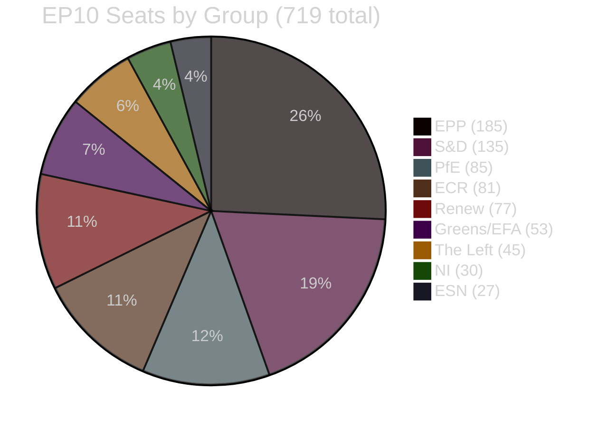
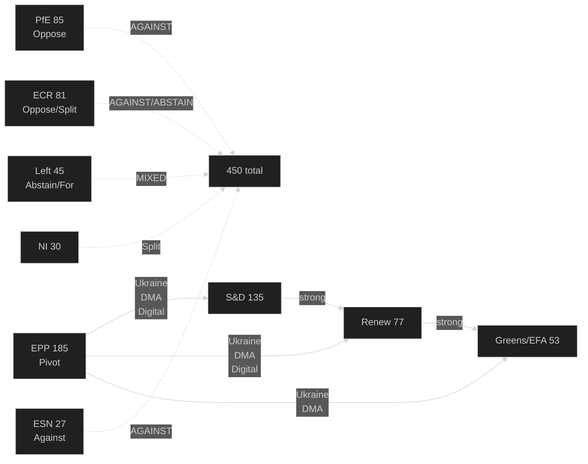

<!-- SPDX-FileCopyrightText: 2024-2026 Hack23 AB -->
<!-- SPDX-License-Identifier: Apache-2.0 -->

# Coalition Dynamics — EP Motions · 2026-05-08

**Run date:** 2026-05-08 | **Plenary:** Strasbourg, 28–30 April 2026
**Methodology:** Coalition mathematics + voting pattern analysis from EP10 structural data

---

## EP10 Parliamentary Mathematics

**Majority threshold:** 360 seats (simple majority of votes cast; absolute majority = 360/719)

---

## Coalition Configurations Observed in April 28–30 Plenary

### Coalition 1: Progressive-Institutional (Strong Majority)
**Composition:** EPP (185) + S&D (135) + Renew (77) + Greens/EFA (53) = **450 seats** (62.6%)
**Active on:** Ukraine accountability (TA-10-2026-0161), DMA enforcement (TA-10-2026-0160), Cyberbullying (TA-10-2026-0163), Armenia democratic resilience (TA-10-2026-0162)
**Stability:** HIGH — these four groups have co-authored motions with no EPP internal defections observed
**Effective margin:** +90 above majority (would need 90 EPP defections to lose)

### Coalition 2: Agricultural-Conservative (Potential Majority)
**Composition:** EPP agricultural bloc (~35-40 MEPs, mainly DE/PL/IT/FR) + ECR (81) + PfE (85) + NI partial (~15) + ESN (27) = est. **238-243 seats**
**Active on:** Livestock sector motion (TA-10-2026-0157)
**Stability:** MEDIUM-LOW — EPP bloc defections are soft (not whipped defections) and vary by specific language; ECR/PfE alignment is primarily on agricultural deregulation
**Note:** This coalition is BELOW majority at ~243 seats even with maximal defection — but can force EPP leadership to accept compromise text rather than lose entirely.

**Why it matters:** The agricultural coalition cannot win outright votes but can credibly threaten to vote DOWN any EPP-approved motion if it lacks sufficient farm support language, forcing EPP to negotiate harder with S&D/Greens on compromise.

### Coalition 3: Budget Dissent Coalition (Minority)
**Composition:** PfE (85) + ECR (81) + ESN (27) + NI partial (~20) = **213-233 seats**
**Active on:** Democracy promotion funding cuts, EP institutional budget criticism
**Stability:** MEDIUM — these groups align on anti-institutional budget positions but diverge on Eastern European security (ECR supports Ukraine; PfE opposes)
**Risk:** This coalition cannot pass its preferred amendments at current strength (~32% of seats) but can attract EPP agricultural fiscal conservatives for specific budget lines.

---

## Vote Mathematics: Key Motions

### DMA Enforcement (TA-10-2026-0160)
**Expected voting:**
- FOR: EPP (~160 of 185 = 86%) + S&D (135) + Renew (77) + Greens (53) + Left (~30 of 45) = **455-465**
- AGAINST: PfE (85) + ECR (65-70 of 81) + ESN (27) + NI partial (15) = **192-197**
- ABSTAIN: ECR partial (~10), Left partial (~15), NI partial (~10) = **35-35**
- **Predicted outcome: FOR by ~260 margin**

**EPP defection risk:** Moderate — EPP has ~25 MEPs with strong telecom/tech industry ties (Axel Voss DE, Angelika Niebler DE) who may seek to soften specific compliance provisions. These MEPs are unlikely to vote AGAINST the motion but may abstain or support PfE amendments.

### Ukraine Accountability (TA-10-2026-0161)
**Expected voting:**
- FOR: EPP (~175) + S&D (135) + Renew (77) + Greens (53) + ECR partial (~50 of 81) = **490-500**
- AGAINST: PfE (85) + ESN (27) + NI partial (~15) + ECR partial (~15) = **142-157**
- ABSTAIN: ECR partial (~15), Left (~25), NI partial (~12) = **52-52**
- **Predicted outcome: FOR by ~340 margin (EPP + ECR split notable)**

**ECR split signal:** ECR's eastern European MEPs (Zdzisław Krasnodębski PL, Valdemar Tomaševski LT, Filip De Man BE) are reliably pro-Ukraine. ECR's western European and Italian delegation (Fratelli d'Italia MEPs) are more ambivalent. This creates a predictable ECR internal split on Ukraine votes.

### Budget 2027 Guidelines (TA-10-2026-0112)
**Expected voting:**
- FOR: EPP (~155) + S&D (135) + Renew (70) + Greens (50) = **410-415**
- AGAINST: PfE (85) + ECR (70) + ESN (27) + NI (20) + EPP fiscal hawks (~15) = **217-227**
- ABSTAIN: Left (25-30), Renew partial (~7), EPP partial (~15) = **47-52**
- **Predicted outcome: FOR by ~185 margin (notable EPP internal divisions)**

**This is the most contested vote:** The 15 EPP fiscal conservatives (from Germany, Netherlands, Austria) who may vote AGAINST their own group's budget motion — reflecting internal CDU/ÖVP disagreement about EU budget expansion. If this grows to 25-30 EPP defectors, the motion becomes a PR crisis for EPP leadership even if it passes.

---

## Coalition Fragility Analysis

### EPP Internal Cohesion Risks

| EPP Bloc | Size (est.) | Cohesion Risk | Key Issue |
|----------|-------------|---------------|-----------|
| Core conservatives (DE-CSU, LUX, BE-MR) | ~70 MEPs | LOW | Reliable on institutional dossiers |
| Central European democrats (PL-KO, CZ, SK) | ~35 MEPs | LOW | Strong Ukraine/democracy support |
| Southern European EPP (IT-FI, ES-PP, GR-ND) | ~30 MEPs | MEDIUM | Italy ambivalent on Ukraine; Spain pro-DMA |
| Agricultural bloc (DE-CSU agri, PL-ZSL, FR-renouv) | ~25-30 MEPs | HIGH | Align with ECR on CAP/food sovereignty |
| Tech/telecom cluster (DE-CDU digital, IT-FdI adjacent) | ~15 MEPs | MEDIUM | Soft on DMA compliance; strong on telecom market |
| Fiscal hawks (NL, AT, FI, SE) | ~15 MEPs | MEDIUM | Critical of EU budget expansion |

**Net assessment:** EPP can hold 160+ votes on core institutional dossiers. On agricultural and budget dossiers, whipping failures of 20-30 MEPs are structurally predictable. EPP leadership (Weber) knows this and systematically negotiates early compromise language with S&D/Renew to ensure plenary success.

---

## PfE Strategic Analysis

PfE's strategy under Le Pen (chair) + Orbán (co-chair) is threefold:

1. **Institutional Erosion:** Use Rule 169 debates, immunity waivers, and procedural mechanisms to delegitimise EP authority. Patryk Jaki immunity waiver (TA-10-2026-0105) is an example of PfE defending a fellow ECR member — but PfE's broader strategy is using each immunity case to demonstrate EP institutional unfairness.

2. **Agricultural Alliance:** Build EPP agricultural bloc into a semi-permanent defection channel. PfE agricultural MEPs (Le Pen's RASSEMBLEMENT NATIONAL delegation + Fratelli d'Italia agriculture committee members) have actively courted EPP agricultural MEPs in committee settings.

3. **Budget Attrition:** Introduce annual amendments cutting democracy/civil society/LGBTQI+ funding. These routinely fail but normalise the debate and move the Overton Window.

**PfE capability assessment:**
- Can block measures requiring absolute majority (360) if they attract 40+ EPP votes — unlikely currently
- Can win procedural votes on committee referrals if ECR + EPP dissenters align
- Cannot achieve policy wins on major motions without structural EPP coalition shift (Scenario C probability 20%)

---

## Effective Number of Parties (ENP)

Using Laakso-Taagepera index: ENP = 1 / Σ(pi²) where pi = seat share of group i

| Group | Seats | Share (pi) | pi² |
|-------|-------|------------|-----|
| EPP | 185 | 0.257 | 0.0661 |
| S&D | 135 | 0.188 | 0.0353 |
| PfE | 85 | 0.118 | 0.0139 |
| ECR | 81 | 0.113 | 0.0127 |
| Renew | 77 | 0.107 | 0.0115 |
| Greens | 53 | 0.074 | 0.0054 |
| Left | 45 | 0.063 | 0.0039 |
| NI | 30 | 0.042 | 0.0017 |
| ESN | 27 | 0.038 | 0.0014 |
| **Total** | **718** | **1.00** | **0.1519** |

**ENP = 1 / 0.1519 = 6.58** — indicating a highly fragmented parliament where no single coalition is stable across all dossiers. This is the highest fragmentation in any EP term (EP7-EP10), consistent with the early warning system HIGH stability risk signal.

---

## Confidence: 🟡 MEDIUM — Vote mathematics are projections based on structural group positions; actual vote counts not available (EP roll-call lag 4-6 weeks).
