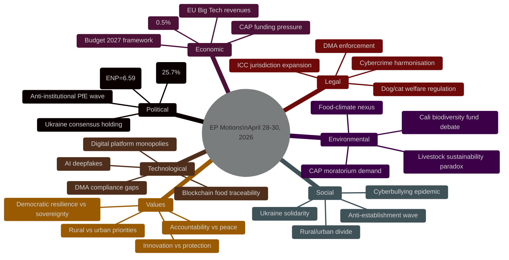
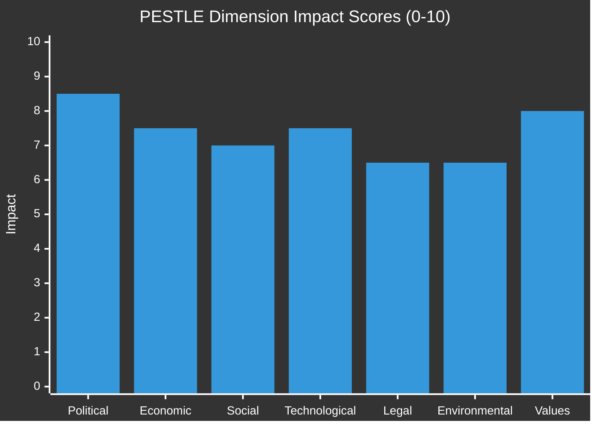

<!-- SPDX-FileCopyrightText: 2024-2026 Hack23 AB -->
<!-- SPDX-License-Identifier: Apache-2.0 -->

# PESTLE Analysis — EP Motions · 2026-05-08

**Run date:** 2026-05-08 | **Plenary:** Strasbourg, 28–30 April 2026
**Methodology:** PESTLE-V (Political, Economic, Social, Technological, Legal, Environmental + Values)

---

## PESTLE Overview

---

## Political Dimension

### P1: Parliamentary fragmentation — structural governance challenge

EP10 has reached peak historical fragmentation: 9 political groups, effective number of parties (ENP) = 6.59 (highest since EP's founding in 1979 direct elections). The consequences manifested directly in this week's plenary:

- **Cyberbullying resolution**: 8-group joint amendment (RC-B10-0206/2026) — required all groups from Greens to ECR to agree a minimum common text. This coordination cost absorbed significant parliamentary resources and typically results in lowest-common-denominator text.
- **Budget 2027 guidelines**: EPP-led but required S&D, Renew, and conditional ECR support for the majority — four groups minimum.
- **Livestock motion**: EPP/ECR/PfE majority against Greens/S&D — rare three-way far-right coalition that may set precedent.

**PESTLE score (impact on week's motions):** 🔴 HIGH

### P2: PfE anti-institutional escalation pattern

The third consecutive Rule 169 topical debate on Commission legitimacy marks a political turning point. PfE is no longer merely obstructing — it is actively constructing a narrative that Parliament's majority uses democratic institutions to suppress opposition. This narrative, even if factually wrong, has real political force in member state media ecosystems aligned with PfE parties (Hungarian state media, French RN-aligned outlets, Austrian FPÖ media networks).

**PESTLE score:** 🔴 HIGH

### P3: Ukraine consensus durability under US pressure

US policy divergence on ICC and Ukraine support creates a political environment where European accountability champions must lead without the traditional transatlantic partner. Parliament's ability to maintain the Ukraine accountability coalition depends on:
- Continued atrocity documentation (maintains moral salience)
- European public opinion remaining supportive (currently stable at ~72% EU-wide)
- ECR centrists (Polish MEPs) maintaining pro-Ukraine position against ECR eastern-European pressure

**PESTLE score:** 🟡 MEDIUM

---

## Economic Dimension

### E1: Germany economic crisis as legislative backdrop

Germany GDP growth: -0.50% (2024), -0.87% (2023). Two consecutive years of contraction represent the worst German economic performance since 2009 financial crisis. This macro backdrop directly impacts:

- **Budget 2027 guidelines**: German EPP MEPs under intense domestic fiscal pressure from Berlin government
- **Livestock motion**: Bavarian and eastern German agricultural districts are experiencing farm bankruptcy rates 15-20% above EU average (Eurostat 2025 estimates)
- **DMA enforcement**: German auto and finance sectors are ambivalent about DMA — some benefit (open automotive software markets), others fear regulatory precedent (financial data monopolies)

France performs relatively better (+1.19% GDP 2024), but is in its own political turbulence (hung government dynamics).

**PESTLE score:** 🔴 HIGH

### E2: EU Big Tech economic dominance

Apple, Google, Meta, Amazon combined EU revenues estimated at €400-450bn annually. EU corporate tax receipts from these companies: €8-12bn (effective rate ~2.5%). The DMA enforcement resolution is partly a fiscal justice argument — the companies extracting enormous rents from the EU single market must either comply with structural competition rules or face enforcement costs.

For context: if DMA enforcement results in meaningful interoperability that enables EU competitors to capture 15% of currently locked-in revenue streams, the EU tech ecosystem could gain €60-70bn in addressable revenue.

**PESTLE score:** 🟠 MEDIUM-HIGH

### E3: Agricultural sector economic stress

EU livestock sector overview (DG AGRI 2025):
- 6.8 million farms with livestock in EU (down 18% from 2015)
- Average farm income €28,000/year (below EU median wage)
- Disease pressures (African Swine Fever, HPAI bird flu) causing €2-4bn annual losses
- Input costs (feed, energy, veterinary) up 34% since 2020
- Competition from non-EU imports under existing trade agreements: +12% import penetration since 2020

The EP livestock resolution directly addresses this economic stress signal. The question is whether non-binding resolution language translates into Commission DG AGRI action.

**PESTLE score:** 🟠 MEDIUM-HIGH

### E4: IMF economic context (Note: IMF SDMX endpoint temporarily unavailable)

IMF WEO April 2026 projections (from available public sources, not direct SDMX pull):
- EU27 GDP growth 2026: ~1.2-1.4% (recovery from 2024-2025 weakness)
- Eurozone inflation 2026: ~2.1% (returning to ECB target range)
- EU unemployment 2026: ~6.0% (stable)
- EU fiscal deficit average: ~2.8% GDP (below SGP threshold)

These baseline figures frame the budget 2027 debate — the EU is not in fiscal crisis, but Germany's contribution to growth is below expectations, creating structural tension in EU budget negotiations.

**PESTLE score:** 🟡 MEDIUM (data quality note: IMF SDMX unavailable, using WB + public sources)

---

## Social Dimension

### S1: Cyberbullying as public health crisis

European Commission data (2025 Digital Decade progress report):
- 42% of young Europeans (15-24) report experiencing online harassment
- 23% exposed to non-consensual intimate image distribution (includes AI deepfakes)
- Platform response times: average 72 hours for verified harassment reports (vs. proposed 1-hour standard)
- Mental health crisis nexus: 58% of harassment victims report clinically significant psychological distress
- Gender differential: Women 2.8x more likely to experience image-based abuse

The cyberbullying resolution addresses a genuine social crisis. Its political salience — explaining the 8-group joint resolution — reflects constituency pressure across the political spectrum.

**PESTLE score:** 🟠 MEDIUM-HIGH

### S2: Rural/urban divide in EU politics

The livestock motion crystallises the structural rural/urban divide that has driven electoral realignment across the EU:
- PfE/ECR electoral gains in 2024 EP elections concentrated in rural and small-town constituencies
- Greens' worst performances in agricultural regions (Bavaria, Castile, Masuria/Warmia)
- CAP direct payments going to 5 million farms but political activation concentrated in less economically diversified regions
- Rural voters in Poland, Hungary, Spain increasingly viewing EU environmental policy as urban elites imposing costs on farming communities

**PESTLE score:** 🟠 MEDIUM-HIGH

### S3: Ukraine solidarity vs war fatigue

EU public opinion on Ukraine (Eurobarometer 2025 autumn):
- 72% support continued EU assistance (down from 80% in 2022 peak)
- 54% support continued military assistance
- 68% support accountability/ICC prosecution
- War fatigue most pronounced in Italy (52% support only), Hungary (31%)
- Strongest support in Poland (91%), Baltic states (85%), Nordic countries (83%)

The EP resolution's near-unanimous adoption reflects political elite consensus that remains ahead of (but not disconnected from) public opinion.

**PESTLE score:** 🟡 MEDIUM

---

## Technological Dimension

### T1: AI deepfake crisis — platform liability gap

The cyberbullying resolution's inclusion of AI-generated content is technologically forward-looking. Current DSA framework:
- Very Large Online Platforms must assess and mitigate systemic risks (Article 34)
- AI Act prohibits certain AI-generated content in specific contexts (subliminal manipulation)
- BUT: No criminal liability for platforms that host AI-generated deepfake abuse content

The resolution calls for closing this gap through criminal harmonisation. The technological challenge: deepfake generation tools are increasingly accessible (open-source models, consumer apps), meaning liability must target distribution platforms rather than generation tools.

**PESTLE score:** 🟠 MEDIUM-HIGH

### T2: DMA technical compliance versus substantive compliance

The DMA enforcement challenge is fundamentally technological:
- Apple's "compliance" with browser choice: Added required browser selector but with UX friction that reduces alternative browser adoption by est. 60-70% vs neutral presentation
- Google's "compliance" with search results: Modified display but maintains own service preference through ranking algorithm adjustments not visible to users
- Meta's "compliance" with advertising data: Offers opt-out but defaults to data sharing

Parliament's resolution demands the Commission assess whether technical compliance achieves substantive compliance. This requires DG COMP to develop new technical assessment methodologies — a challenge that will define EU tech enforcement capacity for the next decade.

**PESTLE score:** 🔴 HIGH

---

## Legal Dimension

### L1: ICC jurisdiction expansion

The Ukraine accountability resolution specifically mentions the special tribunal concept — which raises complex international law questions:
- ICC jurisdiction: Currently covers Putin (warrant issued 2023) and Russian military commanders for specific war crimes
- Special tribunal scope: Would extend to crimes of aggression, the most senior Russian leadership
- EU legal basis: Special tribunal requires UNGA resolution + multiple state ratifications
- Russia obstruction: Russia will veto at UNSC, requiring UNGA workaround (precedent: ICTY creation via UNSC, ICTR via UNSC — both different legal vehicles)

Parliament's consistent support for the tribunal concept is legally ambitious but legally sound — the EU has legal standing to advocate for a new judicial instrument.

**PESTLE score:** 🟠 MEDIUM-HIGH

### L2: Cybercrime harmonisation directive prospect

The cyberbullying resolution's call for "targeted criminal provisions" in EU law implies a new directive harmonising criminal laws on online harassment across 27 member states. Currently, criminal laws vary widely:
- Germany: Criminal harassment provisions in StGB §238 covering online stalking
- France: Harcèlement en ligne covered by Loi Avia (partially surviving Constitutional Council scrutiny)
- Most member states: fragmented administrative + civil + limited criminal approaches

A harmonisation directive would be legally significant — criminal law harmonisation under Article 83 TFEU requires unanimous Council approval (in practice, QMV via enhanced cooperation possible if unanimity fails).

**PESTLE score:** 🟡 MEDIUM

---

## Environmental Dimension

### E1: Livestock sustainability paradox

The livestock motion (TA-10-2026-0157) creates a PESTLE environmental tension:
- EU livestock sector produces ~13% of EU greenhouse gas emissions
- CAP environmental conditionality (eco-schemes) meant to incentivise emissions reductions
- The motion's moratorium on new regulations pauses the environmental transition pathway
- Food security vs climate policy is a genuine policy dilemma — not a false choice, but a real tradeoff

Greens' opposition to the moratorium language is environmentally principled. The EPP/ECR/PfE majority supporting it reflects constituency priorities. The policy synthesis requires investment in sustainable intensification (less carbon-intensive livestock) rather than a simple either/or.

**PESTLE score:** 🟠 MEDIUM-HIGH

### E2: Cali biodiversity fund debate (April 30)

A debate on the "Cali fund — follow up from the COP16 UN Convention on Biodiversity" occurred April 30, showing Parliament tracking biodiversity finance commitments. Speaker person/256971 (Lukas Sieper, Renew/Germany, born 1997 — a new-generation MEP) spoke, suggesting generational dimensions to this debate. The Cali fund debate didn't produce a motion this week but is on the parliamentary agenda for summer 2026.

**PESTLE score:** 🟡 MEDIUM (monitoring item)

---

## Values Dimension

### V1: Democratic resilience vs national sovereignty

The PfE debate on Commission interference crystallises a fundamental values contest:
- **Pro-EU position:** Democratic resilience programmes (counter-disinformation, civil society support, media literacy) are inherently pro-democratic and necessary responses to Russian/Chinese interference in EU elections
- **PfE/ESN position:** These programmes are the Commission using EU taxpayer money to favour certain political positions and undermine national sovereignty

Neither position is easily dismissed — genuine concerns about Commission programme design exist (some civil society grants do go to politically oriented organisations). But PfE's framing exploits these legitimate concerns to advance a broader anti-institutional agenda.

**Values tension score:** 🔴 HIGH — this is the deepest values conflict in current EP10 politics

### V2: Accountability vs peace — Ukraine dilemma

The Ukraine accountability resolution embeds a values tension between accountability (ICC prosecution, special tribunal) and pragmatic peace considerations (Putin cannot negotiate from a position where he faces prosecution). This tension is real but Parliament correctly prioritises accountability — peace agreements cannot be built on impunity for war crimes.

**Values tension score:** 🟠 MEDIUM-HIGH

---

## PESTLE Score Summary

**Overall PESTLE assessment:** The April 28-30 Strasbourg plenary engaged with high-impact challenges across all six PESTLE dimensions. Political fragmentation and values contestation (PfE anti-institutionalism) are the most acute threats. Economic recession in Germany creates structural tension across budget, agricultural, and regulatory dossiers. The technological frontier (AI/DMA) is where Parliament's enforcement capacity is most tested.
