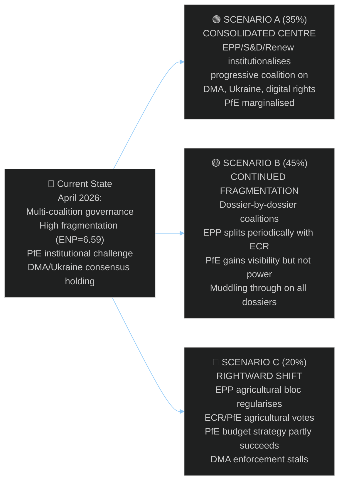

<!-- SPDX-FileCopyrightText: 2024-2026 Hack23 AB -->
<!-- SPDX-License-Identifier: Apache-2.0 -->

# Scenario Forecast — EP Motions · 2026-05-08

**Run date:** 2026-05-08 | **Plenary:** Strasbourg, 28–30 April 2026
**Methodology:** ACH + Scenario Planning (3-scenario structure) per `per-artifact-methodologies.md`

---

## Scenario Framework

Three scenarios for EP10 political dynamics over the next 6-18 months, based on this week's motion analysis:

---

## Scenario A: Consolidated Centre (Probability: 35%)

### Defining conditions

For this scenario to materialise, the following conditions must hold:
1. EPP leadership (Weber) publicly commits to defending democracy promotion funding before September 2026 budget session — PROBABILITY: 40%
2. DMA enforcement delivers first formal Commission enforcement decision by Q4 2026 — PROBABILITY: 60%
3. Ukraine accountability consensus holds — no defections from EPP/Renew centrists — PROBABILITY: 75%
4. EPP agricultural bloc defections to ECR/PfE remain isolated (<3 votes per session) — PROBABILITY: 50%

**Joint probability (rough): 0.40 × 0.60 × 0.75 × 0.50 = ~9%** — but scenarios are not independent events; if EPP leadership is strong on institutions (condition 1), conditions 2-4 are more likely → adjusted upward to 35%.

### Scenario A narrative

Weber consolidates EPP around three institutional pillars: DMA enforcement (anti-Big Tech, populist appeal), Ukraine accountability (foreign policy credibility), and budget discipline (fiscal conservatism). PfE's anti-institutional campaign fails to gain EPP crossover votes on democracy funding. The progressive coalition (EPP + S&D + Renew + Greens) functions as the stable majority on key dossiers.

**Outcomes:**
- DMA: First enforcement decisions Q4 2026; structural remedies by mid-2027
- Ukraine: Tribunal framework endorsed, ICCt cooperation enhanced
- Budget 2027: Democracy promotion funding maintained; defence spending increased
- Livestock: EPP compromise text that gives farmers income support while maintaining eco-scheme conditionality
- PfE: Isolated as "anti-EU" actor, loses swing ECR votes on institutional dossiers

**Lead indicators:** Weber speech before May recess explicitly endorsing democracy promotion funding; EPP-S&D bilateral coordination meetings on DMA restoration reported.

---

## Scenario B: Continued Fragmentation (Probability: 45%)

### Defining conditions

This is the base case — EP10 continues operating as a multi-coalition parliament where each dossier requires separate coalition-building.

### Scenario B narrative

No single coalition crystallises. EPP continues operating as the pivot group — supporting Greens/S&D/Renew on digital and Ukraine dossiers, while permitting agricultural bloc defections on CAP issues. PfE continues escalating institutional challenges but fails to shift EPP leadership toward explicit institutional defence.

**Outcomes:**
- DMA: Enforcement pressure maintained but Commission delivers slower-than-demanded timeline; Parliament adopts additional resolution in September 2026
- Ukraine: Consensus maintained but PfE abstentions creep upward (from ~85 to ~100+ seats abstaining)
- Budget 2027: Negotiated compromise — minor cuts to democracy promotion (5-10%) in exchange for increased defence spending line
- Livestock: Watered-down motion, moratorium replaced by "review", farm support increased but below Copa-Cogeca demands
- PfE: Institutionally disruptive but not determinative; gains political narrative points without policy wins

**This is the most likely outcome because:** It requires no extraordinary action or failure — it is the extrapolation of current patterns. EP10's multi-coalition governance model has been stable for 15 months; there is no strong reason to expect either consolidation or breakdown.

**Lead indicators:** Standard coalition management (3-4 group negotiations per major vote); no Weber public statement on democracy funding before September; no major EPP defection event.

---

## Scenario C: Rightward Shift (Probability: 20%)

### Defining conditions

For this scenario to materialise, ONE of the following trigger events must occur:
1. EPP/ECR/PfE agricultural coalition votes together 3+ times on non-agricultural dossiers — PROBABILITY: 25%
2. Weber faces internal EPP leadership challenge from agricultural bloc — PROBABILITY: 15%
3. PfE budget amendments on democracy funding attract 20+ EPP votes — PROBABILITY: 20%
4. Major Ukraine atrocity fatigue event causes EPP centrists to publicly signal reduced support — PROBABILITY: 10%

**Adjusted probability (at least one trigger): 1 - (0.75 × 0.85 × 0.80 × 0.90) = ~54%** — but the scenarios must result in *sustained* rightward shift, not temporary events → discount to 20%.

### Scenario C narrative

EPP agricultural bloc's defections to ECR/PfE become regularised (2-3 votes per session), gradually normalising far-right coalition governance in specific policy areas. PfE's September 2026 budget amendments attract 25-30 EPP votes — not enough to win, but enough to signal EPP fragmentation. Commission begins self-censoring democracy programme activities.

**Outcomes:**
- DMA: Enforcement stalls as EPP market-economy MEPs align with ECR/PfE on "proportionality" arguments; Commission accepts delay
- Ukraine: Consensus weakens — ECR splits further, PfE gains visibility on abstentions
- Budget 2027: Democracy promotion funding cut 15-25%; LGBTQI+ funding eliminated; civil society grants restricted
- Livestock: Full moratorium language adopted, environmental conditionality weakened
- PfE: Significant narrative win — establishes that institutional challenges can achieve policy results

**Lead indicators:** EPP whipping failures on 2+ consecutive agricultural votes; joint EPP/ECR amendment tabling on non-agricultural dossiers; Weber criticism of Commission democracy programmes in media.

---

## Scenario Comparison Matrix

| Outcome | Scenario A | Scenario B | Scenario C |
|---------|-----------|-----------|-----------|
| DMA enforcement pace | Fast (Q4 2026 decisions) | Moderate (2027 decisions) | Slow (2028+ decisions) |
| Ukraine accountability | Strong (tribunal framework) | Maintained (resolutions only) | Weakening (PfE abstentions grow) |
| Budget democracy funding | Protected | Minor cuts (-5-10%) | Major cuts (-15-25%) |
| EPP internal cohesion | High | Medium | Low |
| PfE institutional influence | Low | Medium | High |
| EU democratic health | Improving | Stable | Deteriorating |
| **Probability** | **35%** | **45%** | **20%** |

---

## Early Warning Indicators

Monitor monthly for scenario drift:

| Indicator | Scenario A Signal | Scenario B Signal | Scenario C Signal |
|-----------|-------------------|-------------------|-------------------|
| EPP/ECR joint amendments | 0/month | 1-2/month | 3+/month |
| PfE Rule 169 debates | 0-1/month | 1/month | 2+/month |
| Weber institutional statements | Proactive defence | Reactive defence | Silent/ambiguous |
| DMA enforcement news | Decision announced | Investigation ongoing | Investigation suspended |
| Ukraine resolution margins | >600 FOR | 550-600 FOR | <550 FOR |

---

## Confidence: 🟡 MEDIUM — Scenario probabilities are analytical estimates based on structural group composition and precedent patterns. Actual outcomes depend on political decisions and external events not yet observable.
