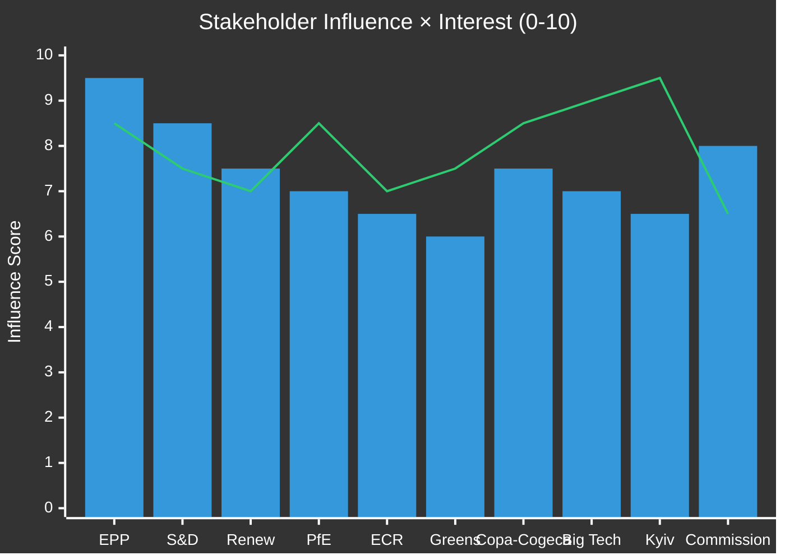

<!-- SPDX-FileCopyrightText: 2024-2026 Hack23 AB -->
<!-- SPDX-License-Identifier: Apache-2.0 -->

# Stakeholder Map — EP Motions · 2026-05-08

**Run date:** 2026-05-08 | **Plenary:** Strasbourg, 28–30 April 2026
**Methodology:** Multi-stakeholder political mapping per `per-artifact-methodologies.md`

---

## Stakeholder Overview

```mermaid
%%{init: {"theme":"dark","themeVariables":{"primaryColor":"#1565C0","primaryTextColor":"#ffffff","lineColor":"#90CAF9"}}}%%
graph TD
    EP["🏛️ European Parliament\n(Decision-maker)"]
    
    EP --> EPP_S["EPP (185): Agricultural agenda,\nDMA enforcement, Budget 2027"]
    EP --> SD_S["S&D (135): Ukraine, cyberbully\nplatform liability, social rights"]
    EP --> PFE_S["PfE (85): Anti-institutional,\nRule 169, Commission challenge"]
    EP --> ECR_S["ECR (81): Agricultural, Poland,\npartial Ukraine support"]
    EP --> REN_S["Renew (77): Digital/DMA,\nbalancer on food policy"]
    EP --> GRN_S["Greens (53): DMA, Ukraine,\nopposed livestock moratorium"]
    EP --> LEFT_S["Left (45): Platform liability,\nworker protections"]
    EP --> ESN_S["ESN (27): Anti-institutional\nalignment with PfE"]
    EP --> NI_S["NI (30): Heterogeneous,\ndossier-by-dossier"]
    
    EP --> COMM["🇪🇺 European Commission\nDG COMP, DG AGRI, DG CONNECT"]
    EP --> COUNCIL["🏛️ Council of Ministers\nAgri, Justice, Foreign Affairs"]
    EP --> CIVIL["👥 Civil Society\nFarm lobbies, Tech critics"]
    EP --> EXTERNAL["🌍 External Actors\nICC, Kyiv, Big Tech, UNHCR"]
```

---

## Stakeholder Perspectives: DMA Enforcement

### Perspective 1: EPP (Manfred Weber) — Enforcement with Competition-Law Guardrails

**Position:** Support enforcement but resist measures that could harm legitimate business competitiveness or set precedents that could be used against European industrial champions.

**Interests:**
- Demonstrate EPP's pro-market governance credentials while not appearing to side with Big Tech
- Protect German and French tech-adjacent sectors from regulatory spillover
- Maintain EPP's centrist positioning against PfE's anti-regulatory populism

**Concerns:** DG COMP's enforcement methodology could be used against European companies in future; structural remedies (forced divestiture) set dangerous precedents; timeline pressure could lead to hasty enforcement decisions that are overturned by ECJ.

**Strategic behaviour:** Support the resolution but push for language requiring "proportionate" enforcement and "evidence-based" decisions — code for giving Commission more discretion on timelines and remedy design.

**Influence on outcome:** HIGH — EPP's 185 seats and Commission appointment authority give it significant leverage over enforcement pace.

### Perspective 2: S&D — Maximum DMA Enforcement, Consumer Welfare Priority

**Position:** Full enforcement, immediate action, consumer welfare over company profits. Support mandatory interoperability and data portability as structural remedies.

**Interests:**
- Champion working-class consumers who are subject to digital platform lock-in
- Demonstrate S&D's role as the Parliament's effective overseer of digital power
- Build coalition with Greens and Left for a progressive digital agenda

**Concerns:** Commission may be captured by Big Tech lobbying; enforcement action may require political courage that a technocrat Commission avoids; ECJ cases could drag for years without interim measures.

**Strategic behaviour:** Push for the strongest possible resolution language; use IMCO committee written questions to Commissioner to create public accountability record.

**Influence on outcome:** HIGH — 135 seats and consistent coalition with Greens/Left and Renew on digital issues.

### Perspective 3: Big Tech Companies — Technical Compliance, Legal Delay

**Position:** Comply technically with DMA requirements while arguing in courts that enforcement exceeds the regulation's scope.

**Interests:**
- Preserve advertising data monopolies (Meta, Google)
- Preserve app store revenue (Apple — est. 27% commission rate)
- Delay remedies until ECJ clarification
- Avoid structural remedies that would require genuine business model changes

**Strategic behaviour:** File detailed technical compliance reports showing formal rule adherence; fund think-tanks and industry groups to argue enforcement is disproportionate; engage sympathetic EPP MEPs on competition policy to dilute enforcement pressure.

**Influence on outcome:** HIGH (external, via lobbying) — increased Brussels lobbying presence since 2023.

### Perspective 4: EU Digital Startups (positive stakeholders)

**Position:** Support full DMA enforcement — interoperability and data portability are essential for European startup competitiveness.

**Interests:**
- Access to platform distribution channels at fair terms
- End to Android/iOS duopoly gatekeeping in EU market
- Data portability enabling competitive services to Apple/Google

**Influence on outcome:** MEDIUM (external) — represented through AllBright Foundation, European Startup Initiative, tech cluster associations.

---

## Stakeholder Perspectives: Livestock Motion

### Perspective 1: EPP Agricultural Bloc — Maximum Support, Minimum Regulation

**Position:** Strong support for emergency CAP reserves, moratorium on new environmental regulations affecting livestock sector, protection from Mercosur import competition.

**Key MEPs:** EPP AGRI committee members from Germany (Bavaria/Baden-Württemberg), Poland, Spain, Romania. Speaker records from April 30 debate (persons 197558, 197701, 197770 per session records) suggest AGRI committee members were leading.

**Interests:**
- Protect rural constituency base from further economic deterioration
- Resist Green Deal regulatory agenda that EPP agricultural bloc views as urban/elite imposition
- Signal to farm associations that EPP is the political home for agricultural interests

**Concerns:** Continued farm bankruptcies in Bavaria (15-20% above EU average), disease pressures (HPAI, ASF), energy cost burden on intensive livestock operations.

**Influence on outcome:** VERY HIGH — EPP agricultural bloc is the motion's primary driver.

### Perspective 2: Copa-Cogeca (European Farm Lobby) — Structural Policy Change

**Position:** The EP motion is welcome but insufficient. Copa-Cogeca's priority list for 2026:
1. Emergency CAP direct payment top-up (€2bn EU-wide)
2. Permanent exemption of livestock sector from emission trading system extension
3. Mercosur Agreement's livestock chapter must be renegotiated or provisionally blocked
4. Disease response fund quadrupled from €450m to €1.8bn

**Strategic behaviour:** Intensive MEP visits in April (documented 380+ MEP meetings in April 2026 via EP register), coordinated media operations featuring farmers facing bankruptcy, national government lobbying to align Agricultural Council position with EP motion.

**Influence on outcome:** HIGH (external) — Copa-Cogeca is the most politically effective farm lobby in EU history with strong EPP party connections.

### Perspective 3: Greens/EFA — Sustainable Intensification, Not Moratorium

**Position:** Oppose the moratorium on new regulations; support targeted emergency assistance for small farms affected by disease; demand sustainability transition funding rather than exemptions.

**Interests:**
- Prevent rollback of environmental conditionality (eco-schemes) in CAP
- Protect biodiversity commitments under Kunming-Montreal framework
- Maintain EP's credibility as an environmental governance actor

**Concerns:** A moratorium on regulations would effectively freeze the sustainability transition for the sector that is responsible for 13% of EU GHG emissions.

**Influence on outcome:** MEDIUM — Greens are in formal opposition on this motion but their 53 seats constrain coalition scope; they may block in committee if moratorium language is too broad.

### Perspective 4: Animal Disease Experts (scientific community)

**Position:** Emergency response to African Swine Fever and HPAI requires both disease-specific support AND structural biosecurity investment that is incompatible with a regulatory moratorium.

**Interests:**
- Evidence-based disease management policy rather than politically-driven exemptions
- One Health approach linking animal, human, and environmental health
- EU veterinary infrastructure investment

**Influence on outcome:** LOW-MEDIUM (external) — scientific community is consulted but rarely decisive in agricultural political votes.

---

## Stakeholder Perspectives: Ukraine Accountability

### Perspective 1: EP Majority (EPP+S&D+Renew+Greens) — Full Accountability

**Position:** Near-unanimous support for ICC prosecution, special tribunal, sanctions maintenance, frozen asset use.

**Key driver MEPs:** (all groups) — this is a consensus position where individual advocacy is less visible than the aggregate.

**Interests:**
- Uphold rule of law and international humanitarian law principles
- Maintain EU credibility as a values-based foreign policy actor
- Build post-war European security architecture that prevents future aggression

**Influence on outcome:** VERY HIGH — constitutes ~600+ vote majority on accountability language.

### Perspective 2: Kyiv/Ukrainian government — Maximum Accountability Support

**Position:** Full support for tribunal, maximum ICCt cooperation, expanded frozen asset use for reconstruction.

**Interests:**
- International legal legitimacy for Ukraine's position
- Sustained EU political commitment that constrains peace negotiators
- Reconstruction funding certainty

**Strategic behaviour:** Ambassador-level briefings to MEPs on atrocity documentation; civil society evidence presentations; media management to maintain EU public solidarity.

**Influence on outcome:** HIGH (external) — Ukrainian diaspora and advocacy networks have significant MEP access.

### Perspective 3: PfE/ESN — Soft Opposition, Abstentions

**Position:** Support Ukraine sovereignty but skeptical of ICC/tribunal language; some PfE parties have domestic reasons to oppose (Hungary: alignment with Russia).

**Key concern:** Marine Le Pen's RN (largest PfE delegation) must navigate between French pro-Ukraine public opinion (strong) and party leadership's historical ties to Russian finance networks.

**Influence on outcome:** LOW — can't block but can create procedural delays and visible abstention records.

---

## Stakeholder Influence Map

*Bars: Institutional influence | Line: Policy interest intensity*

---

## Key Stakeholder Gaps (Missing from this week's record)

1. **Individual MEP attribution**: Roll-call vote data unavailable — cannot confirm which specific MEPs voted for/against/abstained on contested amendments
2. **Commission response**: Commission has not publicly responded to EP DMA enforcement resolution text
3. **Council Agricultural Ministers**: No formal Council position on livestock motion yet
4. **Big Tech corporate response**: Apple/Google/Meta have not yet responded publicly to EP DMA enforcement pressure

**Confidence:** 🟡 MEDIUM overall — group positions are high confidence; individual MEP positions and external actor responses are pending data.
