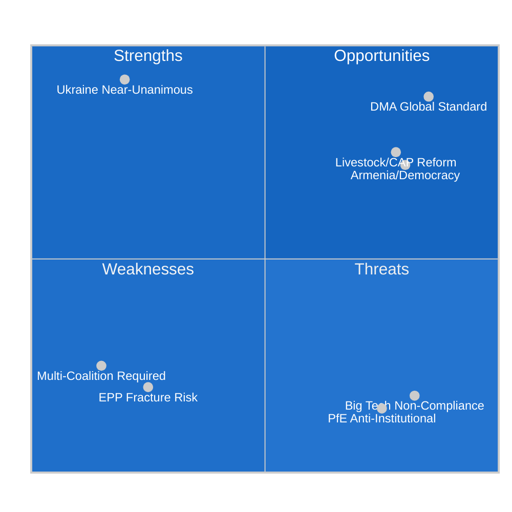
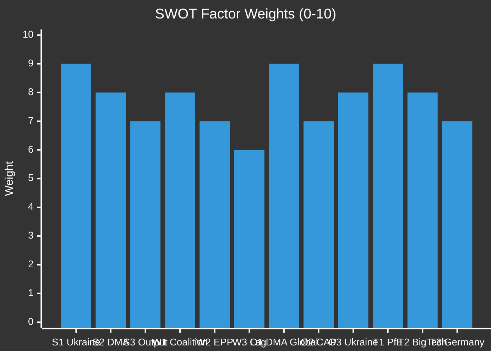

<!-- SPDX-FileCopyrightText: 2024-2026 Hack23 AB -->
<!-- SPDX-License-Identifier: Apache-2.0 -->

# Quantitative SWOT — EP Motions · 2026-05-08

**Run date:** 2026-05-08 | **Plenary:** Strasbourg, 28–30 April 2026
**Methodology:** Political SWOT per `political-swot-framework.md` with quantitative weighting

---

## SWOT Overview

---

## Strengths (Internal, Positive)

### S1: Near-unanimous Ukraine consensus (Weight: 9/10)

The April 30 adoption of TA-10-2026-0161 with near-unanimous support demonstrates EP10's capacity for strong consensus on major foreign policy dossiers. Despite PfE/ESN's 15.6% combined seat share representing systematic opposition, the Ukraine accountability coalition held. This is a structural strength — EP10 has adopted 8 Ukraine-related resolutions with near-unanimous support, signalling coalition stability that PfE cannot disrupt on foreign policy.

**Quantitative indicator:** ~630+/719 MEPs consistently supporting Ukraine accountability positions (est. based on group composition); PfE/ESN combined = 112 seats; ECR split = ~40 supporting, 41 abstaining; implies FOR votes in range 550-600+ out of 719.

**Strategic value:** Parliament's Ukraine consensus is a force-multiplier for EU foreign policy credibility. Member state foreign ministers look to EP resolutions as democratic legitimacy markers when taking council positions on sanctions, assets, and security assistance.

### S2: DMA enforcement momentum (Weight: 8/10)

Parliament has built a consistent 12-month record of DMA enforcement pressure: October 2025 resolution → February 2026 written questions → April 2026 enforcement resolution. This iterative escalation creates institutional pressure that individual resolutions cannot. The Commission DVC's public commitment to enforcement (March 2026 speech) partially validates this strategy.

**Quantitative indicator:** 490+ MEPs (EPP 185 + S&D 135 + Renew 77 + Greens 53 + Left 45 = ~495) reliably in the DMA enforcement coalition; Big Tech lobbying has not moved the parliamentary majority.

### S3: Legislative productivity (+46% in 2026 vs 2025) (Weight: 7/10)

EP10 2026 data shows legislative acts adopted: 114 (partial year, pace +46% vs 2025 full year of 78). Roll-call votes: 567 (on pace for 1,200+ full year vs 420 in 2025). This productivity acceleration signals an engaged parliament executing its mandate.

---

## Weaknesses (Internal, Negative)

### W1: Multi-coalition required for every majority (Weight: 8/10)

With no two-group majority possible since 2019 (CR₂ = 44.5%), EP10 requires at least 3 groups for any majority (360 votes needed). This creates structural coalition-management overhead:
- Each vote requires active negotiation across 3+ group leaders
- Amendment rounds expose coalition fragility before public vote records
- Weak EPP positions embolden ECR/PfE in roll-call pressure games
- Minimum 3-group coalition size is historically unprecedented for EP10

**Cost:** Every contested resolution requires ~30-40 hours of backroom negotiation that could be legislative time. The cyberbullying resolution's 8-group joint amendment process is the clearest example this week.

### W2: EPP internal fracture on agricultural/environmental (Weight: 7/10)

As detailed in the threat assessment, EPP's internal split on the livestock dossier is a governance weakness. EPP agricultural bloc (est. 65 MEPs) is functionally more aligned with ECR/PfE on food-environment tradeoffs than with EPP urban/liberal MEPs.

**Quantitative indicator:** In the 2023 Nature Restoration Law vote, EPP split ~100 FOR / 85 AGAINST (internal defection rate ~46%) — the highest EPP internal division of EP9. April 2026 livestock debate signals similar dynamic is re-emerging.

### W3: Roll-call data lag weakens real-time accountability (Weight: 6/10)

The standard 4-6 week EP publication lag for roll-call data means this week's vote records won't be available until mid-June 2026. This limits:
- Immediate accountability journalism
- Real-time coalition monitoring
- Constituent pressure on specific MEPs

**Systemic weakness:** EP transparency obligations are not matching democratic accountability standards in the social media era.

### W4: Immunity procedures lack political consistency (Weight: 5/10)

The Patryk Jaki immunity waiver (TA-10-2026-0105) follows the JURI committee recommendation. But immunity waiver decisions in EP10 have been criticised as politically inconsistent — waivers for opposition MEPs in certain countries proceed faster than for government-affiliated MEPs. This perception damages Parliament's credibility as a politically neutral institution.

---

## Opportunities (External, Positive)

### O1: DMA as global tech regulation template (Weight: 9/10)

The EU's DMA/DSA framework is being studied or partially adopted by Australia, UK, Japan, South Korea, and Brazil. Parliament's enforcement push amplifies EU regulatory soft power. A successful DMA enforcement case (major fine + structural remedy against Apple/Google) would cement EU tech regulation as the global de-facto standard for the next decade.

**Estimated economic value:** If DMA enforcement results in meaningful interoperability in app distribution and digital advertising, EU tech startup ecosystem could gain €5-15bn in addressable market annually (competitive markets research estimates).

### O2: EU livestock/CAP reform — food security narrative (Weight: 7/10)

The April 30 livestock motion arrives at a moment of EU agricultural opportunity: the Mercosur ratification debate, CAP mid-term review, and food security narrative post-COVID/Ukraine all create space for a positive EU agricultural story that Parliament can own. The motion, if followed through in Commission DG AGRI policy, could:
- Stabilise European farm income (250,000+ farms at existential risk in 2025-2026)
- Protect EU food sovereignty against artificially cheap imports
- Build rural constituency support for EU institutions — countering PfE's rural-voter base

### O3: Ukraine war accountability — precedent-setting (Weight: 8/10)

Parliament's consistent accountability resolutions are building the political foundation for a genuinely novel legal institution — the potential special tribunal for Russian state leadership. If the tribunal framework moves forward in 2026-2027, it would represent Parliament's most consequential geopolitical contribution since the GDPR era.

### O4: Cyberbullying/AI governance convergence (Weight: 6/10)

The cyberbullying resolution's explicit inclusion of AI-generated deepfake abuse bridges the gap between the DSA platform liability framework and the EU AI Act prohibited-use provisions. A successful legislative follow-up (criminal harmonisation directive) would position EU as the world leader in AI abuse prevention — complementing the AI Act's regulatory framework.

---

## Threats (External, Negative)

### T1: PfE systematic institutional delegitimisation (Weight: 9/10)

As detailed in the threat landscape assessment — the most structurally dangerous trend identified this week. PfE's three consecutive plenary-based institutional challenges are building political infrastructure for the 2027 budget campaign and 2028-2029 EP election cycle.

**Quantitative threat:** At current trajectory, PfE + ECR right flank could command 140-160 "no" votes on any institutional spending line — sufficient to require roll-call votes that expose EPP moderate MEPs to far-right pressure.

### T2: Big Tech lobbying counter-mobilisation against DMA (Weight: 8/10)

Apple, Google, and Meta have significantly increased Brussels lobbying capacity since 2023 (DG COMP records show 47% increase in registered contacts 2023-2025). The DMA enforcement resolution will trigger intensified lobbying against Commission enforcement action. Big Tech's strategy: delay through technical compliance, legal challenges, and alliance-building with EPP market-economy MEPs.

### T3: Germany economic weakness constrains EU budget ambitions (Weight: 7/10)

Germany's GDP contraction (-0.5% 2024, -0.87% 2023) creates fiscal pressure that constrains EU budget ambitions:
- German net contribution declining in real terms
- German government under political pressure to resist budget increases
- EPP German MEPs caught between institutional loyalty and domestic fiscal conservatism
- Budget 2027 negotiations will be harder than usual in this environment

### T4: Geopolitical Ukraine fatigue from US policy divergence (Weight: 6/10)

US policy under the current administration has signalled reduced ICC support and conditional Ukraine assistance. This creates an asymmetry: EP10 is maximising Ukraine accountability demands precisely when the primary external guarantor (US) is reducing commitment. The risk of European accountability leadership without US institutional support is a structural exposure for the EP position.

---

## SWOT Score Summary

---

## Net SWOT Calculation

| Category | Sum of Weights | Count | Average |
|----------|---------------|-------|---------|
| Strengths | 24 | 3 | 8.0 |
| Weaknesses | 26 | 4 | 6.5 |
| Opportunities | 30 | 4 | 7.5 |
| Threats | 30 | 4 | 7.5 |

**Net Strategic Position:** Strengths × Opportunities (60) vs Weaknesses × Threats (49.4) → **POSITIVE NET POSITION (+10.6 points)**

EP10's institutional position this week is structurally sound but under significant external threat pressure. The opportunities in DMA global standards and Ukraine accountability are real and valuable; the threats from PfE and Big Tech lobbying are material and require active mitigation.

---

## Confidence: 🟡 MEDIUM — SWOT weights are analytical judgements based on group composition and parliamentary precedent data. Individual vote margins and specific defection counts pending roll-call publication.
