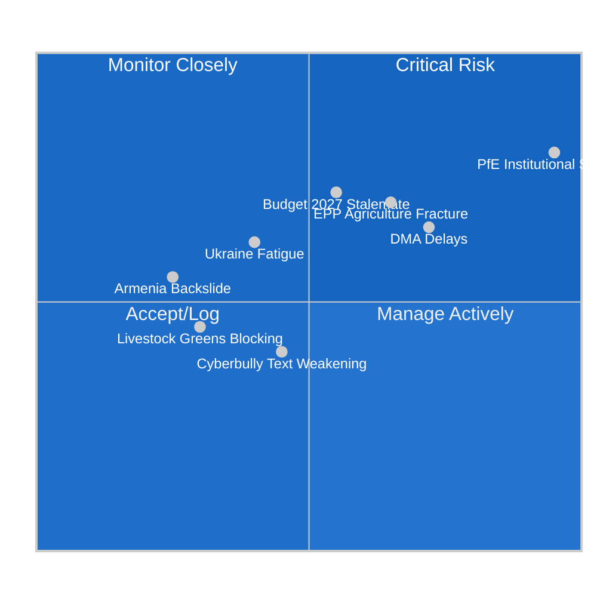
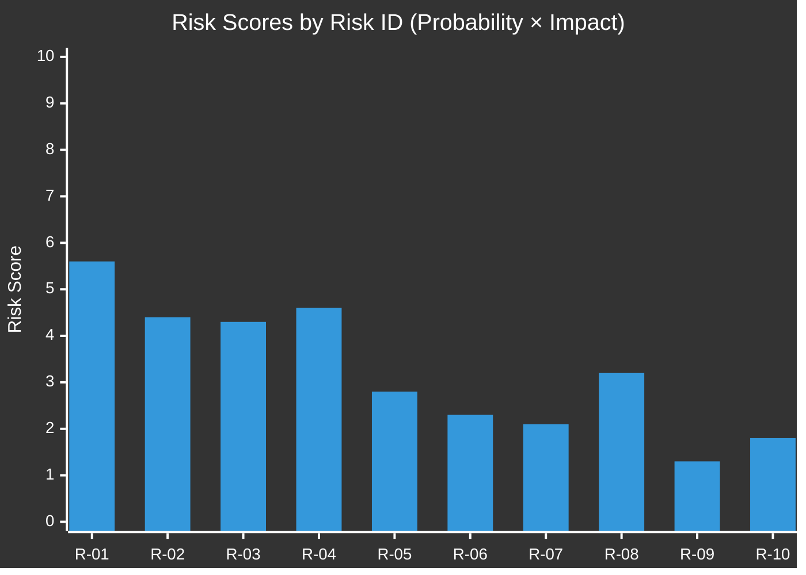

<!-- SPDX-FileCopyrightText: 2024-2026 Hack23 AB -->
<!-- SPDX-License-Identifier: Apache-2.0 -->

# Risk Matrix — EP Motions · 2026-05-08

**Run date:** 2026-05-08 | **Plenary:** Strasbourg, 28–30 April 2026
**Methodology:** Multi-dimensional risk assessment per `political-risk-methodology.md`

---

## Risk Summary Overview

---

## Risk Register

| Risk ID | Risk Description | Probability | Impact | Risk Score | Tier |
|---------|-----------------|-------------|--------|------------|------|
| R-01 | PfE institutional erosion achieves budget cuts in 2027 | 0.70 | HIGH (8/10) | 5.6 | 🔴 CRITICAL |
| R-02 | Budget 2027 negotiations stall — MFF breach | 0.55 | HIGH (8/10) | 4.4 | 🔴 CRITICAL |
| R-03 | DMA enforcement delays embolden Big Tech non-compliance | 0.72 | MEDIUM (6/10) | 4.3 | 🟠 HIGH |
| R-04 | EPP agricultural/environmental fracture deepens in EP10 Year 2 | 0.65 | HIGH (7/10) | 4.6 | 🟠 HIGH |
| R-05 | Ukraine accountability consensus erodes over 2026-2027 | 0.40 | HIGH (7/10) | 2.8 | 🟡 MEDIUM |
| R-06 | Cyberbullying resolution text too weak to drive legislative follow-up | 0.45 | MEDIUM (5/10) | 2.3 | 🟡 MEDIUM |
| R-07 | ECR splits further on Ukraine/ICC — emboldening PfE on defence | 0.35 | MEDIUM (6/10) | 2.1 | 🟡 MEDIUM |
| R-08 | Livestock motion creates precedent against environmental agriculture standards | 0.45 | MEDIUM-HIGH (7/10) | 3.2 | 🟡 MEDIUM |
| R-09 | Patryk Jaki immunity ruling challenged — diplomatic incident with Poland | 0.25 | MEDIUM (5/10) | 1.3 | 🟢 LOW |
| R-10 | Haiti trafficking urgency fails to trigger EU policy follow-through | 0.60 | LOW (3/10) | 1.8 | 🟢 LOW |

---

## Risk 1 Deep Dive: PfE Institutional Budget Risk (CRITICAL)

**Risk ID:** R-01 | **Probability:** 0.70 | **Impact:** HIGH

### Risk Pathway

PfE (85 seats) + ESN (27 seats) = 112 seats of consistent anti-institutional voting. To achieve budget cuts on democracy promotion, PfE needs additional votes from:
- ECR (81 seats): Partial alignment on limiting Commission discretion
- EPP right flank (est. 15-20 seats): Sympathetic to limiting non-governmental organisation funding

If PfE/ECR/EPP right flank forms a budget amendment coalition = ~200+ seats. Still short of majority (360), but sufficient to:
1. Force roll-call votes on specific line items, creating political exposure for EPP centrists
2. Send institutional signal to Commission to self-censor democracy programme spending
3. Create precedent for 2028-2034 MFF negotiations where budget architecture is re-set

**Risk materialisation date:** September 2026 (first draft budget committee session)

### Risk Mitigation

- EPP leadership (Weber) must publicly commit to defending democracy promotion funding
- S&D/Renew/Greens must coordinate counter-amendment packages
- Commission must demonstrate independence in managing civil society grants
- Parliament Legal Service should assess limits of budget conditionality for political speech

---

## Risk 4 Deep Dive: EPP Agricultural Fracture (HIGH)

**Risk ID:** R-04 | **Probability:** 0.65 | **Impact:** HIGH

### The EPP Coalition Mathematics Problem

EPP has 185 seats. A typical EPP internal split on agricultural/environmental issues:
- Agricultural bloc: ~65 MEPs (Germany south, Poland, Hungary, Spain, Romania)
- Environmental accommodationists: ~45 MEPs (Germany north, Netherlands, Belgium, Nordic)
- Swing/neutral: ~75 MEPs

If EPP agricultural bloc votes with ECR/PfE and accommodationists abstain or vote with S&D/Greens/Renew, the typical outcome:
- Agricultural bloc + ECR + PfE = 65 + 81 + 85 = 231 votes (well short of 360 majority)
- BUT: If swing EPP MEPs join = 231 + 75 = 306 (still short)
- Requires Renew defectors or S&D agricultural MEPs to cross the line

**The implication:** No agricultural motion can pass in EP10 without either (a) EPP unity behind a compromise, or (b) S&D/Renew agricultural MEPs overriding their group line. This structural arithmetic explains why every agricultural vote in EP10 is a hard negotiation.

**Fracture risk:** If EPP agricultural bloc repeatedly defects to ECR/PfE for agricultural votes and EPP leadership tolerates this, the functional group identity weakens — creating risk for EPP's ability to hold together on other dossiers.

---

## Risk Mitigation Strategies

| Risk | Mitigation Actor | Mechanism | Timeline |
|------|-----------------|-----------|----------|
| R-01 PfE budget | EPP + S&D + Renew | Explicit pre-commitment on democracy funding protection | Before Sept 2026 budget committee |
| R-02 Budget 2027 | EP Budget Committee | Early trilogue engagement with Council | May-July 2026 |
| R-03 DMA delays | Parliament IMCO | Budget conditionality + written questions to Commissioner | Quarterly |
| R-04 EPP fracture | EPP group leadership | Internal group caucus on agricultural/environmental positions | Before next plenary |
| R-05 Ukraine fatigue | Foreign Affairs Committee | Structured briefings on atrocity documentation | Monthly |
| R-08 Livestock precedent | ENVI committee | Environmental impact assessment of moratorium language | Before CAP reform vote |

---

## Risk Score Chart

---

## Confidence Notes

- 🟢 HIGH: Structural probability assessments based on EP group composition data and precedent
- 🟡 MEDIUM: Impact estimates based on comparable EP9/EP10 policy outcomes
- 🔴 INFERENCE: Specific probability numbers are analytical estimates, not statistical measurements
