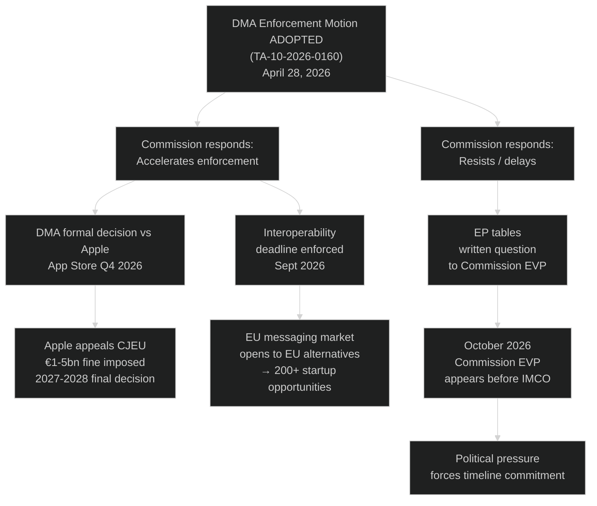
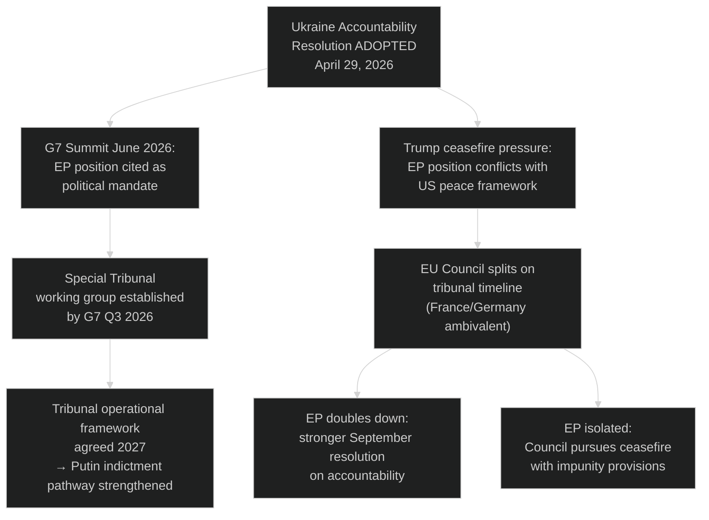
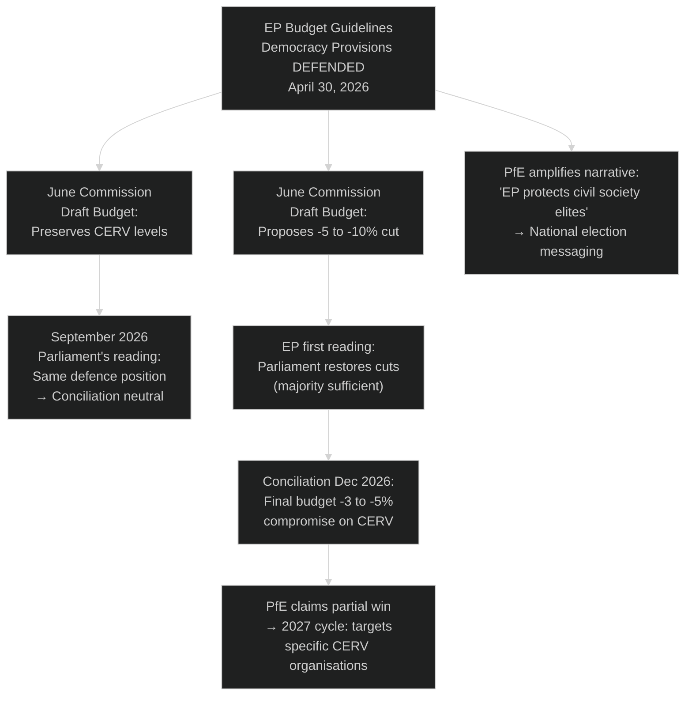

<!-- SPDX-FileCopyrightText: 2024-2026 Hack23 AB -->
<!-- SPDX-License-Identifier: Apache-2.0 -->

# Consequence Trees — EP Motions · 2026-05-08

**Run date:** 2026-05-08 | **Methodology:** Decision tree consequence analysis

---

## Consequence Tree 1: DMA Enforcement Motion (TA-10-2026-0160)

**Key branch:** The Commission's response is the pivotal fork. EP has no direct enforcement authority but its political credibility creates de facto pressure on Commission DG COMP.

**Probability assessment:**
- Commission Accelerates: 55% (IMCO track record of successful pressure)
- Commission Resists: 45% (DG COMP has institutional independence; Commissioner may prefer gradualism)

---

## Consequence Tree 2: Ukraine Accountability Resolution (TA-10-2026-0161)

**Key uncertainty:** The Trump-Zelensky ceasefire pressure is the highest-probability external shock to this consequence tree.

---

## Consequence Tree 3: Budget Democracy Funding Battle (TA-10-2026-0112)

**Long-term consequence:** Even if EP wins every budget battle, PfE wins the narrative war if civil society funding becomes associated with "elite protection." The budget fight is simultaneously a policy battle and a political communication contest.

---

## Confidence: 🟡 MEDIUM — Consequence trees are scenario projections; actual consequences depend on political decisions not yet made.
