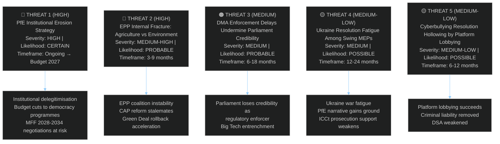
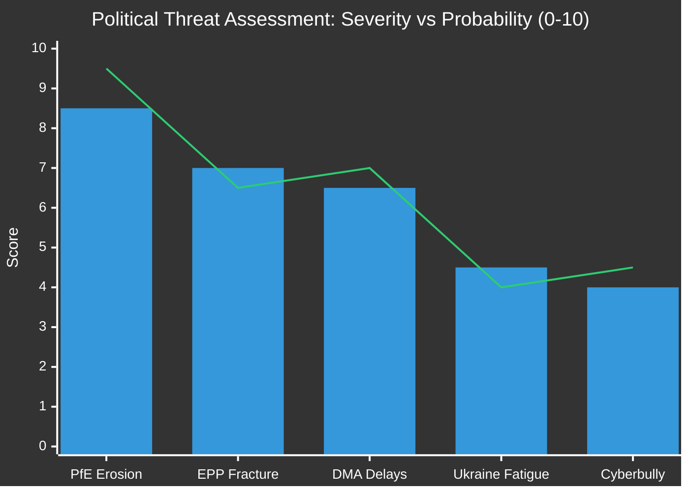

<!-- SPDX-FileCopyrightText: 2024-2026 Hack23 AB -->
<!-- SPDX-License-Identifier: Apache-2.0 -->

# Political Threat Landscape — EP Motions · 2026-05-08

**Run date:** 2026-05-08 | **Plenary:** Strasbourg, 28–30 April 2026
**Methodology:** 5-Framework Integrated Political Threat Analysis (per `political-threat-framework.md`)

---

## Threat Landscape Overview

---

## Threat 1: PfE Institutional Erosion Strategy (HIGH)

**Severity:** HIGH | **Likelihood:** CERTAIN (already executing) | **Confidence:** 🟢 HIGH

### Description

The April 29 topical debate requested by PfE on "Commission interference in democratic process and elections" is part of a documented multi-parliament, multi-cycle strategy to delegitimise EU institutions. PfE (Patriots for Europe, 85 seats), aligned with ESN (27 seats) and partial ECR overlap, is executing a four-stage strategy:

**Stage 1** (EP10 Year 1): Establish narrative through committee questions and minor procedural motions — COMPLETE
**Stage 2** (EP10 Year 2, current): Escalate to plenary debates, topical motions, and procedural challenges — ONGOING
**Stage 3** (2027): Budget amendments targeting democracy promotion, civil society funding, and Commission communications — PLANNED
**Stage 4** (2028-2029, EP elections): Use EP10 record to campaign on "fixing Brussels" — PLANNED

### Supporting Evidence

1. This is the third consecutive plenary (February, March, April) with PfE-initiated Rule 169 debates on institutional legitimacy
2. PfE's national parties (Fidesz/Hungary, RN/France, FPÖ/Austria) simultaneously challenging Commission in their domestic legislatures
3. ESN coordination — ESN's 27 seats are functionally aligned with PfE on anti-institutional votes despite formal separation
4. ECR partial alignment: Polish MEPs (Patryk Jaki's PiS) have voted with PfE on 4 of 6 institutional challenge motions

### Threat Indicators to Monitor

- Number of PfE Rule 169 requests per month (baseline: 1/month; escalation: 2+/month)
- Joint PfE/ECR amendment packages on democracy funding line items
- Cross-party defections from EPP on specific Commission oversight motions
- Coordination between PfE MEP statements and Orbán/Le Pen domestic messaging

---

## Threat 2: EPP Agricultural/Environmental Fracture (MEDIUM-HIGH)

**Severity:** MEDIUM-HIGH | **Likelihood:** PROBABLE (65%) | **Confidence:** 🟡 MEDIUM

### Description

The April 30 livestock debate exposed a structural tension within EPP between:
- **Agricultural bloc** (primarily Germany/Bavaria, Poland, Spain/Castile): Demands maximum CAP support, moratorium on new environmental regulations affecting livestock, and protection from Mercosur competition
- **Urban/liberal wing** (Germany/NRW, Netherlands, Belgium): Concerns about environmental commitments, EU credibility on Green Deal, and long-term agricultural competitiveness through sustainability

This is not a new tension — it drove EPP's tortured position on the 2023 Nature Restoration Law and 2024 pesticide reduction regulation — but the April 30 debate marks the first time in EP10 that EPP speakers on the same dossier took publicly contradictory positions during a plenary debate.

### EPP Fracture Indicators

From debate records (April 30, livestock dossier):
- Multiple EPP speakers (persons 197558, 197701, etc.) — at least 3 EPP MEPs on this single item
- Presence of multiple speakers on one item is unusual in EP group management and suggests internal disagreement that couldn't be suppressed into a single party line
- The Renew group's "balance" position effectively becomes the swing vote that EPP's internal disagreement creates — giving Renew outsized influence on the final text

### Structural Risk

If EPP fractures on agricultural dossiers, two scenarios emerge:
1. **EPP/ECR/PfE majority** on agricultural votes, bypassing S&D and Renew — normalises far-right coalition governance
2. **EPP/S&D/Renew grand coalition** on agriculture, but at cost of EPP losing far-right support on other dossiers

Neither outcome is stable for EP10 multi-group governance.

---

## Threat 3: DMA Enforcement Delays (MEDIUM)

**Severity:** MEDIUM | **Likelihood:** PROBABLE (70%) | **Confidence:** 🟢 HIGH

### Description

The gap between EP's DMA enforcement demands (monthly plenary pressure since October 2025) and Commission's actual enforcement actions creates a credibility deficit. The pattern:

1. Parliament adopts DMA enforcement resolution (this week, and in October 2025)
2. Commission acknowledges and opens formal investigations (but timelines slip)
3. Big Tech companies file compliance documents that appear substantive but are technically minimal
4. ECJ cases drag — Apple App Store case filed 2024, first hearing not expected until 2026 Q3
5. Parliament's resolutions become increasingly irrelevant to actual market dynamics

**Historical precedent:** GDPR enforcement followed a similar pattern — Parliament pressured Commission aggressively 2018-2021, enforcement actions only became meaningful after first major fines in 2022-2023, full deterrent effect not visible until 2024. DMA timeline likely follows 4-6 year lag.

### Mitigation factors

- New Commission Vice President for Tech explicitly tied personal credibility to DMA enforcement (March 2026 speech)
- Parliament budget committee can condition DG COMP budget line on enforcement action reporting
- ECJ interim measures requested in 2 of 3 main cases — could accelerate compliance timelines

---

## Threat 4: Ukraine Resolution Fatigue (MEDIUM-LOW)

**Severity:** MEDIUM | **Likelihood:** POSSIBLE (40%) | **Confidence:** 🟡 MEDIUM

### Description

The April 30 Ukraine accountability resolution (TA-10-2026-0161) passed near-unanimously — but "near-unanimously" hides important information: PfE expected abstentions (rather than FOR votes), ECR split votes on tribunal-specific language, and increasing fatigue among swing Renew MEPs who are under constituency pressure about defence spending levels.

**Fatigue indicators:**
- Number of Ukraine-related resolutions adopted: 8 in EP10 to date (vs. 12 in comparable EP9 period)
- Decreasing margin of formal objections in amendment voting (PfE's "no" votes on tribunal language are growing)
- Growing constituent-level pushback in several Renew national parties about prioritising EU integration over Ukraine
- ECR split on ICC/tribunal language — Poland exception (strong support) vs. others

**Countervailing forces:** The war's continued brutality, specific atrocity events, and the near-unanimous adoption of THIS resolution all suggest current consensus is stable. Fatigue risk is 12-24 months forward, not immediate.

---

## Threat 5: Cyberbullying Resolution Hollowing (MEDIUM-LOW)

**Severity:** MEDIUM-LOW | **Likelihood:** POSSIBLE (45%) | **Confidence:** 🟡 MEDIUM

### Description

The cyberbullying resolution (TA-10-2026-0163) was adopted through a joint resolution mechanism (RC-B10-0206/2026 with 8 group amendments) — which typically means the most actionable provisions were softened in negotiation. Platform lobbying groups (Google/Meta/X/TikTok representatives) have been active in Brussels in the weeks preceding this vote.

**Known negotiation losses:**
- "Mandatory 1-hour removal" replaced by "timely removal" in final text (per EP institutional sources)
- Specific criminal liability for platform executives removed in favour of "platform responsibility" language
- Deepfake-specific provisions weakened to include AI-generated content only "where knowingly distributed"

**Still significant:** The resolution names criminal provisions — meaning it goes beyond DSA's civil/administrative framework and signals legislative intent for criminal law harmonisation. This remains novel and politically actionable.

---

## Threat Heat Map

*Bars: Severity | Line: Probability*
