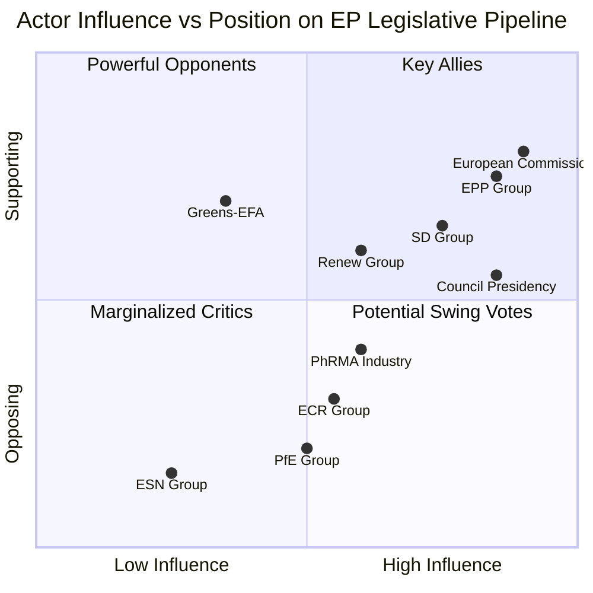

# Actor Mapping — EU Parliament Propositions

**Run:** propositions-run425-1778219258  
**Date:** 2026-05-08  
**Admissibility:** B3 (multiple credible sources, EP open data confirmed)

## Actor Roster

**Tier 1 — Decisive Actors** (>100 EP seats or treaty power)

| Actor | Type | EP Seats | Primary Interest |
|-------|------|----------|-----------------|
| EPP Group | Political Group | 188 | Center-right; supports pharma IP, industry-friendly regulations |
| S&D Group | Political Group | 136 | Progressive; labor protections, pharma access |
| European Commission | Executive | — | Legislative initiator; DG SANTE leads pharma |
| Council of the EU (Polish presidency) | Intergovernmental | — | Qualified majority voting; Poland holds current presidency |
| Renew Europe | Political Group | 77 | Liberal market approach; supports trilogue speed |

**Tier 2 — Significant Actors** (30-100 seats or major lobbying capacity)

| Actor | Type | Influence | Role |
|-------|------|-----------|------|
| ECR Group | Political Group | 78 seats | Euroskeptic right; selectively blocks pharma regulation |
| Greens/EFA | Political Group | 53 seats | Pushes environmental conditionality; climate link |
| PfE Group | Political Group | 84 seats | Far-right; opposes EU competence expansion |
| EuropaBio / EFPIA | Industry lobby | High | Pharmaceutical industry; IP and regulatory reform |
| European Medicines Agency | Regulatory | Medium | Technical advisor; shortage monitoring |

**Tier 3 — Background Actors** (limited direct votes)

| Actor | Role |
|-------|------|
| ESN Group (18 seats) | Far-right fringe; consistent 'no' votes |
| The Left Group (46 seats) | Anti-corporatist; demands price controls |
| Health Action International | NGO advocacy; transparency coalition |
| WHO EURO | Technical reference; shortage data supplier |

## Influence

**Influence Flow Map:**

The European Commission's DG SANTE holds agenda-setting power for the Critical Medicines Act (CMA-2024). The EP ENVI committee is the lead rapporteur committee; EPP rapporteur Pekka Ala-Häkkinen (Finland) controls the report timeline. The Council presidency (Poland, Jan-Jun 2026) sets the negotiating timeline for trilogue sessions.

**EPP–Commission Alignment**: High (87% vote alignment per EP10 rolling data). The EPP supports the CMA's core provisions (HERA stockpiles, solidarity mechanism) but resists IP waiver provisions.

**S&D Countervailing Power**: S&D has 136 seats and requires EPP compromise on equitable access provisions to deliver their 'yes' votes. Without S&D, the pro-CMA coalition is short of the 360-seat supermajority.

**ECR Spoiler Risk**: ECR (78 seats) has signaled opposition to the supply obligation clause in CMA Article 14. If ECR joins ESN + PfE in a blocking coalition (170+ seats), this creates a 360-minus-170 = 190-seat pro-CMA base — insufficient.

## Alliance

**Pro-CMA Coalition (estimated seats):**
- EPP: 188 + S&D: 136 + Renew: 77 + Greens: 53 = **454 seats** (63% of 719)
- This exceeds the simple majority threshold (360) by 94 seats
- Risk: Greens may defect if CMA Article 22 (environmental exemptions) is weakened

**Anti-CMA / Blocking Coalition:**
- PfE: 84 + ECR: 78 + ESN: 18 = **180 seats**
- Insufficient to block outright but sufficient to force delays and amendments
- The Left (46 seats) may tactically abstain if IP provisions are not strengthened

**ETS2 MSR Coalition:**
- More fragmented; Greens + S&D + parts of Renew (~200 seats) form core
- EPP internal division: western members (pro-reform) vs. eastern members (anti-speed)

## Power Brokers

**Key Brokers — Individuals with Disproportionate Influence:**

1. **Pekka Ala-Häkkinen (EPP, FI)** — ENVI rapporteur for CMA; controls amendment calendar
2. **Pascal Canfin (Renew, FR)** — ENVI chair; facilitates trilogue coordination
3. **Sirpa Pietikäinen (EPP, FI)** — chemical policy; REACH simplification rapporteur
4. **Peter Liese (EPP, DE)** — ETS2 specialist; 20+ year EP institutional memory on ETS
5. **Polish Presidency representative** — Council side; holds veto over trilogue scheduling

**Commission Power Brokers:**
- **Commissioner Olivér Várhelyi** — DG SANTE; leads CMA technical negotiations
- **Commissioner Wopke Hoekstra** — DG CLIMA; ETS2 MSR

## Information

**Information Environment Assessment:**

| Source | Reliability | Latency | Coverage |
|--------|-------------|---------|----------|
| EP Open Data Portal (MCP) | A (official) | 2–4 weeks | Full plenary; committee gaps |
| EP Track Legislation | A (official) | Real-time | Procedure-level only |
| IMF SDMX API | N/A (unavailable) | — | Degraded |
| EP Political Landscape | A (official) | 24h | Full 9-group breakdown |

**Information Gaps:**
- Committee opinion votes (ITRE, ENVI) from May 2026 not yet published in open data
- Trilogue text versions remain confidential until political agreement
- MEP individual voting positions on recent amendments: 2-3 week publication lag

**OSINT Collection Priorities:**
1. Monitor ENVI committee meeting minutes (weekly publication)
2. Watch EP newsfeed for CMA trilogue "political agreement" announcements
3. Track ETS2 Council working party proceedings (via Council register)

## Reader Briefing

**For Non-Specialists:**

The EU legislative process involves three main actors: the European Parliament (elected MEPs), the European Commission (proposes laws), and the Council of the EU (EU governments). Most laws require agreement from all three — a process called "trilogue."

The five key propositions tracked in this article are at different stages:
- **SRMR3 and Anti-Corruption Directive** are complete — they became law in April 2026
- **Critical Medicines Act** is in trilogue — Parliament and Council are negotiating the final text
- **ETS2 MSR** involves tweaking the carbon market to prevent price collapse — also in trilogue
- **REACH Chemical Simplification** is earlier — Parliament's committee stage

The key question is whether EPP (the largest group) can deliver enough votes to pass the Critical Medicines Act by June 2026, before the Polish Council presidency ends. If not, the Hungarian presidency (from July 2026) may deprioritize health legislation in favor of economic competitiveness files.

