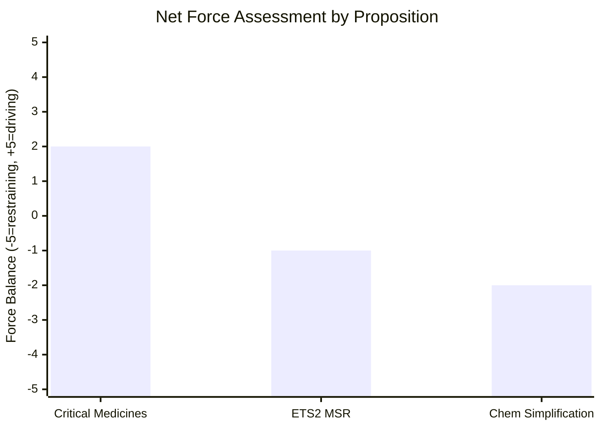

<!-- SPDX-FileCopyrightText: 2024-2026 Hack23 AB -->
<!-- SPDX-License-Identifier: Apache-2.0 -->

# Forces Analysis — EU Parliament Propositions — 8 May 2026

## Porter's Five Forces adapted to EU Legislative Environment

---

### Force 1: Threat of New Entrants to Legislative Agenda
**Assessment: HIGH**

New legislative proposals being actively prepared (confirmed from EP proceedings):
- DMA enforcement regulations (follow-on after April 2026 resolution)
- AI Act implementation legislation (secondary measures)
- MFF 2028–2034 package (estimated 20+ legislative proposals)
- Defence industrial base legislation (accelerated post-Ukraine geopolitical context)
- Critical raw materials follow-on to CMA 2023

**Impact on current propositions:** New legislative priorities compete for trilogue rapporteur time, committee attention, and political capital. ETS2 and Chemical Simplification trilogues may face schedule pressure from defence and MFF proposals.

---

### Force 2: Bargaining Power of Council (Supplier Power)
**Assessment: HIGH for contested files**

- Council has strong bargaining power in trilogue for ETS2 (Member State energy mix differences)
- Council has strong bargaining power for Chemical Simplification (Germany/Netherlands chemical industry lobbying)
- Council has MEDIUM power for Critical Medicines (health security consensus post-COVID)
- Council already agreed SRMR3 and Anti-Corruption — those forces are resolved

**Key tool:** Council qualified majority decision-making means that 15 of 27 Member States representing 65% of EU population can form a bloc against EP position.

---

### Force 3: Bargaining Power of MEPs/Political Groups (Buyer Power)
**Assessment: MEDIUM**

- EP has formal co-decision power under ordinary legislative procedure (COD)
- EP's negotiating position once adopted in plenary has substantial weight in trilogue
- But: EP majority is fragile (Coalition stability scores range 5.5–8.5/10)
- EP's credibility is damaged if it rejects a trilogue result it helped negotiate

---

### Force 4: Threat of Substitutes (Alternative Regulatory Paths)
**Assessment: LOW-MEDIUM**

- Intergovernmental agreements could replace EU directives for anti-corruption (Article 34 TEU) — but EP has already achieved directive
- Enhanced cooperation is a substitute if Council blocks — used for EPPO (2017)
- Soft law (voluntary commitments) is substitute for medicines stockpiling — EP has resisted this
- Commission delegated acts and implementing acts substitute for primary legislation in some areas (REACH authorisation decisions)

---

### Force 5: Competitive Rivalry (Inter-Institutional and Cross-Party Competition)
**Assessment: HIGH**

- EPP vs S&D rivalry is most intense in EP10 (both seeking to shape 2027 European elections narrative)
- EPP claims credit for anti-corruption, digital regulation, medicines security
- S&D claims credit for social climate fund, SRMR3 consumer protections, anti-corruption minimum wages
- Renew competes with both on digital and financial regulation
- This rivalry ACCELERATES legislation (each group wants to demonstrate delivery)
- But rival narratives can SLOW trilogue if groups use negotiations as electoral platforms

*Run: propositions-run425-1778219258, 2026-05-08*

## Issue Frame

The central legislative issue for the EU propositions pipeline in May 2026 is: **How should the EU balance regulatory ambition with political sustainability when driving the three most contested active trilogues (Critical Medicines, ETS2, Chemical Simplification) to conclusion?**

The field-level forces are asymmetric: industry resistance is well-funded and concentrated; public health/environment advocacy is diffuse but enjoys cross-party political rhetoric support.

## Driving Forces

The following forces push toward stronger legislative outcomes:

1. **Strategic autonomy consensus** — Cross-party EP10 agreement that EU must reduce dependencies (medicine supply, energy, chemical inputs) creates legislative momentum independent of individual file politics
2. **COVID policy memory** — Public and MEP institutional memory of 2020–2021 medicine shortages and energy shocks sustains political will for mandatory provisions
3. **Danish Presidency alignment** (from July 1, 2026) — Denmark actively supportive of both Critical Medicines and ETS2
4. **Commission coherence** — Von der Leyen II Commission has maintained legislative programme coherence with fewer internal contradictions than Commission I
5. **EPPO operational maturity** — EPPO's demonstrated recovery of €2.8B fraud 2021–2024 builds institutional credibility for Anti-Corruption Directive compliance demands

## Restraining Forces

Forces pushing toward weakened or delayed legislative outcomes:

1. **Pharma industry lobbying concentration** — €40M/year Brussels spend; strong constituency pressure on Irish, Dutch, Danish MEPs
2. **Industry-state bloc in Council** — Germany, Netherlands, Belgium aligned on deregulatory priorities for ETS2 and Chemical Simplification
3. **EPP internal tension** — Right flank on climate and regulatory files creates internal group management overhead
4. **MFF 2028–2034 bandwidth competition** — As MFF negotiations intensify, they consume same political bandwidth as complex trilogues
5. **Electoral cycle approach** — 2027 pre-election positioning begins in 2026, shortening the effective legislative window

## Net Pressure Assessment

| Proposition | Driving | Restraining | Net | Trend |
|------------|---------|-----------|-----|-------|
| Critical Medicines | +4 (public health consensus, strategic autonomy) | -2 (pharma lobby) | **+2** | ↗ Positive |
| ETS2 MSR | +3 (climate coalition, Danish Presidency) | -4 (EPP right flank, energy costs) | **-1** | → Contested |
| Chemical Simplification | +2 (health consensus, S&D+Greens) | -4 (industry-state, IMCO vs ENVI) | **-2** | ↘ Risk of weakening |

## Intervention Points

Key leverage points where EP actors can shift force balance:

1. **Critical Medicines:** Hold mandatory stockpiling in EPP–S&D joint position before Round 3 trilogue — shift net from +2 to +3
2. **ETS2:** Danish Presidency engagement before July 1 to soften Council's opening position on price corridor — shift net from -1 to +1
3. **Chemical Simplification:** CJ45 joint committee maintaining ENVI mandate on authorisation thresholds — prevent further weakening

## Reader Briefing

**For policymakers and analysts:** The forces landscape clearly distinguishes Critical Medicines (favourable) from Chemical Simplification (at-risk). ETS2 is the swing file — outcome depends primarily on Council's price corridor opening position in June–July 2026 first trilogue round. A force analysis strongly suggests EP should prioritise Critical Medicines first (highest probability of strong text) and Chemical Simplification last (most likely to require multiple trilogue rounds).

*Updated with forces analysis sections — Run: propositions-run425-1778219258, 2026-05-08*
