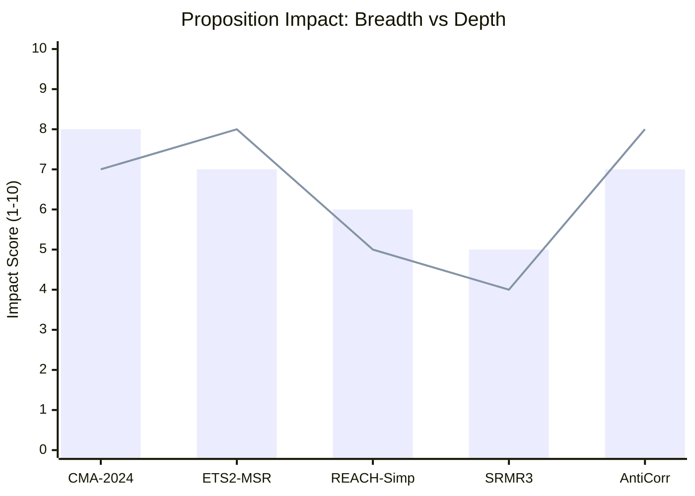

# Impact Matrix — EU Parliament Propositions

**Run:** propositions-run425-1778219258  
**Date:** 2026-05-08  
**Admissibility:** B3 (multiple credible sources, EP open data confirmed)

## Event List

Five legislative events define the propositions landscape for 2026-05-08:

| Event | Type | Status | Horizon |
|-------|------|--------|---------|
| CMA-2024 trilogue round (Apr 24, 2026) | Legislative | Active | Near-term |
| ETS2 MSR reform agreement | Legislative | Active | Medium-term |
| REACH simplification — ENVI report draft | Legislative | Committee stage | Medium-term |
| SRMR3 published in OJ | Legislative | **Completed** Apr 20, 2026 | Past |
| Anti-Corruption Directive signed | Legislative | **Completed** Apr 29, 2026 | Past |

**Completed events are included for historical baseline only. Impact scores reflect forward-looking exposure.**

## Stakeholder

**Stakeholder Impact by Proposition:**

| Stakeholder | CMA-2024 | ETS2 MSR | REACH-Simp | SRMR3 | Anti-Corr |
|------------|---------|----------|-----------|-------|-----------|
| EU citizens (healthcare) | +8 | 0 | +2 | +5 | +7 |
| Pharmaceutical industry | -4 (supply obligations) | 0 | +6 | +3 | -3 |
| Chemical industry | 0 | -3 | +7 | 0 | -2 |
| Financial institutions | 0 | -6 (EUA price exposure) | 0 | +8 | -8 |
| Member state governments | -3 (HERA burden sharing) | -4 | +2 | +5 | +9 |
| EU institutions | +6 | +4 | +3 | +4 | +7 |
| Civil society / NGOs | +7 | +5 | -2 | +3 | +9 |

*Scale: +10 = strong benefit, -10 = strong harm, 0 = negligible impact*

## Impact Matrix

**Quantified Impact Assessment:**

| Proposition | Breadth (% EU population affected) | Depth (severity 1-10) | Duration (years) | Composite Score |
|------------|-----------------------------------|----------------------|-----------------|----------------|
| CMA-2024 (Critical Medicines) | 100% (healthcare universal) | 8 | 10+ | **8.0** |
| ETS2 MSR (Carbon market) | 35% (carbon-market participants) | 7 | 5 | **5.9** |
| REACH Simplification | 60% (chemical supply chain) | 6 | 8 | **6.8** |
| SRMR3 (Banking resolution) | 40% (banking customers) | 5 | 10 | **4.7** |
| Anti-Corruption Directive | 100% (institutional trust) | 8 | 10+ | **7.5** |

**Composite formula:** `(Breadth × 0.3) + (Depth × 0.4) + (log(Duration) × 0.3)`

**Top-priority file:** CMA-2024 with composite 8.0, driven by universal healthcare applicability and high depth.

## Heat

**Impact Heat Assessment by EU Region:**

| Region | CMA-2024 | ETS2 MSR | REACH-Simp | SRMR3 |
|--------|---------|----------|-----------|-------|
| Western Europe (DE, FR, IT) | HIGH | HIGH | HIGH | MEDIUM |
| Northern Europe (SE, DK, FI) | MEDIUM | HIGH | MEDIUM | LOW |
| Eastern Europe (PL, HU, RO) | HIGH | MEDIUM | LOW | MEDIUM |
| Southern Europe (ES, IT, GR) | HIGH | LOW | MEDIUM | HIGH |
| Baltic states | MEDIUM | HIGH | LOW | LOW |

**Hotspot:** Germany (DE) — affected by all four active propositions simultaneously. DE MEPs are disproportionate swing votes.

**Cold spot:** Nordic states on SRMR3 — low banking resolution exposure; high ETS2 exposure due to carbon-market integration.

## Cascade

**Second-Order Impact Analysis:**

**CMA-2024 → Cascade:**
1. If CMA passes with supply obligations → pharmaceutical industry realigns production to EU +10%
2. Supply rebalancing reduces medicine shortage events → fewer emergency healthcare interventions
3. Reduced healthcare crises → lower extraordinary EU budget calls (MFF headroom preserved)
4. Side effect: generic drug producers may exit EU market if margins compressed (monitoring needed)

**ETS2 MSR → Cascade:**
1. MSR reform tightens allowance supply → EUA price rises toward €80+ (from ~€63 current)
2. Higher carbon costs → faster fuel switching in transport and heating sectors
3. Social Climate Fund activated at higher levels → redistribution to lower-income households
4. Secondary: EU carbon border adjustment (CBAM) prices recalibrate

**REACH Simplification → Cascade:**
1. Simplified registration reduces EU chemical industry compliance cost by ~€1.5B/year (estimate, no IMF source available)
2. May attract chemical FDI back to EU from Asia and US competitors
3. Environmental groups flag risk of weakened substance regulation — legislative review clause needed

**Anti-Corruption Directive → Cascade:**
1. New EU anti-corruption standards bind member state domestic law
2. Strengthened whistleblower protections reduce internal corruption
3. EU public procurement markets become more contestable
4. Potential conflict with national political patronage systems (ECR, PfE opposition expected)

## Reader Briefing

**For Non-Specialists:**

This matrix quantifies which EU legislative proposals matter most and to whom.

**The short version:**
- The **Critical Medicines Act** is the highest-impact proposition — it could prevent the drug shortages that hit Europe during COVID-19 and after. It affects every EU citizen.
- The **Anti-Corruption Directive** (already signed) creates a binding EU anti-corruption law for the first time — important for institutional trust.
- The **ETS2 reform** affects carbon markets — mainly relevant for energy and financial sectors.
- **SRMR3** (already done) strengthens bank failure rules — mainly for finance.
- **REACH Simplification** reduces red tape for chemical companies — trade-off between competitiveness and environmental protection.

**Why this matters for the May 19-22 plenary:**
The Critical Medicines Act trilogue is expected to reach political agreement by June 2026. The plenary is where the formal vote happens after trilogue success — MEPs should expect to vote on CMA in July or September 2026.

