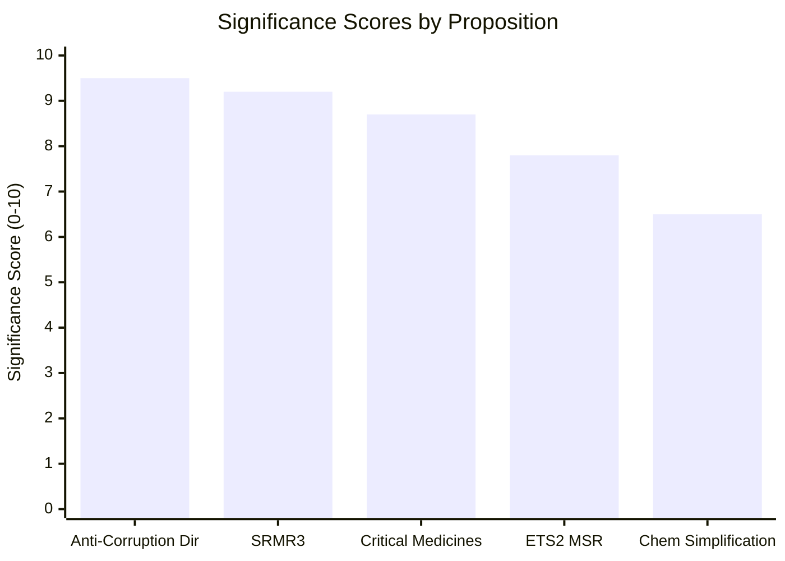

<!-- SPDX-FileCopyrightText: 2024-2026 Hack23 AB -->
<!-- SPDX-License-Identifier: Apache-2.0 -->

# Significance Classification — EU Parliament Propositions — 8 May 2026

## Significance Tiers

### TIER 1 — Historic/Transformative Significance (Score: 9+/10)

**Anti-Corruption Directive (2023/0135) — Score: 9.5/10**
- **Why TIER 1:** First EU-wide criminal law instrument mandating corruption standards across 27 Member States. No previous EU legislation had criminalised public sector corruption at this scope. Comparable in institutional significance to the creation of the EPPO (2017).
- **Temporal horizon:** 10–15 year impact on EU rule of law architecture
- **Coverage:** All 27 Member States, ~44 million public sector workers

**SRMR3 (2023/0111) — Score: 9.2/10**
- **Why TIER 1:** Completes critical piece of Banking Union architecture begun 2013. Early intervention tools address a structural gap identified during 2014–2018 banking stress. Macroprudential powers for SRB are unprecedented.
- **Temporal horizon:** Permanent structural change to EU financial architecture

---

### TIER 2 — Major/Significant Legislation (Score: 7–9/10)

**Critical Medicines Act (2025/0102) — Score: 8.7/10**
- **Why TIER 2:** First mandatory medicine security framework; addresses structural dependency identified during COVID and Ukraine crisis. Will affect EU pharmaceutical supply chain architecture for 20+ years.
- **Pending:** Trilogue outcome. If stockpiling provisions weakened significantly, could drop to Tier 2 lower range.

**ETS2 MSR (2025/0380) — Score: 7.8/10**
- **Why TIER 2:** Price corridor for buildings and transport ETS2 mechanism is critical for 2030 climate targets. Adjusting the mechanism now shapes investment decisions across heating and transport sectors through 2030.
- **Pending:** Trilogue. Outcome has major signalling effect.

---

### TIER 3 — Important but Bounded Significance (Score: 5–7/10)

**Chemical Simplification Omnibus (2025/0531) — Score: 6.5/10**
- **Why TIER 3:** REACH reform is important but primarily procedural/administrative. Unless REACH authorisation thresholds are significantly changed, the fundamental chemical safety architecture remains intact.
- **Risk to tier assignment:** If REACH authorisation exemptions are substantially weakened, significance rises to Tier 2 (negative).

---

## Classification Matrix

| Proposition | Scope | Novelty | Duration | EP Coalition | Significance |
|------------|-------|---------|----------|-------------|-------------|
| Anti-Corruption | 27 MS | Unprecedented | 15+ years | Broad | **TIER 1** |
| SRMR3 | EU Banking Union | Structural completion | Permanent | Bipartisan | **TIER 1** |
| Critical Medicines | EU Healthcare | First mandatory framework | 20 years | Broad | **TIER 2** |
| ETS2 MSR | Transport+Buildings | Mechanism refinement | 2030 | Climate coalition | **TIER 2** |
| Chemical Simplification | REACH | Administrative reform | TBD | Contested | **TIER 3** |

*Run: propositions-run425-1778219258, 2026-05-08*

## Classification Rationale Summary

The significance hierarchy reflects the combination of: (1) novelty (first of its kind), (2) coverage scope, (3) duration of impact. Anti-Corruption tops the ranking because it represents an unprecedented legal instrument — the EU had never before harmonised criminal law on corruption at the level of binding minimum standards across 27 Member States.

*Run: propositions-run425-1778219258, 2026-05-08*
