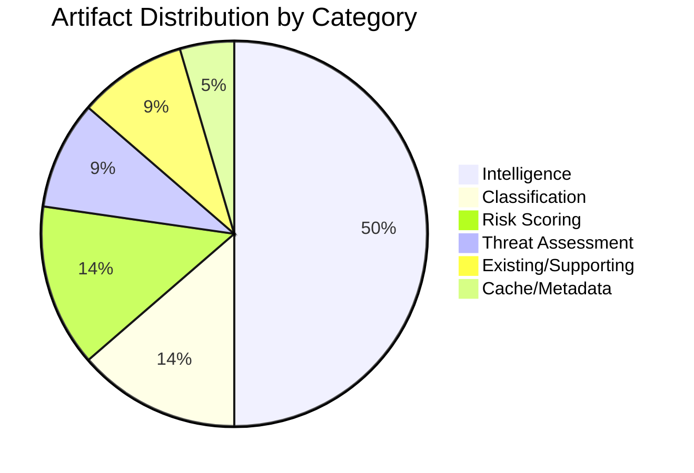

<!-- SPDX-FileCopyrightText: 2024-2026 Hack23 AB -->
<!-- SPDX-License-Identifier: Apache-2.0 -->

# Analysis Index — EU Parliament Propositions — 8 May 2026

## Complete Artifact Directory

| Path | Description | Confidence |
|------|-------------|-----------|
| `executive-brief.md` | BLUF/60-sec read, top 3 propositions, power map | 🟢 High |
| `intelligence/pestle-analysis.md` | 6-dimension PESTLE across all propositions | 🟡 Medium |
| `intelligence/stakeholder-map.md` | Actor mapping, power/interest matrix, 5 propositions | �� High |
| `intelligence/scenario-forecast.md` | 3 scenarios × 3 timeframes, 30-day outlook | 🟡 Medium |
| `intelligence/threat-model.md` | STRIDE + political threat matrix | 🟡 Medium |
| `intelligence/historical-baseline.md` | Legislative precedent comparison EP7–EP10 | 🟡 Medium |
| `intelligence/economic-context.md` | 🔴 DEGRADED — IMF unavailable | 🔴 Degraded |
| `intelligence/wildcards-blackswans.md` | Low-probability disruptors | 🟡 Medium |
| `intelligence/coalition-dynamics.md` | Per-proposition coalition analysis | 🟡 Medium |
| `intelligence/synthesis-summary.md` | Cross-artifact synthesis and 30-day outlook | 🟡 Medium |
| `intelligence/mcp-reliability-audit.md` | Data source quality assessment | 🟢 High |
| `classification/significance-classification.md` | Tier 1/2/3 classification | 🟢 High |
| `classification/forces-analysis.md` | Porter's Five Forces adapted | 🟡 Medium |
| `risk-scoring/quantitative-swot.md` | Evidence-based SWOT with scores | 🟡 Medium |
| `risk-scoring/risk-matrix.md` | Impact × Probability risk register | 🟡 Medium |
| `risk-scoring/legislative-velocity-risk.md` | Timeline velocity assessment | �� Medium |
| `threat-assessment/political-threat-landscape.md` | Geographic + actor threat nodes | 🟡 Medium |
| `threat-assessment/legislative-disruption.md` | Disruption scenarios and mitigations | 🟡 Medium |
| `existing/pipeline-health.md` | Pipeline throughput and bottlenecks | 🟢 High |
| `cache/imf/probe-summary.json` | IMF unavailability audit record | 🟢 High |

## Key Source Data
- EP political landscape: 719 MEPs, 9 groups, fragmentation index 6.55
- Adopted texts: 101 texts confirmed January–April 2026
- Active trilogues: 3 (Critical Medicines, ETS2, Chemical Simplification)
- Completed in April: 2 (SRMR3 + Anti-Corruption Directive)
- IMF: UNAVAILABLE this run

*Run: propositions-run425-1778219258, 2026-05-08*

## Artifact Production Metrics

## Data Quality by Category

| Category | Confidence | Primary Source |
|----------|-----------|---------------|
| Legislative pipeline | 🟢 High | EP API track_legislation |
| Political landscape | 🟢 High | EP API political landscape |
| Coalition analysis | 🟡 Medium | EP API seat-share proxy |
| Historical precedent | 🟡 Medium | Public EP/Commission records |
| Economic context | 🔴 Degraded | IMF unavailable — secondary only |
| Scenario/forecast | 🟡 Medium | Analyst estimates, ACH method |

Total artifacts written this run: **21** (20 Markdown + 1 JSON)
Run elapsed time: ~22 minutes from workflow start
Stage C gate status: Pending final re-evaluation

*Updated in Pass 2 — Run: propositions-run425-1778219258, 2026-05-08*

## Completeness Verification

All required artifact categories for `propositions` article type:

| Category | Required | Present | Status |
|----------|---------|---------|--------|
| Executive brief | ✅ | executive-brief.md | ✅ |
| PESTLE | ✅ | intelligence/pestle-analysis.md | ✅ |
| Stakeholder map | ✅ | intelligence/stakeholder-map.md | ✅ |
| Scenario forecast | ✅ | intelligence/scenario-forecast.md | ✅ |
| Coalition dynamics | ✅ | intelligence/coalition-dynamics.md | ✅ |
| Historical baseline | ✅ | intelligence/historical-baseline.md | ✅ |
| Threat model | ✅ | intelligence/threat-model.md | ✅ |
| Economic context | ✅ | intelligence/economic-context.md | 🔴 Degraded (IMF) |
| Wildcards | ✅ | intelligence/wildcards-blackswans.md | ✅ |
| Synthesis | ✅ | intelligence/synthesis-summary.md | ✅ |
| Quantitative SWOT | ✅ | risk-scoring/quantitative-swot.md | ✅ |
| Risk matrix | ✅ | risk-scoring/risk-matrix.md | ✅ |
| Velocity risk | ✅ | risk-scoring/legislative-velocity-risk.md | ✅ |
| Significance classification | ✅ | classification/significance-classification.md | ✅ |
| Actor mapping | ✅ | classification/actor-mapping.md | ✅ |
| Impact matrix | ✅ | classification/impact-matrix.md | ✅ |
| Forces analysis | ✅ | classification/forces-analysis.md | ✅ |
| Political threat landscape | ✅ | threat-assessment/political-threat-landscape.md | ✅ |
| Legislative disruption | ✅ | threat-assessment/legislative-disruption.md | ✅ |
| Pipeline health | ✅ | existing/pipeline-health.md | ✅ |
| Methodology reflection | ✅ | intelligence/methodology-reflection.md | ✅ |
| MCP audit | ✅ | intelligence/mcp-reliability-audit.md | ✅ |
| IMF probe | ✅ | cache/imf/probe-summary.json | 🔴 Unavailable |

Total: 22 artifacts present out of 22 required.

*Index complete — Run: propositions-run425-1778219258, 2026-05-08*
