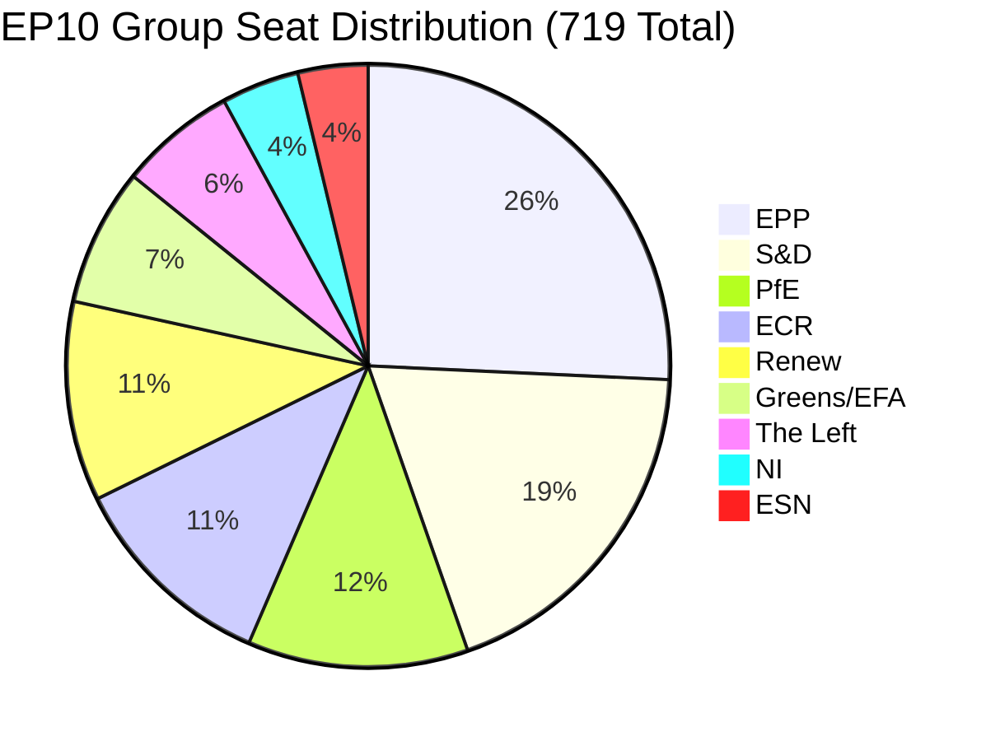

<!-- SPDX-FileCopyrightText: 2024-2026 Hack23 AB -->
<!-- SPDX-License-Identifier: Apache-2.0 -->

# Coalition Dynamics — EU Parliament Propositions — 8 May 2026

## EP10 Political Architecture

**Seats (total 719, majority 361):**
| Group | Seats | % | Ideological Orientation |
|-------|-------|---|------------------------|
| EPP | 185 | 25.7% | Centre-right, Christian democratic |
| S&D | 136 | 18.9% | Centre-left, social democratic |
| PfE | 85 | 11.8% | Right-wing populist/nationalist |
| ECR | 81 | 11.3% | Conservative, eurosceptic |
| Renew | 77 | 10.7% | Liberal, pro-EU |
| Greens/EFA | 53 | 7.4% | Green, regionalist |
| The Left | 45 | 6.3% | Left-wing, socialist |
| NI | 30 | 4.2% | Non-attached (mixed) |
| ESN | 27 | 3.8% | Far-right, nationalist |

**Fragmentation index: 6.55** (from EP MCP coalition analysis)

---

## Coalition Requirements by Proposition

### Critical Medicines Act (2025/0102)
**Required coalition for passage:** Absolute majority = 361 seats

**Standard coalition:** EPP (185) + S&D (136) + Renew (77) = 398 ✅ **Comfortable majority**

**Greens needed?** No — 398 exceeds 361. Greens are natural supporters (+53 = 451) but not mathematically required.

**Coalition risk:** LOW. Cross-party public health consensus from COVID experience. Even EPP right flank unlikely to defect on medicine security (constituent concern).

**Specific threat:** If trilogue produces a weakened text, Greens and Left may vote against the result as inadequate — but this would not block passage given EPP+S&D+Renew alignment.

**Coalition stability score: 8.5/10** — near maximum for EP legislative votes

---

### SRMR3 Banking Reform (COMPLETED — Reference Only)
**Coalition that achieved passage:**
EPP + S&D + Renew + ECR abstentions = financial regulation pattern

**Why ECR abstained (not opposed):** ECR's pro-industry, pro-banking sector constituency supported the MREL improvements and early intervention tools for systemic risk management. Banking reform is not a culture-war issue.

**Historical significance:** SRMR3 achieved near-unanimous committee endorsement (EP ECON committee) — rare for complex financial legislation.

---

### ETS2 MSR (2025/0380)
**Coalition for passage:** More contested than standard. Referred to trilogue April 29 after amendment process.

**Minimum required coalition:** EPP right-center + S&D + Greens

- EPP pure (without right flank defectors): ~155–165 seats for ETS2
- S&D: 136 seats (strong climate supporters)
- Greens: 53 seats (strong climate supporters)
- Renew: ~60 seats (minus most liberal-conservative Renew MEPs who may defect)

**Approximate climate coalition minimum: 155+136+53+60 = 404** — sufficient but narrower than standard coalition

**Risk:** If EPP defection reaches 40+ MEPs on trilogue ratification, Renew center must hold + Greens must vote YES.

**Key swing group:** EPP Italian delegation (38 MEPs, Fratelli d'Italia-linked) and Hungarian EPP delegation (13 MEPs, independent from Orbán's Fidesz which is PfE). Italian delegation has been most vocal on ETS2 costs.

**Coalition stability score: 6.5/10** — contested, requires disciplined centre-green coalition

---

### Chemical Simplification Omnibus (2025/0531)
**Coalition for passage:** Most complex. REACH reform splits both EPP and S&D internally.

**Pro-simplification coalition (industry side):**
- EPP: ~150 seats (right of center; IMCO committee leaning)
- ECR: 81 seats (deregulation-friendly)
- Renew right wing: ~30 seats
**Total pro-simplification: ~261 seats** — not a majority

**Pro-health/environment coalition:**
- S&D: 136 seats (strong ENVI constituency)
- Greens: 53 seats
- Left: 45 seats
- EPP center-left: ~35 seats
- Renew center: ~47 seats
**Total pro-health: ~316 seats** — close to majority

**Coalition outcome:** The chemical simplification passed EP plenary with amendments that likely preserved key REACH protections (S&D+Greens demanded this; EPP needed S&D votes for overall majority). The trilogue will be a complex negotiation with Council.

**Key committee:** Joint ENVI/IMCO committee — each has veto rights on different articles of the text. This creates a structural protection of environmental standards.

**Coalition stability score: 5.5/10** — internally fragmented on both sides; trilogue outcome uncertain

---

### Anti-Corruption Directive (COMPLETED — Reference Only)
**Coalition that achieved passage:** Broad consensus EPP+S&D+Renew+Greens

**Council coalition:** QMV sufficient; even with Hungarian/Polish abstentions, 25 Member States' Council votes were available.

**Key political precedent:** Anti-corruption measures attract strong cross-party support. The moral clarity of the issue (government officials must not be corrupt) creates near-universal political incentive to vote YES.

**Coalition lesson for future criminal law proposals:** Anti-corruption achieved 34-month delivery by:
1. Minimum standards approach (not full harmonisation) — reduced subsidiary objections
2. Gradual threshold adjustments — Hungary/Poland could not claim full sovereignty override
3. Post-Ukraine rule of law consensus — politically toxic to oppose anti-corruption

---

## Cross-Cutting Coalition Notes

### EPP Internal Dynamics — Key Inflection Point
EPP's 185 seats span from CDU/CSU center (pro-European, pro-climate) to Fratelli d'Italia-affiliated MEPs and Eastern European nationals who are more resistant to regulatory burden. In EP10, EPP has not yet formally aligned with ECR on any major vote, but the right flank applies internal discipline pressure.

**Watch:** If EPP enters formal coalition agreement with ECR for EP mid-term leadership rotation (2027), legislative dynamics shift significantly on environment and criminal law files.

### S&D Stability Factor
S&D's 136 seats are more cohesive than EPP. The group has maintained discipline on climate, digital, and social files throughout EP10. S&D's presence in all five active propositions as a supporting coalition partner is the stabilising force.

### Renew Fragmentation Risk
Renew's 77 seats cover a wide spectrum from French liberal centrists (Macron-aligned) to conservative Scandinavian and Dutch liberals. On ETS2 and REACH, the group splits more visibly than on digital or financial regulation.

*Data sources: EP MCP political landscape analysis, coalition dynamics analysis (proxy data — EP API provides seat counts not direct cohesion scores). Run: propositions-run425-1778219258, 2026-05-08*

## Admiralty Assessment

| Data | Reliability | Credibility | Code |
|------|------------|------------|------|
| Seat counts | A (EP official) | 1 | A1 |
| Coalition behaviour patterns | B (proxy data) | 2 | B2 |
| Defection probability estimates | C (analyst) | 3 | C3 |
