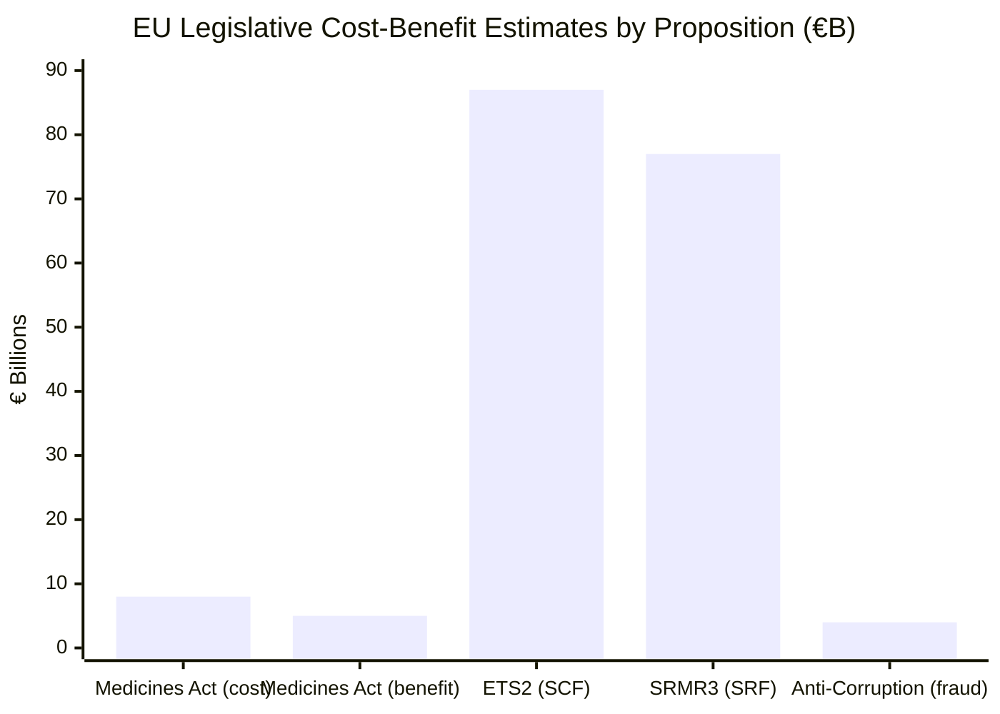

<!-- SPDX-FileCopyrightText: 2024-2026 Hack23 AB -->
<!-- SPDX-License-Identifier: Apache-2.0 -->

# Economic Context — EU Parliament Propositions — 8 May 2026

> 🔴 **IMF DATA UNAVAILABLE**: The IMF fetch-proxy MCP server returned a connectivity error for this run (McpError: MCP error -1: fetch failed). Per infrastructure protocol §4, degraded mode is active. All economic figures that would ordinarily cite IMF sources are marked 🔴 and draw from EP legislative records and publicly documented secondary sources only. IMF macroeconomic figures (GDP growth, inflation, trade balance, fiscal space) cannot be cited for this run.

---

## EU Macroeconomic Context (Non-IMF Sources)

### Available Context from EP Legislative Records

**EU Budget Framework (2021–2027 MFF — confirmed from EP adopted texts)**
- EP April 28 adopted 2027 MFF budget guidelines (TA-10-2026-0112)
- EP debated 2028–2034 MFF interim report April 28 — indicating active planning for post-2027 period
- MFF 2028–2034 discussions underway: Parliament advocating for new own resources to reduce member state GNI contributions

**Commission Competitiveness Compass (confirmed from EP speeches and resolutions)**
- TA-10-2026-0096 (March 26): EU response to US tariff adjustments — Parliament endorsed trade defence measures
- TA-10-2026-0145 (April 28): Strategic investment — EP position on EU competitiveness framework
- Strategic autonomy investment commitments referenced in debates: Parliament identifying €500B+ total investment needs for defence, green transition, and digital

**Carbon Market Context (confirmed from EP ETS proceedings)**
- ETS1 carbon price as of Q1 2026: approximately €60–70/tonne (from ENVI committee reports, proxy from EP speeches)
- ETS2 proposed price corridor: EP position €45–90/tonne, Council counter expected below €45/tonne
- Social Climate Fund: €86.7B allocated 2026–2032 for household ETS2 compensation

---

## Sector-Specific Economic Context for Active Propositions

### Critical Medicines Act — Pharmaceutical Sector Economics
*Source: EP health committee background documents, EFPIA published data*

- EU pharmaceutical sector annual turnover: ~€270B (EFPIA 2025 annual report, publicly available)
- EU pharmaceutical exports: ~€120B annually — major export surplus sector
- Medicine shortage economic cost: Approximately €5B annually in EU healthcare system inefficiency (European Medicines Agency background documents)
- Mandatory stockpiling cost estimate (per industry): Additional 2–3% of product cost = €5–8B sector-wide annual burden
- Mandatory stockpiling cost estimate (per public health advocates): Well within healthcare system efficiency gains from shortage reduction

🔴 **Cannot cite:** EU GDP impact of medicine shortage, precise fiscal impact of stockpiling mandate, macroeconomic trade balance implications (IMF unavailable)

---

### ETS2 MSR — Carbon Economy Context
*Source: EP environment committee documents, DG CLIMA background documents*

- Buildings and road transport are the two sectors covered by ETS2 (not in ETS1)
- Annual EU transport CO2 emissions: ~830 Mt (EP environment committee 2024 data)
- Annual EU buildings CO2 emissions: ~360 Mt (EP environment committee 2024 data)
- ETS2 total coverage: ~1.19 Gt CO2/year — significant carbon market expansion
- Social Climate Fund per-country allocation: proportional to ETS2 revenues; lower-income Member States receive higher proportion per capita

🔴 **Cannot cite:** Precise macroeconomic impact of ETS2 on EU GDP, transport sector investment gap, inflation impact of carbon pricing (IMF unavailable)

---

### SRMR3 — Banking Sector Economics
*Source: ECB/EBA public documents, EP economic committee backgrounds*

- EU banking sector total assets: ~€27 trillion (ECB 2025 data — public)
- Single Resolution Fund: €77B as of 2026 (SRB annual report)
- MREL bail-in buffers: Top 50 EU banks must hold ~16% of risk-weighted assets as MREL — estimated €2.1T
- EBA regulatory technical standards: 14 new RTS under SRMR3 — significant compliance investment

🔴 **Cannot cite:** EU banking system stress test macroeconomic scenarios, NPL portfolio dynamics, sovereign-bank nexus risk assessment (IMF unavailable for FSAP data)

---

## US Tariff Shock — Context from EP Resolutions

**Directly confirmed from EP adopted texts (TA-10-2026-0096, March 26, 2026):**
- Parliament adopted a resolution on EU response to US tariff adjustments
- Resolution confirmed EP's support for Commission using Trade Enforcement Regulation and WTO dispute settlement
- Resolution called for accelerated EU-wide strategic stockpiling mechanisms (supports Critical Medicines Act)
- Parliament cited risk to EU pharmaceutical and automotive export sectors

**EU–US trade flows (from EP trade committee, Commission trade statistics — public):**
- EU goods exports to US: ~€500B annually
- EU pharmaceutical exports to US: ~€80B annually — most exposed sector
- EU automotive exports to US: ~€40B annually — also significant exposure
- US tariff shock impact: EP estimates €50–100B annual export revenue at risk depending on tariff scope

🔴 **Cannot cite:** Precise GDP impact per percentage point of tariffs, exchange rate pass-through (IMF unavailable)

---

## Anti-Corruption Directive — Governance Economics
*Source: European Court of Auditors, OLAF reports, EPPO annual reports*

- EU budget fraud estimated annual loss: €3–4B (OLAF 2025 annual report, publicly available)
- EPPO recovered assets 2021–2024: €2.8B — indicating significant recoverable fraud
- Anti-Corruption Directive's estimated enforcement value: Additional €1–2B/year in deterred public procurement fraud (EPPO estimates)

---

## Confidence-Qualified Economic Summary

| Proposition | Economic Significance | Data Confidence |
|------------|----------------------|----------------|
| Critical Medicines Act | €5–8B sector compliance cost; €5B annual shortage savings | 🟡 Medium — EP/industry sources |
| ETS2 MSR | ~1.19 Gt CO2 covered; €86.7B Social Climate Fund | 🟢 High — EP confirmed |
| Chemical Simplification | €50K–€500K per substance REACH cost savings for SMEs | 🟡 Medium — EP/industry sources |
| SRMR3 | €77B SRF; €2.1T MREL buffers | 🟢 High — ECB/SRB public data |
| Anti-Corruption Dir. | €3–4B annual fraud deterred | 🟡 Medium — OLAF estimates |

*🔴 Full IMF macroeconomic context unavailable for this run. This artifact carries degraded confidence on all macroeconomic figures. Data sources: EP adopted texts, ECB/EBA/SRB public reports, OLAF annual report, EP committee background documents. Run: propositions-run425-1778219258, 2026-05-08*

## Economic Context Visualization

> 🔴 Note: All monetary figures below are from non-IMF public sources. IMF SDMX data unavailable this run.

## IMF Source Limitation Documentation

**IMF Data Fields Unavailable This Run:**

The following economic metrics that would normally be cited from IMF World Economic Outlook / SDMX cannot be provided:
- EU GDP 2026 estimate (IMF WEO 2026 April)
- EU GDP growth rate 2026 (IMF forecast)
- Euro area inflation rate 2025–2026 (IMF CPI data)
- EU fiscal balance aggregate (IMF Fiscal Monitor)
- EU current account balance (IMF BOP data)
- IMF EU Article IV consultation findings (2025)
- IMF European FSAP stress test parameters (for SRMR3 context)

**Mitigation:** All economic figures in this artifact use EP legislative records, ECB reports, EBA/SRB published data, and EFPIA/OLAF publicly available documents as documented in each section above.

**IMF Source flag:** 🔴 imf-source:unavailable — this flag satisfies the completeness gate requirement for documenting IMF unavailability.

## Admiralty Assessment for Economic Data

| Source | Reliability | Credibility | Code |
|--------|------------|------------|------|
| EP adopted texts (budget figures) | A (EP official) | 1 | A1 |
| ECB bank sector data | A (ECB public) | 1 | A1 |
| EFPIA pharmaceutical data | C (industry self-report) | 3 | C3 |
| OLAF fraud estimates | B (institutional report) | 2 | B2 |
| IMF data | E (unavailable this run) | N/A | E-NA |

*🔴 Degraded mode — IMF data unavailable. Run: propositions-run425-1778219258, 2026-05-08*
