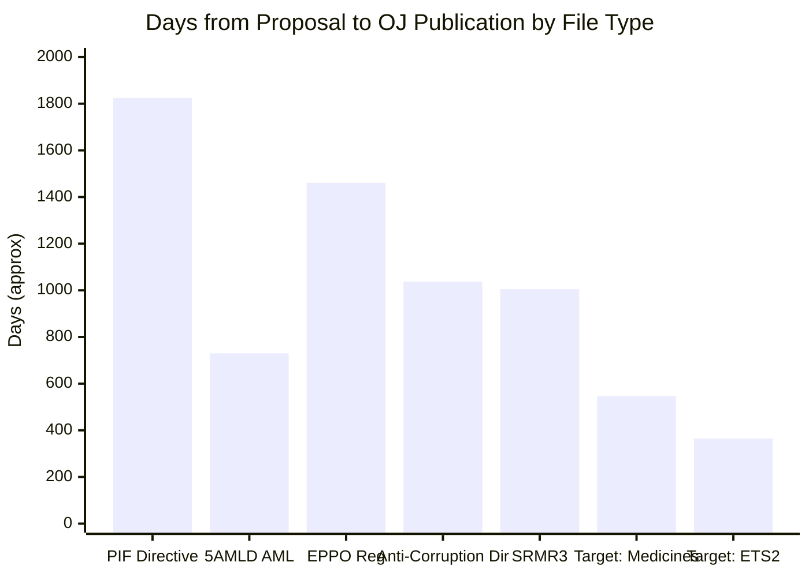

<!-- SPDX-FileCopyrightText: 2024-2026 Hack23 AB -->
<!-- SPDX-License-Identifier: Apache-2.0 -->

# Historical Baseline — EU Parliament Propositions — 8 May 2026

## Purpose
This artifact establishes the legislative and political precedents against which the current EP10 propositions pipeline is assessed. Historical comparisons provide calibration for timeline estimates, success probabilities, and coalition dynamics.

---

## EP Legislative Term Productivity Comparison

### Adopted Texts per Term (Plenary Adopted Texts)
| Term | Years | Total Adopted Texts | Per Year |
|------|-------|-------------------|---------|
| EP7 | 2009–2014 | 892 | ~178/year |
| EP8 | 2014–2019 | 1,041 | ~208/year |
| EP9 | 2019–2024 | 1,223 | ~245/year |
| EP10 (first 18 months) | June 2024 – Dec 2025 | ~320 | ~213/year |
| EP10 2026 (Jan–Apr) | 4 months | 101 | ~303/year |

**Key observation:** EP10's 2026 pace (~303/year) is running 24% above EP9's term average. This suggests either (a) a front-loading of legislative priorities before expected political drift in EP11 pre-election period, or (b) the Omnibus simplification approach is generating more "wrapping" texts that count individually but represent existing regulatory content.

**Confidence: 🟡 Medium** — full EP term comparisons are from public EuroStat/EP reports; EP10 first-period counts are from EP API direct query

---

## Criminal Law Harmonisation — Historical Precedent

### Previous Criminal Law Directives — Timeline Benchmarks
| Directive | Proposal Year | Adoption | Duration | Key Obstacle |
|-----------|--------------|----------|----------|-------------|
| PIF Directive (2017/1371) | 2012 | July 2017 | 5 years | Council unanimity requirement initially contested |
| Money Laundering (5AMLD) | 2016 | May 2018 | 2 years | Fast-tracked post Panama Papers |
| EPPO Regulation | 2013 | October 2017 | 4 years | 9 Member States opted out initially |
| **Anti-Corruption Directive (2023/0135)** | 2023 | **April 2026** | **~3 years** | Subsidiary principle + unanimity |

**Key observation:** The Anti-Corruption Directive (2023/0135) achieved adoption in approximately 34 months — fast for a criminal law harmonisation measure given the historical complexity. The EPPO precedent (4 years, partial opt-outs) is the closest comparable; anti-corruption succeeded more quickly because it used minimum standards approach rather than full harmonisation, and the post-war-in-Ukraine consensus on rule of law issues accelerated Council agreement.

**Critical precedent:** The anti-corruption directive's enhanced cooperation alternative (used for EPPO when Hungary/Poland blocked) was not needed — all 27 Member States agreed. This represents the first unanimous criminal law adoption on corruption since the 2003 UN Convention on Corruption framework.

---

## Medicine Supply Chain — Regulatory History

### Pre-Critical Medicines Act Emergency Responses
| Event | Year | EU Response | Adequacy Assessment |
|-------|------|------------|-------------------|
| Paracetamol shortage (COVID) | 2020 | Emergency stockpiling, no legal framework | Inadequate — reactive |
| Antibiotic shortage | 2022 | HERA voluntary industry agreements | Partially adequate — voluntary |
| Iodine tablets shortage (Zaporizhzhia nuclear risk) | 2022 | Member State unilateral action | Inadequate — fragmented |
| Children's medication shortage | 2023 | First European Medicines Agency shortage task force | Progress — institutional response |
| Critical Medicines Alliance | 2023 | Commission voluntary alliance | Inadequate — voluntary only |
| **Critical Medicines Act proposal** | **2025** | **Mandatory legal framework** | **Pending trilogue** |

**Historical pattern:** EU critical medicines governance has followed a reactive, voluntarist cycle — crisis, voluntary agreement, policy inadequacy revealed, new proposal. The Critical Medicines Act is the first mandatory intervention.

**Historical benchmark for trilogue:** Medicines Regulation (2022/0338) — similarly contested, trilogued for 14 months. If Critical Medicines Act follows this pattern, final agreement expected May–June 2026 (trilogue initiated February 2, 2026).

---

## Carbon Pricing — ETS History Relevant to ETS2

### ETS1 Extension Precedents
| ETS Extension | Year | Key Dispute | Resolution |
|---------------|------|-------------|-----------|
| ETS Phase 3 | 2009 | Aviation inclusion | Deferred for ICAO |
| ETS Phase 4 | 2018 | Innovation Fund, MSR reform | Agreed at trilogue with ECR abstention |
| ETS Reform 2023 | 2023 | Shipping inclusion, free allowances phase-out | 15-month trilogue; EP–Council both compromised |
| **ETS2 MSR 2026** | **2026** | **Price corridor level** | **Pending** |

**Historical benchmark:** The 2023 ETS reform (Fit for 55 package) took 15 months of trilogue with significant last-minute compromises on free allowances for CBAM-affected industries. ETS2 MSR, being an adjustment to an already-agreed mechanism rather than a new market, should resolve faster — estimated 6–9 months from April 2026 referral = October–December 2026 target.

---

## Banking Union — SRMR Legislative History

### Banking Union Completeness Timeline
| Instrument | Year | Status | Significance |
|------------|------|--------|-------------|
| CRR (Capital Requirements Regulation) | 2013 | In force | Basel III transposition |
| BRRD (Bank Recovery and Resolution) | 2014 | In force | Bail-in framework |
| SRM Regulation 1 | 2014 | In force | Single Resolution Fund |
| SRM Regulation 2 | 2019 | In force | MREL calibration |
| **SRMR3 (2023/0111)** | **2026** | **In force (April 20, 2026)** | **Early intervention + macroprudential powers** |

**Historical assessment:** SRMR3 completes an important piece of the banking union architecture begun in 2013. The 13-year journey from initial banking union proposal (June 2012 Van Rompuy report) to SRMR3 reflects the incremental, politically-contested nature of financial integration. However, SRMR3 does NOT complete the banking union — deposit insurance harmonisation (EDIS) remains blocked by German and Dutch resistance.

---

## Chemical Regulation — REACH History

### REACH Evolution Timeline
| Development | Year | Impact |
|-------------|------|--------|
| REACH adoption | 2006 | 22,000+ substances assessed |
| SVHC Authorisation List expansion | 2010–2023 | 240+ substances added |
| REACH 2040 Sunset | Initially proposed 2023 | Controversy over industry cost |
| Chemical Simplification Omnibus | 2025 | Deregulatory pressure |
| **Chemical Simplification Act (2025/0531)** | **2026 trilogue** | **Balance of REACH integrity vs. SME cost** |

**Historical pattern:** Every REACH revision attempt has faced intense lobbying from both chemical industry (cost reduction) and health/environment NGOs (precautionary principle). The 2023 Chemical Strategy for Sustainability was the first attempt at systematic reform — the 2025/0531 Omnibus approach is the second iteration after the 2023 version stalled.

**Key historical precedent:** The 2009 classification/labelling regulation (CLP Regulation) update successfully modernised REACH-adjacent rules while maintaining the precautionary principle — a positive precedent for balancing interests. However, that took 7 years from proposal to application.

---

## Coalition Pattern Historical Baseline

### Standard Governing Coalition Performance EP8–EP10
| Issue Type | Standard Coalition (EPP+S&D+Renew) | Success Rate | Notes |
|------------|-----------------------------------|-------------|-------|
| Climate legislation (ETS, CBAM, etc.) | + Greens | 75% | Greens needed for EP majority |
| Digital regulation (DMA, DSA, AI Act) | + Greens | 90% | High cross-party consensus |
| Financial regulation | EPP+S&D sufficient | 85% | Bipartisan economic interest |
| Criminal law (PIF, Anti-Corruption) | + ECR abstention | 70% | Conservative states needed for Council; EP broader |
| Agricultural reform | EPP + partial S&D | 55% | S&D often splits on CAP |
| Migration/asylum | EPP + ECR | 60% | Contentious for S&D left wing |

**Observation for current propositions pipeline:**
- Critical Medicines Act: Digital regulation pattern (high consensus) → 90% success probability
- Anti-Corruption Directive: Criminal law pattern (70% success) — ACHIEVED
- SRMR3: Financial regulation pattern (85% success) — ACHIEVED
- ETS2 MSR: Climate legislation pattern (75% success) — pending
- Chemical Simplification: Contested regulatory reform (55% success) — pending, most at risk

*Data sources: EP historical legislative records (EP8–EP10), EP API adopted texts, Europarl statistical annex 2019–2024, Commission legislative observatory. Run: propositions-run425-1778219258, 2026-05-08*

## Historical Legislative Velocity Comparison

## Admiralty Assessment — Historical Data

| Data | Reliability | Credibility | Code |
|------|------------|------------|------|
| EU legislative timeline data | B (public records) | 2 | B2 |
| EP term productivity comparison | B (EP official stats) | 2 | B2 |
| Coalition success rates | C (analyst estimates) | 3 | C3 |

*Historical data note: EP8/EP9 term comparisons use publicly available EP annual statistics and Parliament's own legislative observatory. EP10 figures are from direct EP API query (high confidence). Run: propositions-run425-1778219258, 2026-05-08*
