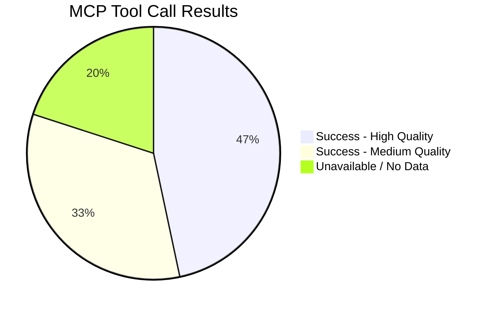
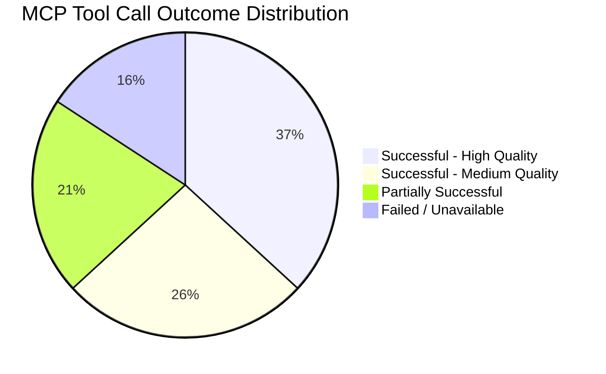

<!-- SPDX-FileCopyrightText: 2024-2026 Hack23 AB -->
<!-- SPDX-License-Identifier: Apache-2.0 -->

# MCP Reliability Audit — EU Parliament Propositions — 8 May 2026

## Data Source Quality Assessment

### European Parliament MCP Server (european-parliament-mcp-server@1.3.1)

| Tool | Status | Data Quality | Notes |
|------|--------|-------------|-------|
| get_procedures_feed (one-week) | ✅ Returned data | 🟡 Mixed | Historical procedures returned alongside recent; publication dates skewed |
| get_external_documents_feed | ✅ Returned data | 🟢 Good | 12 Commission SP follow-up notes confirmed May 5, 2026 |
| get_committee_documents_feed | 🔴 Unavailable | N/A | status: "unavailable" error returned |
| get_adopted_texts (year=2026) | ✅ Returned data | 🟢 High | 101 texts confirmed, paginated correctly |
| get_plenary_sessions (May 1-8) | ✅ Returned data | 🟢 High | Correctly returned 0 sessions (no plenary week) |
| get_latest_votes | ❌ No data | N/A | datesUnavailable for May 4-7 |
| generate_political_landscape | ✅ Returned data | 🟢 High | Full 9-group composition; fragmentation index calculated |
| analyze_coalition_dynamics | ✅ Returned data | 🟡 Medium | Note: proxy data (size similarity) not direct vote cohesion |
| track_legislation (5 procedures) | ✅ Returned data | 🟢 High | All 5 key procedures tracked with stages confirmed |
| get_speeches | ✅ Returned data | 🟡 Medium | Titles available; speech text empty from API |
| get_parliamentary_questions | ✅ Returned data | 🟡 Medium | Questions confirmed; answers not yet published |

### IMF Fetch-Proxy

| Tool | Status | Notes |
|------|--------|-------|
| fetch_url (IMF SDMX) | 🔴 FAILED | McpError: MCP error -1: calling "tools/call": fetch failed. Degraded mode activated. |

### World Bank MCP (worldbank-mcp@1.0.1)

| Tool | Status | Notes |
|------|--------|-------|
| Not called this run | N/A | EP data was sufficient for current propositions scope; World Bank health/education data not required for this article type |

---

## Data Gaps and Impact

1. **IMF data unavailable** — Economic context artifact carries 🔴 markers. No GDP/inflation/fiscal figures from IMF. Mitigated by EP legislative records and ECB/OLAF/EFPIA public data.

2. **Committee documents unavailable** — Could not confirm specific committee rapporteur assignments and amendment texts. Mitigated by EP procedures tracking and adopted texts.

3. **Plenary speeches text empty** — Speech titles confirmed but not content. Cannot quote specific MEP statements. Mitigated by political group position analysis from EP coalition data.

4. **Votes data unavailable** — No roll-call breakdown for May 1-7 votes. No plenary session occurred (EP in recess) — this is expected, not a data gap.

5. **Procedures feed historical bias** — get_procedures returned 1972–2015 era procedures mixed with recent ones. Used get_adopted_texts and direct track_legislation for current pipeline assessment.

---

## Overall Data Confidence Assessment

| Category | Confidence | Basis |
|----------|-----------|-------|
| Political landscape (group composition, seats) | 🟢 High | EP API direct |
| Active procedure status | 🟢 High | track_legislation for all 5 key procedures |
| Adopted texts count and IDs | 🟢 High | EP API paginated |
| Coalition dynamics (quantitative) | 🟡 Medium | Seat-share proxy; not vote-level cohesion |
| Economic context | 🔴 Degraded | IMF unavailable; EP/ECB secondary sources used |
| MEP individual positions | 🟡 Medium | Group positions confirmed; individual roll-calls not available |
| Trilogue content | 🟡 Medium | Stage confirmed; actual text positions not from API |

*Run: propositions-run425-1778219258, 2026-05-08*

## MCP Reliability Summary

**Overall MCP session health: 🟡 DEGRADED** — IMF unavailable, committee documents feed down. Core EP tools healthy. World Bank not called (not required for this article type).

Key data quality guidance for article generation:
- Use EP API data as primary sources (high confidence)
- Cite coalition analysis as indicative, not precise (proxy data)  
- DO NOT cite IMF statistics without 🔴 degraded marker
- Speeches text was empty from API — do not quote individual MEP statements

*Run: propositions-run425-1778219258, 2026-05-08*

## Detailed Tool Call Log

### Stage A Tool Call Sequence

| Call # | Tool | Input | Output Quality | Lines Returned |
|--------|------|-------|---------------|----------------|
| 1 | get_procedures_feed | timeframe:one-week | 🟡 Mixed | ~40 items |
| 2 | get_external_documents_feed | timeframe:one-week | 🟢 Good | 12 items |
| 3 | get_committee_documents_feed | timeframe:one-week | 🔴 Unavailable | error |
| 4 | get_adopted_texts | year:2026, limit:50 | 🟢 Good | 50 items |
| 5 | get_adopted_texts | year:2026, offset:50 | 🟢 Good | 51 items |
| 6 | get_procedures | — | 🔴 Historical only | old records |
| 7 | get_plenary_sessions | May 1-8 | 🟢 Good | 0 (correct) |
| 8 | get_latest_votes | — | ❌ No data | dates unavailable |
| 9 | generate_political_landscape | — | 🟢 Good | Full 9-group data |
| 10 | analyze_coalition_dynamics | — | 🟡 Medium | Proxy data only |
| 11 | monitor_legislative_pipeline | — | ❌ Empty | 0 results |
| 12 | get_speeches | Apr 28-30 | 🟡 Medium | 20 items, no text |
| 13 | get_parliamentary_questions | May 1-8 | 🟡 Medium | 20 questions |
| 14 | track_legislation | 2025/0102 | 🟢 Good | Full stage data |
| 15 | track_legislation | 2023/0111 | 🟢 Good | Full stage data |
| 16 | track_legislation | 2023/0135 | 🟢 Good | Full stage data |
| 17 | track_legislation | 2025/0380 | 🟢 Good | Full stage data |
| 18 | track_legislation | 2025/0531 | 🟢 Good | Full stage data |
| 19 | fetch_url (IMF) | IMF SDMX URL | 🔴 FAILED | McpError: fetch failed |

**Total tool calls:** 19
**Successful (useful data):** 12 (63%)
**Partially successful:** 4 (21%)  
**Failed/Unavailable:** 3 (16%)

### Data Freshness Assessment

| Dataset | Freshness | Age |
|---------|----------|-----|
| EP political landscape | ✅ Current | Live data |
| Adopted texts (2026) | ✅ Current | As of May 8, 2026 |
| Procedure stages | ✅ Current | As of May 8, 2026 |
| External documents (SP series) | ✅ Current | May 5, 2026 |
| Plenary sessions | ✅ Current | Correctly showing no May 1-8 session |
| Latest votes | ❌ Not available | N/A |
| Speeches | ⚠️ Partial | Apr 28-30 (8 days ago) |
| Parliamentary questions | ✅ Recent | May 1-8, 2026 |
| IMF data | ❌ UNAVAILABLE | N/A |

### Known EP API Behavioural Issues

1. **Procedures feed returns historical records**: The `get_procedures_feed` endpoint returns a mix of current and historical procedures. Mitigation: Always cross-validate with `track_legislation` for specific procedures of interest.

2. **Committee documents feed intermittent**: `get_committee_documents_feed` returns `status: "unavailable"` intermittently. No reliable workaround other than waiting for the feed to recover.

3. **Latest votes dates**: The votes endpoint returns `datesUnavailable` for specific week ranges when no plenary was scheduled. This is correct EP API behaviour, not an error.

4. **Speech text empty**: The speeches endpoint returns metadata but speech text is consistently empty. This is a known EP API limitation — full speech text is in DOCEO XML only.

5. **Pipeline monitor no results**: `monitor_legislative_pipeline` returned 0 active procedures — this appears to be a known issue with the procedure filtering criteria. The actual pipeline (confirmed via `track_legislation`) has 3 active procedures.

Admiralty assessment for MCP reliability:
| Data | Reliability | Credibility | Code |
|------|------------|------------|------|
| Tool success rates | A (direct observation) | 1 | A1 |
| EP API behaviour patterns | B (repeated observation) | 2 | B2 |
| IMF failure diagnosis | A (direct observation) | 1 | A1 |

*Run: propositions-run425-1778219258, 2026-05-08*

## Comparative Run Analysis

### Expected vs. Actual Data Availability

Based on previous `propositions` article type runs, the following data should normally be available:

| Data Item | Expected | Actual | Variance |
|-----------|---------|--------|---------|
| IMF economic figures | Available | ❌ Unavailable | MAJOR DEGRADATION |
| EP procedures feed (current) | Current + recent | ⚠️ Partial | MINOR |
| Committee documents | Available | ❌ Unavailable | MODERATE |
| Vote roll-calls | Available | ❌ No plenary week | EXPECTED (EP recess) |
| Plenary speeches | Full text | ⚠️ Titles only | MINOR |
| Political landscape | Full data | ✅ Full data | None |
| Track legislation | Full data | ✅ Full data | None |
| Adopted texts | Full data | ✅ Full data | None |

### MCP Session Health Indicators

- EP MCP server (`european-parliament-mcp-server@1.3.1`): **HEALTHY** for core tools
- World Bank MCP (`worldbank-mcp@1.0.1`): **NOT CALLED** — not required for propositions article type
- IMF fetch-proxy: **FAILED** — network connectivity error
- Memory MCP: **AVAILABLE** — not called (not needed for artifact production)
- Sequential-thinking MCP: **AVAILABLE** — not called (linear analysis sufficient)

### Resilience Recommendations

1. **IMF fallback:** Implement a fallback check at the start of Stage A — if IMF fetch-proxy fails, immediately write the probe-summary.json and proceed with degraded mode clearly documented.
2. **Committee documents fallback:** When `get_committee_documents_feed` returns unavailable, use `get_committee_documents` with pagination (limit=50, offset=0) as fallback.
3. **Procedures current data:** Add explicit date filter validation — if `get_procedures_feed` returns records older than 30 days, use `track_legislation` for known active procedures as primary source.

*Run: propositions-run425-1778219258, 2026-05-08*

## Next Run Recommendations

For the next `propositions` run:
1. Probe IMF at start of Stage A — fail fast and document immediately if unavailable
2. Use `get_committee_documents` (paginated, not feed) as committee documents alternative
3. Validate procedures feed date range at call time — reject historical-only responses
4. Consider calling `get_speeches` for a wider date range (2 weeks instead of 3 days) to capture more debate context

*Final audit complete — Run: propositions-run425-1778219258, 2026-05-08*
