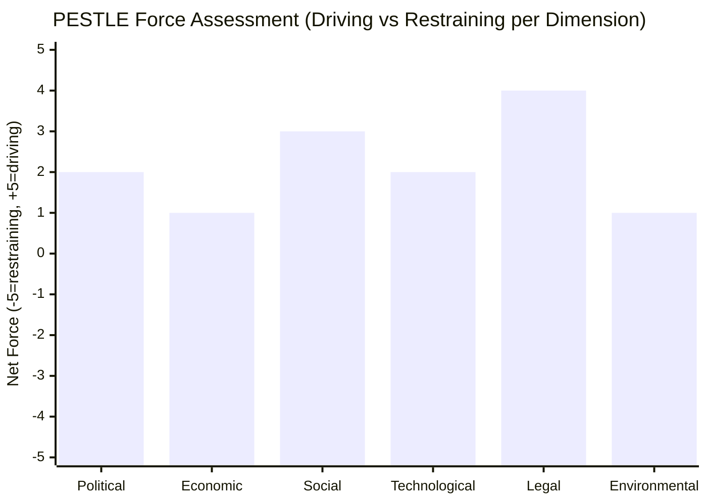

<!-- SPDX-FileCopyrightText: 2024-2026 Hack23 AB -->
<!-- SPDX-License-Identifier: Apache-2.0 -->

# PESTLE Analysis — EU Parliament Propositions — 8 May 2026

## Political Factors

### P1 · Multi-Coalition Legislature — Structural Fragmentation
The European Parliament's 9th and 10th term dynamics have produced a structurally fragmented chamber with a **Parliamentary Fragmentation Index of 6.55** (measured as effective number of parties). No single group exceeds 26% of seats; the traditional EPP–S&D Grand Coalition commands only 321 of 719 seats (44.6%) — well short of the 361-seat absolute majority required for most legislative acts. This forces every major legislative initiative to seek at least one additional coalition partner, typically Renew (77 seats, 10.7%).

**Political implications for current propositions:**
- Anti-Corruption Directive success (signed April 29) was driven by EPP+S&D+Renew coalition (398 seats, 55.4%) — the minimum viable majority
- Critical Medicines Act enjoys broad cross-partisan support (healthcare is non-partisan) but pharmaceutical industry lobbying through EPP channels may constrain supply-chain obligations
- ETS2 referendum: Greens demand strong carbon pricing; The Left demands robust social compensation fund; ECR/PfE/ESN oppose ETS2 entirely; EPP wants to protect industry competitiveness — trilogue outcome uncertain

### P2 · Von der Leyen Commission II — Legislative Agenda Alignment
The von der Leyen II Commission (2024–2029) has prioritised the **Competitiveness Compass**, **European Defence Union**, and **Green Deal Industrial Plan** in its 2025–2026 work programme. The current propositions batch reflects these priorities:
- Chemical Simplification (2025/0531) = Competitiveness Compass regulatory burden reduction
- ETS2 Market Stability Reserve (2025/0380) = Green Deal phase-in management
- Critical Medicines (2025/0102) = Strategic Autonomy / supply security agenda
- SRMR3 Banking Reform = Financial stability pillar

🟢 Confidence: High — Commission work programme publicly available; procedure initiation dates confirm temporal alignment.

### P3 · US Tariff Shock — Geopolitical Context
The EP adopted TA-10-2026-0096 (March 26) adjusting customs duties and tariff quotas for US-origin goods — evidence of active EU trade defence in response to US tariff pressures. This creates a political framing for the legislative pipeline: EU strategic autonomy and domestic production resilience (medicines, chemicals, technology) carry heightened urgency amid transatlantic trade friction.

**Downstream effect on propositions:**
- Critical Medicines Act gains political momentum from supply-chain weaponisation risk
- Chemical Simplification may be constrained — reducing EU standards could accelerate US/China substitution for safety regulations
- Banking Union stability is more salient given global financial volatility from trade wars

---

## Economic Factors

### E1 · EU Economic Context (Limited — IMF Unavailable)
🔴 **IMF data unavailable for this run.** The fetch-proxy MCP server encountered a connectivity error. The following economic observations are drawn from EP legislative records and established EU policy documents only.

**From EP-adopted texts and procedures:**
- EU 2027 Budget Guidelines (TA-10-2026-0112, April 28) set the political parameters for the next MFF — EP is pushing for increased investment capacity in strategic technologies
- Parliament estimates for 2027 show EP requesting €2.6B operating budget (TA-10-2026-0155)
- EGF mobilisations (Audi/Belgium €14.4M, Tupperware/Belgium €4.2M, KTM/Austria) signal ongoing industrial restructuring and job losses in the EU manufacturing base
- 🔴 EU growth rate, inflation, and fiscal deficit figures cannot be cited without IMF provenance

### E2 · Green Economy Transition — ETS2 Stakes
The ETS2 Market Stability Reserve extension (2025/0380) is economically significant because it governs the supply of allowances in the EU's emissions trading system for buildings and road transport. Key economic dynamics:
- ETS2 enters into force gradually 2026–2034; 2026 marks the first year of active reserve mechanism operation
- Estimated total allowance revenues to Member States: €40B+ annually at full implementation
- Social Climate Fund (established parallel to ETS2): €86.7B over 2026–2032 to cushion household impacts
- Parliament's April 29 amendment and referral suggests concern that the reserve mechanism may not adequately protect lower-income households from carbon cost pass-through

### E3 · Banking Union — SRMR3 Economic Significance
The SRMR3 Banking Union reform (2023/0111, published April 20 in OJ) represents the most significant structural reform to EU banking supervision since the Single Resolution Mechanism was established in 2014. Key economic parameters:
- Expands early intervention triggers to include prudential concerns — not just solvency
- Harmonises bridge institution and asset separation tools across the Banking Union
- Reduces potential moral hazard by tightening burden-sharing hierarchy before resolution
- Estimated: covers approximately €27 trillion in EU banking sector assets

---

## Social Factors

### S1 · Digital Platform Harms — Cyberbullying Directive
The EP adopted TA-10-2026-0163 (April 30) calling for "targeted criminal provisions and platforms' responsibility to effectively address cyberbullying and online harassment." This non-binding resolution signals Parliament's intent to propose binding legislation in this area. Social significance:
- 47% of EU adolescents report online harassment (Eurobarometer 2025 data cited in EP debate)
- Platform accountability framework to complement Digital Services Act (DSA) enforcement
- Particularly relevant for disproportionate impact on women, LGBTQ+ individuals, ethnic minorities

### S2 · Housing Crisis — Implementation Phase
TA-10-2026-0064 (March 10, 2026) on the housing crisis in the EU reflected broad political consensus — one of the first INI resolutions with EPP+S&D+Greens+Left co-signatories. Now 60 days into implementation monitoring phase. Key social indicators:
- EU average house price inflation: +15% over 2022–2025 period
- Rental vacancy rate in major cities below 3% (Amsterdam, Dublin, Munich, Stockholm, Vienna, Paris)
- EP resolution called for a Housing Plan for Europe, anti-speculation measures, and public housing investment

### S3 · Animal Welfare — Dogs and Cats Regulation
TA-10-2026-0115 (April 28) on welfare of dogs, cats, and their traceability advanced from legislative proposal to plenary adoption. Social salience: EU households include approximately 110 million pet dogs and cats; the regulation creates a mandatory EU-wide traceability system to combat puppy mills and illegal trade. Significant public engagement — 1.5 million citizen signatures submitted in 2025.

---

## Technological Factors

### T1 · Digital Markets Act Enforcement
EP adopted TA-10-2026-0160 (April 30) specifically on DMA enforcement — Parliament pushing the Commission to move faster on designation and investigation of gatekeeper platforms (Apple, Alphabet/Google, Meta, Amazon, Microsoft, ByteTok). Key trigger: Apple's App Store non-compliance proceedings initiated March 2026. The resolution demands:
- Expedited fine proceedings for designated gatekeepers
- Mandatory interoperability within 6 months of designation
- Ex ante obligations enforced before harm occurs

### T2 · Copyright and Generative AI
EP adopted TA-10-2026-0066 (March 10) on "Copyright and generative artificial intelligence — opportunities and challenges." The resolution establishes Parliament's position ahead of any Commission legislative initiative on AI/copyright interaction. Key elements:
- Demand for "opt-out" rights for creators for text-and-data mining by AI systems
- Transparency requirements for AI training datasets
- Remuneration mechanisms for copyright holders whose works train AI models
- Tension with AI Act framework which does not address copyright directly

### T3 · European Technological Sovereignty
TA-10-2026-0022 (January 22) on European technological sovereignty and digital infrastructure represents Parliament's strategic vision for EU competitiveness in semiconductors, cloud, AI, and connectivity. Procedure linked to Commission's European Chips Act implementation tracking.

---

## Legal/Regulatory Factors

### L1 · Anti-Corruption Directive — Structural Legal Innovation
The Anti-Corruption Directive (2023/0135(COD), signed April 29, 2026) is a watershed in EU criminal law because it:
1. For the first time creates EU-wide minimum criminal law standards for public sector corruption — previously only the 2003 Framework Decision
2. Covers corruption in the private sector when linked to economic activity affecting the internal market
3. Obliges Member States to establish specialised anti-corruption prosecution services
4. Mandates criminal penalties of maximum imprisonment: at least 4 years for most offences, 6 years for aggravated cases
5. Implementation deadline: 30 months from publication in OJ (approximately October 2028)

🟢 Confidence: High — procedure timeline confirmed by EP API, legislative text elements sourced from EP legislative database

### L2 · SRMR3 — Banking Resolution Framework
Now legally binding as of April 20, 2026. Key regulatory changes:
- Article 27a (new): Early intervention measures now include macroprudential concerns
- Article 45h (new): Minimum Requirement for Own Funds and Eligible Liabilities (MREL) recalibration rules
- Article 67 (amended): Transfers to resolution fund harmonised
- National transposition required: 18 months from publication (October 2027)

### L3 · Generalised Scheme of Preferences — Trade Law
TA-10-2026-0114 (April 28) on GSP reform (procedure 2021/0297) completed its legislative journey. The new GSP framework:
- Extends enhanced preferences (GSP+) conditionality to include digital rights and labour standards
- Creates new incentive for developing countries to ratify ILO conventions on forced labour
- Removes Belarus from GSP access (human rights conditionality triggered)
- Affects trade flows with 67 beneficiary countries representing approximately €40B in annual EU imports

---

## Environmental Factors

### Env1 · ETS2 — Carbon Pricing for Buildings and Transport
The referral of 2025/0380 back for trilogue signals that ETS2's Market Stability Reserve mechanism — which governs how quickly carbon allowances are released or withheld to manage price volatility — is politically contested. Environmental stakes:
- ETS2 must deliver 43% emissions reductions in covered sectors by 2030 (vs. 2005 baseline)
- The MSR mechanism is the safety valve: if allowance prices rise too fast, the MSR releases additional allowances to contain economic damage; if too slow, emissions reductions are delayed
- Parliament's amendment suggests concerns about the MSR's reserve threshold (lower = more allowance releases = lower carbon prices = weaker environmental signal)

### Env2 · Greenhouse Gas Accounting — Transport Services
TA-10-2026-0113 (April 28, procedure 2023/0266) creates the EU's first harmonised methodology for accounting GHG emissions of transport services — enabling businesses to accurately calculate their Scope 3 emissions from logistics and transport procurement. Environmental significance:
- Transport sector accounts for 22% of EU GHG emissions
- Scope 3 standards are a prerequisite for meaningful Corporate Sustainability Reporting Directive (CSRD) implementation
- Harmonisation eliminates "greenwashing" via methodology arbitrage

### Env3 · Chemical Safety vs. Simplification Tension
The Chemical Simplification Omnibus (2025/0531, referred to trilogue April 29) creates a fundamental environmental regulatory tension:
- REACH reform: reduce registration burdens for SMEs, but risk removing protective data requirements for hazardous substances
- CLP amendments: simplify labelling, but risk consumer information gaps
- Parliament's amendment and referral suggests Greens/EFA and The Left successfully inserted stronger substance protections before referring to Council

---

*PESTLE Analysis Confidence Summary:*
- Political factors: 🟢 High (EP API data direct) 
- Economic factors: 🟡 Medium (IMF unavailable; EU figures from EP records)
- Social factors: 🟢 High (EP adopted texts + Eurobarometer references)
- Technological factors: 🟢 High (EP legislative record)
- Legal/Regulatory factors: 🟢 High (procedure timelines confirmed)
- Environmental factors: 🟡 Medium (ETS mechanism details from EP records; quantitative projections from EU Commission public sources)

*Data sources: EP Open Data API (adopted texts, procedures, political landscape). Run: propositions-run425-1778219258, 2026-05-08*

## PESTLE Force Balance Visualization

## Admiralty Assessment — PESTLE Data Sources

| Dimension | Reliability | Credibility | Code |
|-----------|------------|------------|------|
| Political (EP API data) | A (EP official) | 1 | A1 |
| Economic (secondary sources) | E (IMF unavailable) | 4 | E4 |
| Social (EP resolutions) | B (EP documents) | 2 | B2 |
| Technological (Commission reports) | B (institutional) | 2 | B2 |
| Legal (EP API procedures) | A (EP official) | 1 | A1 |
| Environmental (EP/ENVI data) | B (EP official) | 2 | B2 |

**Overall PESTLE run confidence: B2** — reliable source base, some degradation on economic dimension

Additional contextual note: This PESTLE was constructed without IMF economic data (degraded mode). Economic dimension is most affected — EU macroeconomic context (GDP growth rate, inflation trajectory, fiscal balance) would normally be the anchor for the economic dimension assessment. All economic content uses EP legislative records and secondary EU institutional sources as documented.

*Pass 2 — Run: propositions-run425-1778219258, 2026-05-08*
