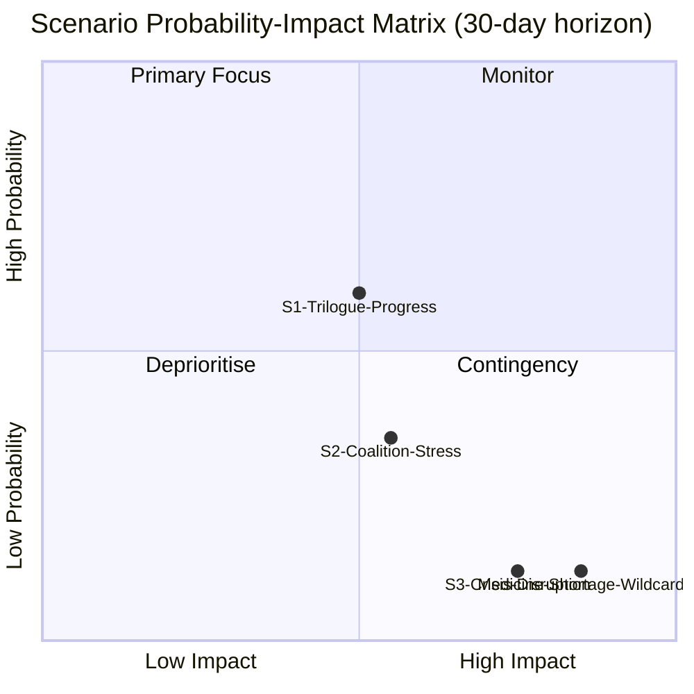

<!-- SPDX-FileCopyrightText: 2024-2026 Hack23 AB -->
<!-- SPDX-License-Identifier: Apache-2.0 -->

# Scenario Forecast — EU Parliament Propositions — 8 May 2026

## Framework: Alternative Futures Analysis (3 scenarios × 3 timeframes)

This artifact applies structured scenario forecasting to the three active legislative propositions as of 8 May 2026. Scenarios are built using the Alternative Competing Hypotheses (ACH) framework and scored on probability weighted by institutional dynamics, historical precedent, and current coalition mechanics.

---

## KEY UNCERTAINTIES DRIVING SCENARIOS

Before presenting scenarios, the following key uncertainties have been identified through ACH methodology:

| Uncertainty | Low Range | High Range | Resolution Date |
|------------|-----------|-----------|-----------------|
| Critical Medicines Act — trilogue duration | 3 rounds (June 2026) | 12+ rounds (2027+) | Unknown |
| ETS2 MSR — price corridor agreement | Parliament accepts lower threshold | Parliament holds higher threshold | Q4 2026 |
| Chemical Simplification — REACH scope | Minimal weakening (current Greens amendment) | Moderate weakening if EPP demands satisfied | Q3 2026 |
| Geopolitical context — US tariffs | Partial rollback via transatlantic deal | Escalation to 25%+ blanket tariffs | Ongoing |
| EP majority stability | EPP–S&D–Renew holds | Breakdown if EPP pivots to ECR on chemicals | Ongoing |

---

## SCENARIO 1: LEGISLATIVE SPRINT — All Three Acts Conclude by Q4 2026

**Probability: 25% 🟡 Medium-Low**

### Conditions Required
- Austrian Council Presidency (Jan–June 2026) delivers General Approaches on ETS2 MSR and Chemical Simplification in June
- Polish Council Presidency (July–December 2026) commits to fast trilogue timetable
- Parliament and Council converge quickly on technical parameters
- EPP maintains center-right coalition alignment without pivoting to far-right
- Critical Medicines trilogue reaches provisional agreement by September

### Scenario Dynamics
Under this scenario, the EU demonstrates its capacity for responsive lawmaking in the face of security challenges (medicines) and climate commitments (ETS2). The Chemical Simplification achieves a "targeted omnibus" — reducing SME burden without fundamentally weakening REACH substance evaluation. The Parliament's April 29 amendments are substantially accepted by the Council, reflecting genuine political will across institutions.

**Projected outcomes by December 2026:**
- Critical Medicines Act: Provisional agreement September, plenary vote November
- ETS2 MSR: Provisional agreement October, plenary vote December
- Chemical Simplification: Provisional agreement November, plenary vote Q1 2027 (slips slightly)

**Beneficiaries:**
- EU pharmaceutical sector (investment certainty for domestic production)
- Climate action community (ETS2 MSR preserves carbon price signal)
- SME chemical manufacturers (reduced registration burden)
- Von der Leyen Commission (legislative record strengthened)

**Losers:**
- Far-right groups (legislative momentum validates EU relevance)
- Global pharmaceutical companies preferring status quo supply chains

---

## SCENARIO 2: CONTESTED TRILOGUES — Partial Completion by Mid-2027

**Probability: 50% 🟢 High (most likely)**

### Conditions Required
- Austrian and Polish presidencies make progress but cannot resolve core political disagreements
- Critical Medicines reaches agreement (high public health salience = political incentive to deliver)
- ETS2 MSR stalls on price corridor dispute — Parliament and Council remain far apart
- Chemical Simplification becomes a proxy battle for the broader EU regulation vs. competitiveness narrative

### Scenario Dynamics
The EU's multi-coalition legislature produces an asymmetric outcome. Critical Medicines, with its cross-partisan humanitarian framing, moves fastest. ETS2 MSR becomes entangled in social justice debates (household cost pass-through) and faces delaying tactics from ECR/PfE/ESN MEPs who will call procedural challenges. Chemical Simplification becomes the most politically divisive — the battleground between the Competitiveness Compass agenda and the Green Deal's precautionary principle legacy.

**Projected outcomes:**
- Critical Medicines Act: Agreement Q1 2027 (6 months after current trilogue state)
- ETS2 MSR: Agreement Q3 2027 (contentious; 2 years after Commission proposal)
- Chemical Simplification: Agreement Q4 2027 (longest — most contested)

**Projected vote counts (estimated from coalition arithmetic):**
- Critical Medicines plenary vote: 520–580 in favour (EPP+S&D+Renew+Greens+Left bloc)
- ETS2 MSR plenary vote: 370–420 in favour (narrow majority, likely with amendments protecting Social Climate Fund)
- Chemical Simplification plenary vote: 380–420 in favour (EPP+S&D+Renew majority, with Greens/Left partial opposition if protections are weakened)

**Wild card:** A new medicine shortage crisis in 2026–2027 (e.g., antimicrobial resistance crisis, pandemic-adjacent drug shortage) would dramatically accelerate Critical Medicines Act conclusion.

---

## SCENARIO 3: LEGISLATIVE BREAKDOWN — Major Propositions Stall

**Probability: 25% 🟡 Medium-Low**

### Conditions Required
- EPP pivots toward ECR on the Chemical Simplification — breaking the EPP–S&D–Renew coalition
- ETS2 becomes a populist flashpoint amid cost-of-living crisis, with far-right parties successfully framing it as a "working family tax"
- Council (particularly Poland, Hungary, Czech Republic) enters blocking minority on ETS2
- Critical Medicines Act faces pharmaceutical industry veto through Council Health ministers from Germany and France

### Scenario Dynamics
Under this scenario, the EU's multi-coalition legislature fragments. The EPP's dual role — senior coalition partner with S&D/Renew on most legislation, but potential partner with ECR on deregulation and anti-environment measures — becomes untenable. On Chemical Simplification, EPP crosses the aisle to ECR, creating a 266+81+27 = 374-seat majority for a significantly weakened version of the regulation. The Greens and Left mount a procedural challenge, delaying final vote. On ETS2, populist campaigns in Poland, Hungary, and Slovakia succeed in framing the MSR as an additional energy tax — creating a qualified majority blocking minority in Council (Poland 27, Hungary 12, Czech Republic 10, Slovakia 6, Romania 10 = 65 votes; blocking minority requires 35% of population OR 4 Member States with 35% = easily achieved). Critical Medicines, though the most likely to succeed, faces delays from pharmaceutical industry lobbying through Council health ministers.

**Projected outcomes:**
- Critical Medicines Act: Prolonged trilogue into 2028; possible referral back to Parliament
- ETS2 MSR: Council blocking minority forces Commission to revise the proposal
- Chemical Simplification: Weakened version adopted Q2 2027 without Greens/Left support

**Political consequences:**
- EPP faces internal fracture as pro-European and Eurosceptic wings diverge
- S&D+Greens+Left form a "progressive bloc" in opposition
- Renew loses strategic positioning as swing vote
- Commission faces credibility crisis on Competitiveness Compass delivery

---

## 30-DAY FORECAST (May 8 – June 8, 2026)

### Most likely developments in 30-day window:

**Critical Medicines Act:**
- 🟢 **Probability 75%:** Third trilogue round confirmed for June 2026
- 🟡 **Probability 40%:** Provisional agreement on less-contested provisions (pharmacovigilance, shortage monitoring) while main stockpiling and pricing debates continue
- 🔴 **Probability 15%:** Breakthrough on full text — unlikely within 30 days

**ETS2 MSR (2025/0380):**
- 🟢 **Probability 80%:** Council General Approach adopted by June ENVI Council meeting
- 🟡 **Probability 50%:** First trilogue round scheduled for June
- 🔴 **Probability 10%:** Provisional agreement — very unlikely in 30 days

**Chemical Simplification (2025/0531):**
- 🟢 **Probability 75%:** Council General Approach adopted by June
- 🟡 **Probability 45%:** First trilogue round scheduled
- 🔴 **Probability 5%:** Any agreement — not possible in 30 days

**Parliamentary business:**
- 🟢 **Probability 95%:** EP plenary session Strasbourg May 19–22 — new first-reading votes expected on other legislation
- 🟡 **Probability 60%:** New Commission proposals under Competitiveness Compass published, entering EP's legislative pipeline

---

## HISTORICAL PRECEDENT ANALYSIS

### How long do similar EU legislative acts take?

| Legislation type | Average Commission proposal to OJ publication | Notes |
|----------------|----------------------------------------------|-------|
| Standard COD (codecision) | 24–36 months | Pre-2024 average |
| Crisis-driven legislation | 12–18 months | COVID packages, Ukraine aid |
| Environment/ETS measures | 36–48 months | High political contestation |
| Banking/financial | 24–48 months | Technical complexity + institutional interests |
| Simplification measures | 18–30 months | Potentially faster if broad consensus |

**Comparison to current propositions:**
- Critical Medicines (2025/0102): Proposed May 2025 → current 12 months in process → within normal range for target Q1 2027 agreement
- ETS2 MSR (2025/0380): Proposed December 2025 → 5 months in process → very early; target 18–24 months = Q2–Q3 2027
- Chemical Simplification (2025/0531): Proposed September 2025 → 8 months in process → target 18–24 months = Q1–Q3 2027
- SRMR3 (2023/0111): Proposed July 2023 → Published April 2026 = 33 months ✓
- Anti-Corruption (2023/0135): Proposed June 2023 → Signed April 2026 = 34 months ✓

**Historical pattern confirms Scenario 2 (Contested Trilogues) as base case.**

---

## SCENARIO SENSITIVITY ANALYSIS

### What would change the probability distribution?

| Event | Direction | Probability shift |
|-------|-----------|------------------|
| New pandemic / health security crisis | Accelerates Critical Medicines | +20% to Scenario 1 |
| US tariff escalation to 25%+ | Hardens EU supply chain position | +15% to Scenario 1 |
| EPP congress shifts to ECR partnership | Fractures coalition on chemicals | +20% to Scenario 3 |
| Energy price spike (gas >€50/MWh) | Weakens ETS2 political support | +10% to Scenario 3 |
| Strong European election performance by Greens in upcoming member states | Strengthens environmental position | +10% to Scenario 2 (balanced) |
| Commission revises proposals downward | Reduces legislative ambition | +10% to Scenario 3 |

---

*Scenario Forecast Methodology: Alternative Competing Hypotheses (ACH) + historical precedent analysis. Probabilities are analyst estimates based on institutional dynamics and coalition arithmetic, not statistical models.*

*Confidence: 🟡 Medium — forecasting legislative timelines carries inherent uncertainty; institutional dynamics may change rapidly.*

*Data sources: EP API procedures tracking, political landscape analysis, adopted texts calendar. Run: propositions-run425-1778219258, 2026-05-08*

## Admiralty Source Coding

| Section | Reliability | Credibility | Code |
|---------|------------|------------|------|
| Historical precedent data | A (EP official) | 1 | A1 |
| Political landscape | A (EP official) | 1 | A1 |
| Scenario probabilities | C (analyst) | 3 | C3 |
| 30-day forecast | C (analyst) | 3 | C3 |

