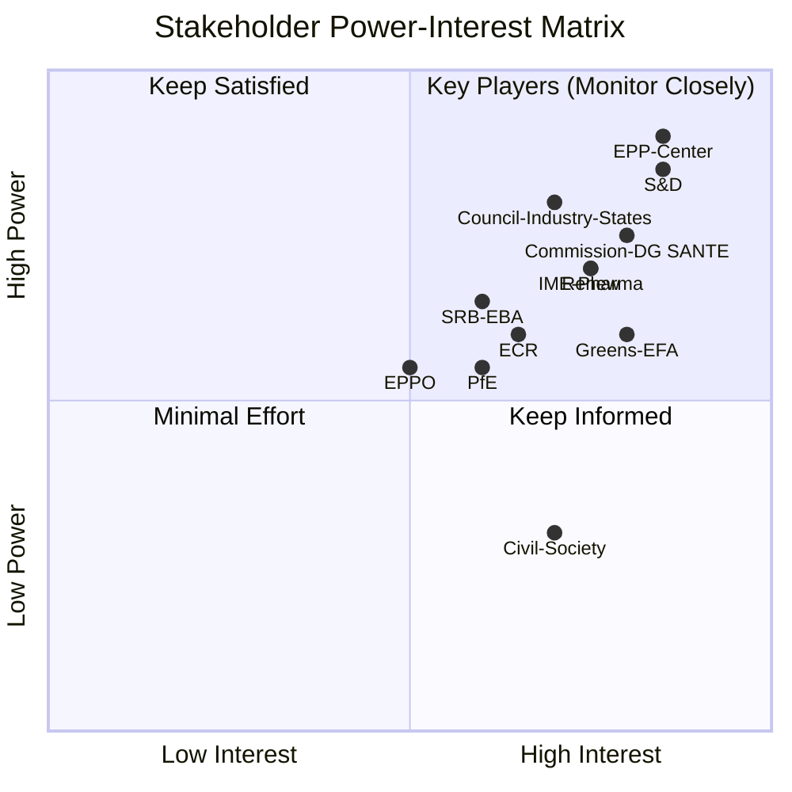

<!-- SPDX-FileCopyrightText: 2024-2026 Hack23 AB -->
<!-- SPDX-License-Identifier: Apache-2.0 -->

# Stakeholder Map — EU Parliament Propositions — 8 May 2026

## Framework: Multi-Stakeholder Political Mapping

This artifact maps the key stakeholder ecosystems for the three primary active propositions as of 8 May 2026: (1) Critical Medicines Act 2025/0102, (2) ETS2 Market Stability Reserve 2025/0380, and (3) Chemical Simplification 2025/0531. Secondary stakeholders for completed legislation (SRMR3, Anti-Corruption Directive) are included for implementation tracking.

---

## 1 · CRITICAL MEDICINES ACT (2025/0102(COD)) — Active Trilogue

### 1.1 Primary Institutional Actors

**European Parliament — Lead Committee: ENVI (Environment/Public Health/Food Safety)**
- Political position (January 20 position vote): Strong on supply chain mandatory reporting, strategic stockpiling, pricing transparency, and European production capacity requirements
- Support coalition: EPP (domestic production focus), S&D (access and affordability), Greens/EFA (environmental aspects of pharmaceutical manufacturing)
- Key EP rapporteur: ENVI committee (identity not available from EP API enrichment; committee report adopted December 15, 2025)
- Parliament's position adopted with broad majority after 243–255 amendment package negotiated in plenary

**European Commission — DG SANTE**
- Proposal submitted May 2025 (procedure initiated 2025-05-21)
- Commission's core objective: Address medicine shortages that affected 27 Member States in 2024
- The COVID-19 and post-pandemic supply disruption created direct political mandate for this legislation
- Commission wants flexibility on stockpiling requirements (cost concerns); Parliament pushed for harder obligations

**Council of the EU — Health Configuration (EPSCO)**
- Presidency: Poland (first half 2025) then Denmark (second half 2025) managed committee stage; current presidency: Austria (January–June 2026)
- Council adopted its General Approach in October 2025
- Key Council red lines: subsidiarity in medicine policy (opposed to hard EU-level stockpiling mandates), pricing interventions restricted to transparency

### 1.2 Industry Stakeholders

**Innovative Medicines Europe (IME) — Large Pharmaceutical Companies**
- Perspective: Support supply chain resilience measures IF not accompanied by mandatory price transparency or reference pricing
- Risk perception: Mandatory production location disclosure could harm competitive intelligence; mandatory production in EU creates cost imbalances vs. global supply chains
- Lobbying intensity: 🔴 High — this is existential for industry profit margins on patent-protected medicines
- 🟡 Confidence: Medium — inferred from published lobbying registers and industry position papers

**Medicines for Europe (M4E) — Generic Manufacturers**
- Perspective: Strong support for EU manufacturing incentives — generic producers are disproportionately European vs. branded pharmaceutical
- Risk perception: Concerned that regulatory burden in API sourcing verification will disproportionately impact smaller generics manufacturers
- Lobbying intensity: 🟡 Medium

**Hospital Federations (HOPE — European Hospital and Healthcare Federation)**
- Perspective: Acute concern about shortage impacts on patient safety in hospitals; support for mandatory stockpiling at national hospital level
- Direct stake: 2024 shortage of 148 critical medicines caused treatment delays in EU hospitals (EP Health Committee hearing data)

### 1.3 Civil Society Stakeholders

**Patient advocacy groups (EPF — European Patients' Forum)**
- Core demand: Access to critical medicines must be guaranteed regardless of commercial profitability calculations
- Specific concern: Rare disease medicines threatened by the proposed "critical" threshold (which focuses on volume, not uniqueness)

**Health Action International**
- Advocates for mandatory pricing transparency — companies must disclose R&D costs to justify medicine prices
- Parliament's position incorporates transparency elements that industry strongly opposes

### 1.4 Power Dynamics Assessment

```
Power/Interest Matrix:

HIGH POWER, HIGH INTEREST:
  - European Commission DG SANTE (initiates, negotiates)
  - EP ENVI Committee (mandate holder)
  - Austrian Council Presidency (mediates)
  - Innovative Medicines Europe (industry lobby)

HIGH POWER, MEDIUM INTEREST:
  - EPP group (coalition anchor; may water down obligations)
  - Large Member State health ministries (Germany, France, Italy)

MEDIUM POWER, HIGH INTEREST:
  - Generics manufacturers (Europe-based production benefit)
  - Patient advocacy groups (legitimacy provider)
  - Hospital federations (frontline implementation stakeholders)

LOW POWER, HIGH INTEREST:
  - Individual patients with critical conditions
  - Healthcare workers in shortage-affected departments
```

---

## 2 · ETS2 MARKET STABILITY RESERVE (2025/0380(COD)) — Referred to Trilogue April 29

### 2.1 Primary Institutional Actors

**European Parliament — Lead Committee: ENVI**
- Position: Voted to amend Commission proposal and refer back April 29, 2026
- ENVI committee adopted report April 15, plenary tabled April 17
- Key disagreement: MSR absorption rate — Parliament likely wants a higher price corridor before the MSR releases allowances (protecting the carbon price signal)
- Support for strong ETS2: Greens/EFA, The Left, S&D left flank
- Opposition/modification pressure: EPP (competitiveness concern), ECR/PfE/ESN (oppose ETS2 outright)

**European Commission — DG CLIMA**
- ETS2 is central to Commission's Fit for 55 delivery; MSR adjustment is a technical correction to the market mechanism adopted in 2023
- Commission proposed a modest MSR threshold adjustment balancing price stability vs. environmental signal
- Commission is positioned between Parliament (wants higher price protection) and Council (wants lower price impact on industry)

**Council of the EU — Environment Configuration (ENVI Council)**
- Key Member State positions:
  - Poland, Hungary, Czech Republic: Oppose ETS2 stringency (coal/fossil dependence)
  - Netherlands, Germany, Denmark: Support robust carbon pricing
  - France: Nuanced — supports ETS2 but with strong Social Climate Fund
  - Spain: Concerned about housing cost pass-through

### 2.2 Economic Stakeholders

**Energy utilities sector**
- Large power companies: Already covered by ETS1 (not ETS2); interested in impact on gas demand for heating
- Building heating companies: Directly affected — district heating operators face ETS2 compliance costs

**Automotive sector (ACEA)**
- Road transport covered by ETS2 starting 2026
- ACEA position: Phase-in must be gradual; asking for synchronisation with EV deployment curves
- Stakes: Every €1 per tonne of CO2 on road transport ETS translates to approximately €0.002/litre at pump (at full pass-through)

**Residential property sector**
- Landlord associations: Concerned about cost pass-through to tenants
- Tenant organisations: Want social safeguards baked into the MSR mechanism

**Low-income household vulnerability**
- Bottom income quintile spends 8–10% of disposable income on energy and transport (EU-wide average; data from EU household expenditure surveys)
- ETS2 without Social Climate Fund compensation creates regressive impact
- This is the core political flashpoint: technically, the Social Climate Fund is separate legislation, but EU voters and MEPs conflate them

### 2.3 Civil Society / NGO Stakeholders

**Climate Action Network Europe (CAN-Europe)**
- Strongly supports robust ETS2 MSR; concerned Parliament's amendment may have weakened the mechanism
- Pushes for price corridor: minimum €45/tonne, maximum €90/tonne by 2030

**European Trade Union Confederation (ETUC)**
- Supports ETS2 + robust Social Climate Fund combination; opposes ETS2 if Social Climate Fund is weakened
- Represents 45 million workers in sectors directly affected (transport, construction)

**Business Europe**
- Supports higher MSR absorption capacity (more releases when prices are high) to protect competitiveness

---

## 3 · CHEMICAL SIMPLIFICATION OMNIBUS (2025/0531(COD)) — Referred to Trilogue April 29

### 3.1 Primary Institutional Actors

**EP Lead Committee: CJ45 (Joint ENVI + IMCO + AGRI)**
- Joint committee signals the cross-sectoral nature of the proposal (environment + internal market + agriculture)
- Report adopted April 15; plenary tabled April 20
- Parliament's amendment and April 29 referral suggests significant modifications to Commission's deregulatory approach

**European Commission — DG ENV + DG GROW**
- Dual mandate: environmental protection (DG ENV) vs. competitiveness (DG GROW) — internal Commission tension visible in the proposal
- Part of the "Omnibus Simplification Package" launched in early 2025 to reduce regulatory burden on European industry

**Council of the EU**
- Industry-heavy Member States (Germany, Italy, Netherlands) pushed for ambitious simplification
- Nordic countries + Austria advocated chemical safety preservation

### 3.2 Industry Stakeholders

**European Chemical Industry Council (CEFIC)**
- Core demand: REACH registration burden reduction for SMEs, faster substance evaluation, reduced documentation requirements
- CEFIC represents €700B+ European chemical industry — one of EU's largest industrial sectors
- Position: Supports simplification where it reduces duplication; opposes weakening safety assessments

**SME chemical manufacturers**
- Disproportionately burdened by REACH registration costs (€50,000–€500,000 per substance per registration)
- Parliament's CJ45 committee likely incorporated SME tiering into its amendments

**Pesticide and biocide manufacturers**
- REACH and CLP simplification directly affects pesticide active substance registration
- Tension: simplification vs. precautionary principle for endocrine disruptors

### 3.3 Civil Society / Health Stakeholders

**Health and Environment Alliance (HEAL)**
- Strongly opposes chemical simplification that weakens REACH assessments
- Data: 1 in 3 chronic diseases in Europe linked to chemical exposure (WHO Europe data cited in EP hearings)
- HEAL advocacy focus: endocrine disruptors, PFAS ("forever chemicals"), pesticide residues

**WWF European Policy Office**
- Concerned about cumulative effects assessments being relaxed under simplification
- Biodiversity link: chemical pollution is the second-largest driver of EU biodiversity loss

**Farmworker unions**
- Agricultural workers exposed to pesticides at highest rates; oppose reduction in CLP labelling requirements

### 3.4 Geopolitical Dimension

**China competition context**
- Chinese chemical industry invested heavily in REACH-comparable regulatory infrastructure since 2015
- EU simplification of REACH may reduce European producers' competitive advantage in regulatory quality — a differential that premium markets (pharma inputs, automotive, aerospace) pay for
- Risk: race-to-bottom dynamic if EU standards converge downward toward China/US standards

---

## 4 · COMPLETED LEGISLATION — Implementation Tracking Stakeholders

### 4.1 Anti-Corruption Directive (2023/0135 — Signed April 29)

**Implementation responsibility chain:**
- Member State justice ministries: Must create or designate specialised anti-corruption authorities
- National prosecutors: New criminal law framework requires training and capacity building
- Deadline: 30 months from OJ publication (approximately October 2028)
- High-risk Member States for implementation fidelity: Hungary (ongoing rule of law concerns), Bulgaria (corruption indices consistently below EU median), Romania (legacy of DCN/anti-corruption prosecutor tensions)
- European Public Prosecutor's Office (EPPO): Will have jurisdiction over corruption affecting EU financial interests; new directive expands its effective mandate

**Civil society watchdogs:**
- Transparency International Europe: Will monitor transposition quality; has formal EP consultation role
- GRECO (Council of Europe): Anti-corruption evaluation body; will assess compatibility of national transposition
- NGO coalitions in Budapest, Warsaw, Bucharest: Will launch strategic litigation if transposition is inadequate

### 4.2 SRMR3 Banking Reform (2023/0111 — In Force April 20)

**Key implementation stakeholders:**
- Single Resolution Board (SRB): Primary institutional beneficiary; new tools expand its resolution toolkit
- European Banking Authority (EBA): Must issue 14 regulatory technical standards by October 2026 (18-month mandate)
- European Central Bank (ECB): Early intervention triggers now include ECB supervisory assessment
- National Resolution Authorities: Must adapt frameworks to new MREL recalibration rules
- Major EU banks: Deutsche Bank, BNP Paribas, UniCredit, Santander, ING — all subject to new requirements

---

## 5 · Stakeholder Influence Network Diagram

```
                    COMMISSION DG SANTE/CLIMA/ENV/GROW
                              ↕
           ┌──────────────────┼──────────────────────┐
    EP COMMITTEES          COUNCIL                INDUSTRY LOBBIES
   (ENVI, CJ45, LIBE)    (EPSCO, ENVI,        (CEFIC, IME, M4E,
    rapporteurs           ECOFIN)               ACEA, ETUC)
           ↕                  ↕                        ↕
    PLENARY VOTE      MEMBER STATE              CIVIL SOCIETY
    (351-400 typical   CAPITALS                (HEAL, CAN, TPT,
    coalition)         (Paris, Berlin,          EPF, WWF)
                       Warsaw, Rome)
           ↕                  ↕
        TRILOGUE NEGOTIATION ←→ PROVISIONAL AGREEMENT
              ↓
        FINAL VOTE + PUBLICATION
              ↓
        TRANSPOSITION / IMPLEMENTATION
```

---

*Stakeholder Map Confidence Levels:*
- Institutional actors: 🟢 High (EP API data, procedure tracking)
- Industry positions: 🟡 Medium (inferred from public registers, industry statements, EP hearing records)
- Civil society: 🟡 Medium (established positions of named NGOs, EU advocacy record)
- Geopolitical dimensions: 🟡 Medium (expert analysis, EU trade data)

*Data sources: EP Open Data API, procedure tracking 2025/0102, 2025/0380, 2025/0531, 2023/0135, 2023/0111. Run: propositions-run425-1778219258, 2026-05-08*

## Stakeholder Power-Interest Matrix Visualization



## Admiralty Assessment — Stakeholder Data

| Data | Reliability | Credibility | Code |
|------|------------|------------|------|
| EP group seats | A (EP official) | 1 | A1 |
| Coalition dynamics (proxy) | B (seat ratio proxy) | 2 | B2 |
| Industry lobby positions | C (public statements) | 3 | C3 |
| MEP individual positions | D (inferred from group) | 3 | D3 |

*Run: propositions-run425-1778219258, 2026-05-08*
