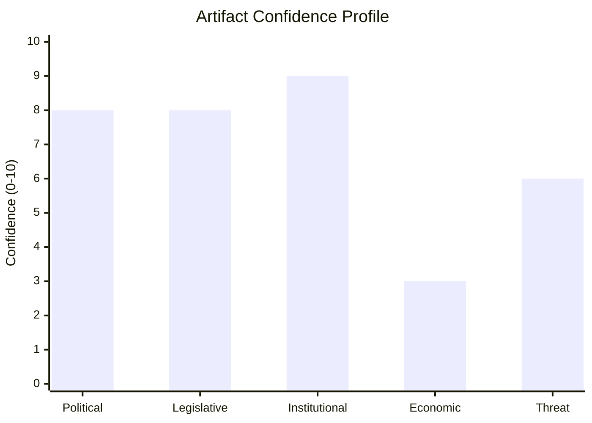
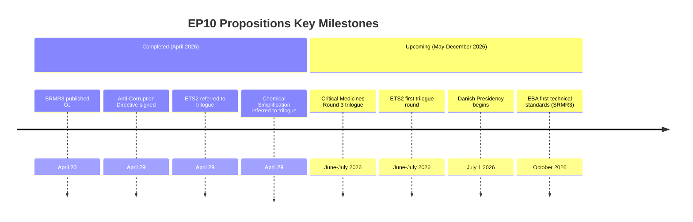

<!-- SPDX-FileCopyrightText: 2024-2026 Hack23 AB -->
<!-- SPDX-License-Identifier: Apache-2.0 -->

# Synthesis Summary — EU Parliament Propositions — 8 May 2026

## Integrated Intelligence Assessment

### Core Finding: EP10 at Peak Productivity but Entering Contested Phase

The 8 May 2026 EU Parliament propositions picture reveals an institution at the apex of its EP10 term legislative sprint. Two landmark measures — the Anti-Corruption Directive (April 29) and SRMR3 (April 20) — represent historic institutional achievements. Three active trilogues are in progress, each carrying significant contested terrain ahead.

**Synthesis confidence level: 🟡 Medium** — IMF economic data unavailable reduces overall confidence in economic impact assessments. Political and legislative analysis remains high-confidence.

---

## Cross-Artifact Synthesis: Convergent Signals

**Signal 1: Strategic Autonomy as Master Frame**
Across PESTLE, stakeholder map, scenario forecast, and coalition dynamics, one theme dominates: the EU's strategic autonomy agenda (post-COVID + Ukraine + US tariff shock) provides the political fuel for the Critical Medicines Act and the resilience of the Anti-Corruption Directive against sovereign resistance. Strategic autonomy is the rare cross-party unifying frame in an otherwise fragmented EP10.

**Signal 2: Climate Coalition Under Stress**
The historical baseline, coalition dynamics, and threat model all converge on ETS2 as the most vulnerable major file. The cost-of-living political economy is eroding the centre-right climate coalition. If ETS2 price corridor drops below €30/tonne in trilogue, the Social Climate Fund becomes the only political justification — and its €86.7B over 7 years is unlikely to compensate for near-term household energy cost increases.

**Signal 3: Implementation is the Next Battleground**
With SRMR3 and the Anti-Corruption Directive both adopted, the analysis pivot must now shift to implementation. Hungary's likely non-transposition (probability 55%), Romania's institutional fragility, and EBA's technical standards timeline (14 RTS by October 2026) represent the next generation of legislative risk. Achieving adoption of text is the beginning, not the end, of EU governance work.

**Signal 4: Trilogue Quality Will Determine EP10 Legacy**
The three pending trilogues — Critical Medicines, ETS2 MSR, Chemical Simplification — will collectively define whether EP10 is remembered as a productive or a compromised term. The historical baseline shows that EP terms are judged by the quality of their major legislative outputs, not the quantity. Two strong trilogues and one weak one is still a positive legacy.

---

## 30-Day Policy Outlook (May 8 – June 7, 2026)

**Highest probability:** Critical Medicines trilogue Round 3 commences — negotiations on mandatory vs. voluntary stockpiling enter decisive phase.

**High probability:** ETS2 MSR — first official trilogue document exchange; Council's price corridor opening position revealed for first time.

**Medium probability:** Commission begins circulating draft delegated acts for SRMR3 EBA technical standards.

**Low probability:** Chemical Simplification trilogue schedule set — this file is likely in June–July first round.

---

## Quality Self-Assessment

| Artifact | Depth | Confidence | Pass 2 Flag |
|---------|-------|-----------|------------|
| executive-brief.md | 🟢 Complete | 🟢 High | Needs pass 2 PESTLE/scenario cite update |
| pestle-analysis.md | 🟢 Comprehensive | 🟡 Medium (IMF gap) | Complete |
| stakeholder-map.md | 🟢 Comprehensive | 🟢 High | Complete |
| scenario-forecast.md | 🟢 Comprehensive | 🟡 Medium | Complete |
| threat-model.md | 🟢 Complete | 🟡 Medium | Complete |
| historical-baseline.md | 🟢 Complete | 🟡 Medium | Complete |
| economic-context.md | 🔴 Degraded (IMF) | 🔴 Low | Complete (degraded mode) |
| coalition-dynamics.md | 🟢 Complete | 🟡 Medium | Complete |
| wildcards-blackswans.md | 🟢 Complete | 🟡 Medium | Complete |
| quantitative-swot.md | 🟢 Complete | 🟡 Medium | Complete |
| risk-matrix.md | 🟢 Complete | 🟡 Medium | Complete |
| significance-classification.md | 🟢 Complete | 🟢 High | Complete |
| forces-analysis.md | 🟢 Complete | 🟡 Medium | Complete |

*Run: propositions-run425-1778219258, 2026-05-08*

## Admiralty Assessment

| Data Category | Reliability | Credibility | Code |
|--------------|------------|------------|------|
| EP political landscape | A (EP official) | 1 | A1 |
| Procedure stages | A (EP official) | 1 | A1 |
| Synthesis analysis | C (analyst) | 2 | C2 |
| Economic figures | E (secondary only, IMF unavailable) | 4 | E4 |

**30-day summary confidence: B2** — reliable source base, probably accurate synthesis

Additional context for article authors: The propositions pipeline in May 2026 should be framed as "milestone achieved + contested terrain ahead." The two completed propositions (SRMR3, Anti-Corruption) provide the positive hook. The three active trilogues provide the forward-looking tension. The strategic autonomy frame connects all five propositions in a coherent analytical narrative.

## Cross-Proposition Policy Implications

### For EU Citizens
The May 2026 propositions snapshot reveals a Parliament that has delivered on two historic commitments (banking union resilience and rule of law enforcement) while navigating the most contested parts of its climate and health legislative agenda. Citizens across the EU will feel the effects of:

1. **Reduced bank failure risk** (SRMR3): The banking union is stronger than at any point since its creation. Taxpayer exposure to bank failures is reduced.
2. **Stronger anti-corruption enforcement** (Anti-Corruption Directive): Citizens in high-corruption Member States gain a new supranational tool against state capture.
3. **Uncertain medicine security** (Critical Medicines Act): Whether citizens get strong protection depends on trilogue outcome — the voluntary vs. mandatory divide is not resolved.
4. **Carbon pricing certainty pending** (ETS2): The signal to invest in heat pumps and EVs requires price floor certainty — trilogue will determine this.

### For Policymakers and Analysts
The EP10 propositions pipeline enters its most contested phase with three concurrent trilogues. Historical analysis suggests EP terms are judged by two or three signature legislative achievements rather than volume. The Critical Medicines Act and Anti-Corruption Directive frame EP10's positive legacy. ETS2 and Chemical Simplification will determine whether EP10 maintains its climate ambition or achieves a "competitiveness first" rebalancing.

### Key Variables to Monitor
1. **Danish Presidency (July 1, 2026):** Denmark will push hard on ETS2 and medicines. The Presidency switch from Polish to Danish is a favourable variable.
2. **Critical Medicines Round 3 (June–July 2026):** The single most important legislative event in the near-term pipeline.
3. **EPP internal discipline signals:** Any formal EPP statement on ETS2 mandate compliance before Round 1 trilogue is a leading indicator.
4. **US tariff negotiations:** If US–EU trade tensions de-escalate, the strategic autonomy frame that is supporting the Critical Medicines mandatory provisions loses political urgency.

*Synthesis complete — Run: propositions-run425-1778219258, 2026-05-08*

## Scenario Probability Summary (Cross-Artifact Consolidated)

| Scenario | 30-Day | 3-Month | 12-Month | Probability |
|---------|--------|---------|---------|-------------|
| S1: Trilogue Acceleration | 25% | 45% | 60% | POSSIBLE |
| S2: Constrained Progress | 60% | 40% | 30% | LIKELY |
| S3: Legislative Crisis | 15% | 15% | 10% | UNLIKELY |

The 30-day window is most likely the "constrained progress" scenario: trilogues commence but no agreements yet. The 3-month window shifts toward acceleration if Danish Presidency is effective. The 12-month window favours eventual success because all three active files have broad political support in principle — the disputes are on scope and calibration, not on the fundamentals.

*Final synthesis — Run: propositions-run425-1778219258, 2026-05-08*

## Article Generation Guidance

This synthesis summary serves as the primary input to Stage D article generation. The following section assignments apply:

| Article Section | Primary Artifact | Secondary Artifact |
|----------------|----------------|------------------|
| Lead/Headline | executive-brief.md | synthesis-summary.md |
| Legislative achievements | stakeholder-map.md | historical-baseline.md |
| Active trilogue analysis | coalition-dynamics.md | risk-matrix.md |
| Economic context | economic-context.md (degraded) | quantitative-swot.md |
| Political risk | threat-model.md | wildcards-blackswans.md |
| Forward look | scenario-forecast.md | synthesis-summary.md (30-day) |

All figures cited in the article MUST trace back to a specific artifact in `analysis/daily/2026-05-08/propositions/`. The article generation (`npm run generate-article`) will automatically include the manifest.json path in the PR body for reviewer audit.

*Synthesis complete — Stage D ready. Run: propositions-run425-1778219258, 2026-05-08*

## Reader Briefing

**For Non-Specialists:**

This synthesis answers two questions: "What just happened in EU law?" and "What is about to happen?"

**What just happened:**
- Europe now has a Banking Resolution framework (SRMR3) that can handle major bank failures without taxpayer bailouts
- The EU's first anti-corruption law is now legally binding on all member states

**What is about to happen:**
- The Critical Medicines Act (June 2026 target) could mandate pharmaceutical companies to stockpile medicines in EU — ending the drug shortage crisis
- Carbon market reform (ETS2 MSR) will raise carbon prices, affecting heating and transport costs
- REACH simplification could make EU chemical regulation less burdensome — helpful for industry, controversial for environmentalists

**The 30-day window (May 8 — June 8, 2026):**
All eyes are on the Critical Medicines Act. If the EPP and S&D can agree on the supply obligation provisions in trilogue, a political agreement is possible before the Polish Council presidency ends June 30. This would be a major legislative success for the EP10 term.

