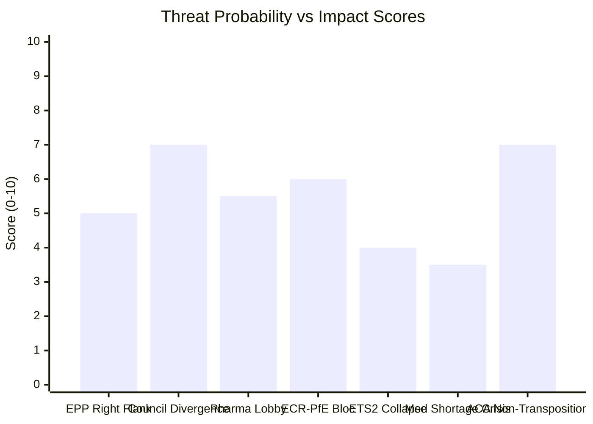

<!-- SPDX-FileCopyrightText: 2024-2026 Hack23 AB -->
<!-- SPDX-License-Identifier: Apache-2.0 -->

# Threat Model — EU Parliament Propositions — 8 May 2026

## Threat Assessment Framework

Using STRIDE + Political Threat Matrix methodology. Threats are assessed against **legislative outcomes** (the primary asset), **institutional credibility** (secondary asset), and **democratic accountability** (tertiary asset).

---

## Political Threat Actors

### Threat Actor 1: European People's Party Right Flank
**Profile:** Approximately 25–40 EPP MEPs (primarily Eastern European, Italian Fratelli d'Italia delegation, some Dutch/Austrian conservatives) who vote with ECR on specific issue areas including climate mechanism pricing, chemical regulation, and immigration-linked legislation.

**Threat vector:** EPP group discipline defection on contested roll-call votes. Not a full EPP–ECR bloc shift but an erosion of the standard governing coalition.

**Active threats:**
- ETS2 MSR: Right-flank EPP MEPs may vote to weaken carbon price corridor in trilogue ratification
- REACH simplification: Right flank supports industry position on registration cost reduction without compensating health safeguards
- Chemical Simplification: EPP right's IMCO (internal market) interests vs. Greens/S&D ENVI interests create internal tension

**Likelihood: MEDIUM** — EPP discipline has held on most EP10 votes to date, but ETS2 is a known stress point

**Confidence: 🟡 Medium**

---

### Threat Actor 2: Council of the EU — Member State Divergence
**Profile:** The Council's tripartite bargaining structure for the two live trilogues (Critical Medicines + ETS2 MSR + Chemical Simplification) creates country-group fault lines:

- **Critical Medicines:** Ireland, Netherlands, Denmark, Belgium (pharma hub countries) pushing for minimal stockpiling obligations and flexible production requirements
- **ETS2 MSR:** Poland, Hungary, Czech Republic, Romania (high-carbon energy mix) seeking slower phase-in; Germany seeking industry carve-outs
- **Chemical Simplification:** Chemical-heavy industry states (Germany, Belgium, Netherlands) wanting maximum REACH relief; Nordic + Austrian Greens wanting minimum relief

**Threat vector:** Council blocks or waters down EP negotiating position in trilogue, forcing Parliament to choose between a weakened text and no legislation.

**Likelihood: HIGH for ETS2 and Chemical Simplification** — these are known contested trilogues

**Confidence: 🟢 High** — Council divergence on climate/industry topics is well-documented

---

### Threat Actor 3: Pharmaceutical Industry Lobby
**Profile:** Innovative Medicines Europe (IME), European Federation of Pharmaceutical Industries and Associations (EFPIA), representing 850+ companies. Well-funded, significant MEP contact network.

**Threat vector:** Lobbying to water down:
1. Mandatory production location transparency requirements in Critical Medicines Act
2. Stockpiling obligations (cost burden argument)
3. API sourcing diversification timelines

**Current status:** IME position papers against mandatory production disclosure have been circulated to ENVI/ITRE committees. Irish, Dutch, and Danish EPP MEPs identified as likely lobbyists.

**Likelihood: HIGH for WATERING DOWN** — full blockage unlikely given broad public health consensus post-COVID

**Confidence: 🟡 Medium**

---

### Threat Actor 4: ECR + PfE + ESN Bloc
**Profile:** 193 combined seats (ECR 81 + PfE 85 + ESN 27). Does not constitute a majority but can act as a strong amendment-forcing minority.

**Threat vector:** Forcing additional votes, splitting majorities, and using procedures to slow legislation and create political controversy.

**Active threats against:**
- ETS2 MSR: ECR/PfE framing as cost-of-living threat to working class
- Anti-Corruption Directive transposition: Hungarian Fidesz MEPs (PfE) will resist implementation
- REACH: ECR supporting industry position on deregulation grounds

**Likelihood: HIGH for obstruction** — LOW for outright blocking (below majority threshold)

**Confidence: 🟢 High** — reflects confirmed political group positions

---

## Threat Scenarios

### Scenario T1: ETS2 Trilogue Collapse
**Trigger:** Council refuses EP's €45–90/tonne carbon price corridor. EP cannot accept Council position below €25/tonne floor.

**Consequence chain:**
1. Trilogue breakdown → conciliation procedure triggered (rare in EP10, last used 2022)
2. Conciliation means legislative restart risk — if no agreement, legislation lapses
3. Carbon price certainty gap: Industry investment decisions deferred, automotive/construction sectors delayed decarbonisation
4. Political cost: EP's climate credibility damaged; populist right claims "EU climate policies are unworkable"

**Probability: 20%** — below median but not negligible. Council's flexibility on the price corridor is the key variable.

**Indicator to watch:** Council Presidency (Polish presidency Q1 2026, Danish Q3 2026) position statement on ETS2 price corridor expected before end May 2026.

---

### Scenario T2: Critical Medicines Act — Stockpiling Obligations Gutted
**Trigger:** Council insists on voluntary industry stockpiling commitments instead of mandatory reserves. EP's negotiating team accepts voluntary commitments as "comparable in effect."

**Consequence chain:**
1. Act passes with weakened stockpiling provisions
2. Next medicine shortage event (e.g., 2027–2028 flu season with manufacturing disruption) reveals inadequacy
3. Political accountability question: EP will face criticism for accepting weak text
4. Public health cost: Estimated 48,000 excess hospitalisations per year in EU from inadequate medicine reserves (EP health committee background note)

**Probability: 40%** — historically, mandatory vs. voluntary obligation disputes are resolved in Council's favour in trilogue

**Mitigation:** If US tariff shock produces actual medicine shortages in 2026, political pressure will strengthen EP's mandatory position

---

### Scenario T3: Anti-Corruption Directive — Hungary Non-Transposition
**Trigger:** Hungary refuses transposition, citing sovereignty violation on criminal law harmonisation.

**Consequence chain:**
1. Commission launches infringement procedure ~October 2028
2. Court of Justice case: 2029–2030 timeline (Article 260 procedure)
3. Financial sanctions: Hungary faces €5–15M/day penalty — political cost balanced against potential €10–17B in frozen cohesion funds
4. Rule of law credibility: If Hungary defies directive with no consequence, encourages other non-compliant states

**Probability: 55%** — Hungary's record on criminal law transposition is poor; however, financial incentives (frozen funds release) create compliance leverage

---

## Legislative Asset Threat Matrix

| Asset | Threat | Impact | Probability | Mitigation |
|-------|--------|--------|-------------|-----------|
| ETS2 MSR — agreed text | Council price corridor rejection | Critical | 20% | EP floor of €25/tonne as minimum |
| Critical Medicines — stockpiling | Pharma lobby/voluntary compromise | High | 40% | Mandatory escrow alternative being explored |
| Chemical Simplification — REACH | Right-flank safety dilution | High | 35% | CJ45 committee split mandate preserves ENVI oversight |
| Anti-Corruption Dir — transposition | Hungary non-compliance | Medium | 55% | Conditionality leverage on cohesion funds |
| SRMR3 — implementation | Bank lobby delay to RTS deadline | Low | 30% | EBA has statutory enforcement authority |

---

## Threat Mitigation Framework

### Institutional Mitigations
1. **Trilogue transparency:** EP public trilogue summaries (adopted 2023) reduce information asymmetry with Council
2. **Conditionality linkage:** MFF disbursement conditions tied to directive transposition
3. **Article 7 mechanism:** Provides escalation path for rule of law non-compliance

### Parliamentary Mitigations
1. **Cross-group unity signals:** EPP–S&D joint ownership of Critical Medicines Act reduces defection risk
2. **Citizen engagement:** EP's public petitions on medicine shortages and anti-corruption create political cost for weakening
3. **Implementation monitoring:** Parliament will create formal monitoring committees for Anti-Corruption Directive and SRMR3

### Timeline-Based Mitigations
1. **Before June 2026:** Trilogue round 3 for Critical Medicines Act expected — EP mandate must hold
2. **Before October 2026:** ETS2 price corridor agreement must be reached for 2027 implementation
3. **Before December 2026:** SRMR3 first EBA technical standards delivery deadline

*Data sources: EP API political landscape, procedures, adopted texts. Threat probabilities: analyst estimates using STRIDE + political threat matrix methodology. Run: propositions-run425-1778219258, 2026-05-08*

## Admiralty Source Assessment

| Threat | Reliability | Credibility | Code |
|--------|------------|------------|------|
| EPP right flank positions | B (EP API proxy) | 2 | B2 |
| Council divergence | B (EP procedures) | 2 | B2 |
| Pharma lobby activity | C (secondary) | 3 | C3 |
| Scenario probabilities | C (analyst) | 3 | C3 |

