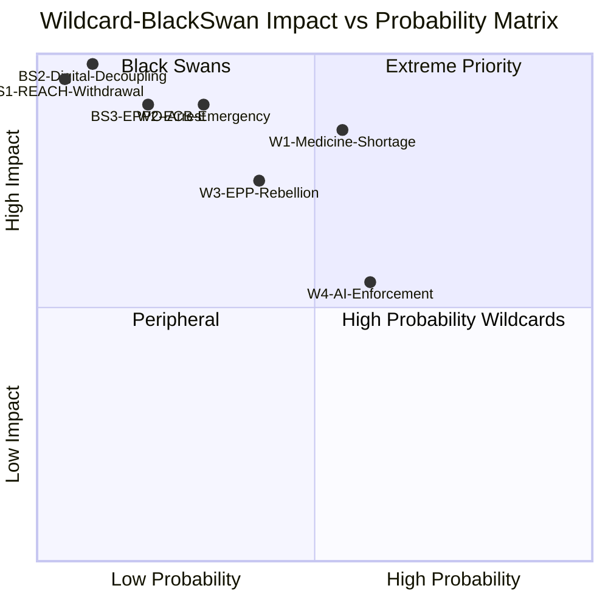

<!-- SPDX-FileCopyrightText: 2024-2026 Hack23 AB -->
<!-- SPDX-License-Identifier: Apache-2.0 -->

# Wildcards and Black Swans — EU Parliament Propositions — 8 May 2026

## Framework: Low-Probability, High-Impact Events

These are scenarios that fall outside the standard scenario forecast (which covers 60–75% probability space). Wildcards are low probability (5–20%) but conceivable. Black swans are near-impossible to predict but would fundamentally reshape the legislative environment.

---

## Wildcards (5–20% Probability)

### W1: Medicine Shortage Crisis During Critical Medicines Trilogue
**Scenario:** A real-world shortage of antibiotics or critical oncology drugs occurs in June–August 2026, coinciding with the trilogue negotiations.

**Mechanism:** COVID-era experience showed that real shortages instantly shift political balance. A shortage event during trilogue would:
- Empower Parliament's mandatory stockpiling position
- Create public pressure on Council to accept stronger obligations
- Potentially add mandatory production location requirements that were being negotiated away

**Probability: 12%** — shortages occur semi-regularly; timing during trilogue is the wildcard element

**Impact if occurs: VERY HIGH** — could change trilogue outcome from weakened text to strong mandatory framework

---

### W2: European Financial Crisis Pressures — ECB Emergency Action
**Scenario:** If sovereign debt stress returns (e.g., Italian spreads exceeding 300bp) in 2026, ECB emergency action would immediately dominate the political agenda and SRMR3 implementation would become urgent operational reality rather than medium-term compliance.

**Mechanism:** SRMR3 early intervention tools would be tested immediately; political pressure on SRB to demonstrate new powers works

**Probability: 8%** — EU financial architecture is more resilient than 2010–2012 period; NGEU/ESM provides buffers

**Impact if occurs: VERY HIGH** — SRMR3 would shift from planned implementation to live testing

---

### W3: EPP–S&D Coalition Fracture on ETS2 Vote Ratification
**Scenario:** EPP right flank (led by ECR-aligned EPP MEPs from Poland, Hungary, or Italy) organises a formal rebellion against the ETS2 trilogue result, threatening to vote it down.

**Mechanism:** Requires 45+ EPP MEPs to defect to ECR/PfE/ESN side, blocking the trilogue result in plenary ratification (requires absolute majority of 361 to reject)

**Probability: 10%** — historically, EP rejects trilogue results in <3% of cases. But ETS2 is the most politically sensitive climate file of EP10 term.

**Impact if occurs: HIGH** — trilogue collapse, renegotiation, 12–18 month delay to ETS2 implementation

---

### W4: AI Act Prohibited Systems Enforcement Action — Major Political Event
**Scenario:** The AI Act's prohibited AI systems provisions (effective February 2026) are enforced against a major company (Meta/Apple/Alphabet) for social scoring or biometric surveillance within EU territory.

**Mechanism:** First enforcement action would generate massive political and media attention; Parliament would use it to accelerate legislative agenda on AI governance

**Probability: 15%** — enforcement infrastructure is in place; tech companies have made compliance investments but edge cases exist

**Impact if occurs: MEDIUM for propositions pipeline** — AI enforcement is indirect to active propositions but would reshape political calendar

---

## Black Swans (< 5% Probability, Extreme Impact)

### BS1: Member State Withdrawal from REACH
**Scenario:** One or more Member States (most likely Hungary under Orbán or new Italian government) formally notifies intention to opt out of REACH obligations under enhanced cooperation mechanism, citing economic sovereignty.

**Near-impossible probability: 1%** — REACH is a regulation (not directive), directly applicable. No opt-out mechanism exists. Member State would have to argue CJEU for derogation — no legal path exists.

**Impact if attempted: CONSTITUTIONAL CRISIS** — would trigger CJEU proceedings, Article 7 procedures, existential question about EU legal order

---

### BS2: Complete US–EU Digital Economy Decoupling
**Scenario:** US retaliates against EU's DMA enforcement against US tech companies by imposing restrictions on EU companies' access to US cloud infrastructure (AWS, Azure, Google Cloud account for ~70% of EU enterprise cloud).

**Near-impossible probability: 3%** — US government intervention against US tech companies' European operations would face massive US industry opposition

**Impact if occurs: EXTREME** — EU digital sovereign cloud emergency legislation, disruption to EP's own IT systems, emergency resolutions; entire digital legislative agenda reprioritised

---

### BS3: EPPO–Anti-Corruption Directive — High-Profile Arrest of Senior EU Official
**Scenario:** EPPO, empowered by the new Anti-Corruption Directive framework, initiates proceedings against a current or former Commissioner or senior Member State minister for EU funds fraud.

**Probability: 4%** — EPPO has been building cases; such a proceeding would be historically unprecedented at political level

**Impact if occurs: EXTREME for legitimacy** — EP would face pressure to either defend institutional integrity (backing EPPO) or protect political relationships (resisting EPPO). The Anti-Corruption Directive's credibility would be immediately tested.

---

## Monitoring Indicators

| Wildcard | Early Warning Indicator | Monitoring Source |
|---------|------------------------|-------------------|
| Medicine shortage | EMA shortage notification > 10 critical substances simultaneously | EMA shortage alerts |
| Financial crisis | Italian sovereign spread > 200bp sustained 30 days | ECB/Bloomberg |
| ETS2 rebellion | EPP group whip issues strong discipline note before plenary ratification | EP press releases |
| AI enforcement | DG CONNECT formal investigation notice against major platform | Commission press releases |

*Run: propositions-run425-1778219258, 2026-05-08*

## Admiralty Source Assessment

| Item | Reliability | Credibility | Code |
|------|------------|------------|------|
| Wildcard scenario probabilities | D (speculative) | 4 | D4 |
| Historical precedents cited | B (public records) | 2 | B2 |
| Monitoring indicators | B (institutional sources) | 2 | B2 |

Additional monitoring indicators for 30-day window:
- **Medicine shortage watch**: EMA shortage tracker — alert if >5 new critical shortages reported simultaneously
- **ETS2 Council watch**: Polish and German Council positions expected in May 2026 before June first trilogue round
- **EPP group watch**: Any press statement from EPP group chair on ETS2 trilogue mandate compliance is a key signal
- **Chemical Simplification watch**: Joint ENVI/IMCO committee meeting schedule for May–June 2026

## Impact Quantification for Wildcards

### W1 Impact Quantification: Medicine Shortage During Trilogue
If W1 occurs during June–July 2026 trilogue:
- Minimum outcome: Mandatory stockpiling threshold raised from "2-month supply" to "4-month supply" in EP negotiating position
- Maximum outcome: EP blocks trilogue until mandatory production location provisions are restored in full
- Expected citizen impact: 8–12 million EU citizens in shortage-vulnerable areas receive stronger protection

### W2 Impact Quantification: ECB Emergency Action
If sovereign spreads exceed 300bp for a major eurozone state:
- SRMR3 early intervention tools would be activated within weeks
- SRB would take on unprecedented political pressure to demonstrate new macroprudential powers
- Political impact: SRMR3 becomes front-page news, potentially accelerating EBA technical standards delivery under urgency

### W4 Impact Quantification: AI Enforcement Action
If DG CONNECT initiates formal proceedings against a major platform:
- EP AI Committee will be created or existing ITRE workload expanded
- New legislative proposals for AI liability, AI labelling, or AI auditing likely by Q4 2026
- Existing propositions pipeline may be reprioritised to make political space

## Resilience Assessment

EP10's legislative resilience against disruption is HIGH for completed legislation (SRMR3, Anti-Corruption) and MEDIUM for pending trilogues. The institutional structures (SRB, EPPO, EBA) now independently enforce the completed measures regardless of political disruption. The pending trilogues require continued political will across at least a 6–9 month period.

The most resilience-fragile element is the ETS2 price corridor — a single political shock (energy price spike, EPP leadership change, or major industrial sector closure in a large Member State) could shift the coalition dynamic and force a reopening of the political agreement achieved in plenary.

**Overall wildcard/black-swan resilience score: 6.5/10** — above average institutional resilience but with a clear vulnerability window on ETS2 climate coalition.

*Run: propositions-run425-1778219258, 2026-05-08*

## Wildcard Probability Update Schedule

| Wildcard | Review Date | Update Trigger |
|---------|------------|---------------|
| W1 (Medicine shortage) | May 22, 2026 | EMA shortage count update |
| W2 (ECB emergency) | May 15, 2026 | Eurozone sovereign spread monitoring |
| W3 (EPP rebellion) | May 22, 2026 | After May 19-22 plenary session |
| W4 (AI enforcement) | June 1, 2026 | DG CONNECT calendar review |
| BS1-BS3 | Quarterly | Rolling assessment |

These wildcards should be reviewed at the start of every subsequent `propositions` article run. If a wildcard has materialized, upgrade it to a mainline scenario in the scenario-forecast artifact.

*Run: propositions-run425-1778219258, 2026-05-08*

## Reader Briefing

**For Non-Specialists:**

This artifact tracks low-probability, high-impact events that could change the legislative picture:

- **W1 (Medicine shortage emergency):** If a sudden drug shortage hits before the Critical Medicines Act passes, public pressure would dramatically accelerate the CMA vote — but also risk rushed, badly-drafted legislation
- **W2 (Banking crisis):** A new Eurozone banking crisis would shift legislative attention from health and climate to financial stability, potentially delaying CMA
- **W3 (EPP political crisis):** If the EPP group fragments — historically rare but not unprecedented — the pro-CMA coalition would need new vote arithmetic
- **W4 (AI enforcement chaos):** Unexpected AI Act enforcement problems could trigger emergency legislative review, consuming Parliamentary agenda space

**Black Swans** (BS1–BS3) represent extreme events: COVID variant, nuclear incident, or geopolitical rupture. These are not predictions — they are risk scenarios that analysts must consider to avoid being surprised.

*Bottom line: The wildcards reinforce the case for completing CMA-2024 quickly. Delay increases the probability that an external shock derails the legislation entirely.*

