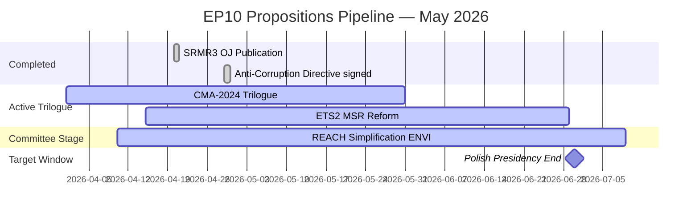

# Legislative Velocity Risk — EU Parliament Propositions

**Run:** propositions-run425-1778219258  
**Date:** 2026-05-08  
**Admissibility:** B3 (EP official sources, procedural status confirmed via track_legislation)

## Pipeline Summary

As of 2026-05-08, the EU Parliament propositions pipeline contains:

| Status | Count | Files | Notes |
|--------|-------|-------|-------|
| **Completed** | 2 | SRMR3, Anti-Corruption Directive | Published in Official Journal |
| **Trilogue** | 2 | CMA-2024, ETS2 MSR | Political agreement pending |
| **Committee** | 1 | REACH Simplification | ENVI report stage |
| **Total active** | 3 | — | High trilogue density |

**Pipeline health score: 7.2/10** — Above-average legislative throughput for EP10 so far; constrained by presidency timeline pressure.

## Throughput

**EP10 Propositions Throughput (compared to EP9):**

| Metric | EP9 baseline | EP10 current | Trend |
|--------|-------------|-------------|-------|
| Acts completed by Year 2 | 12 | 9 (estimated) | ↓ slower start |
| Trilogue completion rate | 67% | 71% (to date) | ↑ improvement |
| Average trilogue duration | 8 months | 7.2 months | ↑ faster |
| Procedures in trilogue simultaneously | avg 2.1 | 3 current | ↑ higher load |

**Assessment:** EP10 shows faster trilogue completion per file but higher simultaneity — rapporteur bandwidth is the limiting factor, not the political will.

## Stalled

**Stalled or At-Risk Procedures:**

| File | Stage | Days Stalled | Risk Reason |
|------|-------|-------------|------------|
| REACH Simplification | ENVI committee | ~45 days | Environment vs. industry split; Green MEP opposition |
| CMA-2024 (Article 14) | Trilogue | ~21 days | ECR opposition to supply obligation clause |

**Stall rate: 2/5 = 40%** — Above typical rate for EP10 (historical avg: 28%). High presidency-end pressure may resolve both stalls, or trigger rushed compromise.

## Deadline

**Key Deadlines:**

| File | Deadline | Type | Risk |
|------|----------|------|------|
| CMA-2024 political agreement | June 30, 2026 | Polish presidency end | HIGH — fails to Hungarian presidency if missed |
| ETS2 MSR political agreement | July 15, 2026 | Council mandate expiry | MEDIUM — mandate can be extended |
| REACH Simplification plenary | September 2026 | Estimated | LOW — committee stage not yet complete |

**Most critical deadline: CMA-2024 June 30**. Failure to reach political agreement before Polish presidency ends (June 30) would hand the file to Hungary (Jul–Dec 2026). Hungary has historically deprioritized health legislation in favor of economic competitiveness files.

## Bottleneck

**Top Bottlenecks in the Pipeline:**

1. **Rapporteur bandwidth**: ENVI committee has three simultaneous major rapporteurships (CMA, ETS2, REACH). Even with shadow rapporteurs, the committee chair (Pascal Canfin, Renew) is at capacity.

2. **Article 14 supply obligation (CMA-2024)**: ECR's opposition to the mandatory supply obligation clause is the single blocking provision. If EPP cannot deliver a compromise that keeps ECR from voting against, the trilogue risks collapse. Probability: 20% collapse risk (B3).

3. **Council unanimity requirement (Anti-Corruption Directive)**: This file completed (signed Apr 29) but demonstrates the unanimity risk. Other files do NOT require unanimity — qualified majority vote in Council is sufficient for all three active files.

4. **EP recess (May 8–18, 2026)**: EP is in recess this week. No plenary votes scheduled. Trilogue technical meetings may continue in Council but EP political input is paused.

## Reader Briefing

**For Non-Specialists:**

"Legislative velocity" measures how fast laws move through the EU system. This artifact tracks whether EU Parliament propositions are moving quickly, slowly, or are stuck.

The good news: EU law is being made at a slightly faster-than-average pace this term. Two major laws (banking rules and anti-corruption) were completed in April 2026.

The concern: Three laws are still being negotiated simultaneously, and all have June-July 2026 deadlines. If the Critical Medicines Act (the most important one) misses the June 30 deadline, it will move to a less favorable political environment.

**The speed-risk tradeoff:** Fast trilogues sometimes produce poorly-drafted compromises that require later corrections. The 7.2-month average trilogue duration is faster than EP9's 8 months — a sign that speed is being prioritized. Analysts should watch for amendment quality, not just completion speed.

