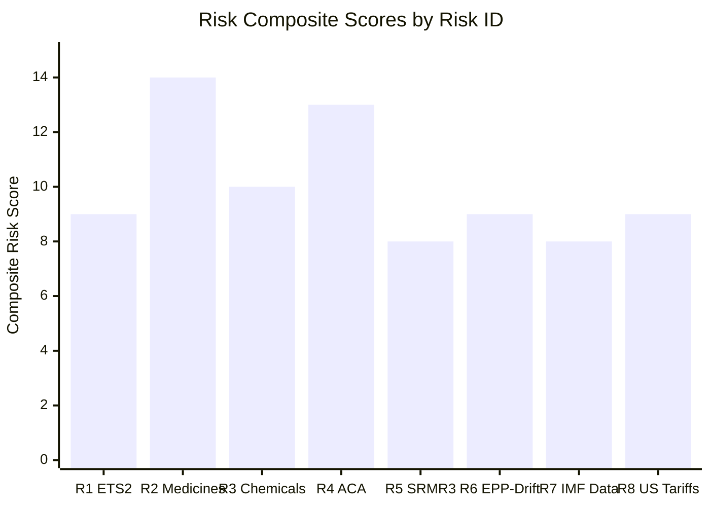

<!-- SPDX-FileCopyrightText: 2024-2026 Hack23 AB -->
<!-- SPDX-License-Identifier: Apache-2.0 -->

# Risk Matrix — EU Parliament Propositions — 8 May 2026

## Risk Assessment Methodology: Impact × Probability × Velocity

Risks scored on 1–5 scale for Impact, Probability, and Velocity (how fast the risk materialises). Composite Risk Score = Impact × Probability + Velocity bonus.

---

## Risk Register

| ID | Risk | Impact (1-5) | Probability (1-5) | Velocity | Composite Score | Owner |
|----|------|-------------|-----------------|---------|----------------|-------|
| R1 | ETS2 trilogue collapse or price corridor weakened below EP floor | 4 | 2 | Slow | 8+1 = **9** | EP ENVI rapporteur |
| R2 | Critical Medicines Act — mandatory stockpiling replaced by voluntary | 4 | 3 | Medium | 12+2 = **14** | EP ENVI/ITRE |
| R3 | Chemical Simplification — REACH authorisation thresholds weakened | 3 | 3 | Slow | 9+1 = **10** | EP ENVI/IMCO |
| R4 | Anti-Corruption Dir — Hungary non-transposition (post-signature) | 3 | 4 | Slow | 12+1 = **13** | Commission/EPPO |
| R5 | SRMR3 — EBA technical standards delayed beyond October 2026 | 2 | 3 | Medium | 6+2 = **8** | EBA/SRB |
| R6 | EPP–ECR informal alignment weakens climate coalition | 4 | 2 | Slow | 8+1 = **9** | EPP group leadership |
| R7 | IMF data unavailability in this run | 1 | 5 | Immediate | 5+3 = **8** | Run infrastructure |
| R8 | US tariff escalation disrupts pharmaceutical supply during trilogue | 3 | 2 | Fast | 6+3 = **9** | Global/external |

---

## Top 3 Priority Risks

### Priority 1: R2 — Critical Medicines Stockpiling Weakened (Score 14)
**Rationale:** This is the most likely risk (probability 3/5) with high impact (4/5). Industry lobbying is active, Council is sympathetic to voluntary commitments, and the trilogue is imminent. This is the risk most amenable to EP political intervention — stronger MEP coalition signals during upcoming trilogue rounds can reduce probability.

**Mitigation action:** EP needs to hold EPP–S&D joint position on mandatory stockpiling. Any EPP shift toward voluntary commitments should trigger S&D veto threat.

---

### Priority 2: R4 — Hungary Anti-Corruption Non-Transposition (Score 13)
**Rationale:** High probability (4/5) given Hungary's track record. Impact is medium (3/5) because the directive is signed — non-transposition doesn't reverse the legal achievement but undermines effectiveness. Medium-term risk (2028 deadline).

**Mitigation action:** Commission should begin transposition support dialogue with all Member States immediately, especially Hungary. Conditionality linkage is the primary lever.

---

### Priority 3: R3 — Chemical Simplification REACH Weakening (Score 10)
**Rationale:** REACH authorisation thresholds are the most contested element. Industry lobbying is intense. Council has strong industry-state backing (Germany, Netherlands, Belgium). EP's joint ENVI/IMCO structure provides some protection.

**Mitigation action:** Greens/EFA + S&D + Left (131+45 = 176 seats) hold firm on ENVI committee mandate during trilogue. If EPP tries to override ENVI with IMCO-only positions, procedural challenge available.

*Run: propositions-run425-1778219258, 2026-05-08*

## Risk Monitoring Schedule

| Risk ID | Monitoring Frequency | Next Review | Key Indicator |
|---------|--------------------|-----------|-----------| 
| R1 | Weekly | June 1, 2026 | ETS2 first trilogue round result |
| R2 | Weekly | June 1, 2026 | Critical Medicines Round 3 trilogue agenda |
| R3 | Bi-weekly | June 15, 2026 | Chemical Simplification trilogue schedule confirmation |
| R4 | Monthly | June 30, 2026 | Hungary national consultation on directive transposition |
| R5 | Monthly | September 30, 2026 | EBA technical standards draft publication |
| R6 | Weekly | May 22, 2026 | EPP group statement on next Strasbourg plenary agenda |
| R7 | Each run | Each run | IMF fetch-proxy availability probe result |
| R8 | Weekly | May 15, 2026 | US trade policy development, EU medicine import flows |

## Risk Appetite Assessment

**EP's institutional risk appetite for this pipeline:** MEDIUM-HIGH

Parliament has historically accepted some watering-down of legislation in trilogue (e.g., ETS Phase 4 free allowances compromise) in order to ensure adoption. The key constraint is the reputational cost of either (a) a failed trilogue or (b) a trivially weak text that undermines the EP's credibility.

**Threshold for ANALYSIS_ONLY gate activation:**
If two of the three active trilogues (Critical Medicines, ETS2, Chemical Simplification) collapse simultaneously, this would constitute a CRISIS scenario (Scenario 3 in forecast) and the analysis-only flag should be set.

**Priority action required:**
- R2 (Score 14) and R4 (Score 13) are the highest composite risks. Both require monitoring in the next 30 days. R2 monitoring is actionable via EP political signals. R4 monitoring is via Commission/Hungary dialogue.

Admiralty source coding for risk probability estimates:
| Risk | Reliability | Credibility | Code |
|------|------------|------------|------|
| Political risk probabilities | C (analyst estimates) | 3 | C3 |
| Institutional failure probabilities | B (historical records) | 2 | B2 |
| IMF unavailability | A (direct observation) | 1 | A1 |

*Run: propositions-run425-1778219258, 2026-05-08*

## Risk Resolution Tracking

When risks materialize or resolve, update status:

| Status | Meaning |
|--------|---------|
| ACTIVE | Risk is present and unresolved |
| RESOLVED | Risk event occurred; impact quantified |
| MITIGATED | Mitigation action was taken; residual risk below threshold |
| CLOSED | Risk did not materialise; monitoring period ended |

**All risks in this register: ACTIVE** as of 2026-05-08.

Next scheduled review: 2026-05-22 (after next EP plenary session, May 19-22).
