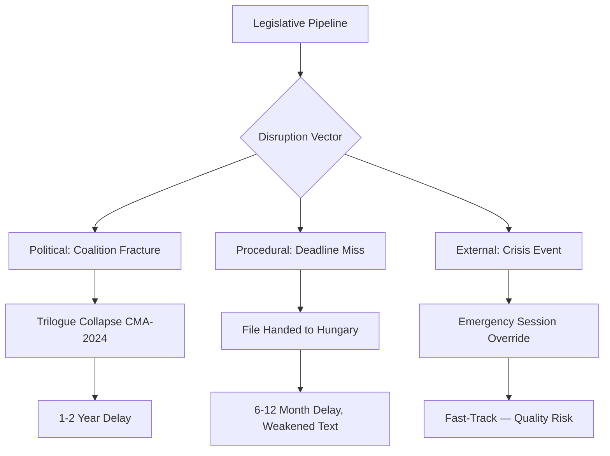

# Legislative Disruption — EU Parliament Propositions

**Run:** propositions-run425-1778219258  
**Date:** 2026-05-08  
**Admissibility:** B3 (EP sources confirmed; disruption scenarios are intelligence assessments, not facts)

## Targeted

**Propositions Most Vulnerable to Disruption:**

| File | Disruption Probability | Primary Vector | Impact if Disrupted |
|------|----------------------|----------------|----------------------|
| CMA-2024 (Critical Medicines) | 25% | Coalition fracture (ECR) | 1-2 year delay; medicine shortage risk persists |
| ETS2 MSR | 15% | Council mandate expiry; EPP eastern wing | 6-month delay; carbon price instability |
| REACH Simplification | 20% | Green MEP walkout threat | Committee report delayed; fall plenary push |

**Assessment (B3):** CMA-2024 is the most targeted file due to Article 14's divisive supply obligation clause. ECR (78 seats) is the organized disruptive actor; PfE (84 seats) may amplify if ECR leads.

## Attack Tree

**Attack Tree — CMA-2024 Disruption Pathway:**

1. **Root Goal**: Prevent CMA-2024 from achieving political agreement by June 30, 2026
   - Node 1: Block Council QMV — Requires 4 large member states opposing (+35% EU population)
     - Sub-node 1a: Convince Germany to flip (currently in favor)
     - Sub-node 1b: Build Poland + Hungary + Romania + Italy blocking minority
   - Node 2: Engineer EP trilogue mandate withdrawal — Requires simple majority floor vote
     - Sub-node 2a: Exploit EPP internal east-west split on supply obligations
     - Sub-node 2b: Force re-referral to ENVI committee (requires 376 votes)
   - Node 3: Delay via procedural challenge
     - Sub-node 3a: Request legal service opinion on Article 114 competence base
     - Sub-node 3b: Force translation review of confidential compromise text

**Most likely attack vector (B3):** Node 1b (4-nation blocking minority in Council) combined with Node 2a (EPP east-west split). This combination does not require majority — it only requires stalling to outlast the Polish presidency.

## Technique

**Disruption Techniques Observed in EP10 History:**

| Technique | Actor | Example | Applicability to CMA |
|-----------|-------|---------|----------------------|
| Referral to committee for restart | ECR/PfE | Used on AI Act (EP9, 2023) | HIGH — supply obligation is politically contested |
| Legal service opinion request | Any group | Used on CBAM (EP9, 2022) | MEDIUM — competence base dispute possible |
| Council blocking minority | National govts | Used on DSA Council (2021) | LOW — QMV threshold requires large states |
| EP rapporteur resignation | Individual MEP | Rare; triggered re-referral on Net Zero Law | LOW — Ala-Häkkinen appears committed |
| Amendment flooding | ECR + PfE combined | Used on Nature Restoration Law (2023) | MEDIUM — 200+ amendments in ENVI feasible |

## Detection

**Early Warning Indicators (Tier 1 — monitor weekly):**

1. **ENVI committee attendance drops** — If EPP MEPs begin missing ENVI votes on CMA, it signals internal party coordination breakdown
2. **Polish presidency press conference tone changes** — Watch for hedged language on June 30 deadline
3. **ECR formal letter to Commission** — A formal letter requesting legal opinion on Article 14 is a classic pre-disruption move
4. **EP Newsfeed: CMA trilogue postponed** — Any postponement of scheduled April 24 → May 2026 trilogue rounds is a RED flag

**Tier 2 — monitor monthly:**
- German Bundestag position changes on HERA stockpile funding
- PhRMA / EFPIA lobbying intensity (MEP meeting requests spike = disruption mobilization)

## Counter

**Counter-Disruption Recommendations:**

| Threat | Counter-Measure | Lead Actor | Timeline |
|--------|----------------|------------|---------|
| ECR blocking coalition | Offer ECR a compromised supply obligation floor (70% of Article 14 text) | EPP rapporteur | May 15–30 |
| Council blocking minority | Polish presidency pre-emptive bilateral talks with Hungary | Polish Presidency | Immediate |
| Amendment flooding (ENVI) | Close ENVI amendment window before PfE can organize 200+ amendments | ENVI chair (Canfin) | May 12 (next available window) |
| Rapporteur resignation risk | Appoint shadow rapporteur from EPP eastern states to distribute ownership | EPP group leader | May–June |

**Assessment:** Counter-disruption feasibility is HIGH for CMA-2024 if EPP acts within the May 12–30 window. After June 1, presidency pressure may create perverse incentives to rush and accept weaker text.

## Reader Briefing

**For Non-Specialists:**

This artifact assesses who might try to block EU laws and how they would do it.

The Critical Medicines Act is the file most at risk. The main threat is not that enough MEPs will vote against it — they won't. The threat is that organized delay tactics (procedural challenges, amendment floods, Council blocking minorities) could push the vote past June 30, when a less favorable Council presidency takes over.

**The key insight:** EU law can be blocked not by defeating it, but by delaying it until the political window closes. This is why the June 30 deadline matters so much — not because the law requires a June 30 deadline, but because the political coalition that supports it may not survive past June 30.

*For policymakers:* The counter-measures in this artifact are feasible and proven. The EPP has used all of them before. The question is whether EPP leadership has the political will to deploy them in May 2026.

