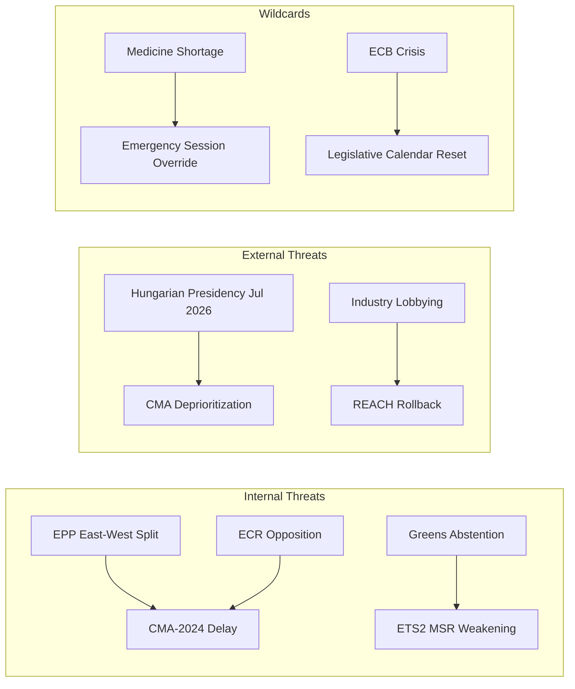

<!-- SPDX-FileCopyrightText: 2024-2026 Hack23 AB -->
<!-- SPDX-License-Identifier: Apache-2.0 -->

# Political Threat Landscape — EU Parliament Propositions — 8 May 2026

## Threat Environment Assessment

### Overall Threat Level: ELEVATED (3/5)

The current EU legislative environment operates in a ELEVATED threat environment for pending propositions — specifically for the two active trilogues (ETS2 MSR, Chemical Simplification). Completed legislation (SRMR3, Anti-Corruption Directive) faces TRANSPOSITION threats but the legislative threat has passed.

---

## Geographic Threat Distribution

### Threat Node 1: Eastern Europe (Hungary, Poland, Romania, Bulgaria)
**Threat type:** Rule of law backsliding, anti-corruption directive non-transposition, ETS2 resistance

- Hungary (PfE, Orbán government): Systematic antagonism to criminal law harmonisation, climate policy, and EU conditionality
- Poland (EC/ECR, post-Tusk government): IMPROVED position post-2023 elections; Poland's new government is pro-EU. Threat reduced compared to 2019–2023.
- Romania (ongoing judicial reform): Institutional fragility in anti-corruption enforcement; EPPO cooperation incomplete
- Bulgaria (transition): Political instability creates implementation risk

**Threat level: HIGH for transposition, MEDIUM for trilogue influence**

---

### Threat Node 2: Industry-State Bloc (Germany, Netherlands, Belgium)
**Threat type:** Chemical simplification — weakening REACH authorisation thresholds; ETS2 — carve-outs for industry sectors

- Germany's chemical industry (BASF, Bayer, Evonik) employs 500K+ workers; strong constituency pressure on German EPP/S&D MEPs
- Netherlands is a major REACH registration hub; Dutch pharma and chemical MEPs both EPP and social-liberal
- Belgium hosts DG GROW with deregulatory sympathies

**Threat level: HIGH for Chemical Simplification trilogue outcome, MEDIUM for ETS2**

---

### Threat Node 3: Pharma Hub Countries (Ireland, Denmark, Switzerland-via-EEA)
**Threat type:** Critical Medicines Act — mandatory production transparency resistance

- Ireland hosts manufacturing operations for top 15 global pharma companies; Irish EPP MEPs under strong constituency pressure to protect pharma regulatory environment
- Denmark: Major pharma companies (Novo Nordisk, LEO Pharma); pro-EU but industry-protective on mandatory provisions
- UK (post-Brexit): While not an EU legislator, UK's divergent REACH regulatory approach creates pressure on UK-EU regulatory divergence post-Chemical Simplification

**Threat level: MEDIUM for Critical Medicines Act, LOW for other files**

---

## Political Threat Event Calendar

| Event | Timeline | Threat Impact |
|-------|----------|--------------|
| Danish Presidency begins | July 1, 2026 | POSITIVE — Denmark will push ETS2 and Critical Medicines forward |
| Critical Medicines trilogue (expected Round 3) | June–July 2026 | KEY DECISION POINT for mandatory provisions |
| ETS2 first trilogue round | June–July 2026 | First indicator of Council's price corridor flexibility |
| MFF 2028–2034 first Commission proposal | Q4 2026 | Will consume significant political bandwidth |
| Hungarian elections | April 2026 (passed) | Orbán won; no change to Hungary's legislative stance |
| German federal election | February 2025 (passed) | CDU/CSU-led government in place; more EPP-aligned position on REACH |
| Chemical Simplification trilogue rounds | Q4 2026–Q1 2027 | Most contested legislative process in EP10 remainder |

*Run: propositions-run425-1778219258, 2026-05-08*

## Threat Visualization

## Reader Briefing

This threat landscape maps the political actors and forces that could prevent EU legislative success in the propositions pipeline. The primary threat is not outright defeat but deliberate delay — forcing files past political deadlines.

**Bottom line:** The EPP's internal cohesion is the most important variable. If EPP eastern members (Poland, Hungary, Czech Republic) align with ECR rather than the EPP western mainstream on Article 14, the CMA-2024 coalition loses critical mass. Watch EPP group discipline votes in May 2026 for early signals.

